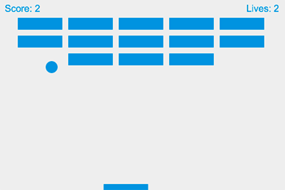

{{GamesSidebar}}

{{Next("Games/Tutorials/순수한_자바스크립트를_이용한_2D_벽돌깨기_게임/캔버스_생성과_그리기")}}

이 튜토리얼을 차례차례 진행하면서 우리는 HTML5 {{htmlelement("canvas")}} 로 렌더되는 순수한 JavaScript로 쓰여진 간단한 MDN 벽돌깨기 게임을 만들 것입니다.

모든 과정은 플레이 가능하고 편집가능한 라이브 샘플을 포함하고 있습니다. 이 샘플을 통해, 여러분은 중간 스테이지들이 어떻게 보여져야 하는지 확인할 수 있습니다. 여러분은 이미지의 렌더링과 움직임, 충돌 감지, 컨트롤 메카니즘들과 승리와 패배 상태와 같은 기본적인 게임 원리들을 구현하기 위해서, {{htmlelement("canvas")}}엘리먼트의 기본적인 사용 방법을 배우게 될 것입니다.

이 시리즈를 최대한 활용하려면 중급의 [JavaScript](/ko/Learn/Getting_started_with_the_web/JavaScript_basics) 지식이 있어야 합니다. 이 튜토리얼을 끝낸 후에는 여러분은 스스로 간단한 웹 게임들을 만들 수 있게 될 것입니다.

## 강의 내용

모든 강의 내용과 우리가 함께 만드는 [MDN 벽돌깨기 게임](http://breakout.enclavegames.com/lesson10.html)의 다른 버전들은 [GitHub](https://github.com/end3r/Canvas-gamedev-workshop)에서 찾을 수 있습니다.:

1. [캔버스 생성과 그리기](/ko/docs/Games/Tutorials/순수한_자바스크립트를_이용한_2D_벽돌깨기_게임/캔버스_생성과_그리기)
2. [공 움직이기](/ko/docs/Games/Workflows/2D_Breakout_game_pure_JavaScript/Move_the_ball)
3. [벽으로 부터 튕겨나오기](/ko/docs/Games/Workflows/2D_Breakout_game_pure_JavaScript/Bounce_off_the_walls)
4. [패들과 키보드 컨트롤](/ko/docs/Games/Workflows/2D_Breakout_game_pure_JavaScript/Paddle_and_keyboard_controls)
5. [게임 오버](/ko/docs/Games/Workflows/2D_Breakout_game_pure_JavaScript/Game_over)
6. [벽돌 필드 만들기](/ko/docs/Games/Workflows/2D_Breakout_game_pure_JavaScript/Build_the_brick_field)
7. [충돌 감지](/ko/docs/Games/Workflows/2D_Breakout_game_pure_JavaScript/Collision_detection)
8. [점수 추적과 승리](/ko/docs/Games/Workflows/2D_Breakout_game_pure_JavaScript/Track_the_score_and_win)
9. [마우스 컨트롤](/ko/docs/Games/Workflows/2D_Breakout_game_pure_JavaScript/Mouse_controls)
10. [마무리](/ko/docs/Games/Workflows/2D_Breakout_game_pure_JavaScript/Finishing_up)

웹 게임 개발의 확고한 지식을 얻기 위해 순수한 JavaScript로 시작하는 것은 최고의 방법입니다. 이후에, 여러분은 프로젝트에 프레임워크를 골라서 사용할 수도 있습니다. 프레임워크들은 JavaScript로 만들어진 툴일 뿐입니다. 따라서 여러분이 프레임워크를 사용하더라도, 프레임워크 밑에서 정확히 어떤 일이 어떤일이 일어나는지 알기 위해 언어를 배우는것은 좋은 일입니다. 프레임워크들은 개발 속도를 올려주고, 게임의 지루한 부분들을 해결하는데 도움을 줍니다. 하지만 어떤 일들이 기대한대로 일어나지 않는다면, 여러분은 디버그를 시도하거나 여러분 스스로 순수한 JavaScript로 솔루션을 작성할 수 도 있습니다.

> **참고:** 만약 여러분이 게임 라이브러리를 이용한 2D 웹 게임 개발의 학습에 흥미가 있다면, 이 시리즈의 대응 파트인 [2D breakout game using Phaser](/ko/docs/Games/Workflows/2D_breakout_game_Phaser)를 살펴보시기 바랍니다.

> **참고:** 이 시리즈의 내용들은 게임개발 워크숍의 재료로 쓰일 수 있습니다. 또한, 만약 여러분이 게임개발에 있어 강연을 원한다면 이 튜토리얼에 기초한 [Gamedev Canvas Content Kit](https://github.com/end3r/Gamedev-Canvas-Content-Kit)를 활용할 수 있습니다.

## 다음 단계

좋습니다, 이제 시작하도록 합시다. 첫 번째 챕터인 [캔버스 생성과 그리기](/ko/docs/Games/Tutorials/순수한_자바스크립트를_이용한_2D_벽돌깨기_게임/캔버스_생성과_그리기) 부터 시작합니다.

{{Next("Games/Tutorials/순수한_자바스크립트를_이용한_2D_벽돌깨기_게임/캔버스_생성과_그리기")}}
