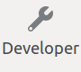
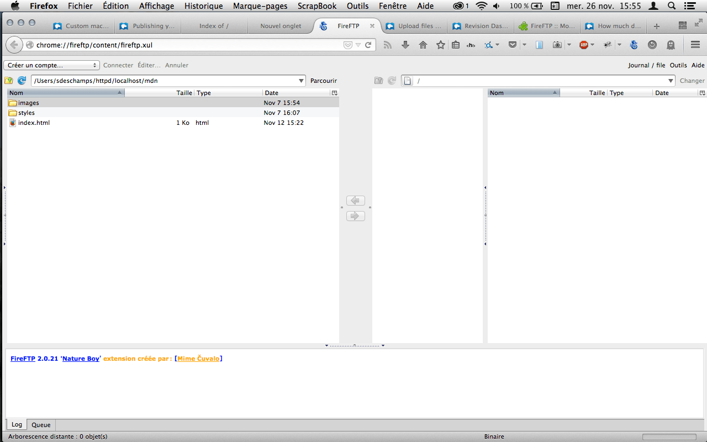
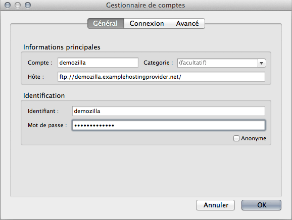
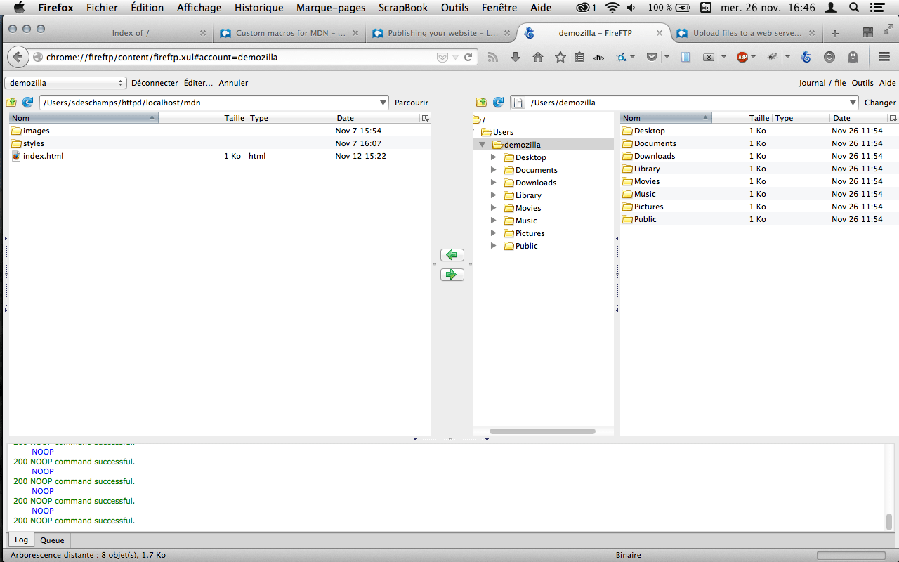
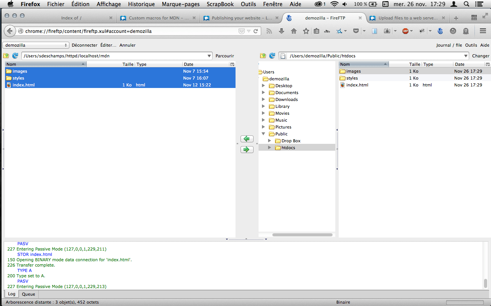

본 글은 어떻게 {{Glossary("FTP")}} 도구를 사용하여 사이트를 발행(publish) 할 수 있는지를 다루고 있습니다.

<table class="learn-box standard-table">
  <tbody>
    <tr>
      <th scope="row">선행조건:</th>
      <td>
        <p>
          먼저 웹 서버가 무엇인지(<a
            href="https://developer.mozilla.org/en-US/Learn/What_is_a_web_server"
            >what a web server is</a
          >)와 어떤 식으로 도메인이 작동하는지(<a
            href="https://developer.mozilla.org/en-US/Learn/Understanding_domain_names"
            >how domain names work</a
          >)를 알아야 합니다. 더불어 어떻게 기본 환경을 구성하는지(<a
            href="/en-US/Learn/Set_up_a_basic_working_environment"
            >set up a basic environment</a
          >)와 간단한 웹 페이지 작성법(<a
            href="/en-US/Learn/HTML/Write_a_simple_page_in_HTML"
            >write a simple webpage</a
          >)을 알고 있어야 합니다.
        </p>
      </td>
    </tr>
    <tr>
      <th scope="row">목표:</th>
      <td>FTP를 이용해 파일들을 서버에 올리기.</td>
    </tr>
  </tbody>
</table>

## 개요

당신은 이미 간단한 웹 페이지를 만들었습니다.([you have built a simple page](/en-US/Learn/HTML/Write_a_simple_page_in_HTML) 참조), 이제 웹 서버에 올려 온라인에 공개하고 싶을 겁니다. 우리는 이러한 방법을 {{Glossary("FTP")}}를 통해 다뤄보고자 합니다.

## 따라해보기

_아직 좋은 예제가 없습니다. 누군가 나서 주세요([Please, consider contributing](/ko/docs/MDN/Getting_started))._

## 깊이 파보기

### FTP 클라이언트와 함께 해보기: FireFTP

세상에는 다양한 종류의 FTP 클라이언트들이 있습니다. 본 문서에서는 FireFTP를 다룰 겁니다. FireFTP는 파이어 폭스에서 다루기 쉽습니다. 만약 파이어폭스를 사용하신다면 FireFTP 애드온 페이지([FireFTP's addons page](https://addons.mozilla.org/firefox/addon/fireftp/)) 에 가셔서l FireFTP를 설치하시면 됩니다.

> **참고:** 물론 FireFTP 외에도 수 많은 대안이 있습니다. 관심이 있다면 퍼블리싱 도구: FTP 클라이언트([Publishing tools: FTP clients](/en-US/Learn/How_much_does_it_cost#Publishing_tools.3A_FTP_client)) 항목을 참조하시면 되겠습니다.

FireFTP를 새로운 탭에서 열어보세요. 파이어폭스에서 열기 위한 방법도 두가지 있습니다.

1. **Firefox menu  ➤  ➤ FireFTP**
2. **Tools** ➤ **Web Develope**r ➤ **FireFTP**

이제 다음과 같이 보이게 될겁니다.



### 로그인 하기

이 예시에서 우리는 호스팅 제공자가 "Example Hosting Provider"라는 가상의 회사라고 가정합니다. 이 회사의 URLs는 다음과 같습니다 : `mypersonalwebsite.examplehostingprovider.net`.

우리는 방금 계정을 만들었고 호스팅제공자로부터 아래와 같은 계정정보를 받았습니다.

```plain
Congratulations for opening an account at Example Hosting Provider.

Your account is: `demozilla`

Your website will be visible at `demozilla.examplehostingprovider.net`

To publish to this account, please connect through FTP with the following credentials:

- FTP server: `ftp://demozilla.examplehostingprovider.net`
- User: `demozilla`
- Password: `quickbrownfox`
- To publish on the web, put your files into the `Public/htdocs` directory.
```

먼저 이곳을 봅시다. `http://demozilla.examplehostingprovider.net/` — 보시다시피 아직 아무런 정보도 없습니다.


> **참고:** 보이는 화면은 여러분의 호스팅 제공자에 따라 다릅니다. 대부분은 "This website is hosted by \[Hosting Service]."과 같은 페이지를 보게될 것입니다.

이제 우리의 FTP 클라이언트를 멀리 떨어진 서버에 접속하기 위해 _"Create an account..." 버튼을 누릅니다._ 그리고 호스팅제공자로 부터 받은 정보를 해당 필드에 채워줍니다.



### 이곳과 "저곳" : 로컬 과 원격 화면

이제 새로 만든 계정으로 접속을 해봅시다.



어떤 것이 보이는지 조사해봅시다.

- 왼쪽에는, 여러분 컴퓨터의 로컬파일들이 보입니다. 여러분이 올리고 싶은 파일들이 있는 디렉토리로 이동합시다. (여기에서는 `mdn`폴더입니다)
- 오른쪽에는, 원격 파일이 보입니다. 우리는 멀리 떨어진 FTP서버의 디렉토리에 들어온 것입니다. (in this case, `users/demozilla`)
- 아래부분은 지금은 무시하셔도 좋습니다. 이 부분은 여러분의 FTP클라이언트와 서버사이의 상호작용(업로드, 다운로드)을 기록해 놓은 곳입니다.

### 서버에 업로딩

여러분이 기억하듯이, 우리의 호스팅제공자는 우리에게 `Public/htdocs` 디렉토리에 파일을 저장해야한다고 했습니다. 오른쪽 패널에서 해당 디렉토리로 이동해봅시다.


이제, 여러분의 파일을 서버에 업로드하기 위해서 드래그-앤-드롭하여 파일들을 왼쪽에서 오른쪽 패널로 이동합니다.



### 우리가 올린 것이 진짜로 온라인으로 되어있나요?

지금까지는 좋습니다. 하지만 여러분의 브라우저에서 `http://demozilla.examplehostingprovider.net/` 주소로 이동하여 재확인 해봅시다.


맙소사! 우리의 웹사이트가 잘 올라와있습니다!

### 파일 업로드를 위한 다른 방법들

FTP 프로토콜은 웹사이트를 출시하기 위해 잘 알려진 방법입니다. 하지만 유일한 방법은 아닙니다. 여기 몇개의 다른 방법들도 있습니다.

- **Web interfaces**. An HTML interface acting as front-end for a remote file upload service. Provided by your hosting service. 여러분의 호스팅제공자는 HTML 인터페이스로 된(브라우저에서 업로드 가능한) 원격 파일 업로드 서비스를 지원해줄 수도 있습니다.
- **GitHub** (advanced). {{Glossary("git")}}을 이용해 commit/push 와 같은 방법으로 업로드할 수도 있습니다. [Getting started with the Web](/en-US/Learn/Getting_started_with_the_web) 가이드에서 [Publishing your website](/en-US/Learn/Getting_started_with_the_web/Publishing_your_website) 를 읽어보세요.
- **{{Glossary("Rsync")}}** (advanced). 로컬과 원격의 파일을 동기화하는 방법입니다.
- **{{Glossary("WebDAV")}}**. An extension of the {{Glossary("HTTP")}} 프로토콜의 확장으로 보다 나은 파일 관리를 가능하게 해주는 확장입니다.

## 다음 단계

잘하셨습니다. 이제 거의 끝났습니다. 마지막으로 중요한 일은 [make sure your web site is working properly](/ko/docs/Learn/Checking_that_your_web_site_is_working_properly) 입니다.
