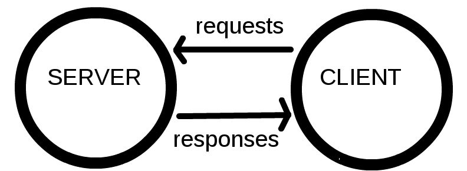

{{LearnSidebar}}

{{PreviousMenu("Learn/Getting_started_with_the_web/Publishing_your_website", "Learn/Getting_started_with_the_web")}}

*'웹의 동작 방식'*은 여러분의 컴퓨터나 폰의 웹 브라우저 안에서 웹페이지를 볼 때 무슨 일이 발생하는지에 대한 간소화된 개념을 제공할 것입니다.

이 이론은 단기적으로 봤을 때 웹 코드를 작성하기 위해 필수적인 것은 아니지만, 머지 않아 백그라운드에서 발생하는 것을 이해하는 것으로부터 오는 장점을 얻게 될 것입니다.

## 클라이언트와 서버

웹에 연결된 컴퓨터는 **클라이언트** 와 **서버** 라고 합니다. 그들이 어떻게 상호작용하는가에 대한 간소화된 다이어그램은 다음과 같습니다:

- 클라이언트는 일반적인 웹 사용자의 인터넷이 연결된 장치들 (예를 들어, 여러분의 컴퓨터는 WI-FI에 연결되어 있고, 또는 여러분의 폰은 모바일 네트워크에 연결되어 있습니다) 과 이런 장치들에서 이용가능한 웹에 접근하는 소프트웨어 (일반적으로 파이어폭스 또는 크롬 과 같은 웹 브라우저) 입니다.
- 서버는 웹페이지, 사이트, 또는 앱을 저장하는 컴퓨터입니다. 클라이언트의 장비가 웹페이지에 접근하길 원할 때, 서버로부터 클라이언트의 장치로 사용자의 웹 브라우저에서 보여지기 위한 웹페이지의 사본이 다운로드 됩니다.

## 도구 상자의 다른 부분들

위에서 설명한 클라이언트와 서버는 모든 내용을 알려주진 않습니다. 많은 다른 부분들이 포함되어 있고, 아래에서 그것들에 대해 설명할 것입니다.

지금은, 웹이 도로라고 상상해봅시다. 도로의 한 쪽 끝은 여러분의 집 같은 클라이언트 입니다. 다른 한 쪽 끝은 여러분이 뭔가를 사길 원하는 상점같은 서버입니다.

클라이언트와 서버에 덧붙여서 우리는 다음 내용들도 알아볼 필요가 있습니다.

- **인터넷 연결**: 여러분이 웹에서 데이터를 보내고 받을 수 있게 해줍니다. 기본적으로 여러분의 집과 상점 사이의 거리와 같습니다.
- **TCP/IP**: Transmission Control Protocol (전송 제어 규약) 과 Internet Protocol (인터넷 규약) 은 데이터가 어떻게 웹을 건너 여행해야 하는지 정의하는 통신 규약입니다. 이것은 주문을 하고, 상점에 가고, 또 여러분의 상품을 살 수 있게 해주는 운송 장치와 같습니다. 우리 예시에서, 이것은 차 또는 자전거 (또는 여러분의 두 다리) 와 같습니다.
- **DNS**: Domain Name System Servers (도메인 이름 시스템 서버) 는 웹사이트를 위한 주소록과 같습니다. 여러분이 브라우저에 웹 주소를 입력할 때, 브라우저는 그 웹사이트를 검색하기 전에 DNS 를 살펴봅니다. 브라우저는 HTTP 메시지를 올바른 장소로 전송하기 위해 그 웹사이트가 있는 서버가 어떤것인지 찾아야 합니다 (아래를 보세요). 이것은 여러분이 접근하기 위해 상점의 주소를 찾아보는 것과 같습니다.
- **HTTP**: Hypertext Transfer Protocol (하이퍼텍스트 전송 규약) 은 클라이언트와 서버가 서로 통신할 수 있게 하기 위한 언어를 정의하는 어플리케이션 규약 입니다. 이것은 여러분의 상품을 주문하기 위해 여러분이 사용하는 언어와 같습니다.
- **컴포넌트 파일**: 한 웹사이트는 여러분이 상점에서 사는 다양한 종류의 상품들과 같이 많은 다른 파일들로 만들어집니다. 이 파일들은 두개의 주요한 타입이 있습니다:

  - **코드 파일**: 다른 기술들도 잠시 뒤 보게 되실것이지만, 웹사이트는 근본적으로 HTML, CSS, 그리고 JavaScript 로 생성됩니다.
  - **자원**: 이것은 이미지, 음악, 비디오, 단어 문서, 그리고 PDF 같은, 웹사이트를 만드는 모든 다른 것들을 위한 공동적인 이름입니다.

## 그래서 정확히 무슨일이 발생할까요?

여러분이 브라우저에 웹 주소를 입력할 때 (우리의 비유에서 상점으로 걸어가는 것과 유사합니다):

1. 브라우저는 DNS 서버로 가서 웹사이트가 있는 서버의 진짜 주소를 찾습니다 (여러분이 상점의 주소를 찾습니다).
2. 그 다음 브라우저는 서버에게 웹사이트의 사본을 클라이언트에게 보내달라는 HTTP 요청 메세지를 서버로 전송합니다.(상점으로 가서 상품을 주문합니다.) 이 메세지, 그리고 클라이언트와 서버 사이에 전송된 모든 데이터는 TCP/IP 연결을 통해서 전송됩니다.
3. 이 메세지를 받은 서버는 클라이언트의 요청을 승인하고, "200 OK" 메세지를 클라이언트에게 전송합니다. "200 OK"는 "물론이죠. 당신은 웹 사이트를 볼 수 있어요! 여기 있어요" 라는 의미입니다. 그 다음 서버는 웹사이트의 파일들을 데이터 패킷이라 불리는 작은 일련의 덩어리들로 브라우저에 전송하기 시작합니다.(상점은 여러분이 주문한 상품을 전달하고, 여러분은 그것을 집으로 가져갑니다.)
4. 브라우저는 이 작은 덩어리들을 완전한 웹 사이트로 조립하고, 당신에게 보여줍니다. (상품이 당신의 문에 도착합니다. — 새 것이죠, 멋져요!)

## DNS 설명

실제 웹 주소는 멋지거나, 여러분이 선호하는 웹사이트를 찾기 위한 주소 막대에 입력하는 기억할만한 문자가 아닙니다. 그것은 `63.245.217.105` 같은 숫자 덩어리입니다.

이것은 IP 주소라고 하고, 웹의 하나뿐인 특정 위치를 나타냅니다. 그러나 기억하기에 쉽지는 않죠? 그것이 도메인 이름 서버가 발명된 이유입니다. 도메인 이름 서버는 여러분이 브라우저에 입력하는 웹주소 ("mozilla.org" 같은) 를 웹사이트의 실제 (IP) 주소에 맞춰주는 특별한 서버입니다.

웹사이트는 그들의 IP 주소를 통해 직접 접근될 수도 있습니다. 여러분은 [IP Checker](https://www.nslookup.io/website-to-ip-lookup/)와 같은 도구에 도메인을 입력해 IP 주소를 찾을 수 있습니다.

## 패킷 설명

앞서 우리는 서버에서 클라이언트로 전송되는 데이터의 포맷을 설명하기 위해 "패킷" 이라는 용어를 사용했습니다. 이게 무엇을 의미하는 걸까요? 기본적으로, 데이터가 웹을 거쳐서 전송될 때, 수천개의 작은 덩어리들로 전송됩니다. 그래서 다양한 웹 사용자들은 동시에 같은 웹 사이트를 다운로드 할 수 있게 됩니다. 만약 웹 사이트가 하나의 큰 덩어리들로 전송된다면, 오직 한 번에 하나의 사용자만 다운로드 할 수 있을 것입니다. 이는 분명 웹을 매우 비효율적이고, 사용하기에 재미없게 만들 것입니다.

## 여기도 보세요

- [인터넷 작동 방식](/ko/docs/Learn/Common_questions/How_does_the_Internet_work)
- [HTTP — 어플리케이션-계층 규약](https://dev.opera.com/articles/http-basic-introduction/)
- [HTTP: Let's GET It On!](https://dev.opera.com/articles/http-lets-get-it-on/)
- [HTTP: 응답 코드](https://dev.opera.com/articles/http-response-codes/)

## 크레딧

거리 사진: [Street composing](https://www.flickr.com/photos/kdigga/9110990882/in/photolist-cXrKFs-c1j6hQ-mKrPUT-oRTUK4-7jSQQq-eT7daG-cZEZrh-5xT9L6-bUnkip-9jAbvr-5hVkHn-pMfobT-dm8JuZ-gjwYYM-pREaSM-822JRW-5hhMf9-9RVQNn-bnDMSZ-pL2z3y-k7FRM4-pzd8Y7-822upY-8bFN4Y-kedD87-pzaATg-nrF8ft-5anP2x-mpVky9-ceKc9W-dG75mD-pY62sp-gZmXVZ-7vVJL9-h7r9AQ-gagPYh-jvo5aM-J32rC-ibP2zY-a4JBcH-ndxM5Y-iFHsde-dtJ15p-8nYRgp-93uCB1-o6N5Bh-nBPUny-dNJ66P-9XWmVP-efXhxJ), by [Kevin D](https://www.flickr.com/photos/kdigga/).

{{PreviousMenu("Learn/Getting_started_with_the_web/Publishing_your_website", "Learn/Getting_started_with_the_web")}}
