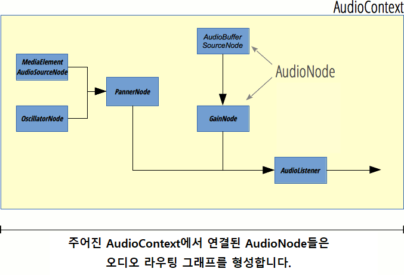

{{APIRef("Web Audio API")}}

**`AudioNode`** 인터페이스는 오디오 프로세싱 모듈을 나타내기 위한 포괄적인 인터페이스입니다.

그 예시로는,

- 오디오 소스 (예: HTML {{HTMLElement("audio")}} 또는 {{HTMLElement("video")}} 요소, {{domxref("OscillatorNode")}} 등)
- 오디오 목적지(destination)
- 중간 프로세싱 모듈 (예: {{domxref("BiquadFilterNode")}} 또는 {{domxref("ConvolverNode")}} 같은 필터)
- 볼륨 제어 (예: {{domxref("GainNode")}})

{{InheritanceDiagram}}

> **참고:**
>
> `AudioNode` 는 이벤트의 대상이 될 수 있으므로, `AudioNode`는 {{domxref("EventTarget")}} 인터페이스를 구현합니다.

## 설명

### 오디오 라우팅 그래프



각각의 `AudioNode` 는 입력과 출력을 가지며, 오디오 노드들은 연결되어 **프로세싱 그래프**를 형성합니다. 이 그래프는 {{domxref("AudioContext")}}내에 포함되어 있고, 각 오디오 노드는 오직 하나의 오디오 컨텍스트에만 속할 수 있습니다.

**소스 노드**는 0개의 입력을 가지나 하나 혹은 다수의 출력을 가지고, 사운드를 생성하기 위해 사용될 수 있습니다. 반면에, **목적지 노드**는 출력을 가지고 있지 않습니다. 대신, 이 노드의 모든 출력은 바로 스피커 (또는 오디오 컨텍스트가 사용하는 모든 오디오 출력 장치) 에서 재생됩니다. 추가적으로, 입력과 출력을 가지고 있는 **프로세싱 노드**가 있습니다. 이루어지는 정확한 프로세싱은 하나의 `AudioNode` 에서 다른 것까지 다양하나, 일반적으로, 노드는 자신의 입력을 읽고, 오디오에 관계된 프로세싱을 수행하고, 출력으로 새로운 값을 생성하거나, 오디오가 지나가도록 합니다 (그 예로 {{domxref("AnalyserNode")}}를 들 수 있는데, 이 노드에서는 프로세싱의 결과가 별도로 이용됩니다).

그래프에 노드가 많아질수록, 지연 시간은 길어질 것입니다. 예를 들어, 만약 오디오 그래프가 500ms 만큼 지연된다면, 소스 노드가 사운드를 재생할 때, 이 노드는 사운드가 스피커에서 들릴 때까지 0.5초를 소요할 것입니다 (혹은 근본적인 오디오 장치의 지연 때문에 더 길 수도 있습니다). 그러므로, 상호작용을 하는 오디오가 필요하다면, 가능한 한 작게 그래프를 유지하고, 그래프의 끝에 사용자에 의해 제어되는 오디오 노드를 배치하십시오. 예를 들자면, 볼륨 변화가 즉각적인 효과를 가지도록 볼륨 제어(`GainNode`)는 마지막 노드여야 합니다.

각각의 입력과 출력은 주어진 양의 **채널**을 가지고 있습니다. 예를 들자면, 모노 오디오는 하나의 채널을 가지고 있는 반면, 스테레오 오디오는 두 개의 채널을 가지고 있습니다. Web Audio API는 요구될 때 업믹스나 다운믹스를 수행할 것입니다. 자세한 사항은 Web Audio 명세서를 확인해 보세요.

모든 오디오 노드의 목록은 [Web Audio API](/ko/docs/Web/API/Web_Audio_API) 홈페이지에서 찾아볼 수 있습니다.

### `AudioNode` 생성하기

`AudioNode` 를 생성하는 데는 **생성자**를 통해서 생성하는 것과 **팩토리 메서드**를 통해 생성하는 두 가지 방법이 있습니다.

```js
// 생성자
const analyserNode = new AnalyserNode(audioCtx, {
  fftSize: 2048,
  maxDecibels: -25,
  minDecibels: -60,
  smoothingTimeConstant: 0.5,
});

// 팩토리 메서드
const analyserNode = audioCtx.createAnalyser();
analyserNode.fftSize = 2048;
analyserNode.maxDecibels = -25;
analyserNode.minDecibels = -60;
analyserNode.smoothingTimeConstant = 0.5;
```

생성자와 팩토리 메서드 중 어느 쪽이든 사용할 수 있고, 혹은 섞어서 사용할 수도 있지만, 생성자를 사용하는 방법에 이점이 있습니다.

- 생성 도중에 모든 매개변수들이 설정될 수 있고 개별적으로 설정될 필요가 없습니다.
- 오디오 노드의 [하위 클래스를 파생](https://github.com/WebAudio/web-audio-api/issues/251)시킬 수 있습니다. 실제 프로세싱은 브라우저에 의해 내부적으로 처리되고 변경될 수 없는 반면, 오디오 노드에 래퍼를 작성하여 사용자 정의 속성과 메서드를 제공할 수 있습니다.
- 조금 더 나은 성능을 보입니다. Chrome과 Firefox 모두에서, 팩토리 메서드는 생성자를 내부적으로 호출합니다.

**간략한 역사:** Web Audio 명세서의 첫번째 버전은 오직 팩토리 메서드만을 정의했습니다. [2013년 10월의 디자인 리뷰](https://github.com/WebAudio/web-audio-api/issues/250) 이후에, 생성자가 팩토리 메서드에 비해 수많은 이점들을 가지고 있었기 때문에 생성자를 추가하기로 결정되었습니다. 생성자는 2016년 8월에서부터 10월까지 명세서에 추가되었습니다. 팩토리 메서드는 명세서에 계속 포함되고 폐기(deprecated)되지 않았습니다.

## 속성

- {{domxref("AudioNode.context")}} {{readonlyInline}}
  - : 연관된 {{domxref("BaseAudioContext")}}를 반환하는데, {{domxref("BaseAudioContext")}}란 이 노드가 관여하고 있는 프로세싱 그래프를 나타내는 객체입니다.
- {{domxref("AudioNode.numberOfInputs")}} {{readonlyInline}}
  - : 노드에 공급되는 입력의 수를 반환합니다. 소스 노드는 `0` 의 값의 `numberOfInputs` 을 가진 노드로 정의됩니다.
- {{domxref("AudioNode.numberOfOutputs")}} {{readonlyInline}}
  - : 노드에서 나오는 출력의 수를 반환합니다. {{ domxref("AudioDestinationNode") }}같은 목적지 노드는 이 특성에 대해 `0` 의 값을 가지고 있습니다.
- {{domxref("AudioNode.channelCount")}}
  - : 노드의 모든 입력에 대한 연결을 [업믹싱 그리고 다운믹싱](/ko/docs/Web/API/Web_Audio_API/Basic_concepts_behind_Web_Audio_API#up-mixing_and_down-mixing)할 때 얼마나 많은 채널을 사용할 지 결정하기 위해 쓰이는 integer를 반환합니다. 이 속성의 사용법과 정밀한 정의는 {{domxref("AudioNode.channelCountMode")}}의 값에 달려 있습니다.
- {{domxref("AudioNode.channelCountMode")}}
  - : 채널들이 노드의 입력과 출력 사이에서 반드시 일치되어야만 하는 방법을 기술하는 열거형 값을 나타냅니다.
- {{domxref("AudioNode.channelInterpretation")}}
  - : 채널의 의미를 기술하는 열거형 값을 나타냅니다. 이 설명은 어떻게 오디오 [업믹싱과 다운믹싱](/ko/docs/Web/API/Web_Audio_API/Basic_concepts_behind_Web_Audio_API#up-mixing_and_down-mixing)이 일어날 것인지를 정의합니다. 가능한 값은 `"speakers"` 또는 `"discrete"` 입니다.

## 메서드

또한 {{domxref("EventTarget")}} 인터페이스로부터 메서드를 구현합니다.

- {{domxref("AudioNode.connect()")}}
  - : 이 메서드를 사용해 노드의 출력이 다른 노드에 오디오 데이터로써 혹은 {{domxref("AudioParam")}}의 값으로써 입력되도록 연결할 수 있습니다.
- {{domxref("AudioNode.disconnect()")}}
  - : 이 메서드를 사용해 이미 연결되어 있는 노드로부터 현재 노드의 연결을 끊을 수 있습니다.

## 예제

이 간단한 코드는 몇몇 오디오 노드의 생성과, 어떻게 `AudioNode` 속성과 메서드가 사용되는지를 보여줍니다. [Web Audio API](/ko/docs/Web/API/Web_Audio_API) 랜딩 페이지에 연결된 모든 예제에서 이러한 사용법의 예시를 찾을 수 있습니다 (예: [Violent Theremin](https://github.com/mdn/violent-theremin)).

```js
const audioCtx = new AudioContext();

const oscillator = new OscillatorNode(audioCtx);
const gainNode = new GainNode(audioCtx);

oscillator.connect(gainNode).connect(audioCtx.destination);

oscillator.context;
oscillator.numberOfInputs;
oscillator.numberOfOutputs;
oscillator.channelCount;
```

## 명세서

{{Specifications}}

## 브라우저 호환성

{{Compat}}

## 같이 보기

- [Web Audio API 사용하기](/ko/docs/Web/API/Web_Audio_API/Using_Web_Audio_API)
