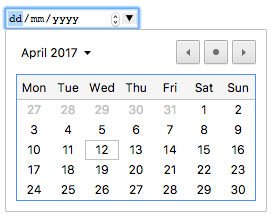

{{HTMLSidebar}}

**`date`** 유형의 {{HTMLElement("input")}} 요소는 유효성 검증을 포함하는 텍스트 상자 또는 특별한 날짜 선택 인터페이스를 사용해 날짜를 입력할 수 있는 입력 칸을 생성합니다.

입력 칸의 값은 연, 월, 일을 포함하지만 시간은 포함하지 않습니다. {{HTMLElement("input/time", "time")}}과 {{HTMLElement("input/datetime-local", "datetime-local")}} 입력 유형이 시간과 시간+날짜 조합을 지원합니다.

{{EmbedInteractiveExample("pages/tabbed/input-date.html", "tabbed-shorter")}}

입력 UI는 브라우저마다 다릅니다. [브라우저 호환성](#브라우저_호환성)에서 더 자세한 정보를 알아보세요. 날짜 입력 유형을 지원하지 않는 브라우저에서는 우아하게 [`<input type="text">`](/ko/docs/Web/HTML/Element/input/text)로 저하됩니다.

날짜 선택을 위한 별도의 인터페이스를 갖춘 브라우저 중, Chrome과 Opera는 다음과 같은 모양의 달력을 보여줍니다.



구 Edge의 컨트롤입니다.


Firefox의 날짜 컨트롤입니다.


<table class="properties">
  <tbody>
    <tr>
      <td>
        <strong><a href="#값">값</a></strong>
      </td>
      <td>
        YYYY-MM-DD 형식으로 날짜를 나타내거나, 빈
        {{domxref("DOMString")}}.
      </td>
    </tr>
    <tr>
      <td><strong>이벤트</strong></td>
      <td>
        {{domxref("HTMLElement/change_event", "change")}},
        {{domxref("HTMLElement/input_event", "input")}}
      </td>
    </tr>
    <tr>
      <td><strong>지원하는 공통 특성</strong></td>
      <td>
        <a href="/ko/docs/Web/HTML/Element/input#autocomplete"><code>autocomplete</code></a>,
        <a href="/ko/docs/Web/HTML/Element/input#list"><code>list</code></a>,
        <a href="/ko/docs/Web/HTML/Element/input#readonly"><code>readonly</code></a>,
        <a href="/ko/docs/Web/HTML/Element/input#step"><code>step</code></a>
      </td>
    </tr>
    <tr>
      <td><strong>IDL 특성</strong></td>
      <td>
        <code>list</code>, <code>value</code>, <code>valueAsDate</code>,
        <code>valueAsNumber</code>.
      </td>
    </tr>
    <tr>
      <td><strong>메서드</strong></td>
      <td>
        {{domxref("HTMLInputElement.select", "select()")}},
        {{domxref("HTMLInputElement.stepDown", "stepDown()")}},
        {{domxref("HTMLInputElement.stepUp", "stepUp()")}}
      </td>
    </tr>
  </tbody>
</table>

## 값

날짜 입력 칸의 값은 입력한 날짜를 나타내는 {{domxref("DOMString")}}입니다. 날짜는 유효한 날짜 문자열 문서에서 설명하듯, ISO8601을 따르는 서식을 취합니다.

[`value`](/ko/docs/Web/HTML/Element/input#value) 특성에 날짜를 지정해서 입력 칸의 기본값을 지정할 수 있습니다.

```html
<input type="date" value="2017-06-01" />
```

{{EmbedLiveSample('값', 600, 40)}}

<div class="blockIndicator note"><p><strong>표시 값과 실제 <code>value</code>의 불일치</strong> — 입력 칸에 표시되는 값은 사용자 브라우저의 로케일에 기반한 서식을 따라가지만, <code>value</code>는 항상 <code>yyyy-mm-dd</code>의 서식을 사용합니다.</p></div>

입력 요소의 날짜 값은 JavaScript의 {{domxref("HTMLInputElement.value", "value")}}와 {{domxref("HTMLInputElement.valueAsNumber", "valueAsNumber")}} 속성으로 설정할 수도 있습니다. 다음 예제 코드를 보세요.

```js
var dateControl = document.querySelector('input[type="date"]');
dateControl.value = "2017-06-01";
console.log(dateControl.value); // prints "2017-06-01"
console.log(dateControl.valueAsNumber); // prints 1496275200000, a UNIX timestamp
```

위의 코드는 `type`이 `date`인 첫 번째 {{HTMLElement("input")}} 요소를 찾아서, 값을 `2017-06-01`로 설정합니다. 그리고 값을 다시 문자열과 숫자 형태로 가져옵니다.

## 추가 특성

모든 {{htmlelement("input")}} 요소의 공용 특성 외에도, `date` 유형은 아래의 특성도 지원합니다.

| 특성            | 설명                                                                         |
| --------------- | ---------------------------------------------------------------------------- |
| [`max`](#max)   | 허용하는 가장 늦은 날짜                                                      |
| [`min`](#min)   | 허용하는 가장 이른 날짜                                                      |
| [`step`](#step) | 위/아래 조절 버튼을 눌렀을 때와, 날짜 유효성을 검증할 때 사용하는 스텝 간격. |

### {{htmlattrdef("max")}}

받을 수 있는 제일 나중 날짜. 입력받은 [`value`](/ko/docs/Web/HTML/Element/input#value)가 `max`보다 더 나중이라면 유효성 검증에 실패합니다. `max`의 값이 `yyyy-mm-dd` 형식의 유효한 날짜 문자열이 아니면 최댓값을 지정하지 않은 것으로 간주합니다.

`max`와 `min` 특성을 모두 사용할 경우, `max`는 `min`과 **동일하거나 이후**인 날짜 문자열이어야 합니다.

### {{htmlattrdef("min")}}

받을 수 있는 제일 이전 날짜. 입력받은 [`value`](/ko/docs/Web/HTML/Element/input#value)가 `min`보다 더 이전이라면 유효성 검증에 실패합니다. `min`의 값이 `yyyy-mm-dd` 형식의 유효한 날짜 문자열이 아니면 최솟값을 지정하지 않은 것으로 간주합니다.

`max`와 `min` 특성을 모두 사용할 경우, `min`은 `max`와 **동일하거나 이전**인 날짜 문자열이어야 합니다.

### {{htmlattrdef("step")}}

The `step` attribute is a number that specifies the granularity that the value must adhere to, or the special value `any`, which is described below. Only values which are equal to the basis for stepping ([`min`](#min) if specified, [`value`](/ko/docs/Web/HTML/Element/input#value) otherwise, and an appropriate default value if neither of those is provided) are valid.

A string value of `any` means that no stepping is implied, and any value is allowed (barring other constraints, such as [`min`](#min) and [`max`](#max)).

> **참고:** When the data entered by the user doesn't adhere to the stepping configuration, the {{Glossary("user agent")}} may round to the nearest valid value, preferring numbers in the positive direction when there are two equally close options.

`date` 입력 칸의 `step` 값은 날짜 단위, 즉 밀리초 단위로 86,400,000 ✕ `step`로 처리합니다. 기본값은 1로, 하루를 나타냅니다.

> **참고:** `date` 입력 칸에서 `step`의 값으로 `any`를 지정하면 `1`과 같습니다.

## 날짜 입력 칸 사용하기

날짜 입력 칸은 꽤 편리하게 보입니다. 날짜를 선택할 수 있는 쉬운 인터페이스를 제공하고, 서버로 값을 전송할 땐 현재 사용자의 로케일과 관계 없이 정규화하니까요. 그러나, 지금은 제한적인 브라우저 지원으로 인한 문제가 존재합니다.

이 구획에서는 `<input type="date">`의 기본 사용법과 복잡한 사용법을 살펴볼 것이고, 뒤에서는 브라우저 지원 문제를 처리할 때 사용할 수 있는 조언을 드리겠습니다. ([미지원 브라우저 처리하기](#미지원_브라우저_처리하기)로 가세요.)

> **참고:** 모든 브라우저에서 날짜 입력 칸을 지원하는 날이 오면 이 문제도 자연스럽게 사라질 것입니다.

### 기본 예제

`<input type="date">`의 가장 간단한 사용법은 아래 코드처럼 하나의 `<input>`과 그 {{htmlelement("label")}}로 이뤄집니다.

```html
<form action="https://example.com">
  <label>
    Enter your birthday:
    <input type="date" name="bday" />
  </label>

  <p><button>Submit</button></p>
</form>
```

{{EmbedLiveSample('기본_예제', 600, 40)}}

위의 HTML은 입력받은 날짜를 `bday`라는 키로 `https://example.com`에 제출합니다. 그래서, 최종 URL은 `https://example.com/?bday=1955-06-08`이 됩니다.

### 최대와 최소 날짜 설정

[`min`](/ko/docs/Web/HTML/Element/input#min)과 [`max`](/ko/docs/Web/HTML/Element/input#max) 특성을 사용하면 사용자가 선택할 수 있는 날짜를 제한할 수 있습니다. 다음 코드에서는 최소 날짜 `2017-04-01`, 최대 날짜 `2017-04-30`을 지정합니다.

```html
<form>
  <label for="party"
    >Choose your preferred party date:
    <input type="date" name="party" min="2017-04-01" max="2017-04-30" />
  </label>
</form>
```

{{EmbedLiveSample('최대와_최소_날짜_설정', 600, 40)}}

실행 결과에서 2017년 4월의 날짜만 선택 가능함을 볼 수 있습니다. 입력 칸의 연과 월은 편집이 불가능해지며, 날짜 선택 위젯에서도 2017년 4월 바깥의 날짜는 선택할 수 없습니다.

> **참고:** 원래 [`step`](/ko/docs/Web/HTML/Element/input#step) 특성을 사용해 날짜를 증감할 때 늘어날 일 수를 조절할 수 있어야 하고, 이를 이용해 토요일만 선택 가능하게 하는 등의 처리가 가능해야 합니다. 그러나 지금은 아무 브라우저에서도 구현하고 있지 않습니다.

### 입력 칸 크기 조절

`<input type="date">`는 [`size`](/ko/docs/Web/HTML/Element/input#size) 등의 크기 조절 특성을 지원하지 않습니다. [CSS](/ko/docs/Web/CSS)를 사용하세요.

## 유효성 검사

`<input type="date">`는 기본값에선 값의 형식 외에 다른 유효성 검사는 수행하지 않습니다. 보통 날짜 입력 칸의 인터페이스가 날짜 이외의 값을 처음부터 허용하지 않는 것이 유용하긴 하나, 아무 값을 입력하지 않을 수도 있고, 미지원 브라우저에서 텍스트 입력 칸으로 대체된 경우 4월 32일처럼 유효하지 않은 날짜도 입력할 수 있습니다.

[`min`](/ko/docs/Web/HTML/Element/input#min)과 [`max`](/ko/docs/Web/HTML/Element/input#max)를 사용해 가능한 날짜 범위를 제한([최대와 최소 날짜 설정](#최대와_최소_날짜_설정))한 경우, 지원하는 브라우저에서는 범위 밖의 값을 받았을 때 오류를 표시합니다. 그러나 브라우저가 온전히 지원하지 않을 수도 있기 때문에, 제출받은 값을 이중으로 검증하는 것이 필요합니다.

[`required`](/ko/docs/Web/HTML/Element/input#required) 특성을 사용해 값을 필수로 요구할 수도 있으며, 빈 입력 칸을 제출하려고 하면 오류를 표시합니다. required는 대부분의 브라우저에서, 텍스트 입력 칸으로 대체되더라도 지원하고 있습니다.

최소/최대 날짜와 필수 검증 예제를 보겠습니다.

```html
<form>
  <label>
    Choose your preferred party date (required, April 1st to 20th):
    <input
      type="date"
      name="party"
      min="2017-04-01"
      max="2017-04-20"
      required />
    <span class="validity"></span>
  </label>

  <p>
    <button>Submit</button>
  </p>
</form>
```

날짜 입력 칸의 입력을 완전히 끝내지 않았거나, 범위 밖의 값으로 제출을 시도하면 브라우저가 오류를 표시하는 것을 확인할 수 있습니다. 아래 실행 결과에서 직접 해보세요.

{{EmbedLiveSample('유효성_검사', 600, 100)}}

지원하지 않는 브라우저를 사용하시는 경우엔 다음 스크린샷을 참고하세요.


다음은 위 코드에서 사용한 CSS로, {{cssxref(":valid")}}와 {{cssxref(":invalid")}} 의사 클래스를 사용해 입력한 값의 유효성 여부에 따라 다른 스타일을 적용하고 있습니다. 구체적으로는, 유효성에 따라 입력 칸의 옆에 배치한 {{htmlelement("span")}}에 아이콘을 추가합니다.

```css
label {
  display: flex;
  align-items: center;
}

span::after {
  padding-left: 5px;
}

input:invalid + span::after {
  content: "✖";
}

input:valid + span::after {
  content: "✓";
}
```

> **경고:** **중요**: 클라이언트측 유효성 검사는 서버의 검사를 대체할 수 없습니다. HTML을 수정하는 것도 쉽지만, HTML을 완전히 우회하고 서버에 데이터를 직접 제출할 수도 있기 때문입니다. 서버가 받은 데이터의 검증을 하지 못하는 경우 잘못된 형식, 잘못된 유형, 너무 큰 데이터 등으로 인해 심각한 상황을 맞을 수도 있습니다.

## 미지원 브라우저 처리하기

위에서 언급했듯, 현재 날짜 입력 칸의 큰 문제는 [브라우저 지원](#브라우저_호환성)입니다. 예를 하나 들자면, Firefox for Android의 날짜 입력기는 다음과 같은 모습입니다.


지원하지 않는 브라우저에서는 단순한 텍스트 입력 칸으로 우아하게 저하되긴 하지만, 이는 (보여지는 컨트롤이 다르므로) 사용자 인터페이스와 데이터 처리가 일관적이지 못하다는 문제를 만듭니다.

두 문제 중 데이터 처리가 더 심각합니다. 날짜 입력 칸을 지원하는 브라우저에서는 값을 `yyyy-mm-dd`의 형식으로 정규화합니다. 그러나 텍스트 입력만으로는 값의 형식을 브라우저가 알 수 없으며, 사람들은 다양한 형태로 날짜를 입력합니다. 다음은 그 일부입니다.

- `yymmdd`
- `yyyymmdd`
- `yyyy/mm/dd`
- `yyyy-mm-dd`
- `dd/mm/yyyy`
- `mm-dd-yyyy`

해결하는 방법 중 하나는 날짜 입력 칸에 [`pattern`](/ko/docs/Web/HTML/Element/input#pattern) 특성을 사용하는 것입니다. 날짜 입력 칸은 사용하지 않는 특성이지만 텍스트 입력 칸으로 대체된 경우에는 사용하기 때문인데, 미지원 브라우저에서 다음 코드를 확인해보세요.

```html
<form>
  <label for="bday"
    >Enter your birthday:
    <input type="date" name="bday" required pattern="\d{4}-\d{2}-\d{2}" />
    <span class="validity"></span>
  </label>
  <p>
    <button>Submit</button>
  </p>
</form>
```

{{EmbedLiveSample('미지원_브라우저_처리하기', 600, 100)}}

입력한 값을 패턴 `####-##-##` (`#`은 0에서 9까지의 숫자)에 맞추지 않고 제출해보면 브라우저가 날짜 입력 칸을 강조하며 오류를 표시함을 볼 수 있습니다. 물론 아직도 사람들이 유효하지 않은 날짜나 잘못된 형태로 입력하는 것은 막을 수 없으므로, 문제를 해결한 것은 아닙니다.

```css hidden
span {
  position: relative;
}

span::after {
  right: -18px;
  position: absolute;
}

input:invalid + span::after {
  content: "✖";
}

input:valid + span::after {
  content: "✓";
}
```

그러므로 지금으로서는, 크로스 브라우저 날짜 처리를 지원하기 위한 가장 좋은 방법은 각각 다른 입력 칸에 연, 월, 일을 입력하도록 하는 방법과, 외부 JavaScript 라이브러리를 사용하는 편이 최선입니다.

## 예제

이번 예제에서는 날짜를 선택할 수 있는 사용자 인터페이스 두 개를 만들어보겠습니다. 첫 번째는 네이티브 `<input type="date">` 입력 칸을 사용한 것이고, 두 번째는 네이티브 입력 칸을 지원하지 않는 구형 브라우저에서 사용할 수 있도록 세 개의 {{htmlelement("select")}} 요소를 이용한 것입니다.

{{EmbedLiveSample('예제', 600, 100)}}

### HTML

HTML은 다음과 같습니다.

```html
<form>
  <label class="nativeDatePicker"
    >Enter your birthday:
    <input type="date" name="bday" />
    <span class="validity"></span>
  </label>

  <fieldset class="fallbackDatePicker" hidden>
    <legend class="fallbackLabel">Enter your birthday:</legend>

    <label>
      Day:
      <select name="day"></select>
    </label>

    <label>
      Month:
      <select name="month">
        <option>January</option>
        <option>February</option>
        <option>March</option>
        <option>April</option>
        <option>May</option>
        <option>June</option>
        <option>July</option>
        <option>August</option>
        <option>September</option>
        <option>October</option>
        <option>November</option>
        <option>December</option>
      </select>
    </label>

    <label>
      Year:
      <select name="year"></select>
    </label>
  </fieldset>
</form>
```

월은 변하지 않으므로 하드코딩합니다. 일과 연은 현재 선택 값에 따라 동적으로 생성하도록 비워놓습니다. (자세한 설명은 아래의 코드 주석을 참고하세요.)

```css hidden
span {
  padding-left: 5px;
}

input:invalid + span::after {
  content: "✖";
}

input:valid + span::after {
  content: "✓";
}
```

### JavaScript

코드에서 관심을 가질만한 곳은 브라우저의 `<input type="date">` 지원 여부를 알아내기 위한 기능 탐지 부분입니다.

우선 새로운 {{htmlelement("input")}} 요소를 만들고, `type`을 `date`로 설정해봅니다. 그리고 즉시 `<input>`의 유형을 검사하는데, 지원하지 않는 브라우저에서 `date`는 `text`로 대체되므로 `text`를 반환합니다. `<input type="date">`을 지원하지 않는다는 사실을 알아냈으면 네이티브 입력 칸을 숨기고, 대체 요소({{htmlelement("select")}})를 대신 노출합니다.

```js
// define variables
var nativePicker = document.querySelector(".nativeDatePicker");
var fallbackPicker = document.querySelector(".fallbackDatePicker");

var yearSelect = document.querySelector("[name=year]");
var monthSelect = document.querySelector("[name=month]");

// Test whether a new date input falls back to a text input
var testElement = document.createElement("input");

try {
  test.type = "date";
} catch (e) {
  console.log(e.description);
}

// If it does, run the code inside the if () {} block
if (testElement.type === "text") {
  // hide the native picker and show the fallback
  nativePicker.hidden = true;
  fallbackPicker.hidden = false;

  // populate the days and years dynamically
  // (the months are always the same, therefore hardcoded)
  populateDays(monthSelect.value);
  populateYears();
}

function populateDays(month) {
  const daySelect = document.querySelector("[name=day]");
  const month = monthSelect.value;

  // Create variable to hold new number of days to inject
  let dayNum;

  // 31 or 30 days?
  switch (month) {
    case "April":
    case "June":
    case "September":
    case "November":
      dayNum = 30;
      break;
    case "February":
      // If month is February, calculate whether it is a leap year or not
      const year = yearSelect.value;
      const isLeap = new Date(year, 1, 29).getMonth() === 1;
      dayNum = isLeap ? 29 : 28;
      break;
    default:
      dayNum = 31;
  }

  // inject the right number of new <option>s into the <select>
  daySelect.options = Array.from({ length: dayNum }, function (index) {
    return index + 1;
  });

  // if previous day has already been set, set daySelect's value
  // to that day, to avoid the day jumping back to 1 when you
  // change the year
  if (previousDay) {
    daySelect.value = previousDay;

    // If the previous day was set to a high number, say 31, and then
    // you chose a month with fewer days in it (like February),
    // this code ensures that the highest day available
    // is selected, rather than showing a blank daySelect
    if (previousDay > daySelect.length + 1) {
      daySelect.selectedIndex = daySelect.length;
    }
  }
}

function populateYears() {
  // get this year as a number
  var year = new Date().getFullYear();

  // Make this year and the 100 years before it available in the <select>
  daySelect.options = Array.from({ length: 100 }, function (index) {
    return index + year;
  });
}

// when the month or year <select> values are changed, rerun populateDays()
// in case the change affected the number of available days
yearSelect.onchange = populateDays;
monthSelect.onchange = populateDays;

// preserve day selection
var previousDay;

// update what day has been set to previously
// see end of populateDays() for usage
daySelect.onchange = function () {
  previousDay = daySelect.value;
};
```

> **참고:** 어떤 연도는 53주임을 기억하세요! ([Wikipedia](https://en.wikipedia.org/wiki/ISO_week_date#Weeks_per_year)) 프로덕션 애플리케이션을 개발할 땐 고려해야 할 사항입니다.

## 명세

{{Specifications}}

## 브라우저 호환성

{{Compat}}

## 같이 보기

- 일반 {{HTMLElement("input")}} 요소와, 그 인터페이스인 {{domxref("HTMLInputElement")}}.
