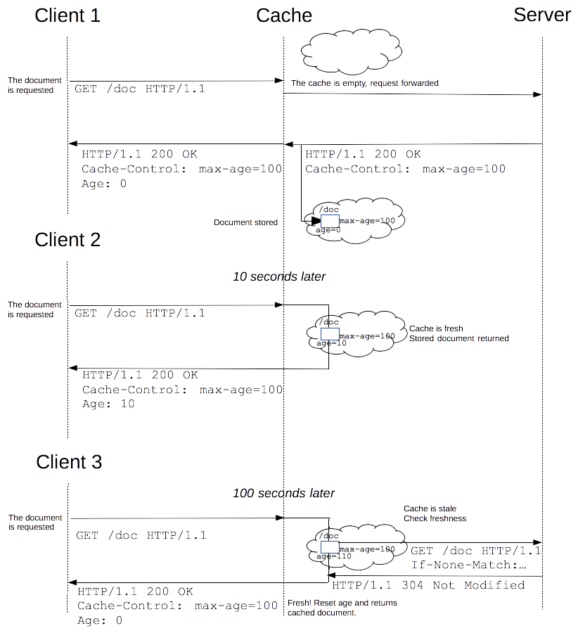

{{HTTPSidebar}}

웹 사이트와 애플리케이션의 성능은 이전에 가져온 리소스들을 재사용함으로써 현저하게 향상될 수 있습니다. 웹 캐시는 레이턴시와 네트워크 트래픽을 줄여줌으로써 리소스를 보여주는 데에 필요한 시간을 줄여줍니다. HTTP 캐싱을 활용하면 웹 사이트가 좀 더 빠르게 반응하도록 만들 수 있습니다.

## 다른 종류의 캐시들

캐싱은 주어진 리소스의 복사본을 저장하고 있다가 요청 시에 그것을 제공하는 기술입니다. 웹 캐시가 자신의 저장소 내에 요청된 리소스를 가지고 있다면, 요청을 가로채 원래의 서버로부터 리소스를 다시 다운로드하는 대신 리소스의 복사본을 반환합니다. 이것은 다음과 같은 몇 가지 목표를 달성하게 해줍니다: 모든 클라이언트를 서비스할 필요가 없어지므로 서버의 부하를 완화하고, (캐시가 원래 서버에 비해서) 클라이언트에 더 가까이에 있으므로 성능이 향상됩니다. 즉, 리소스를 회신하는데 더 적은 시간이 들게 됩니다. 웹 사이트에서 캐싱은 높은 성능을 달성하는 데에 주요한 요소입니다. 반면에 모든 리소스가 영원히 변하지 않는 것은 아니므로 리소스가 변하기 전까지만 캐싱하고 변한 이후에는 더이상 캐싱하지 않는 것이 중요합니다.

캐시에는 몇 가지 종류가 있습니다: 크게 사설(private) 혹은 공유(shared) 캐시 두 가지 부류로 분류될 수 있습니다. *공유 캐시*는 한 명 이상의 사용자가 재사용할 수 있도록 응답을 저장하는 캐시를 말합니다. *사설 캐시*는 한 명의 사용자만 사용하는 캐시를 말합니다. 이 페이지에서는 거의 대부분 브라우저와 프록시 캐시에 대해서만 다룰 것이나, 그 외에도 더 나은 신뢰도, 성능 그리고 웹 사이트와 웹 애플리케이션의 확장(scaling)을 위해 웹 서버 위에 배포되는 게이트웨이 캐시, CDN, 리버스 프록시 캐시 그리고 로드 밸랜서 등이 있습니다.


### 사설 브라우저 캐시

사설 캐시는 단일 사용자가 전용으로 사용합니다. 브라우저 설정에서 "caching"을 본 적이 있을 겁니다. 브라우저 캐시는 그 사용자에 의하여 [HTTP](/ko/docs/Web/HTTP)를 통해 다운로드된 모든 문서들을 가지고 있습니다. 이 캐시는 서버에 대한 추가적인 요청 없이 뒤로 가기나 앞으로 가기, 저장, 소스로 보기 등을 위해 방문했던 문서들을 사용할 수 있도록 해 줍니다. 또한 유사한 방법으로 캐시된 컨텐츠의 오프라인 브라우징을 개선시킵니다.

### 공유 프록시 캐시

공유 캐시는 한 명 이상의 사용자에 의해 재사용되는 응답을 저장하는 캐시입니다. 예를 들어, 당신의 회사의 ISP는 많은 사용자들을 서비스하기 위해 지역 네트워크 기반의 일부분으로서 웹 프록시를 설치해뒀을 수도 있는데, 그 덕분에 조회가 많이 되는 리소스들은 몇 번이고 재사용되어 네트워크 트래픽과 레이턴시를 줄여줍니다.

## 캐싱 동작의 대상

HTTP 캐싱은 선택적(optional)이지만 캐시된 리소스를 재사용하는 것은 보통 바람직한 일입니다. 하지만, HTTP 캐시들은 일반적으로 {{HTTPMethod("GET")}}에 대한 응답만을 캐싱하며, 다른 메서드들은 제외될 겁니다. 기본 캐시 키(primary cache key)는 요청 메서드 그리고 대상 URI로 구성됩니다(GET 요청만을 대상으로 하므로 URI만 사용되는 경우가 많습니다). 일반적인 캐싱 엔트리의 형태는 다음과 같습니다:

- 검색(retrieval) 요청의 성공적인 결과: HTML 문서, 이미지 혹은 파일과 같은 리소스를 포함하는 {{HTTPMethod("GET")}} 요청에 대한 {{HTTPStatus(200)}} (OK) 응답.
- 영구적인 리다이렉트: {{HTTPStatus(301)}} (Moved Permanently) 응답.
- 오류 응답: {{HTTPStatus(404)}} (Not Found) 결과 페이지.
- 완전하지 않은 결과: {{HTTPStatus(206)}} (Partial Content) 응답.
- 캐시 키로 사용하기에 적절한 무언가가 정의된 경우의 {{HTTPMethod("GET")}} 이외의 응답.

캐시 엔트리는 요청이 컨텐츠 협상의 대상인 경우, 두번째 키에 의해 구별되는 여러 개의 저장된 응답들로 구성될 수도 있습니다. 좀 더 자세한 내용을 참고하시려면 [아래에서](#varying_responses) {{HTTPHeader("Vary")}} 헤더에 대해서 읽어보시기 바랍니다.

## 캐싱 제어

### `Cache-control` 헤더

{{HTTPHeader("Cache-Control")}} HTTP/1.1 기본 헤더 필드는 요청과 응답 양측 모두에 있어 캐싱 메커니즘을 위한 디렉티브를 지정하는데 사용됩니다. 이 헤더 필드가 제공하는 여러 디렉티브들로 캐싱 정책을 정의하고자 한다면 이 헤더를 사용하시기 바랍니다.

#### 캐시하지 않음

캐시는 클라이언트 요청 혹은 서버 응답에 관해서 어떤 것도 저장해서는 안됩니다. 요청은 서버 측으로 전송되고 전체 응답은 매번 다운로드됩니다.

```
Cache-Control: no-store
```

#### 캐시하지만 재검증

캐시된 복사본을 사용자에게 릴리즈 하기 전에, 유효성 확인을 위해 원 서버로 요청을 보냅니다.

```
Cache-Control: no-cache
```

#### 사설 캐시와 공개 캐시

"public" 디렉티브는 응답이 어떤 캐시에 의해서든 캐시되어도 좋다는 것을 가리킵니다. 이것은 HTTP 인증, 혹은 보통 캐시 가능하지 않은 응답 상태 코드를 지닌 페이지가 이제 캐시되어야 할 경우 유용할 수 있습니다.

반면 "private"은 응답이 단일 사용자만을 위한 것이며 공유 캐시에 의해 저장되어서는 안된다는 것을 가리킵니다. 사설 브라우저 캐시는 이런 경우에 응답을 저장할 수 있습니다.

```
Cache-Control: private
Cache-Control: public
```

#### 만료

여기서 가장 중요한 디렉티브는 "`max-age=<seconds>`"로 리소스가 유효하다고 판단되는 최대 시간을 말합니다. 이 디렉티브는 요청 시간에 상대적이며, {{HTTPHeader("Expires")}}가 설정되어 있어도 그보다 우선합니다. 변경되지 않을 파일에 대해, 공격적으로 (긴 시간으로) 캐싱할 수 있습니다. 예를 들어 이미지, CSS 파일 그리고 자바스크립트 파일과 같은 정적 파일들입니다.

좀 더 자세한 내용을 위해, 아래에서 [유효성](#유효성freshness) 섹션을 참고하시기 바랍니다.

```
Cache-Control: max-age=31536000
```

#### 검증

"`must-revalidate`" 디렉티브 사용 시, 캐시는 오래된 리소스를 사용하기 전에 그 상태를 확인하고 만료된 리소스는 사용하지 말아야 합니다. 좀 더 자세한 내용은, 아래에서 [검증](#캐시_검증) 섹션을 참고하시기 바랍니다.

```
Cache-Control: must-revalidate
```

### `Pragma` 헤더

{{HTTPHeader("Pragma")}}는 HTTP/1.0 헤더입니다. `Pragma: no-cache`는 캐시가 검증을 위해 원래 서버에 요청을 보내도록 강제한다는 점에서 `Cache-Control: no-cache`와 유사합니다. 그러나 `Pragma`는 HTTP 응답에 대해 명세되지 않았으므로 일반적인 HTTP/1.1 `Cache-Control` 헤더를 신뢰성 있게 대체할 수 없습니다.

`Cache-Control` HTTP/1.1 헤더가 없는 HTTP/1.0 클라이언트와의 하위 호환성을 위한 경우에만 `Pragma`를 사용하여야 합니다.

## 유효성(Freshness)

리소스가 캐시 내에 저장되고 나면, 이론적으로는 영원히 캐시에 의해 서비스될 수도 있습니다. 캐시는 유한한 저장 공간을 가지므로 아이템들은 주기적으로 스토리지에서 제거됩니다. 이런 과정을 *캐시 축출(cache eviction)*이라고 부릅니다. 반면 어떤 리소스들은 서버 상에서 변경될 수 있고, 캐시가 갱신되어야 합니다. HTTP가 클라이언트-서버 프로토콜이므로, 리소스가 변경됐을 때 서버는 캐시와 클라이언트에 접근할 수 없습니다; 서버는 리소스에 대한 만료 시간을 알려줄 수밖에 없습니다. 만료 시간 이전에는, 리소스가 *유효(fresh)*합니다; 만료 시간 이후의 리소스는 *실효(stale)*됩니다. 축출 알고리즘은 대개 실효된 리소스보다 유효한 리소스에 특권을 부여합니다. 실효된 리소스는 축출되거나 무시되지 않는다는 것을 알아두시기 바랍니다; 캐시가 실효된 리소스에 대한 요청을 받은 경우, 이 리소스가 실제로 아직 유효한지 아닌지를 확인하기 위해 {{HTTPHeader("If-None-Match")}}와 함께 요청을 전달합니다. 만약 그렇다면, 서버는 요청된 리소스 본문을 전송하지 않고 {{HTTPStatus("304")}} (Not Modified) 헤더를 돌려보내 대역폭을 절약합니다.

다음은 이런 과정에 대한 공유 캐시 프록시를 이용한 예제입니다:



유효 수명은 몇가지 헤더에 근거해 계산됩니다. "`Cache-control: max-age=N`" 헤더가 설정된 경우, 유효 수명은 N과 동일합니다. 만약 이 헤더가 없다면, 이런 경우가 매우 많습니다만, {{HTTPHeader("Expires")}} 헤더가 있는지 없는지를 검사합니다. `Expires` 헤더가 존재한다면, 그것의 값에서 {{HTTPHeader("Date")}} 헤더의 값을 뺀 결과가 유효 수명이 됩니다.

### 유효성 검사 휴리스틱

원래 서버가 명시적으로 유효성을 지정하지 않았으면 (예를 들어 {{HTTPHeader("Cache-Control")}} 또는 {{HTTPHeader("Expires")}} 헤더를 사용해서), 휴리스틱으로 유효 기간을 추정합니다.

이 경우에는 {{HTTPHeader("Last-Modified")}} 헤더를 찾습니다. 이 헤더가 있다면, 캐시의 유효 수명은 `Date` 헤더 값에서 `Last-modified` 헤더 값을 뺀 값을 10으로 나눈 결과가 됩니다.
만료 시간은 다음과 같이 계산됩니다:

```
expirationTime = responseTime + freshnessLifetime - currentAge
```

`responseTime`은 브라우저가 응답을 수신한 시간을 말합니다. 더 많은 정보를 위해서는 [RFC 7234: Hypertext Transfer Protocol (HTTP/1.1): 4.2.2. Calculating Heuristic Freshness](https://tools.ietf.org/html/rfc7234#section-4.2.2)를 참조하시기 바랍니다.

### 리비전된(Revved) 리소스

우리가 캐시된 리소스들을 많이 사용할수록, 웹 사이트의 응답성과 성능은 점점 더 좋아질 것입니다. 이것을 최적화하기 위한 좋은 방법은 만료 시간을 가능한 더 먼 미래로 설정하는 것입니다. 이것은 정기적으로나 자주 업데이트되는 리소스에 대해서는 가능하지만, 드물게 업데이트되는 리소스의 경우에는 문제가 됩니다. 이런 리소스들을 캐시하면 이득이 크지만, 업데이트하기가 매우 어렵기 때문입니다. 캐시한 리소스로부터 최대한 활용되는 리소스들로, 앞서 얘기한 방법 덕분에 이러한 리소스들을 갱신하기 더 어렵게 됩니다. 대표적으로 각 웹 페이지에 포함되고 링크된 기술적인 리소스들이 그렇습니다: 자바스크립트와 CSS 파일들의 변경은 드물지만, 그것들이 변경되었을 때에는 빠르게 갱신되기를 원할 겁니다.

웹 개발자들은 Steve Sounders가 _revving_[\[1\]](https://www.stevesouders.com/blog/2008/08/23/revving-filenames-dont-use-querystring/)이라고 불렀던 기술을 발명했습니다. 드물게 업데이트되는 파일들은 특정한 방법으로 이름붙여집니다: 파일들의 URL내에, 보통 파일명에, 수정(혹은 버전) 번호가 추가됩니다. 그렇게 해서 해당 리소스의 각각의 새로운 수정본 자체는 결코 변경되지 않으며, 보통 1년 혹은 그 이상의 아주 먼 미래로 만료 시간이 설정될 수 있습니다. 새로운 버전을 가지기 위해, 해당 리소스와의 모든 연결(link)들은 전부 변경되어야 하며, 그것이 이 방법의 단점입니다: 이 추가적인 복잡함은 보통 웹 개발자들이 사용하는 툴체인에 의해 다루어집니다. 드물게 변경되는 리소스들이 변경되는 경우 자주 변경되는 리소스에 추가적인 변경을 합니다. 이런 리소스들이 읽혀지는 경우, 다른 리소스들의 새로운 버전들도 읽혀지게 됩니다.

이 기술은 추가적인 이점도 가지고 있습니다: 캐시된 두 개의 리소스를 동시에 갱신해도 한 리소스의 오래된 버전이 다른 리소스의 새로운 버전과 함께 혼합되어 사용되는 경우를 초래하지 않을 것입니다. 이것은 웹 사이트가 상호 간의 의존성을 가지고 있는 CSS 스타일시트와 자바스크립트를 가지고 있는 경우 (같은 HTML 요소를 참조하기에 서로 의존하게 됩니다) 매우 중요합니다.


리소스에 추가되는 수정 버전은 1.1.3과 같은 전통적인 버전 번호 형식이 아니어도 되고, 단조 증가하는 숫자들이 아니어도 됩니다. 그것은 해시 혹은 날짜와 같이 충돌만 되지 않는다면 무엇이든지 될 수 있습니다.

## 캐시 검증

캐시된 문서의 만료 시간이 가까워져오면, 문서가 검증되거나 다시 불러오게 됩니다. 검증은 서버가 _강한 검증_ 혹은 _약한 검증_ 중 하나라도 제공하는 경우에만 일어날 수 있습니다.

재검증은 사용자가 리로드 버튼을 누를 경우 촉발됩니다. 재검증은 캐시된 응답이 "`Cache-control: must-revalidate`" 헤더를 포함하고 있는 경우 일반적인 브라우징 중에도 촉발될 수 있습니다. 또 다른 요인은 `Advanced->Cache` 환경설정 패널 내에 캐시 검증 환경 설정입니다. 거기에는 문서가 로드될 때마다 검증을 강제할 수 있는 옵션이 있습니다.

### ETags

{{HTTPHeader("ETag")}} 응답 헤더는 강한 검증으로써 사용될 수 있는 _사용자 에이전트에게 있어 불투명한(opaque)_ 값입니다. 그것은 브라우저와 같은 HTTP 사용자 에이전트가 이 문자열이 무엇을 표현하는지 알 수 없고, 그것의 값이 무엇이 될지를 예측할 수 없다는 것을 의미합니다. `ETag` 헤더가 리소스에 대한 응답의 일부라면, 클라이언트는 이후 요청의 해더 내에 (캐시된 리소스를 검증하기 위해) {{HTTPHeader("If-None-Match")}}를 줄 수 있습니다.

### Last-Modified

{{HTTPHeader("Last-Modified")}} 응답 헤더는 약한 검증으로써 사용될 수 있습니다. 그것이 1초의 해상도만 가질 수 있기에 약하다고 간주됩니다. `Last-Modified` 헤더가 응답 내에 존재하면, 클라이언트는 캐시된 문서를 검증하기 위해 {{HTTPHeader("If-Modified-Since")}} 요청 헤더를 줄 수 있습니다.

검증 요청을 받으면, 서버는 검증 요청을 무시하고 일반적인 {{HTTPStatus(200)}} `OK`으로 응답하거나, 브라우저에게 캐시된 복사본을 사용하도록 지시하기 위해 {{HTTPStatus(304)}} `Not Modified` (본문을 비워둔 상태로)를 반환할 수 있습니다. 후자의 응답은 캐시된 문서의 만료 시간을 갱신하는 헤더를 포함할 수도 있습니다.

## 상황에 따른 응답

{{HTTPHeader("Vary")}} HTTP 응답 헤더는 원 서버로부터 새로운 리소스를 요청해야 하는지 캐시된 응답이 사용될 수 있는지를 결정하기 위해 이후의 요청 헤더를 대조하는 방식을 결정합니다.

캐시가 `Vary` 헤더 필드를 지닌 요청을 수신한 경우, `Vary` 헤더에 의해 지정된 모든 헤더 필드들이 원래의 (캐시된) 요청과 새로운 요청 사이에서 일치하지 않는다면 그 캐시된 응답을 사용해서는 안 됩니다.


이 기능은 컨텐츠를 비압축 또는 (여러 가지) 압축 포맷으로 캐시될 수 있도록 하고, 유저 에이전트가 지원하는 포맷에 따라 제공하도록 할 때 흔히 사용됩니다. 예를 들어 서버는 `Vary: Accept-Encoding`을 설정하여 특정한 집합의 인코딩을 지원하는 (예를 들어 `Accept-Encoding: gzip,deflate,sdch`) 모든 요청들에 대해 각각 다른 버전의 리소스를 캐시하도록 할 수 있습니다.

```
Vary: Accept-Encoding
```

> **참고:** `Vary`는 주의해서 사용하기 바랍니다 — 캐시의 효과를 떨어뜨리기 쉽습니다! 캐시 서버는 중복된 캐시 엔트리와 서버로의 불필요한 요청을 줄이기 위해 [정규화](#정규화)를 하여야 합다. `Vary`에 지정된 헤더나 헤더 값이 여러 가지인 경우에는 특히 그렇습니다.

`Vary` 헤더는 데스크탑과 모바일 사용자에게 서로 다른 컨텐츠를 제공하거나, 검색 엔진에게 페이지의 모바일 버전을 발견할 수 있게 하는 (그리고 [클로킹](https://en.wikipedia.org/wiki/Cloaking) 의도가 없다고 알려주는) 데에도 유용합니다. 이것은 보통 `Vary: User-Agent` 헤더를 사용해서 할 수 있습니다. {{HTTPHeader("User-Agent")}} 헤더 값이 모바일과 데스크탑 클라이언트 간에 서로 다르기 때문입니다..

```
Vary: User-Agent
```

### 정규화

위에서 언급한 바와 같이, 캐시 서버는 기본적으로 (by default) 헤더와 헤더 값이 _정확히_ 같은 요청*만* 매치시킵니다. 이것은 다른 유저 에이전트에 따라 미세한 차이가 있는 모든 요청들에 대해 원래 서버로 요청이 전달되고, 새로운 캐시 엔트리가 생성된다는 것을 의미합니다.

예를 들어, 기본적으로 다음 헤더들은 제각각 별개의 요청을 서버에 전달하고, 별개의 캐시 엔트리가 생성되는 결과를 초래합니다: `Accept-Encoding: gzip,deflate,sdch`, `Accept-Encoding: gzip,deflate`, `Accept-Encoding: gzip`. 심지어 원래 서버가 모든 요청들에 대해 똑같은 리소스(gzip)를 응답할 (그리고 저장하고 있을) 때에도 그렇습니다!

이러한 불필요한 요청과 중복된 캐시 엔트리를 피하기 위해서, 캐시 서버는 요청을 전처리해서 필요한 파일만 캐시하는 **정규화**를 하여야 합니다. 예를 들어, `Accept-Encoding`의 경우에는 다른 처리를 하기 전에 헤더 내의 `gzip`과 다른 압축 타입들을 체크할 수 있습니다 (아니면 그 헤더를 해제합니다). "수도 코드"로 표현한다면 다음과 같습니다:

```
// Normalize Accept-Encoding
if (req.http.Accept-Encoding) {
  if (req.http.Accept-Encoding ~ "gzip") {
    set req.http.Accept-Encoding = "gzip";
  }
  // elsif other encoding types to check
else {
  unset req.http.Accept-Encoding;
  }
}
```

`User-Agent` 값은 `Accept-Encoding`보다 더욱 다양합니다. 그래서 만약 모바일과 데스크탑 버전을 캐싱하기 위해 `Vary: User-Agent`를 사용한다면, 위와 유사하게 `"mobile"`과 `"desktop"` 값이 요청의 `User-Agent` 헤더에 있는지 체크한 후에, 그것을 해제할 수 있습니다.

## 함께 참고할 내용

- [RFC 7234: 하이퍼텍스트 전송 프로토콜 (HTTP/1.1): 캐싱](https://tools.ietf.org/html/rfc7234)
- [캐싱 튜토리얼 – Mark Nottingham](https://www.mnot.net/cache_docs)
- [HTTP 캐싱 – Ilya Grigorik](https://developers.google.com/web/fundamentals/performance/optimizing-content-efficiency/http-caching)
- [레드봇](https://redbot.org/), 캐시와 관련된 HTTP 헤더 점검을 위한 도구.
