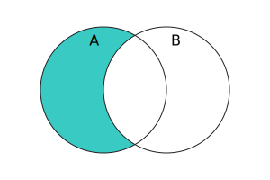

{{JSRef}}

{{jsxref("Set")}} 인스턴스의 **`difference()`** 메서드는 집합을 받아서 이 집합에는 있지만 주어진 집합에는 없는 요소를 포함하는 새로운 집합을 반환합니다.

## 구문

```js-nolint
difference(other)
```

### 매개 변수

- `other`
  - : {{jsxref("Set")}} 객체 혹은 [유사 집합](/ko/docs/Web/JavaScript/Reference/Global_Objects/Set#set-like_objects) 객체

### 반환 값

이 집합에는 있지만 `other` 집합에는 없는 요소를 포함하는 새 {{jsxref("Set")}} 객체입니다.

## 설명

수학적 표기법에서 차집합(difference)는 다음과 같이 정의됩니다.

<math display="block"><semantics><mrow><mi>A</mi><mo>∖</mo><mi>B</mi><mo>=</mo><mo stretchy="false">{</mo><mi>x</mi><mo>∊</mo><mi>A</mi><mo>∣</mo><mi>x</mi><mo>∉</mo><mi>B</mi><mo stretchy="false">}</mo></mrow><annotation encoding="TeX">A\setminus B = \{x\in A\mid x\notin B\}</annotation></semantics></math>

벤 다이어그램을 사용하자면



`difference()`는 [유사 집합](/ko/docs/Web/JavaScript/Reference/Global_Objects/Set#set-like_objects)객체를 `other` 매개변수로 받습니다. 사용자 코드를 호출하지 않고 `this`에 저장된 기본 데이터를 직접 검색하기 때문에 실제 {{jsxref("Set")}} 인스턴스가 되기 위해 {{jsxref("Operators/this", "this")}}가 필요합니다. 그런 다음 동작은 `this`와 `other`의 크기에 따라 달라집니다.

- `this`에 `other.size`보다 더 많은 요소가 있으면 `other.size`의 `keys()` 메서드를 호출하여 `other`을 순회하고 `other`에 표시되지 않는 모든 요소로 새 집합을 구성합니다.
- 그렇지 않으면, `this`의 요소를 순회하고 `other.has(e)`가 [거짓 같은 값](/ko/docs/Glossary/Falsy)을 반환하게 만드는 모든 요소 `e`를 포함하는 새 집합을 구성합니다.

반환된 집합의 요소 순서는 `this`와 동일합니다.

## 예제

### difference() 사용하기

아래 예제는 홀수 집합(<10)과 완전 제곱 집합(<10)의 차이를 계산하는 예제입니다. 결과는 완전 제곱이 아닌 홀수 집합입니다.

```js
const odds = new Set([1, 3, 5, 7, 9]);
const squares = new Set([1, 4, 9]);
console.log(odds.difference(squares)); // Set(3) { 3, 5, 7 }
```

## 명세서

{{Specifications}}

## 브라우저 호환성

{{Compat}}

## 같이 보기

- [Polyfill of `Set.prototype.difference` in `core-js`](https://github.com/zloirock/core-js#new-set-methods)
- {{jsxref("Set.prototype.intersection()")}}
- {{jsxref("Set.prototype.isDisjointFrom()")}}
- {{jsxref("Set.prototype.isSubsetOf()")}}
- {{jsxref("Set.prototype.isSupersetOf()")}}
- {{jsxref("Set.prototype.symmetricDifference()")}}
- {{jsxref("Set.prototype.union()")}}
