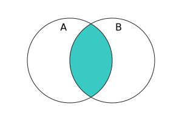

{{JSRef}}

**`Set`** 객체는 {{Glossary("Primitive", "원시값")}}이나 객체 참조 값 등 모든 유형의 고유 값을 저장할 때 사용할 수 있습니다.

## 설명

`Set` 객체는 값의 컬렉션입니다. Set의 값은 **한 번만 나타날 수 있으며**, Set의 컬렉션에서는 고유한 값입니다. Set의 요소를 삽입 순서대로 순회할 수 있습니다. 삽입 순서는 각 요소가 [`add()`](/ko/docs/Web/JavaScript/Reference/Global_Objects/Set/add) 메서드에 의해 Set에 성공적으로 삽입된 순서(즉, `add()`가 호출될 때 이미 Set에 동일한 요소가 없는 경우)에 해당합니다.

명세서에서는 Set이 "평균적으로 컬렉션의 요소 수에 따라 선형 이하의 액세스 시간을 제공하는" 방식으로 구현되어야 한다고 요구하고 있습니다. 따라서 내부적으로 해시 테이블(O(1) 조회), 검색 트리(O(log(N)) 조회) 또는 복잡성이 O(N)보다 좋은 다른 데이터 구조로 표현할 수 있습니다.

### 값 동등성

값 동일성은 [동일 값 제로 동등](/ko/docs/Web/JavaScript/Equality_comparisons_and_sameness#동일_값_제로_동등) 알고리즘을 기반으로 합니다. (이전에는 `0`과 `-0`을 다른 값으로 취급하는 [동일 값 동등](/ko/docs/Web/JavaScript/Equality_comparisons_and_sameness#same-value_equality_using_object.is)를 사용했습니다. [브라우저 호환성](#브라우저_호환성)을 확인하세요.) 즉, `===` 연산자의 의미에 따라 {{jsxref("NaN")}}은 `NaN`과 동일하게 간주되며(`NaN !== NaN`임에도 불구하고) 다른 모든 값은 동일하게 간주됩니다.

### 성능

[`has`](/ko/docs/Web/JavaScript/Reference/Global_Objects/Set/has) 메서드는 이전에 Set에 추가된 대부분의 요소를 시험하는 것보다 평균적으로 빠른 접근 방식을 사용하여 값이 Set에 있는지 여부를 확인합니다. 특히 배열의 `length`가 Set의 `size`와 같을 때 [`Array.prototype.includes`](/ko/docs/Web/JavaScript/Reference/Global_Objects/Array/includes) 메서드보다 평균적으로 더 빠릅니다.

### Set 구성

`Set` 객체는 수학 연산과 같이 집합을 구성할 수 있는 몇 가지 메서드를 제공합니다. 이러한 메서드는 다음과 같습니다.

<table>
  <thead>
    <tr>
      <th scope="col">메서드</th>
      <th scope="col">반환 유형</th>
      <th scope="col">수학적 동치</th>
      <th scope="col">벤 다이어그램</th>
    </tr>
  </thead>
  <tbody>
    <tr>
      <td>{{jsxref("Set/difference", "A.difference(B)")}}</td>
      <td><code>Set</code></td>
      <td><math display="inline"><semantics><mrow><mi>A</mi><mo>∖</mo><mi>B</mi></mrow><annotation encoding="TeX">A\setminus B</annotation></semantics></math></td>
      <td style="margin:0;padding:0"></td>
    </tr>
    <tr>
      <td>{{jsxref("Set/intersection", "A.intersection(B)")}}</td>
      <td><code>Set</code></td>
      <td><math display="inline"><semantics><mrow><mi>A</mi><mo>∩</mo><mi>B</mi></mrow><annotation encoding="TeX">A\cap B</annotation></semantics></math></td>
      <td style="margin:0;padding:0"></td>
    </tr>
    <tr>
      <td>{{jsxref("Set/symmetricDifference", "A.symmetricDifference(B)")}}</td>
      <td><code>Set</code></td>
      <td><math display="inline"><semantics><mrow><mo stretchy="false">(</mo><mi>A</mi><mo>∖</mo><mi>B</mi><mo stretchy="false">)</mo><mo>∪</mo><mo stretchy="false">(</mo><mi>B</mi><mo>∖</mo><mi>A</mi><mo stretchy="false">)</mo></mrow><annotation encoding="TeX">(A\setminus B)\cup(B\setminus A)</annotation></semantics></math></td>
      <td style="margin:0;padding:0"></td>
    </tr>
    <tr>
      <td>{{jsxref("Set/union", "A.union(B)")}}</td>
      <td><code>Set</code></td>
      <td><math display="inline"><semantics><mrow><mi>A</mi><mo>∪</mo><mi>B</mi></mrow><annotation encoding="TeX">A\cup B</annotation></semantics></math></td>
      <td style="margin:0;padding:0"></td>
    </tr>
    <tr>
      <td>{{jsxref("Set/isDisjointFrom", "A.isDisjointFrom(B)")}}</td>
      <td><code>Boolean</code></td>
      <td><math display="inline"><semantics><mrow><mi>A</mi><mo>∩</mo><mi>B</mi><mo>=</mo><mi>∅</mi></mrow><annotation encoding="TeX">A\cap B = \empty</annotation></semantics></math></td>
      <td style="margin:0;padding:0"></td>
    </tr>
    <tr>
      <td>{{jsxref("Set/isSubsetOf", "A.isSubsetOf(B)")}}</td>
      <td><code>Boolean</code></td>
      <td><math display="inline"><semantics><mrow><mi>A</mi><mo>⊆</mo><mi>B</mi></mrow><annotation encoding="TeX">A\subseteq B</annotation></semantics></math></td>
      <td style="margin:0;padding:0"></td>
    </tr>
    <tr>
      <td>{{jsxref("Set/isSupersetOf", "A.isSupersetOf(B)")}}</td>
      <td><code>Boolean</code></td>
      <td><math display="inline"><semantics><mrow><mi>A</mi><mo>⊇</mo><mi>B</mi></mrow><annotation encoding="TeX">A\supseteq B</annotation></semantics></math></td>
      <td style="margin:0;padding:0"></td>
    </tr>
  </tbody>
</table>

이 메서드들은 일반화 가능성을 높이기 위해 `Set` 객체뿐만 아니라 [유사 Set](#set-like_objects)인 모든 객체를 허용합니다.

### 유사 Set 객체(Set-like objects)

모든 [Set 구성 메서드](#set_composition)는 {{jsxref("Operators/this", "this")}}가 실제 `Set` 인스턴스여야 하지만, 인자는 Set과 유사하면 됩니다. 유사 Set 객체는 다음을 제공하는 객체입니다.

- 숫자값을 가진 {{jsxref("Set/size", "size")}} 속성
- 요소를 취하고 부울을 반환하는 {{jsxref("Set/has", "has()")}} 메서드
- Set의 요소에 대한 [반복자](/ko/docs/Web/JavaScript/Reference/Iteration_protocols)를 반환하는 {{jsxref("Set/keys", "keys()")}} 메서드

예를 들어 {{jsxref("Map")}} 객체는 {{jsxref("Map/size", "size")}}, {{jsxref("Map/has", "has()")}}, {{jsxref("Map/keys", "keys()")}}도 가지고 있기 때문에 Set의 메서드를 사용했을때 아래처럼 키 Set처럼 동작합니다.

```js
const a = new Set([1, 2, 3]);
const b = new Map([
  [1, "one"],
  [2, "two"],
  [4, "four"],
]);
console.log(a.union(b)); // Set(4) {1, 2, 3, 4}
```

> [!NOTE]
> 유사 Set 프로토콜은 요소를 생성하기 위해 [`[@@iterator]()`](/ko/docs/Web/JavaScript/Reference/Global_Objects/Set/@@iterator) 대신 `keys()` 메서드를 호출합니다. 이는 맵의 경우 반복자는 entries를 생성하지만 `has()` 메서드는 keys를 취하기 때문에 맵을 유효한 유시 Set 객체로 만들기 위해서입니다.

[배열](/ko/docs/Web/JavaScript/Reference/Global_Objects/Array)은 `has()` 메서드나 `size` 속성이 없고 `keys()` 메서드가 요소 대신 인덱스를 생성하기 때문에 유사 Set이 아닙니다. {{jsxref("WeakSet")}} 객체 역시 `keys()` 메서드가 없기 때문에 유사 Set이 아닙니다.

### 유사 Set 브라우저 API

브라우저 **`Set`과 유사한 객체**(또는 "유사 Set 객체")는 `Set`처럼 여러 가지 방식으로 동작하는 [웹 API](/ko/docs/Web/API) 인터페이스입니다.

`Set`과 마찬가지로 요소는 객체에 추가한 순서대로 순회할 수 있습니다. 유사 `Set` 객체와 `Set`에는 동일한 이름과 동작을 공유하는 속성와 메서드도 있습니다. 그러나 `Set`과 달리 각 항목에 대해 미리 정의된 특정 유형만 허용합니다.

허용되는 유형은 명세 IDL 정의에 설정되어 있습니다.
예를 들어 {{domxref("GPUSupportedFeatures")}}는 키/값으로 문자열을 사용해야 하는 유사 `Set` 객체입니다.
이는 아래 사양 IDL에 정의되어 있습니다.

```webidl
interface GPUSupportedFeatures {
  readonly setlike<DOMString>;
};
```

유사 `Set` 객체는 읽기 전용이거나 읽기-쓰기 가능합니다(위의 IDL에서 `readonly` 키워드 참조).

- 읽기 전용 `Set` 유사 객체에는 [`size`](#set.prototype.size) 속성과 메서드 [`entries()`](#set.prototype.entries), [`forEach()`](#set. prototype.foreach), [`has()`](#set.prototype.has), [`keys()`](#set.prototype.keys), [`values()`](#set.prototype.values), [`@@iterator`](#set.prototypeiterator)가 있습니다.
- 쓰기 가능한 `Set` 유사 객체에는 추가적으로 [`clear()`](#set.prototype.clear), [`delete()`](#set.prototype.delete), [`add()`](#set.prototype.add) 메서드가 있습니다.

메서드와 속성은 항목의 유형에 대한 제한을 제외하고는 `Set`의 동등한 개체처럼 동일한 동작을 합니다.

아래는 읽기 전용인 유사 `Set` 브라우저 객체의 예입니다.

- {{domxref("GPUSupportedFeatures")}}
- {{domxref("XRAnchorSet")}}

아래는 쓰기 가능한 유사 `Set` 브라우저 객체의 예입니다.

- {{domxref("CustomStateSet")}}
- {{domxref("FontFaceSet")}}
- {{domxref("Highlight")}}

## 생성자

- {{jsxref("Set/Set", "Set()")}}
  - : 새로운 `Set` 객체를 생성합니다.

## 정적 속성

- {{jsxref("Set/@@species", "Set[@@species]")}}
  - : 파생 객체를 생성하는 데 사용되는 생성자 함수입니다.

## 인스턴스 속성

아래 속성은 `Set.prototype`에 정의되며 모든 `Set` 인스턴스에서 공유됩니다.

- {{jsxref("Object/constructor", "Set.prototype.constructor")}}
  - : 인스턴스 객체를 생성한 생성자 함수입니다. `Set` 인스턴스의 경우 초기 값은 {{jsxref("Set/Set", "Set")}} 생성자입니다.
- {{jsxref("Set.prototype.size")}}
  - : `Set` 객체에 있는 값의 수를 반환합니다.
- `Set.prototype[@@toStringTag]`
  - : [`@@toStringTag`](/ko/docs/Web/JavaScript/Reference/Global_Objects/Symbol/toStringTag) 속성의 초기 값은 문자열 `"Set"` 입니다. 이 속성은 {{jsxref("Object.prototype.toString()")}}에서 사용합니다.

## 인스턴스 메서드

- {{jsxref("Set.prototype.add()")}}
  - : Inserts a new element with a specified value in to a `Set` object, if there isn't an element with the same value already in the `Set`.
  - : `Set` 객체에 같은 값이 있지 않다면 해당 `Set` 객체에 특정 값을 가진 새로운 요소를 삽입합니다.
- {{jsxref("Set.prototype.clear()")}}
  - : `Set` 객체에서 모든 요소를 제거합니다.
- {{jsxref("Set.prototype.delete()")}}
  - : `value`에 연결된 요소를 제거하고 요소가 성공적으로 제거되었는지 여부를 나타내는 부울을 반환합니다. `Set.prototype.has(value)`는 이후 `false`를 반환합니다.
- {{jsxref("Set.prototype.difference()")}}
  - : 하나의 Set을 받아서 주어진 Set 없으나 이 인스턴스의 Set에는 있는 요소가 포함된 새로운 Set을 반환합니다.
- {{jsxref("Set.prototype.entries()")}}
  - : `Set` 객체의 각 요소에 대해 삽입 순서대로 **`[value, value]` 배열** 을 포함하는 새 반복자 객체를 반환합니다. 이는 {{jsxref("Map")}} 객체와 유사하므로 각 항목의 키는 `Set`의 값과 동일합니다.
- {{jsxref("Set.prototype.forEach()")}}
  - : `Set` 객체에 있는 각 값에 대해 삽입 순서대로 `callbackFn`을 한 번씩 호출합니다. `thisArg` 매개변수가 주어진다면, `callbackFn`을 호출할 때마다 이 매개변수가 `this` 값으로 사용됩니다.
- {{jsxref("Set.prototype.has()")}}
  - : 주어진 값을 가진 요소가 `Set` 객체 내 존재 여부를 나타내는 부울을 반환합니다.
- {{jsxref("Set.prototype.intersection()")}}
  - : 하나의 Set을 받아 이 Set과 주어진 Set의 요소를 모두 포함하는 새 Set을 반환합니다.
- {{jsxref("Set.prototype.isDisjointFrom()")}}
  - : 하나의 Set을 받아 주어진 Set과 이 Set 간의 공통 요소가 없는지를 가리키는 부울을 반환합니다.
- {{jsxref("Set.prototype.isSubsetOf()")}}
  - : 하나의 Set을 받아 이 Set의 모든 요소가 주어진 Set 안에 있는지 여부를 나타내는 부울을 반환합니다.
- {{jsxref("Set.prototype.isSupersetOf()")}}
  - : 하나의 Set을 받아 주어진 Set의 모든 요소가 이 Set 안에 있는지 여부를 나타내는 부울을 반환합니다.
- {{jsxref("Set.prototype.keys()")}}
  - : {{jsxref("Set.prototype.values()")}}의 별칭입니다.
- {{jsxref("Set.prototype.symmetricDifference()")}}
  - : 하나의 Set을 받아 이 Set과 주어진 Set 모두에 속한 요소를 제외하고 주어진 Set 혹은 이 Set에만 있는 요소가 속해있는 새로운 Set을 반환합니다.
- {{jsxref("Set.prototype.union()")}}
  - : 하나의 Set을 받아 이 Set과 주어진 Set 모두 혹은 하나만 속해있는 요소가 들어있는 새로운 Set을 반환합니다.
- {{jsxref("Set.prototype.values()")}}
  - : `Set`객체 내의 각 요소의 값을 삽입 순서대로 yield하는 새로운 반복자 객체를 리턴합니다.
- [`Set.prototype[@@iterator]()`](/ko/docs/Web/JavaScript/Reference/Global_Objects/Set/@@iterator)
  - : `Set` 객체 내의 각 요소를 삽입 순서대로 yield하는 새로운 반복자 객체를 반환합니다.

## 예제

### Set 객체 사용하기

```js
const mySet1 = new Set();

mySet1.add(1); // Set(1) { 1 }
mySet1.add(5); // Set(2) { 1, 5 }
mySet1.add(5); // Set(2) { 1, 5 }
mySet1.add("some text"); // Set(3) { 1, 5, 'some text' }
const o = { a: 1, b: 2 };
mySet1.add(o);

mySet1.add({ a: 1, b: 2 }); // o 는 다른 객체를 참조하고 있기 때문에 이는 괜찮습니다

mySet1.has(1); // true
mySet1.has(3); // false, 3 이 set에 추가되지 않았기 때문입니다.
mySet1.has(5); // true
mySet1.has(Math.sqrt(25)); // true
mySet1.has("Some Text".toLowerCase()); // true
mySet1.has(o); // true

mySet1.size; // 5

mySet1.delete(5); // set에서 5 제거
mySet1.has(5); // false, 5 는 제거되었습니다.

mySet1.size; // 4, 막 하나를 제거했기 때문에

mySet1.add(5); // Set(5) { 1, 'some text', {...}, {...}, 5 } - 이전에 삭제된 아이템이 새로운 아이템으로 추가되나, 삭제 전 원래 위치를 유지하진 못합니다.

console.log(mySet1); // Set(5) { 1, "some text", {…}, {…}, 5 }
```

### set 순회하기

set의 요소를 삽입 순서대로 순회합니다.

```js
for (const item of mySet1) {
  console.log(item);
}
// 1, "some text", { "a": 1, "b": 2 }, { "a": 1, "b": 2 }, 5

for (const item of mySet1.keys()) {
  console.log(item);
}
// 1, "some text", { "a": 1, "b": 2 }, { "a": 1, "b": 2 }, 5

for (const item of mySet1.values()) {
  console.log(item);
}
// 1, "some text", { "a": 1, "b": 2 }, { "a": 1, "b": 2 }, 5

// 키와 값은 여기선 같습니다.
for (const [key, value] of mySet1.entries()) {
  console.log(key);
}
// 1, "some text", { "a": 1, "b": 2 }, { "a": 1, "b": 2 }, 5

// Array.from을 사용하여 Set 객체를 배열 객체로 변경
const myArr = Array.from(mySet1); // [1, "some text", {"a": 1, "b": 2}, {"a": 1, "b": 2}, 5]

// 아래 코드는 HTML 문서에서 수행될 때 동작합니다.
mySet1.add(document.body);
mySet1.has(document.querySelector("body")); // true

// Set과 배열간의 변경
const mySet2 = new Set([1, 2, 3, 4]);
console.log(mySet2.size); // 4
console.log([...mySet2]); // [1, 2, 3, 4]

// 교집합(intersection)은 아래처럼 시뮬레이션 가능합니다.
const intersection = new Set([...mySet1].filter((x) => mySet2.has(x)));

// 차집합(difference)은 아래처럼 시뮬레이션 가능합니다.
const difference = new Set([...mySet1].filter((x) => !mySet2.has(x)));

// Set이 가진 개체를 forEach()를 사용하여 순회
mySet2.forEach((value) => {
  console.log(value);
});
// 1
// 2
// 3
// 4
```

### 기본적인 Set 연산 구현하기

```js
function isSuperset(set, subset) {
  for (const elem of subset) {
    if (!set.has(elem)) {
      return false;
    }
  }
  return true;
}

function union(setA, setB) {
  const _union = new Set(setA);
  for (const elem of setB) {
    _union.add(elem);
  }
  return _union;
}

function intersection(setA, setB) {
  const _intersection = new Set();
  for (const elem of setB) {
    if (setA.has(elem)) {
      _intersection.add(elem);
    }
  }
  return _intersection;
}

function symmetricDifference(setA, setB) {
  const _difference = new Set(setA);
  for (const elem of setB) {
    if (_difference.has(elem)) {
      _difference.delete(elem);
    } else {
      _difference.add(elem);
    }
  }
  return _difference;
}

function difference(setA, setB) {
  const _difference = new Set(setA);
  for (const elem of setB) {
    _difference.delete(elem);
  }
  return _difference;
}

// 예제
const setA = new Set([1, 2, 3, 4]);
const setB = new Set([2, 3]);
const setC = new Set([3, 4, 5, 6]);

isSuperset(setA, setB); // true 반환
union(setA, setC); // Set {1, 2, 3, 4, 5, 6} 반환
intersection(setA, setC); // Set {3, 4} 반환
symmetricDifference(setA, setC); // Set {1, 2, 5, 6} 반환
difference(setA, setC); // Set {1, 2} 반환
```

### 배열과의 관계

```js
const myArray = ["value1", "value2", "value3"];

// Set 생성자를 사용하여 배열을 Set으로 변형
const mySet = new Set(myArray);

mySet.has("value1"); // returns true

// 전개 구문을 사용하여 set을 배열로 변형
console.log([...mySet]); // Will show you exactly the same Array as myArray
```

### 배열에서 중복 요소 제거하기

```js
// 배열에서 중복 요소를 제거하기 위해 사용
const numbers = [2, 13, 4, 4, 2, 13, 13, 4, 4, 5, 5, 6, 6, 7, 5, 32, 13, 4, 5];

console.log([...new Set(numbers)]); // [2, 13, 4, 5, 6, 7, 32]
```

### 문자열과의 관계

```js
// 대소문자 구문 (set은 "F"와 "f"를 모두 가지게 됨)
new Set("Firefox"); // Set(7) [ "F", "i", "r", "e", "f", "o", "x" ]

// 중복 문자열은 생략 ("f"는 문자열에서 2번 나타나기에, set은 하나만 가지게 됨)
new Set("firefox"); // Set(6) [ "f", "i", "r", "e", "o", "x" ]
```

### Set를 사용하여 값 목록의 고유성을 보장하는 방법

```js
const array = Array.from(document.querySelectorAll("[id]")).map((e) => e.id);

const set = new Set(array);
console.assert(set.size === array.length);
```

## 명세서

{{Specifications}}

## 브라우저 호환성

{{Compat}}

## 같이 보기

- [Polyfill of `Set` in `core-js`](https://github.com/zloirock/core-js#set)
- {{jsxref("Map")}}
- {{jsxref("WeakMap")}}
- {{jsxref("WeakSet")}}
