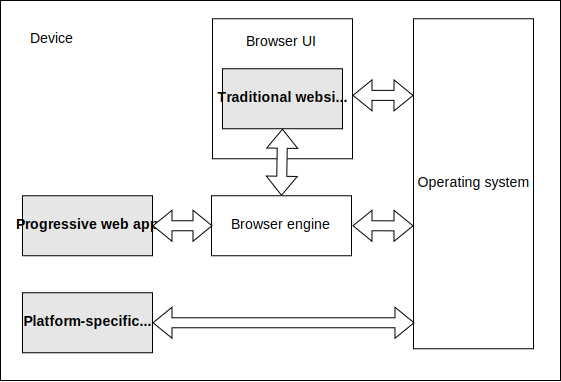

프로그레시브 웹 앱(PWA)는 웹 플랫폼 기술을 사용하여 구축되지만, 플랫폼별 앱과 유사한 사용자 경험을 제공하는 앱입니다.

## 플랫폼별 앱

플랫폼별 앱은 iOS나 Android 기기처럼 특정 운영 체제(OS) 또는 기기 종류를 위해 개발되며, 일반적으로 플랫폼 공급업체에 의해 제공된 SDK를 사용하여 만들어집니다. 이러한 앱은 보통 공급업체의 앱 스토어를 통해 배포되며, 사용자는 이 앱 스토어에서 앱을 찾아 설치할 수 있습니다. 설치 후, 앱은 사용자에게 기기의 기능을 확장하는 기능처럼 보입니다.

플랫폼별 앱의 장점은 다음과 같습니다.

- **유저가 접근하기 쉬움**: 사용자가 쉽게 찾고 실행할 수 있도록 앱은 기기에서 자체 아이콘을 가집니다.
- **오프라인 및 백그라운드 동작**: 사용자가 앱과 상호작용하지 않거나 기기가 오프라인 상태일 때도 동작할 수 있습니다. 예를 들어, 채팅 앱은 열려 있지 않아도 메시지를 수신하고 알림을 표시할 수 있으며, 뉴스 앱은 백그라운드에서 콘텐츠를 업데이트하여 오프라인 상태에서도 최신 콘텐츠를 보여줄 수 있습니다.
- **전용 UI**: 독자적이고 몰입감 있는 사용자 인터페이스(UI)를 구현할 수 있습니다.
- **운영 체제 통합**: 호스트 OS와 통합될 수 있습니다. 예를 들어, 메시징 앱은 "공유 대상"으로 등록되어 사용자가 사진 앱에서 이미지를 선택해 메시징 앱으로 바로 전송할 수 있습니다. 또한 카메라, GPS, 가속도계와 같은 기기 기능에도 접근할 수 있습니다.
- **앱 스토어 통합**: 앱 스토어를 통해 배포되므로, 사용자는 한 곳에서 앱을 찾고 설치 여부를 일관된 방식으로 결정할 수 있습니다.

## 전통적인 웹사이트

전통적으로, 웹사이트는 "사용자가 소유하는 것"이라기보다는 "사용자가 방문하는 장소"에 가깝습니다. 일반적으로 전통적인 웹사이트는 사용자가 접속하지 않을 때는 기기에 존재하지 않으며, 사용자가 브라우저를 열고 해당 사이트로 이동해야만 접속할 수 있습니다. 또한 웹사이트는 네트워크 연결에 크게 의존합니다.

그러나 웹사이트는 플랫폼별 앱과 비교했을 때 다음과 같은 장점이 있습니다.

- **단일 코드베이스**: 웹은 본질적으로 크로스 플랫폼이므로, 하나의 코드베이스로 서로 다른 운영 체제와 기기 종류에서 실행할 수 있습니다.
- **웹을 통한 배포**: 웹은 뛰어난 배포 플랫폼입니다. 웹사이트는 검색 엔진에 의해 색인화되고, URL만으로 공유하거나 접근할 수 있습니다. 또한 웹사이트는 어떤 플랫폼 제공자의 앱 스토어에도 가입하지 않고 배포될 수 있습니다.

## 프로그레시브 웹 앱

프로그레시브 웹 앱(PWA)은 전통적인 웹사이트와 플랫폼별 앱의 장점을 결합합니다.

PWA는 웹사이트의 여러 장점을 가집니다. 이는 다음과 같습니다.

- PWA는 표준 웹 플랫폼 기술을 사용해 개발됩니다. 그러므로 단일 코드베이스로 여러 운영 체제와 기기 종류에서 실행할 수 있습니다
- PWA는 웹에서 직접 접근할 수 있습니다.

PWA는 또한 플랫폼별 앱의 여러 장점도 가집니다. 이는 다음과 같습니다.

- [**PWA는 기기에 설치될 수 있습니다**](/ko/docs/Web/Progressive_web_apps/Guides/Making_PWAs_installable). 이것은 다음을 의미합니다.
  - PWA는 플랫폼의 앱 스토어에서 또는 웹에서 직접 설치될 수 있습니다.
  - PWA는 플랫폼별 앱처럼 설치할 수 있으며, 설치 과정을 커스터마이즈할 수 있습니다.
  - 설치 후, PWA는 플랫폼별 앱과 함께 기기에 앱 아이콘이 생깁니다
  - 설치 후, 브라우저에서 접속하는 웹사이트가 아니라, 독립적인 앱으로 실행할 수 있습니다.

- [**PWA는 백그라운드 및 오프라인에서도 동작할 수 있습니다**](/ko/docs/Web/Progressive_web_apps/Guides/Offline_and_background_operation) 일반적인 웹사이트는 브라우저에서 페이지가 열려있는 동안에만 활성 상태입니다. PWA는 다음과 같은 작업이 가능합니다.
  - 기기가 네트워크에 연결되어 있지 않아도 동작할 수 있습니다.
  - 백그라운드에서 콘텐츠를 업데이트할 수 있습니다.
  - 서버로부터 [푸시 메시지](/ko/docs/Web/API/Push_API)에 응답할 수 있습니다.
  - 운영 체제의 [알림](/ko/docs/Web/API/Notifications_API) 시스템을 사용하여 알림을 표시할 수 있습니다.

- PWA는 브라우저 UI에서 실행되는 것 대신, [전체 화면을 사용](/ko/docs/Web/Progressive_web_apps/How_to/Create_a_standalone_app)할 수 있습니다.
- PWA는 기기에 통합되어 공유 대상으로 등록되거나 공유 출처로 사용될 수 있으며, 기기 기능에도 접근할 수 있습니다.
- PWA는 앱 스토어를 통해서뿐 아니라, 웹을 통해서도 공개적으로 배포될 수 있습니다.

### PWA와 브라우저

브라우저에서 웹사이트를 방문할 때, 웹사이트가 "브라우저 안에서 실행되고 있음"이 시각적으로 명확하게 보입니다. 브라우저 UI는 웹사이트를 둘러싼 눈에 보이는 프레임을 제공하며, 뒤로 가기/앞으로 가기 버튼이나 페이지 제목과 같은 UI 기능도 포함됩니다. 웹사이트가 호출하는 웹 API는 브라우저 엔진에 의해 구현됩니다.

PWA는 일반적으로 플랫폼별 앱처럼 보이며 보통 브라우저 UI 없이 표시되는 경우가 많습니다. 그러나 기술적으로는 여전히 웹사이트입니다. 즉, 이를 관리하고 실행하기 위해서는 Chrome이나 Firefox 같은 브라우저 엔진이 필요합니다. 플랫폼별 앱의 경우, 플랫폼의 운영 체제(OS)가 앱을 관리하고 앱이 실행될 환경을 제공합니다. PWA의 경우, 일반적인 웹사이트와 마찬가지로, 브라우저 엔진이 이러한 백그라운드 역할을 수행합니다.

PWA 문서에서는, 때때로 브라우저가 이러한 백그라운드 역할을 수행한다고 언급합니다. 예를 들어, "푸시 알림이 수신되면 브라우저가 PWA의 서비스 워커를 시작한다"고 말할 수 있습니다. 이 경우 브라우저의 활동은 완전히 백그라운드에서 이루어집니다. PWA 관점에서는, 이를 시작한 주체가 운영체제일 수도 있습니다. Chromebook과 같은 일부 시스템에서는 "브라우저"와 "운영체제" 사이의 구분이 아예 없을 수도 있습니다.

### PWA의 기술적 특징

PWA는 웹사이트이므로 다른 웹사이트와 동일한 기본 특징을 갖고 있습니다. 즉, 최소한 하나의 HTML 페이지가 있으며, 일반적으로 CSS와 JavaScript를 불러옵니다. 일반적인 웹사이트처럼, 페이지에 의해 로드된 JavaScript는 전역 {{domxref("Window")}} 객체를 가지며, 이 객체를 통해 이용 가능한 모든 웹 API에 접근할 수 있습니다.

이 외에도, PWA에는 다음과 같은 추가 기능이 있습니다.

- [웹 앱 매니페스트](/ko/docs/Web/Progressive_web_apps/Manifest) 파일은 앱 이름, 아이콘 등과 같은, 최소한 브라우저가 PWA를 설치하는 데 필요한 정보를 제공합니다.
- 선택적으로 [서비스 워커](/ko/docs/Web/API/Service_Worker_API)는 오프라인에서도 사용할 수 있는 환경을 제공합니다.

#### 웹 앱 매니페스트 (Web app manifest)

PWA는 반드시 웹 앱 매니페스트를 가져야 하며, [매니페스트는 브라우저가 PWA를 설치할 수 있을 만큼 충분한 정보를 포함해야 합니다](/ko/docs/Web/Progressive_web_apps/Guides/Making_PWAs_installable#the_web_app_manifest).

매니페스트는 PWA의 외관과 관련된 다양한 항목(예: [테마 색상](/ko/docs/Web/Progressive_web_apps/Manifest/Reference/theme_color), [배경 색상](/ko/docs/Web/Progressive_web_apps/Manifest/Reference/background_color))과 동작과 관련된 항목 (예: 다른 앱에서 데이터를 공유받는 [공유 대상 역할 수행](/ko/docs/Web/Progressive_web_apps/Manifest/Reference/share_target), [특정 파일 형식 처리 기능](/ko/docs/Web/Progressive_web_apps/Manifest/Reference/file_handlers)) 등을 정의할 수 있습니다.

#### 서비스 워커 (Service worker)

PWA에 서비스 워커가 반드시 설치되어야 하는 건 아니지만, PWA는 최소한의 오프라인 경험을 제공하기 위해 종종 서비스 워커를 사용합니다.

서비스 워커는 앱의 페이지, 즉 웹사이트의 전통적인 부분이 사용자 인터페이스를 구현하고, 서비스 워커가 백엔드를 구현하여 [오프라인 및 백그라운드 동작](/ko/docs/Web/Progressive_web_apps/Guides/Offline_and_background_operation)을 지원하도록 하는 구조를 권장합니다. 이를 통해 PWA는 웹사이트보다는 앱처럼 동작하게 됩니다. 이는 서비스 워커가 필요할 때(예: 푸시 알림을 처리하기 위해) 브라우저에서 백그라운드로 시작될 수 있기 때문입니다.

### PWA와 단일 페이지 애플리케이션 (SPA)

전통적으로 웹사이트는 서로 연결된 여러 페이지의 집합으로 구성됩니다. 사용자가 한 페이지에서 같은 사이트 내의 다른 페이지로 이동하는 링크를 클릭하면, 브라우저는 새로운 페이지를 완전히 새 페이지처럼 로드하며, HTML과 그 HTML이 불러오는 CSS, JavaScript 등의 하위 리소스도 포함합니다. 반면, {{Glossary("SPA", "단일 페이지 애플리케이션")}}에서는 사이트가 하나의 HTML 페이지로 구성되며, 사용자가 내부 링크를 클릭하면 JavaScript가 서버에서 새로운 콘텐츠를 가져와 페이지에서 관련있는 부분만 업데이트하는 방식으로 동작합니다.

단일 페이지 애플리케이션은 플랫폼별 앱에 더 가까운 사용자 경험을 제공할 수 있으므로, PWA는 종종 SPA 형태로 구현됩니다. 특히, SPA는 사용자에게 일관된 단일 페이지를 제공하면서, 상호작용에 따라 필요한 부분만 자연스럽게 갱신되는 매끄러운 UI를 구현하기 쉽습니다.

하지만, PWA가 반드시 단일 페이지 애플리케이션이어야 하는 것은 아니며, 단일 페이지 애플리케이션이 반드시 PWA여야 하는 것도 아닙니다.

### 점진적 향상 (Progressive enhancement)

{{Glossary("Progressive Enhancement", "점진적 향상")}} 은 대부분의 웹사이트에서 바람직한 속성이지만, 특히 PWA에서는 매우 중요합니다. 그 이유는 PWA가 다양한 기기에서 실행될 것을 전제로 하며, 종종 모든 브라우저에서 지원되지 않을 수도 있는 고급 웹 API를 사용하기 때문입니다.

점진적 향상의 기본 원칙 중 하나는, 사용자가 브라우저에 PWA의 URL을 입력하여 웹에서 접근했을 때 사용자는 일반 웹사이트처럼 앱과 상호작용할 수 있어야 한다는 것입니다. 그러나 브라우저에서 앱을 설치할 수 있는 경우, 사용자에게 설치하라는 안내가 표시되며, 앱은 기기에서 새로운 기능으로 나타납니다.

PWA는 고급 API 사용 시 기능 탐지(feature detection)를 수행하고, 적절한 대체 경험(fallback)을 제공해야 합니다.

예를 들어, [Background Sync API](/ko/docs/Web/API/Background_Synchronization_API)는 PWA가 기기가 네트워크에 연결되자마자 서비스 워커를 통해 네트워크 요청을 수행하도록 요청할 수 있게 해줍니다. 이 API의 대표적인 활용 사례는 메시징 기능입니다. 사용자가 메시지를 작성했지만, 전송 시점에 기기가 오프라인 상태라면, Background Sync API를 통해 기기가 다시 연결되었을 때 메시지를 백그라운드에서 자동으로 전송할 수 있습니다. 반면, Background Sync를 지원하지 않는 기기에서는, 앱이 사용자에게 메시지를 보낼 수 없음을 알려주고, 나중에 다시 시도할 수 있는 기회를 제공해야 합니다.
