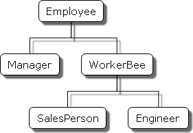
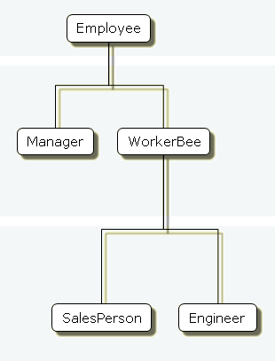

JavaScript é uma linguagem orientada a objetos com base em protótipos, em vez de ser baseada em classes. Devido a essa base diferente, pode ser menos evidente como o JavaScript permite criar hierarquias de objetos e ter herança de propriedades e seus valores. Este capítulo tenta esclarecer essa situação.

Este capítulo assume que você já está um pouco familiarizado com JavaScript e que você já tenha usado funções JavaScript para criar simples objetos.

## Linguagens baseada em classe vs. baseada em protótipo

Linguagens orientadas a objetos baseadas em classe, como Java e C + +, são fundadas no conceito de duas entidades distintas: classes e instâncias.

- Uma classe define todas as propriedades (considerando-se os métodos e campos em Java, ou membros em C + +, para ser propriedades) que caracterizam um determinado conjunto de objetos. Uma classe é algo abstrato, ao invés de qualquer membro particular do conjunto de objetos que descreve. Por exemplo, a classe `Employee` poderia representar o conjunto de todos os funcionários.
- Uma* \_\_instância*, por outro lado, é a instanciação de uma classe, ou seja, um dos seus membros. Por exemplo, `Victoria` poderia ser uma instância da classe `Employee`, o que representa um indivíduo em particular como um empregado. Uma instância tem exatamente as propriedades de sua classe pai (nem mais, nem menos).

Uma linguagem baseada em protótipo, como JavaScript, não faz essa distinção: ele simplesmente tem objetos. Uma linguagem baseada em protótipo tem a idéia de um _objeto\_\_ prototípico_, um objeto usado como um modelo do qual obtém as propriedades iniciais para um novo objeto. Qualquer objeto pode especificar suas próprias propriedades, quando você o cria ou em tempo de execução. Além disso, qualquer objeto pode ser associado como um protótipo de outro objeto, permitindo ao segundo objeto compartilhar as propriedades do primeiro objeto.

### Definindo uma classe

Em linguagens baseadas em classe, você define uma classe em uma _definição de classe_ separada. Nessa definição, você pode especificar métodos especiais, chamados de _construtores_, para criar instâncias da classe. Um método _construtor_ pode especificar valores iniciais para as propriedades da instância e executar outros processamentos apropriados no momento da criação. Você pode usar o operador `new`, em associação com o método construtor para criar instâncias de classe.

O JavaScript segue um modelo semelhante, mas não têm uma definição da classe separada do construtor. Em vez disso, você define uma função de construtor para criar objetos com um conjunto inicial particular de propriedades e valores. Qualquer função JavaScript pode ser usado como um construtor. Você pode usar o operador `new` com uma função de construtor para criar um novo objeto.

### Subclasses e herança

Em uma linguagem baseada em classe, você cria a hierárquia de classes através de sua definição. Em uma definição de classes, você pode especificar que a nova classe é uma _subclasse_ de outra já existente. A subclasse herda todas as propriedades da superclasse e pode adicionar novas propriedades ou modificar propriedades herdadas. Por exemplo, assuma que a classe `Employee` tem somente duas propriedades `name` e `dept` , e `Manager` é uma subclasse of `Employee` que adiciona a propriedade `reports`. Neste caso, uma instância da classe `Manager` terá todas as três propiedades: `name`, `dept`, and `reports`.

Em JavaScript, a herança é implementada associando um objeto prototípico a qualquer função de construtor. Então, você pode criar exatamente o mesmo exemplo: `Employee` — `Manager`, mas utilizando uma terminologia ligeramente diferente. Primeiro, define-se a função de construtor de `Employee`, especificando as propriedades `name` e `dept`. Depois, define-se a função de construtor de `Manager`, especificando a propriedade `reports`. Finalmente, associa-se um objeto new `Employee` como `prototype` para a função de construtor `Manager`. Então, quando vocẽ criar um objeto new `Manager`, ele herdará as propriedades `name` e `dept` do objeto `Employee`.

### Adicionando e removendo propriedades

Em uma linguagem baseada em classe, você normalmente cria uma classe em tempo de compilação e então vincula as instâncias da classe em tempo de compilação, ou tempo de execução. Você não pode alterar o número ou o tipo de propriedade de uma classe após definí-la. Em javaScript, no entanto, você pode adicionar ou remover propriedades de qualquer objeto. Se você adiciona uma propriedade a um objeto que é usado como o protótipo para um conjunto de objetos, os objetos no qual ele é protótipo herdarão as novas propriedades.

### Sumário das diferenças

A tabela a seguir apresenta um breve resumo de algumas dessas diferenças. O restante deste capítulo descreve os detalhes do uso de construtores e protótipos JavaScript para criar uma hierarquia de objetos e compara isso à maneira como você faria em Java.

| **Baseados em classes (Java)**                                                                                                                                       | **Baseados em protótipos (JavaScript)**                                                                                                                                                                |
| -------------------------------------------------------------------------------------------------------------------------------------------------------------------- | ------------------------------------------------------------------------------------------------------------------------------------------------------------------------------------------------------ |
| Classes e instancias são entidades distintas.                                                                                                                        | Todos os objetos são instancias.                                                                                                                                                                       |
| Define uma classe com uma definição de classe; cria um objeto - como instância da classe - com o método constructor.                                                 | Define e cria um conjunto de objetos com funções construtoras.                                                                                                                                         |
| Cria um único objeto com o operador `new`.                                                                                                                           | Faz o mesmo.                                                                                                                                                                                           |
| Constroi uma hierarquia de objetos usando definição de classe para definir subclasses de classes existentes.                                                         | Constrói uma hierarquia de objetos, atribuindo um objeto como o protótipo associado com uma função de construtor.                                                                                      |
| Herda propriedade seguindo a cadeia de classe.                                                                                                                       | Herda propriedade seguindo a cadeia de protótipo.                                                                                                                                                      |
| Definição de classe especifica todas as propriedades de todas as instâncias de uma classe. Não é possível adicionar propriedades dinamicamente em tempo de execução. | Função construtor ou protótipo especifica um conjunto _inicial_ de propriedades. Pode adicionar ou remover propriedades de forma dinâmica para objetos individuais ou para todo o conjunto de objetos. |

## O exemplo employee

O restante deste capítulo usa a hierarquia employee como mostrado na figura abaixo.

Uma simples hierarquia de objetos:



- `Employee` tem a propriedade `name` (cujo valor padrão é uma string vazia) e `dept` (cujo valor padrão e o "general").
- `Manager` é baseado no `Employee`. É adicionada a propriedade `reports` (cujo valor padrão é um array vazio, planejado para ter um array do objeto `Employee como valor`).
- `WorkerBee` também é baseado no `Employee`. É adicionada a propriedade `projects` (cujo valor padrão é um array vazio, pretende-se ter um array de strings como valor).
- `SalesPerson` é baseado no `WorkerBee`. É adicionada a propriedade `quota` (cujo valor padrão é 100). E também controla a propriedade `dept` com o valor "sales", indicando que todos os salespersons são o mesmo departamento.
- `Engineer` é baseado no `WorkerBee`. É adicionada a propriedade `machine` (cujo valor padrão é uma string vazia) e também controla a propriedade `dept` com o valor "engineering".

## Criando a hierarquia

Há muitas formas de definir funções construtoras apropriadas para implementar a hierarquia `Employee`. Como escolher defini-las depende amplamente do que você quer ser capaz de fazer em sua aplicação.

Esta seção mostra definições simples de como trabalhar com heranças. Nestas definições, você não pode especificar nenhum valor de propriedade quando criar um objeto. O recém-criado objeto terá os valores padrão, que você poderá alterar mais tarde.

Na aplicação real, você poderia definir construtores que permitem que você forneça valores de propriedade no momento da criação do objeto (veja [Construtores flexíveis](#Construtores_flexíveis) para saber mais). Por enquanto, estas simples definições demonstram como a herança ocorre.

As seguintes definições Java e JavaScript `Employee` são similares. A única diferença é que você precisa especificar o tipo de cada propriedade em Java, mas não em JavaScript (devido ao Java ser uma [linguagem fortemente tipada](http://en.wikipedia.org/wiki/Strong_and_weak_typing) enquanto o JavaScript é linguagem fracamente tipada).

#### JavaScript

```js
function Employee() {
  this.name = "";
  this.dept = "general";
}
```

#### Java

```java
public class Employee {
   public String name = "";
   public String dept = "general";
}
```

As definições `Manager` e `WorkerBee` mostram a diferença na forma de especificar o próximo objeto mais alto na cadeia de herança. Em JavaScript, você adiciona uma instância prototípica como o valor da propriedade `prototype` da função construtora. Você pode fazer isso a qualquer momento depois de definir o construtor. Em Java, você especifica a superclasse dentro da classe definida. Você não pode alterar a superclasse fora da classe definida.

#### JavaScript

```js
function Manager() {
  Employee.call(this);
  this.reports = [];
}
Manager.prototype = Object.create(Employee.prototype);

function WorkerBee() {
  Employee.call(this);
  this.projects = [];
}
WorkerBee.prototype = Object.create(Employee.prototype);
```

#### Java

```java
public class Manager extends Employee {
   public Employee[] reports = new Employee[0];
}


public class WorkerBee extends Employee {
   public String[] projects = new String[0];
}
```

As definições `Engineer` e `SalesPerson` criam objetos que descendem de `WorkerBee` e consequentemente de `Employee`. Objetos destes tipos tem propriedades de todos os objetos acima de sua cadeia. Em adição, estas definições substituem o valor herdado da propriedade `dept` com novos valores específicos para esses objetos.

#### JavaScript

```js
function SalesPerson() {
   WorkerBee.call(this);
   this.dept = "sales";
   this.quota = 100;
}
SalesPerson.prototype = Object.create(WorkerBee.prototype);

function Engineer() {
   WorkerBee.call(this);
   this.dept = "engineering";
   this.machine = "";
}
Engineer.prototype = Object.create(WorkerBee.prototype);
```

#### Java

```java
public class SalesPerson extends WorkerBee {
   public double quota;
   public dept = "sales";
   public quota = 100.0;
}


public class Engineer extends WorkerBee {
   public String machine;
   public dept = "engineering";
   public machine = "";
}
```

Usando estas definições, você pode criar instâncias desses objetos que obterão valores padrão para suas propriedades. A próxima imagem mostra o uso destas definições JavaScript para criar novos objetos e mostrar os valores das propriedades dos novos objetos.

> **Nota:** O termo _instancia_ tem significado específicamente técnico em linguagens baseadas em classe. Nessas linguagens, uma instância é uma instanciação individual de uma classe e é fundamentalmente diferente de uma classe. Em JavaScript, "instância" não tem esse significado técnico porque JavaScript não tem essa diferença entre classes e instâncias. No entanto, falando sobre JavaScript, "instância" pode ser usada informalmente para significar um objeto criado usando uma função construtora particular. Então, neste exemplo, você pode informalmente dizer que `jane` é uma instância de `Engineer`. Similarmente, embora os termos **parent*, \_child*, \_ancestor**, e **descendant** não tenham significados formais em JavaScript; você pode usá-los informalmente para referir a objetos altos ou baixos na cadeia de protótipos.

### Criando objetos com definições simples

#### Hierarquia do Objeto

A hierarquia abaixo foi criada utilizando o código ao lado.



#### Objetos individuais = Jim, Sally, Mark, Fred, Jane, etc. "Instancias" criadas a partir do construtor.

```js
var jim = new Employee;
// jim.name is ''
// jim.dept is 'general'

var sally = new Manager;
// sally.name is ''
// sally.dept is 'general'
// sally.reports is []

var mark = new WorkerBee;
// mark.name is ''
// mark.dept is 'general'
// mark.projects is []

var fred = new SalesPerson;
// fred.name is ''
// fred.dept is 'sales'
// fred.projects is []
// fred.quota is 100

var jane = new Engineer;
// jane.name is ''
// jane.dept is 'engineering'
// jane.projects is []
// jane.machine is ''
```

## Propriedades do Objeto

Esta seção discute como objetos herdam propriedades de outros objetos na cadeia de protótipos e o que acontece quando você adiciona uma propriedade em tempo de execução.

### Herdando Propriedades

Suponha que você criou o objeto `mark` como um `WorkerBee` com a seguinte declaração:

```js
var mark = new WorkerBee;
```

Quando o JavaScript vê o operador `new`, ele cria um novo objeto genérico e implicitamente define o valor da propriedade interna \[\[Protótipo]] para o valor de `WorkerBee.prototype` passando este novo objeto como o valor da palavra-chave `this` para a função construtora de `WorkerBee`. A propriedade interna \[\[\_\_proto\_\_]] determina a cadeia de protótipos usada para retornar os valores das propriedades. Uma vez que essas propriedades são definidas, o JavaScript retorna o novo objeto e a declaração de atribuição define a variável `mark` para este objeto.

Este processo não põe explicitamente valores no objeto `mark` (valores _locais_) para as propriedades que `mark` herdou da cadeia de protótipo. Quando você solicita o valor de uma propriedade, o JavaScript primeiro verifica se o valor existe nesse objeto. Caso exista, esse valor é retornado. Se o valor não existe localmente, JavaScript verifica a cadeia de protótipos (usando a propriedade interna \_\_proto\_\_). Se um objeto na cadeia de protótipos possui um valor para a propriedade, este valor é retornado. Se nenhuma propriedade é encontrada, o Javascript avisa que o objeto não possui a propriedade. Deste modo, o objeto `mark` possui as seguintes propriedades e valores:

```js
mark.name = "";
mark.dept = "general";
mark.projects = [];
```

The `mark` object inherits values for the `name` and `dept` properties from the prototypical object in `mark.__proto__`. It is assigned a local value for the `projects` property by the `WorkerBee` constructor. This gives you inheritance of properties and their values in JavaScript. Some subtleties of this process are discussed in [Property inheritance revisited](#Property_inheritance_revisited).

Because these constructors do not let you supply instance-specific values, this information is generic. The property values are the default ones shared by all new objects created from `WorkerBee`. You can, of course, change the values of any of these properties. So, you could give specific information for `mark` as follows:

```js
mark.name = "Doe, Mark";
mark.dept = "admin";
mark.projects = ["navigator"];
```

### Adding properties

In JavaScript, you can add properties to any object at run time. You are not constrained to use only the properties provided by the constructor function. To add a property that is specific to a single object, you assign a value to the object, as follows:

```js
mark.bonus = 3000;
```

Now, the `mark` object has a `bonus` property, but no other `WorkerBee` has this property.

If you add a new property to an object that is being used as the prototype for a constructor function, you add that property to all objects that inherit properties from the prototype. For example, you can add a `specialty` property to all employees with the following statement:

```js
Employee.prototype.specialty = "none";
```

As soon as JavaScript executes this statement, the `mark` object also has the `specialty` property with the value of `"none"`. The following figure shows the effect of adding this property to the `Employee` prototype and then overriding it for the `Engineer` prototype.


**Adding properties**

## More flexible constructors

The constructor functions shown so far do not let you specify property values when you create an instance. As with Java, you can provide arguments to constructors to initialize property values for instances. The following figure shows one way to do this.


**Specifying properties in a constructor, take 1**

The following table shows the Java and JavaScript definitions for these objects.

#### JavaScript

#### Java

```js
function Employee (name, dept) {
  this.name = name || "";
  this.dept = dept || "general";
}
```

```java
public class Employee {
   public String name;
   public String dept;
   public Employee () {
      this("", "general");
   }
   public Employee (String name) {
      this(name, "general");
   }
   public Employee (String name, String dept) {
      this.name = name;
      this.dept = dept;
   }
}
```

```js
function WorkerBee (projs) {

 this.projects = projs || [];
}
WorkerBee.prototype = new Employee;
```

```java
public class WorkerBee extends Employee {
   public String[] projects;
   public WorkerBee () {
      this(new String[0]);
   }
   public WorkerBee (String[] projs) {
      projects = projs;
   }
}
```

```js
function Engineer (mach) {
   this.dept = "engineering";
   this.machine = mach || "";
}
Engineer.prototype = new WorkerBee;
```

```java
public class Engineer extends WorkerBee {
   public String machine;
   public Engineer () {
      dept = "engineering";
      machine = "";
   }
   public Engineer (String mach) {
      dept = "engineering";
      machine = mach;
   }
}
```

These JavaScript definitions use a special idiom for setting default values:

```js
this.name = name || "";
```

The JavaScript logical OR operator (`||`) evaluates its first argument. If that argument converts to true, the operator returns it. Otherwise, the operator returns the value of the second argument. Therefore, this line of code tests to see if `name` has a useful value for the `name` property. If it does, it sets `this.name` to that value. Otherwise, it sets `this.name` to the empty string. This chapter uses this idiom for brevity; however, it can be puzzling at first glance.

> **Nota:** This may not work as expected if the constructor function is called with arguments which convert to `false` (like `0` (zero) and empty string (`""`). In this case the default value will be chosen.

With these definitions, when you create an instance of an object, you can specify values for the locally defined properties. You can use the following statement to create a new `Engineer`:

```js
var jane = new Engineer("belau");
```

`Jane`'s properties are now:

```js
jane.name == "";
jane.dept == "engineering";
jane.projects == [];
jane.machine == "belau"
```

Notice that with these definitions, you cannot specify an initial value for an inherited property such as `name`. If you want to specify an initial value for inherited properties in JavaScript, you need to add more code to the constructor function.

So far, the constructor function has created a generic object and then specified local properties and values for the new object. You can have the constructor add more properties by directly calling the constructor function for an object higher in the prototype chain. The following figure shows these new definitions.


**Specifying properties in a constructor, take 2**

Let's look at one of these definitions in detail. Here's the new definition for the `Engineer` constructor:

```js
function Engineer (name, projs, mach) {
  this.base = WorkerBee;
  this.base(name, "engineering", projs);
  this.machine = mach || "";
}
```

Suppose you create a new `Engineer` object as follows:

```js
var jane = new Engineer("Doe, Jane", ["navigator", "javascript"], "belau");
```

JavaScript follows these steps:

1. The `new` operator creates a generic object and sets its `__proto__` property to `Engineer.prototype`.
2. The `new` operator passes the new object to the `Engineer` constructor as the value of the `this` keyword.
3. The constructor creates a new property called `base` for that object and assigns the value of the `WorkerBee` constructor to the `base` property. This makes the `WorkerBee` constructor a method of the `Engineer` object.The name of the `base` property is not special. You can use any legal property name; `base` is simply evocative of its purpose.
4. The constructor calls the `base` method, passing as its arguments two of the arguments passed to the constructor (`"Doe, Jane"` and `["navigator", "javascript"]`) and also the string `"engineering"`. Explicitly using `"engineering"` in the constructor indicates that all `Engineer` objects have the same value for the inherited `dept` property, and this value overrides the value inherited from `Employee`.
5. Because `base` is a method of `Engineer`, within the call to `base`, JavaScript binds the `this` keyword to the object created in Step 1. Thus, the `WorkerBee` function in turn passes the `"Doe, Jane"` and `"engineering"` arguments to the `Employee` constructor function. Upon return from the `Employee` constructor function, the `WorkerBee` function uses the remaining argument to set the `projects` property.
6. Upon return from the `base` method, the `Engineer` constructor initializes the object's `machine` property to `"belau"`.
7. Upon return from the constructor, JavaScript assigns the new object to the `jane` variable.

You might think that, having called the `WorkerBee` constructor from inside the `Engineer` constructor, you have set up inheritance appropriately for `Engineer` objects. This is not the case. Calling the `WorkerBee` constructor ensures that an `Engineer` object starts out with the properties specified in all constructor functions that are called. However, if you later add properties to the `Employee` or `WorkerBee` prototypes, those properties are not inherited by the `Engineer` object. For example, assume you have the following statements:

```js
function Engineer (name, projs, mach) {
  this.base = WorkerBee;
  this.base(name, "engineering", projs);
  this.machine = mach || "";
}
var jane = new Engineer("Doe, Jane", ["navigator", "javascript"], "belau");
Employee.prototype.specialty = "none";
```

The `jane` object does not inherit the `specialty` property. You still need to explicitly set up the prototype to ensure dynamic inheritance. Assume instead you have these statements:

```js
function Engineer (name, projs, mach) {
  this.base = WorkerBee;
  this.base(name, "engineering", projs);
  this.machine = mach || "";
}
Engineer.prototype = new WorkerBee;
var jane = new Engineer("Doe, Jane", ["navigator", "javascript"], "belau");
Employee.prototype.specialty = "none";
```

Now the value of the `jane` object's `specialty` property is "none".

Another way of inheriting is by using the [`call()`](/pt-BR/docs/Web/JavaScript/Reference/Global_Objects/Function/call "en-US/docs/JavaScript/Reference/Global Objects/Function/call") / [`apply()`](/pt-BR/docs/Web/JavaScript/Reference/Global_Objects/Function/apply "en-US/docs/JavaScript/Reference/Global Objects/Function/apply") methods. Below are equivalent:

```js
function Engineer (name, projs, mach) {
  this.base = WorkerBee;
  this.base(name, "engineering", projs);
  this.machine = mach || "";
}
```

```js
function Engineer (name, projs, mach) {
  WorkerBee.call(this, name, "engineering", projs);
  this.machine = mach || "";
}
```

Using the javascript `call()` method makes a cleaner implementation because the `base` is not needed anymore.

## Property inheritance revisited

The preceding sections described how JavaScript constructors and prototypes provide hierarchies and inheritance. This section discusses some subtleties that were not necessarily apparent in the earlier discussions.

### Local versus inherited values

When you access an object property, JavaScript performs these steps, as described earlier in this chapter:

1. Check to see if the value exists locally. If it does, return that value.
2. If there is not a local value, check the prototype chain (using the `__proto__` property).
3. If an object in the prototype chain has a value for the specified property, return that value.
4. If no such property is found, the object does not have the property.

The outcome of these steps depends on how you define things along the way. The original example had these definitions:

```js
function Employee () {
  this.name = "";
  this.dept = "general";
}

function WorkerBee () {
  this.projects = [];
}
WorkerBee.prototype = new Employee;
```

With these definitions, suppose you create `amy` as an instance of `WorkerBee` with the following statement:

```js
var amy = new WorkerBee;
```

The `amy` object has one local property, `projects`. The values for the `name` and `dept` properties are not local to `amy` and so are gotten from the `amy` object's `__proto__` property. Thus, `amy` has these property values:

```js
amy.name == "";
amy.dept == "general";
amy.projects == [];
```

Now suppose you change the value of the `name` property in the prototype associated with `Employee`:

```js
Employee.prototype.name = "Unknown"
```

At first glance, you might expect that new value to propagate down to all the instances of `Employee`. However, it does not.

When you create _any_ instance of the `Employee` object, that instance gets a local value for the `name` property (the empty string). This means that when you set the `WorkerBee` prototype by creating a new `Employee` object, `WorkerBee.prototype` has a local value for the `name` property. Therefore, when JavaScript looks up the `name` property of the `amy` object (an instance of `WorkerBee`), JavaScript finds the local value for that property in `WorkerBee.prototype`. It therefore does not look farther up the chain to `Employee.prototype`.

If you want to change the value of an object property at run time and have the new value be inherited by all descendants of the object, you cannot define the property in the object's constructor function. Instead, you add it to the constructor's associated prototype. For example, assume you change the preceding code to the following:

```js
function Employee () {
  this.dept = "general";
}
Employee.prototype.name = "";

function WorkerBee () {
  this.projects = [];
}
WorkerBee.prototype = new Employee;

var amy = new WorkerBee;

Employee.prototype.name = "Unknown";
```

In this case, the `name` property of `amy` becomes "Unknown".

As these examples show, if you want to have default values for object properties and you want to be able to change the default values at run time, you should set the properties in the constructor's prototype, not in the constructor function itself.

### Determining instance relationships

Property lookup in JavaScript looks within an object's own properties and, if the property name is not found, it looks within the special object property `__proto__`. This continues recursively; the process is called "lookup in the prototype chain".

The special property `__proto__` is set when an object is constructed; it is set to the value of the constructor's `prototype` property. So the expression `new Foo()` creates an object with `__proto__ == Foo.prototype`. Consequently, changes to the properties of `Foo.prototype` alters the property lookup for all objects that were created by `new Foo()`.

Every object has a `__proto__` object property (except `Object`); every function has a `prototype` object property. So objects can be related by 'prototype inheritance' to other objects. You can test for inheritance by comparing an object's `__proto__` to a function's `prototype` object. JavaScript provides a shortcut: the `instanceof` operator tests an object against a function and returns true if the object inherits from the function prototype. For example,

```js
var f = new Foo();
var isTrue = (f instanceof Foo);
```

For a more detailed example, suppose you have the same set of definitions shown in [Inheriting properties](#Inheriting_properties). Create an `Engineer` object as follows:

```js
var chris = new Engineer("Pigman, Chris", ["jsd"], "fiji");
```

With this object, the following statements are all true:

```js
chris.__proto__ == Engineer.prototype;
chris.__proto__.__proto__ == WorkerBee.prototype;
chris.__proto__.__proto__.__proto__ == Employee.prototype;
chris.__proto__.__proto__.__proto__.__proto__ == Object.prototype;
chris.__proto__.__proto__.__proto__.__proto__.__proto__ == null;
```

Given this, you could write an `instanceOf` function as follows:

```js
function instanceOf(object, constructor) {
   object = object.__proto__;
   while (object != null) {
      if (object == constructor.prototype)
         return true;
      if (typeof object == 'xml') {
        return constructor.prototype == XML.prototype;
      }
      object = object.__proto__;
   }
   return false;
}
```

> **Nota:** The implementation above checks the type of the object against "xml" in order to work around a quirk of how XML objects are represented in recent versions of JavaScript. See {{ bug(634150) }} if you want the nitty-gritty details.

> **Nota:** Using the `instanceOf` function defined above, these expressions are true:

```js
instanceOf (chris, Engineer)
instanceOf (chris, WorkerBee)
instanceOf (chris, Employee)
instanceOf (chris, Object)
```

But the following expression is false:

```js
instanceOf (chris, SalesPerson)
```

### Global information in constructors

When you create constructors, you need to be careful if you set global information in the constructor. For example, assume that you want a unique ID to be automatically assigned to each new employee. You could use the following definition for `Employee`:

```js
var idCounter = 1;

function Employee (name, dept) {
   this.name = name || "";
   this.dept = dept || "general";
   this.id = idCounter++;
}
```

With this definition, when you create a new `Employee`, the constructor assigns it the next ID in sequence and then increments the global ID counter. So, if your next statement is the following, `victoria.id` is 1 and `harry.id` is 2:

```js
var victoria = new Employee("Pigbert, Victoria", "pubs")
var harry = new Employee("Tschopik, Harry", "sales")
```

At first glance that seems fine. However, `idCounter` gets incremented every time an `Employee` object is created, for whatever purpose. If you create the entire `Employee` hierarchy shown in this chapter, the `Employee` constructor is called every time you set up a prototype. Suppose you have the following code:

```js
var idCounter = 1;

function Employee (name, dept) {
   this.name = name || "";
   this.dept = dept || "general";
   this.id = idCounter++;
}

function Manager (name, dept, reports) {...}
Manager.prototype = new Employee;

function WorkerBee (name, dept, projs) {...}
WorkerBee.prototype = new Employee;

function Engineer (name, projs, mach) {...}
Engineer.prototype = new WorkerBee;

function SalesPerson (name, projs, quota) {...}
SalesPerson.prototype = new WorkerBee;

var mac = new Engineer("Wood, Mac");
```

Further assume that the definitions omitted here have the `base` property and call the constructor above them in the prototype chain. In this case, by the time the `mac` object is created, `mac.id` is 5.

Depending on the application, it may or may not matter that the counter has been incremented these extra times. If you care about the exact value of this counter, one possible solution involves instead using the following constructor:

```js
function Employee (name, dept) {
   this.name = name || "";
   this.dept = dept || "general";
   if (name)
      this.id = idCounter++;
}
```

When you create an instance of `Employee` to use as a prototype, you do not supply arguments to the constructor. Using this definition of the constructor, when you do not supply arguments, the constructor does not assign a value to the id and does not update the counter. Therefore, for an `Employee` to get an assigned id, you must specify a name for the employee. In this example, `mac.id` would be 1.

### No multiple inheritance

Some object-oriented languages allow multiple inheritance. That is, an object can inherit the properties and values from unrelated parent objects. JavaScript does not support multiple inheritance.

Inheritance of property values occurs at run time by JavaScript searching the prototype chain of an object to find a value. Because an object has a single associated prototype, JavaScript cannot dynamically inherit from more than one prototype chain.

In JavaScript, you can have a constructor function call more than one other constructor function within it. This gives the illusion of multiple inheritance. For example, consider the following statements:

```js
function Hobbyist (hobby) {
   this.hobby = hobby || "scuba";
}

function Engineer (name, projs, mach, hobby) {
   this.base1 = WorkerBee;
   this.base1(name, "engineering", projs);
   this.base2 = Hobbyist;
   this.base2(hobby);
   this.machine = mach || "";
}
Engineer.prototype = new WorkerBee;

var dennis = new Engineer("Doe, Dennis", ["collabra"], "hugo")
```

Further assume that the definition of `WorkerBee` is as used earlier in this chapter. In this case, the `dennis` object has these properties:

```js
dennis.name == "Doe, Dennis"
dennis.dept == "engineering"
dennis.projects == ["collabra"]
dennis.machine == "hugo"
dennis.hobby == "scuba"
```

So `dennis` does get the `hobby` property from the `Hobbyist` constructor. However, assume you then add a property to the `Hobbyist` constructor's prototype:

```js
Hobbyist.prototype.equipment = ["mask", "fins", "regulator", "bcd"]
```

The `dennis` object does not inherit this new property.

{{PreviousNext("Web/JavaScript/Guide/Working_with_Objects", "Web/JavaScript/Guide/Iterators_and_Generators")}}
