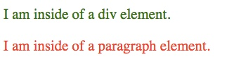

{{GlossarySidebar}}

O **seletor CSS** é parte da regra do CSS que lhe permite selecionar qual elemento(s) vai receber o estilo pela regra.

## Exemplos

### HTML

```html
<div>Eu estou dentro do elemento.</div>
<p>Eu estou dentro de um elemento de parágrafo.</p>
```

### CSS

```css
div {
  color: green;
}

p {
  color: red;
}
```

Nessa primeira regra do CSS, eu estou selecionando o elemento da div estilizando-a colorindo o texto para verde. Na segunda regra do CSS, eu estou selecionando o elemento "p" e estilizando-a colorindo o texto para vermelho. Aqui estão os resultados:



## Aprenda mais

### Conhecimento geral

- Seletores básicos
  - [Tipos de seletores](/pt-BR/docs/Web/CSS/Reference/Selectors/Type_selectors) `elementname`
  - [Classes seletoras](/pt-BR/docs/Web/CSS/Reference/Selectors/Class_selectors) `.classname`
  - [ID seletores](/pt-BR/docs/Web/CSS/Reference/Selectors/ID_selectors) `#idname`
  - [Seletores universais](/pt-BR/docs/Web/CSS/Reference/Selectors/Universal_selectors) `* ns|* *|*`
  - [Seletores de atributos](/pt-BR/docs/Web/CSS/Reference/Selectors/Attribute_selectors) `[attr=value]`
  - `Seletores de estado a:active, a:visited`

- Combinadores
  - [Seletores de irmão adjacentes](/pt-BR/docs/Web/CSS/Next-sibling_combinator) `A + B`
  - [Seletores de irmãos gerais](/pt-BR/docs/Web/CSS/Reference/Selectors/Subsequent-sibling_combinator) `A ~ B`
  - [Seletores filhos](/pt-BR/docs/Web/CSS/Child_combinator) `A > B`
  - [Seletores descendentes](/pt-BR/docs/Web/CSS/Reference/Selectors/Descendant_combinator) `A B`

- [Pseudo-elementos](/pt-BR/docs/Web/CSS/Reference/Selectors/Pseudo-elements)
- [Pseudo-classes](/pt-BR/docs/Web/CSS/Reference/Selectors/Pseudo-classes)

### Referência técnica

[Selectors Level 3](https://drafts.csswg.org/selectors-3/)
