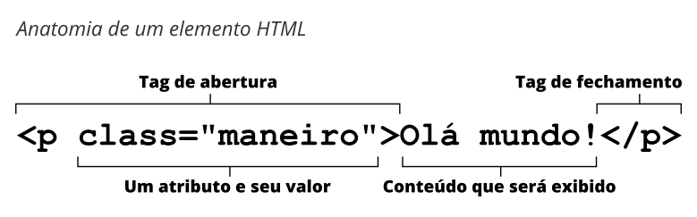

HTML (HyperText Markup Language) é uma linguagem descritiva que especifica a estrutura de uma página web.

## Breve história

Em 1990, Tim Berners-Lee definiu o conceito de {{glossary("hipertexto")}} como parte de sua visão da {{glossary("World Wide Web","Web")}} , a qual Berners-Lee formalizou no ano seguinte através de uma marcação baseada em {{glossary("SGML")}}. O {{glossary("IETF")}} começou a especificar formalmente o HTML em 1993, e depois de vários rascunhos, lançou a versão 2.0 em 1995. Em 1994 Berners-Lee fundou a {{glossary("W3C")}} para desenvolver a Web. Em 1996, a W3C assumiu o HTML e publicou a recomendação HTML 3.2 um ano depois. A recomendação HTML 4.0 foi lançada em 1999 e se tornou um padrão {{glossary("ISO")}} em 2000.

Nesse momento, a W3C quase abandonou o HTML em favor do {{glossary("XHTML")}}, levando a fundação de um grupo independente chamado de {{glossary("WHATWG")}} em 2004. Graças ao WHATWG, o trabalho em {{glossary("HTML5")}} continuou: as duas organizações lançaram o primeiro rascunho em 2008 e o padrão final em 2014.

## Conceito e sintaxe

Um documento HTML é um documento de texto simples estruturado com {{glossary("element","elementos")}}. Elementos são acompanhados de abertura e fechamento de {{Glossary("tag","tags")}}. Cada tag começa e termina com colchetes angulares (<>). Existem algumas tags vazias ou sem conteúdo que não podem incluir qualquer texto, como por exemplo a tag {{htmlelement("img")}}.

Você pode estender tags HTML com {{Glossary("attribute","atributos")}}, os quais fornecem informações adicionais que afetam como o navegador interpreta o elemento:

Um arquivo HTML normalmente é salvo com uma extensão .htm ou .html, é disponibilizado por um {{Glossary("Server","servidor web")}}, e pode ser renderizado por qualquer {{Glossary("Browser","navegador")}}.

## Leia mais

### Conhecimento Geral

- [HTML](https://pt.wikipedia.org/wiki/HTML) na Wikipedia

### Aprendendo HTML

- [Nosso tutorial de HTML](/pt-BR/docs/Aprender/HTML)
- [O curso web no codeacademy.com](https://www.codecademy.com/learn/web)

### Referência Técnica

- [A documentação HTML no MDN](/pt-BR/docs/Web/HTML)
- [A especificação HTML (W3C)](https://www.w3.org/TR/html5/)
