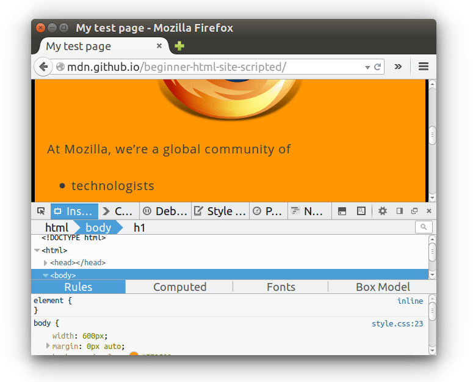
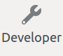
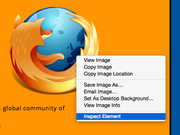
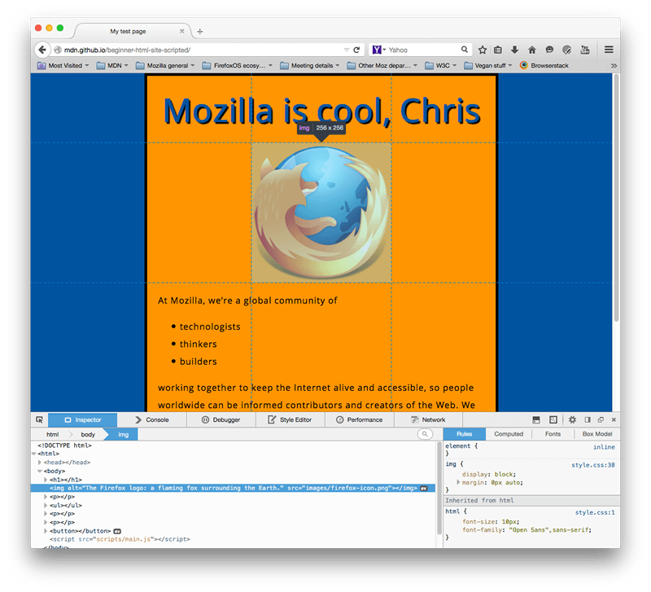
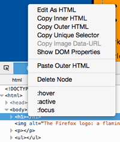
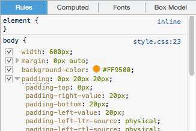
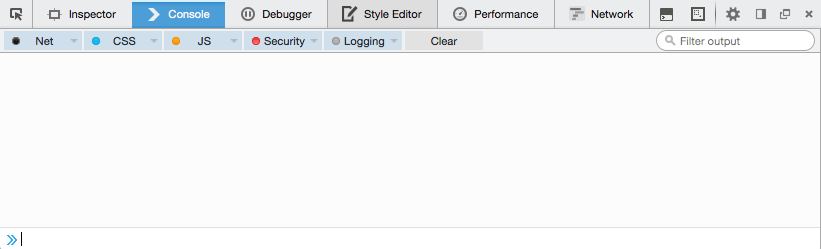

Todo navegador web moderno inclui um poderoso conjunto de ferramentas para desenvolvedores. Essas ferramentas fazem muitas coisas, desde inspecionar o HTML, CSS e JavaScript recém carregado e quais recursos foram requeridos até mostrar quanto tempo a página precisou para carregar. Este artigo explica como usar as funções básicas das ferramentas para desenvolvedores do seu navegador.

> **Nota:** Antes de você executar os exemplos abaixo, abra o [Beginner's example site](http://mdn.github.io/beginner-html-site-scripted/) (site de exemplos do iniciante) que nós criamos durante o início da série de artigos da Web ( [Getting started with the Web](/en-US/Learn/Getting_started_with_the_web) ). Você poderá abrir isso enquanto segue os passos abaixo.

## Como abrir o devtools no seu navegador

O devtools está inserido no navegador em uma janela semelhante a esta:



Como você acessa? Três modos:

- _**Teclado.**_ _<kbd>Ctrl</kbd> + <kbd>Shift</kbd> + <kbd>I</kbd>_, exceto:

  - **Internet Explorer.<kbd> </kbd>**_<kbd>F12</kbd>_
  - **Mac OS X.** _<kbd>⌘</kbd> + <kbd>⌥</kbd> +<kbd> I</kbd>_

- _**Menu bar.**_

  - **Firefox.** Menu  *➤  *➤ Web Developer ➤ Toggle Tools,_ or \_Tools ➤_ _Web Developer ➤ Toggle Tools_
  - **Chrome.** _View ➤ Developer ➤ Developer Tools_
  - **Safari.** _Develop ➤ Show Web Inspector._ Se você não consegue ver o _menu Desenvolvedor_ , vá para _Safari ➤ Preferências ➤ Avançado_ e confira o _Show Develop menu no menu bar_ checkbox.
  - **Opera**. _Developer ➤ Web Inspector_

- **_Context menu._** Pressione-e-segure/botão-direito no item da webpage (Ctrl-click on the Mac), e escolha _Inspect Element no_ menu de contexto que aparece. (_An added bonus:_ this method straight-away highlights the code of the element you right-clicked.)



## O Inspetor: DOM explorer e editor CSS

O devtools usualmente abre por padrão o inspetor, que se parece com a imagem abaixo. Esta ferramenta permite que você veja o resultado do HTML num site em execução, bem como o CSS aplicado en cada elemento na página. Ele também lhe mostra as mudanças efetuadas no HTML e CSS e os resultados são produzidos imediatamente, ao vivo, na janela do navegador.



Se você não vê o inspector,

- Clique a aba _Inspetor._
- No Internet Explorer, Clique a aba _DOM Explorer,_ ou pressione

  <kbd>Ctrl</kbd>

  \+

  <kbd> 1</kbd>

  .

- No Safari, os controles não são apresentados claramente, mas você poderia ver se não tiver selecionado algo para aparecerna janela. Pressione o botão _Style para ver o_ CSS.

### Explore o inspector DOM

Para começar tente pressionar o botão direito do mouse sobre um elemento HTML no inspetor do DOM e olhe para o menu de contexto. As opções do menu variam nos navegadores, mas os mais importantes são os mesmos.



- **Delete Node** (às vezes Delete _Element_). Exclui o elemento atual.
- **Edit as HTML** (às vezes _Add attribute_/_Edit text_). Permite alterar o HTML e ver os resultados na hora. Muito útil para depuração e teste.
- **:hover/:active/:focus**. Força os estados dos elementos a serem alternados, para que você possa ver como seria seu estilo.
- **Copy/Copy as HTML**. Copia o HTML atualmente selecionado.
- Alguns navegadores também têm Copy CSS Path e Copy XPath available, para permitir que você copie o seletor CSS ou a expressão XPath que selecionaria o elemento HTML atual.

Tente editar alguns dos seus DOM agora. Clique duas vezes em um elemento ou clique com o botão direito do mouse e escolha Editar como HTML no menu de contexto. Você pode fazer alterações que quiser, mas não pode salvar suas alterações.

### Explorando o editor de CSS

Por padrão, o editor CSS exibe as regras CSS aplicadas ao elemento atualmente selecionado:



Esses recursos são especialmente úteis:

- As regras aplicadas ao elemento atual são mostradas em ordem de mais específicas.
- Clique nas caixas de seleção ao lado de cada declaração para ver o que aconteceria se você removesse a declaração.
- Clique na pequena seta ao lado de cada propriedade abreviada para mostrar os equivalentes de longhand da propriedade.
- Clique no nome ou no valor de uma propriedade para exibir uma caixa de texto, na qual você pode digitar um novo valor para obter uma visualização ao vivo de uma alteração de estilo.
- Ao lado de cada regra está o nome do arquivo e o número da linha em que a regra está definida. Clicar nessa regra faz com que as ferramentas dev pularem para mostrá-la em sua própria visão, onde geralmente podem ser editadas e salvas.
- Você também pode clicar na chave de fechamento de qualquer regra para abrir uma caixa de texto em uma nova linha, onde você pode escrever uma declaração completamente nova para a sua página.

Você notará várias guias clicáveis na parte superior do Visualizador de CSS:

- _Computed_: Isso mostra os estilos calculados para o elemento atualmente selecionado (os valores finais normalizados que o navegador aplica).
- _Box model_: Isso representa visualmente o modelo de caixa do elemento atual, para que você possa ver rapidamente o preenchimento, a borda e a margem aplicados a ele e o tamanho do conteúdo.
- _Fonts_: No Firefox, a guia Fontes mostra as fontes aplicadas ao elemento atual.

### Descubra mais

Descubra mais sobre o Inspetor em diferentes navegadores:

- [Inspetor de páginas do Firefox](/pt-BR/docs/Tools/Page_Inspector)
- [IE DOM Explorer](http://msdn.microsoft.com/en-us/library/ie/dn255008%28v=vs.85%29.aspx)
- [Chrome DOM inspector](https://developer.chrome.com/devtools/docs/dom-and-styles) (Inspetor da Opera funciona da mesma forma)
- [Inspetor do Safari DOM e explorador de estilo](https://developer.apple.com/library/safari/documentation/AppleApplications/Conceptual/Safari_Developer_Guide/ResourcesandtheDOM/ResourcesandtheDOM.html#//apple_ref/doc/uid/TP40007874-CH3-SW1)

## O depurador JavaScript

O depurador Javascript permite a visualização dos conteúdos das variáveis e a configuração dos pontos de paradas(breakpoints) no código. Breakpoints são marcadores de linha para analisar a execução do código. A identificação previne problemas.


Para acessar o (debugger)depurador:

**Firefox**: Clique ➤ _Web Developer_ ➤ _Debugger_ ou pelo atalho <kbd>Ctrl</kbd> + <kbd>Shift</kbd> + <kbd>S</kbd> para abrir o Debugger Javascript. Se a ferramenta já estiver vísivel, clique na aba **Debugger**.

**Chrome**: Abra as ferramentas de desenvolvimento e selecione a aba Fontes(**Sources)**. (Opera funciona igualmente).

**Edge e Internet Explorer 11**: Aperte <kbd>F12</kbd> então, <kbd>Ctrl</kbd> + <kbd>3</kbd>, ou se a ferramenta já estiver visível, clique na aba Debugger(depurador).

**Safari**: Abra as ferramentas de desenvolvedor e então selecione a aba Debugger(depurador).

### Explorando o depurador

Há três painéis no Depurador(debugger) no Firefox

#### Lista de Arquivos

O primeiro painel na parte esquerda contém uma lista de arquivos associado com a página que está sendo depurada(debugging). Selecione o arquivo da seleção. Clique no arquivo para selecionar e visualizar os conteúdos no painel central do Debugger.


#### Código fonte

Insira os pontos de parada (breakpoints) onde deseja que a execução pare. Na imagem abaixo, a linha selecionada é a 18 na qual tem um ponto de parada (breakpoint).


#### Veja as expressões e pontos de paradas

À direita do painel é exibida uma lista de expressões e pontos de paradas adicionadas.

Na imagem, na primeira seção, **Watch expressions**, mostra a lista de itens e variáveis que foram adicionadas. Expanda a lista para visualizar os valores no vetor.

Na próxima seção, **Pontos de paradas**, lista os pontos de paradas na página. No arquivo example.js, um breakpoint foi adicionado `listItems.push(inputNewItem.value);`

As duas seções finais aparecem somente quando o código está executando.

A seção **Call stack** (chamada na pilha) mostra que o código foi executado para a linha atual. A função manuseia o clique do mouse e o código está pausado no ponto de parada (breakpoint).

A seção final, **Scopes(escopos)**, mostra os valores visíveis em vários pontos no código. Por exemplo, na imagem abaixo, os objetos disponíveis estão na função addItemClick.


## O console JavaScript

O console JavaScript é uma ferramenta incrivelmente útil para depurar códigos em JavaScript que não está funcionando como o esperado. Ele permite que você execute linhas de JavaScript enquanto a página é carregada no navegador e relata os erros encontrados enquanto o navegador tenta executar o código.

Para acessar o console basta abrir ferramentas de desenvolvimentos e escolher a aba Console.

No Firefox o atalho é <kbd>ctrl</kbd> + <kbd>shift</kbd>+ <kbd>k</kbd> ou no menu comando:  _➤ Web Developer_ _➤ Web Console,_ or _Tools ➤_ _Web Developer ➤ Web Console._

Aparecerá uma janela como a seguinte:



Para ver o que acontece, tente inserir os seguintes trechos de código no console, um por um (e, em seguida, pressione Enter):

```js
alert("hello!");
```

```js
document.querySelector("html").style.backgroundColor = "purple";
```

```js
const myWordmark = document.createElement("img");
myWordmark.setAttribute(
  "src",
  "https://blog.mozilla.org/press/wp-content/themes/OneMozilla/img/mozilla-wordmark.png",
);
document.querySelector("h1").appendChild(myWordmark);
```

Agora, tente inserir as seguintes versões incorretas do código e veja o que você obtém.

```js example-bad
alert('hello!);
```

```js example-bad
document.cheeseSelector("html").style.backgroundColor = "purple";
```

```js example-bad
const myWordmark = document.createElement("img");
myBanana.setAttribute(
  "src",
  "https://blog.mozilla.org/press/wp-content/themes/OneMozilla/img/mozilla-wordmark.png",
);
document.querySelector("h1").appendChild(myWordmark);
```

Você começará a ver o tipo de erro que o navegador retorna. Muitas vezes, esses erros são bastante críticos, mas deve ser bem simples descobrir esses problemas!

### Descubra mais

Descubra mais sobre o console JavaScript em diferentes navegadores:

- [Firefox Web Console](/pt-BR/docs/Tools/Web_Console)
- [IE JavaScript console](http://msdn.microsoft.com/en-us/library/ie/dn255006%28v=vs.85%29.aspx)
- [Chrome JavaScript Console](https://developer.chrome.com/devtools/docs/console) (O inspetor do Ópera funciona da mesma forma)
- [Safari Console](https://developer.apple.com/library/safari/documentation/AppleApplications/Conceptual/Safari_Developer_Guide/Console/Console.html#//apple_ref/doc/uid/TP40007874-CH6-SW1)

## Veja também

- [Debugging HTML](/pt-BR/docs/Learn/HTML/Introduction_to_HTML/Debugging_HTML)
- [Debugging CSS](/pt-BR/docs/Learn/CSS/Introduction_to_CSS/Debugging_CSS)
