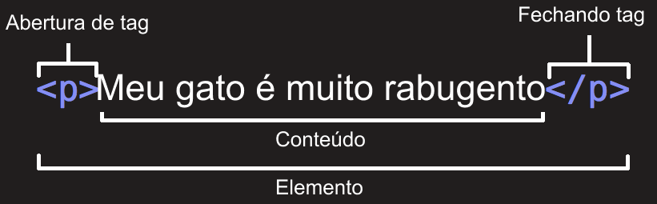
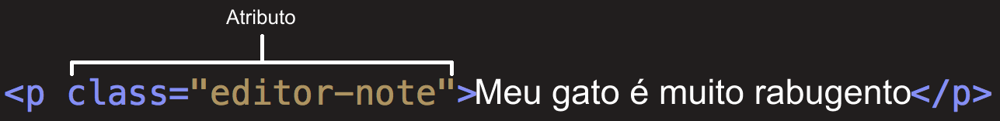

{{LearnSidebar}}{{PreviousMenuNext("Learn/Getting_started_with_the_web/Dealing_with_files", "Learn/Getting_started_with_the_web/CSS_basics", "Learn/Getting_started_with_the_web")}}

HTML (Linguagem de Marcação de Hipertexto) é o código que você usa para estruturar uma página web e seu conteúdo. Por exemplo, o conteúdo pode ser estruturado em parágrafos, em uma lista com marcadores ou usando imagens e tabelas. Como o título sugere, este artigo fornecerá uma compreensão básica do HTML e suas funções.

## Então, o que é HTML?

HTML não é uma linguagem de programação; é uma _linguagem de marcação_, usada para definir a estrutura do seu conteúdo. HTML consiste de uma série de **{{Glossary("element", "elementos")}}**, que você usa para delimitar ou agrupar diferentes partes do conteúdo para que ele apareça ou atue de determinada maneira. As {{Glossary ("tag", "tags")}} anexas podem transformar uma palavra ou imagem num hiperlink, pode colocar palavras em itálico, pode aumentar ou diminuir a fonte e assim por diante. Por exemplo, veja a seguinte linha de conteúdo:

```
Meu gatinho é muito mal humorado
```

Se quiséssemos que a linha permanecesse por si só, poderíamos especificar que é um parágrafo colocando-a em uma tag de parágrafo:

```html
<p>Meu gatinho é muito mal humorado</p>
```

### Anatomia de um elemento HTML

Vamos explorar esse parágrafo mais profundamente.



As principais partes de um elemento são:

1. A **tag de abertura**: Consiste no nome do elemento (no caso, p), envolvido em **parênteses angulares** de abertura e fechamento. Isso demonstra onde o elemento começa, ou onde seu efeito se inicia — nesse caso, onde é o começo do parágrafo.
2. A **tag de fechamento**: Isso é a mesma coisa que a tag de abertura, exceto que inclui uma barra antes do nome do elemento. Isso demonstra onde o elemento acaba — nesse caso, onde é o fim do parágrafo. Esquecer de incluir uma tag de fechamento é um dos erros mais comuns de iniciantes e pode levar a resultados estranhos.
3. O **conteúdo**: Esse é o conteúdo do elemento, que nesse caso é apenas texto.
4. O **elemento**: A tag de abertura, a de fechamento, e o conteúdo formam o elemento.

Elementos também podem ter atributos, que parecem assim:



Atributos contém informação extra sobre o elemento que você não quer que apareça no conteúdo real. Aqui, `class` é o nome do atributo e `editor-note` é o valor do atributo. O atributo `class` permite que você forneça ao elemento um identificador que possa ser usado posteriormente para aplicar ao elemento informações de estilo e outras coisas.

Um atributo sempre deve ter:

1. Um espaço entre ele e o nome do elemento (ou o atributo anterior, se o elemento já tiver um).
2. O nome do atributo, seguido por um sinal de igual.
3. Aspas de abertura e fechamento, envolvendo todo o valor do atributo.

> **Nota:** Valores de atributos simples que não contém espaço em branco ASCII (ou qualquer um dos caracteres `"` `'` `` ` `` `=` `<` `>`) podem permanecer sem aspas, mas é recomendável colocar em todos os valores de atributos, pois isso torna o código mais consistente e compreensível.

### Aninhando elementos

Você pode colocar elementos dentro de outros elementos também — isso é chamado de **aninhamento**. Se quiséssemos afirmar que nosso gato é **muito** mal-humorado, poderíamos envolver a palavra "muito" em um elemento {{htmlelement ("strong")}}, o que significa que a palavra deve ser fortemente enfatizada:

```html
<p>Meu gatinho é <strong>muito</strong> mal humorado.</p>
```

Você precisa, no entanto, certificar-se de que seus elementos estejam adequadamente aninhados. No exemplo acima, abrimos primeiro o elemento {{htmlelement ("p")}}, depois o elemento {{htmlelement ("strong")}}; portanto, temos que fechar primeiro o elemento {{htmlelement ("strong")}}, depois o elemento {{htmlelement ("p")}}. O código abaixo está incorreto:

```html-nolint example-bad
<p>Meu gatinho é <strong>muito mal humorado.</p></strong>
```

Os elementos precisam ser abertos e fechados corretamente para que eles estejam claramente visíveis dentro ou fora um do outro. Se eles se sobrepuserem conforme mostrado acima, seu navegador tentará adivinhar o que você estava tentando dizer, o que pode levar a resultados inesperados. Então não faça isso!

### Elementos vazios

Alguns elementos não possuem conteúdo e são chamados de **elementos vazios**. Considere o elemento {{htmlelement("img")}} que temos na nossa página HTML:

```html

```

Ele contém dois atributos, mas não há tag `</img>` de fechamento, e não há conteúdo interno. Isso acontece porque um elemento de imagem não envolve conteúdo para ter efeito em si mesmo. Sua proposta é incorporar uma imagem na página HTML no lugar que o código aparece.

### Anatomia de um documento HTML

Isso resume o básico dos elementos HTML individuais, mas eles não são úteis por si só. Agora vamos ver como elementos individuais são combinados para formar uma página HTML inteira. Vamos visitar novamente os códigos que colocamos no exemplo de `index.html` (que vimos no artigo [Lidando com arquivos](/pt-BR/docs/Learn/Getting_started_with_the_web/Dealing_with_files)):

```html
<!doctype html>
<html>
  <head>
    <meta charset="utf-8" />
    <meta name="viewport" content="width=device-width" />
    <title>Minha página de teste</title>
  </head>
  <body>
    
  </body>
</html>
```

Aqui nós temos:

- `<!DOCTYPE html>` — o doctype. É a parte inicial obrigatória do documento. Nas névoas do tempo, quando o HTML era novo (por volta de 1991/2), doctypes eram criados para agir como links para um conjunto de regras que a página HTML tinha que seguir para ser considerada um bom HTML, o que poderia significar checagem automática de erros e outras coisas úteis. No entanto, atualmente, eles não fazem muito sentido e são basicamente necessários apenas para garantir que o documento se comporte corretamente. Isso é tudo que você precisa saber agora.
- `<html></html>` — o elemento {{htmlelement("html")}}. Esse elemento envolve todo o conteúdo da página e às vezes é conhecido como o elemento raiz.
- `<head></head>` — o elemento {{htmlelement("head")}}. Esse elemento age como um recipiente de tudo o que você deseja incluir em uma página HTML que _não é_ o conteúdo que você quer mostrar para quem vê sua página. Isso inclui coisas como {{Glossary("keyword", "palavras-chave")}} e uma descrição que você quer que apareça nos resultados de busca, CSS para dar estilo ao conteúdo, declarações de conjuntos de caracteres e etc.
- `<meta charset="utf-8">` — esse elemento define o conjunto de caracteres que seu documento deve usar para o UTF-8, que inclui praticamente todos os caracteres da grande maioria dos idiomas escritos. Essencialmente, agora ele pode manipular qualquer conteúdo textual que você possa colocar. Não há razão para não definir isso e assim pode ajudar a evitar alguns problemas no futuro.
- `<title></title>` — o elemento {{htmlelement ("title")}}. Ele define o título da sua página, que é o título que aparece na guia do navegador onde sua página é carregada. Ele também é usado para descrever a página quando você a adiciona aos favoritos.
- `<body></body>` — o elemento {{htmlelement("body")}}. Contém _todo_ o conteúdo que você quer mostrar ao público que visita sua página, seja texto, imagens, vídeos, jogos, faixas de áudio reproduzíveis ou qualquer outra coisa.

## Imagens

Vamos voltar nossa atenção para o elemento {{htmlelement("img")}} novamente:

```html

```

Como dissemos antes, isso incorpora uma imagem na nossa página na posição que aparece. Isso é feito pelo atributo `src` (_source_), que contém o caminho para nosso arquivo de imagem.

Incluímos também um atributo `alt` (_alternative_). Neste atributo, você especifica um texto descritivo para usuários que não podem ver a imagem, possivelmente devido aos seguintes motivos:

1. Eles são deficientes visuais. Usuários com deficiências visuais significativas costumam usar ferramentas chamadas leitores de tela para ler o texto alternativo para eles.
2. Algo deu errado, fazendo com que a imagem não seja exibida. Por exemplo, tente alterar deliberadamente o caminho dentro do atributo `src` para torná-lo incorreto. Se você salvar e recarregar a página, você deve ver algo assim no lugar da imagem:


As palavras-chave para o texto alternativo são "texto descritivo". O texto alternativo que você escreve deve fornecer ao leitor informações suficientes para ter uma boa ideia do que a imagem mostra. Neste exemplo, nosso texto "Minha imagem teste" não é bom para todos. Uma alternativa muito melhor para o nosso logotipo do Firefox seria "A logo do Firefox: uma raposa em chamas envolvendo a Terra."

Tente criar um texto alternativo melhor para sua imagem agora.

> **Nota:** Saiba mais sobre acessibilidade em [módulo de aprendizagem sobre acessibilidade.](/pt-BR/docs/Web/Accessibility)

## Marcando o texto

Essa seção abordará alguns dos elementos HTML essenciais que você usará para marcar o texto.

### Cabeçalhos

Os elementos de cabeçalhos permitem especificar que certas partes do seu conteúdo são títulos ou subtítulos. Da mesma forma que um livro tem o título principal e os capítulos possuem títulos e subtítulos, um documento HTML também tem. HTML contém 6 níveis de título, {{htmlelement ("h1")}} - {{htmlelement ("h6")}}, embora você normalmente só use de 3 a 4:

```html
<h1>Meu título principal</h1>
<h2>Meu título de alto nível</h2>
<h3>Meu subtítulo</h3>
<h4>Meu segundo subtítulo</h4>
```

Agora, tente adicionar um título adequado à sua página HTML logo acima do elemento {{htmlelement("img")}}.

> **Nota:** Você verá que seu nível de cabeçalho 1 tem um estilo implícito. Não use elementos de cabeçalho para aumentar ou negritar o texto, pois eles são usados para [acessibilidade](/pt-BR/docs/Learn/Accessibility/HTML#text_content) e [outros motivos, como SEO](/pt-BR/docs/Learn/HTML/Introduction_to_HTML/HTML_text_fundamentals#why_do_we_need_structure). Tente criar uma sequência significativa de títulos em suas páginas, sem pular os níveis.

Agora tente adicionar um título adequado à sua página HTML logo acima do elemento {{htmlelement("img")}}.

> **Nota:** você verá que seu título de nível 1 tem um estilo implícito. Não use elementos de cabeçalho para deixar o texto maior ou em negrito, pois eles são usados para [acessibilidade](/pt-BR/docs/Learn/Accessibility/HTML#text_content) e [outros motivos, como SEO](/pt-BR/docs/Learn/HTML/Introduction_to_HTML/HTML_text_fundamentals#why_do_we_need_structure). Tente criar uma sequência significativa de títulos em suas páginas, sem pular níveis.

### Parágrafo

Como explicado acima, os elementos {{htmlelement ("p")}} são para conter parágrafos de texto; você os usará com frequência ao marcar um conteúdo de texto regular:

```html
<p>Este é um parágrafo simples</p>
```

Adicione seu texto de exemplo (você o obteve em [_Como será o seu site?_](/pt-BR/docs/Learn/Getting_started_with_the_web/What_will_your_website_look_like)) Em um ou alguns parágrafos, colocados diretamente abaixo do seu elemento {{htmlelement ("img")}}.

### Listas

Muito do conteúdo da web é de listas e o HTML tem elementos especiais para elas. Listas de marcação sempre consistem em pelo menos 2 elementos. Os tipos mais comuns de lista são ordenadas e não ordenadas:

1. **Listas não ordenadas** são para listas onde a ordem dos itens não importa, como uma lista de compras, por exemplo. Essas são envolvidas em um elemento {{htmlelement("ul")}}.
2. **Listas Ordenadas** são para listas onde a ordem dos itens importa, como uma receita. Essas são envolvidas em um elemento {{htmlelement("ol")}}.

Cada item dentro das listas é posto dentro de um elemento {{htmlelement("li")}} (item de lista).

Por exemplo, se nós quisermos tornar uma parte de um parágrafo numa lista:

```html
<p>
  Na Mozilla, somos uma comunidade global de tecnólogos, pensadores e
  construtores trabalhando juntos ...
</p>
```

Nós podemos fazer assim:

```html
<p>Na Mozilla, somos uma comunidade global de</p>

<ul>
  <li>tecnólogos</li>
  <li>pensadores</li>
  <li>construtores</li>
</ul>

<p>trabalhando juntos ...</p>
```

Tente adicionar uma lista ordenada ou não ordenada à sua página de exemplo.

## Links

Links são muito importantes — eles são o que faz da web ser de fato uma REDE! Para adicionar um link, precisamos usar um elemento simples — {{htmlelement ("a")}} — "a" é a forma abreviada de "âncora". Para transformar o texto do seu parágrafo em um link, siga estas etapas:

1. Escolha algum texto. Nós escolhemos o texto "Mozilla Manifesto".
2. Envolva o texto em um elemento {{htmlelement("a")}} , assim:

   ```html
   <a>Mozilla Manifesto</a>
   ```

3. Dê ao elemento {{htmlelement("a")}} um atributo `href`, como mostrado abaixo:

   ```html
   <a href="">Mozilla Manifesto</a>
   ```

4. Preencha o valor desse atributo com o endereço da Web que você deseja vincular o link:

   ```html
   <a href="https://www.mozilla.org/pt-BR/about/manifesto/"
     >Mozilla Manifesto</a
   >
   ```

Você pode obter resultados inesperados se omitir a parte `https://` ou o `http://`, o chamado _protocolo_, no começo do endereço web. Então depois de criar um link, clique nele para ter certeza de que ele está indo para onde você deseja.

> **Nota:** `href` pode parecer, numa primeira impressão, uma escolha obscura para um nome de atributo. Se você está tendo problemas para lembrar do nome, lembre que significa _**h**ypertext **ref**erence_. (referência em hipertexto)

Adicione um link em sua página agora, se ainda não tiver feito isso.

## Conclusão

Se você seguiu todas as instruções neste artigo, você deve terminar com uma página que pareça algo do tipo (você também pode [vê-la aqui](https://mdn.github.io/beginner-html-site/)):


Se você ficar emperrado, pode sempre comparar seu trabalho com nosso [código de exemplo finalizado](https://github.com/mdn/beginner-html-site/blob/gh-pages/index.html) no Github.

Aqui, nós só arranhamos na superfície do HTML. Para descobrir mais, vá a nossa [Estruturando a web com HTML](/pt-BR/docs/Learn/HTML).

{{PreviousMenuNext("Learn/Getting_started_with_the_web/Dealing_with_files", "Learn/Getting_started_with_the_web/CSS_basics", "Learn/Getting_started_with_the_web")}}
