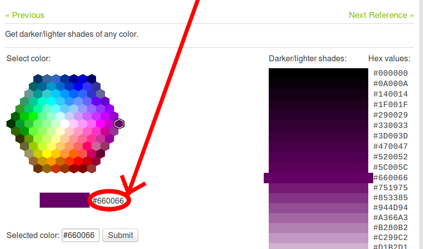
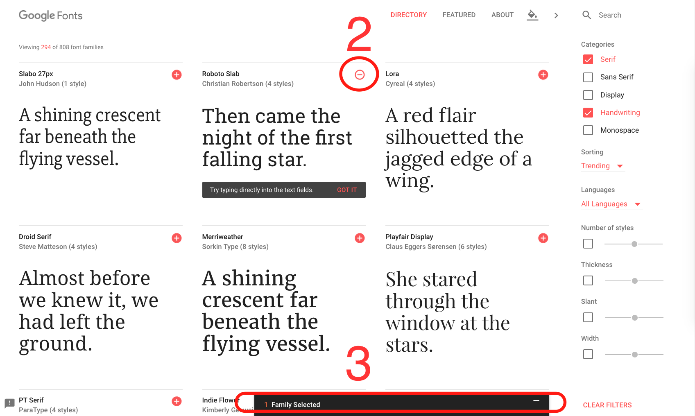
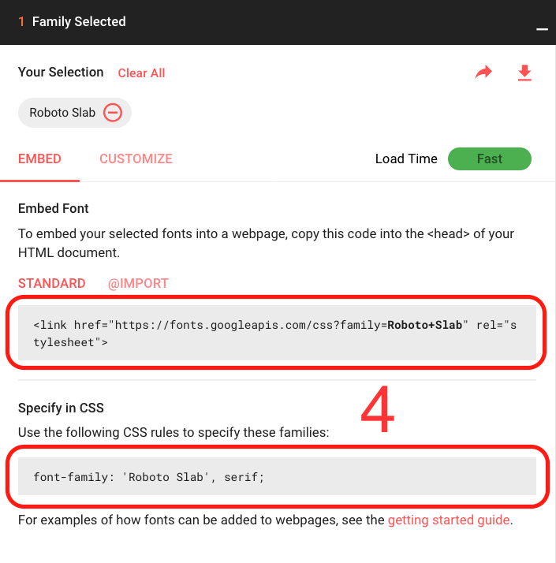

{{LearnSidebar}}{{PreviousMenuNext("Learn/Getting_started_with_the_web/Installing_basic_software", "Learn/Getting_started_with_the_web/Dealing_with_files", "Learn/Getting_started_with_the_web")}}

_Como será o seu site?_ discute o trabalho de planejamento e design que você precisa fazer para o seu site antes de escrever o código, incluindo "Quais informações meu site oferece?", "Quais fontes e cores eu quero?" e "O que meu site faz?"

## Primeiramente: planejamento

Antes que você faça qualquer coisa, você precisa de algumas ideias. O que seu site realmente vai fazer? Um site pode fazer praticamente tudo, mas primeiro você deve manter as coisas em um nível simples. Nós vamos começar criando um site simples com um cabeçalho, uma imagem e alguns parágrafos.

Para começar, você deve responder às seguintes questões:

1. **Sobre o que é seu site?** Você gosta de cachorros, Nova Iorque ou Pacman?
2. **Que informação você está apresentando sobre o assunto?** Escreva um título e alguns parágrafos e pense em uma imagem para ilustrar sua página.
3. **Como será seu site,** em termos simples. Qual é a cor de fundo? Qual é o tipo de fonte apropriado: formal, desenhado, negrito e gritante, sutil?

> **Nota:** Projetos complexos precisam de guias detalhados que abordam todos os detalhes de cores, fontes, espaçamento entre itens de uma página, estilo de escrita apropriado, e por aí vai. Isso é denominado um guia de design, sistema de design ou manual da marca, e você pode ver um exemplo no [Sistema de Design do Firefox Photon](https://design.firefox.com/photon/) (em inglês).

## Rascunhando seu design

Em seguida, pegue papel e caneta e faça um rascunho de como você deseja que seu site seja. Para sua primeira página simples, não há muito o que rascunhar, mas você deve criar o hábito desde o começo. Realmente ajuda — você não precisa ser um Van Gogh!

> **Nota:** Mesmo em sites reais e complexos, os times de design geralmente começam pelo rascunho em papel e depois constroem a versão digital usando um editor gráfico ou tecnologias da web.
>
> Os times de web geralmente incluem um designer gráfico e um designer de {{Glossary("UX", "experiencia do usuário")}} (UX). Designers gráficos, obviamente, constroem a parte visual do site. UX designers tem uma função de certa forma mais abstrata, direcionando como os usuários vão interagir e experimentar o site.

## Construindo seus ativos

Nesse ponto, é bom começar juntando o conteúdo que vai eventualmente aparecer no site.

### Texto

Você deve ter seu título e parágrafos desde antes. Mantenha eles por perto.

### Cor do tema

Para escolher a cor, vá ao [Seletor de Cores](/pt-BR/docs/Web/CSS/CSS_Colors/seletor_de_cores) e escolha a cor que preferir. Quando escolher a cor, você verá uma sequência de seis caracteres, como `#660066`. Isso é chamado um _código hex(adecimal)_, e representa sua cor. Copie esse código em algum lugar seguro por enquanto.

### Imagens

Para escolher uma imagens, vá no [Google Imagens](https://www.google.com/imghp?gws_rd=ssl) e procure por algo que se encaixe no seu site.

1. Quando você achar a imagem que você quer, clique nela para obter uma visão ampliada dela.
2. Clique com o botão direito na imagem (Ctrl + click no Mac) escolha _Salvar imagem como..._ e escolha um local seguro para salvar sua imagem. Como alternativa, copie o endereço web da imagem da barra de endereço do navegador, para uso posterior.

Observe que a maioria das imagens na Web, inclusive no Imagens do Google, é protegida por direitos autorais. Para reduzir a probabilidade de violar direitos autorais, você pode usar o filtro de licenças do Google. Clique no botão _Ferramentas_ e, em seguida, na opção _Direitos de uso_ resultante que aparece abaixo. Você deve escolher uma opção como _Marcada para reutilização_.

### Fonte

Para escolher uma fonte:

1. Vá no [Google Fontes](http://www.google.com/fonts) e role a lista até que você ache uma que você goste. Você também pode usar os controles à direita para filtrar os resultados.
2. Clique no ícone "mais" (Adicionar a) ao lado da fonte desejada.
3. Clique no botão "\* Família Selecionada" no painel na parte inferior da página ("\*" depende de quantas fontes você selecionou).
4. Na caixa pop-up, você pode ver e copiar as linhas de código que o Google oferece em seu editor de texto para salvar posteriormente.

{{PreviousMenuNext("Learn/Getting_started_with_the_web/Installing_basic_software", "Learn/Getting_started_with_the_web/Dealing_with_files", "Learn/Getting_started_with_the_web")}}
