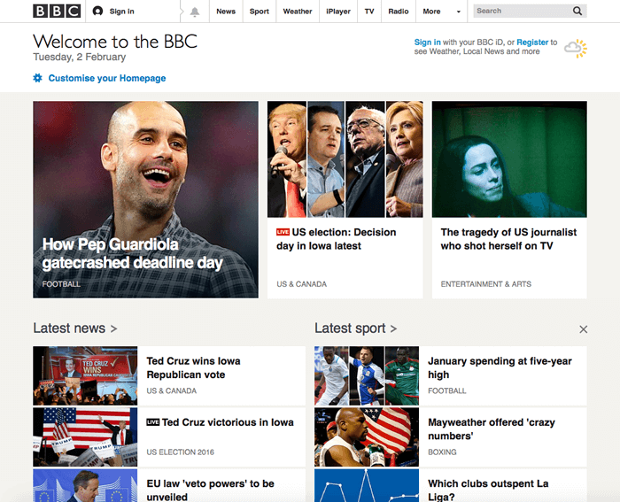

{{LearnSidebar}}

{{PreviousMenuNext("Learn/HTML/Introduction_to_HTML/HTML_text_fundamentals", "Learn/HTML/Introduction_to_HTML/Advanced_text_formatting", "Learn/HTML/Introduction_to_HTML")}}

Os hiperlinks são realmente importantes — são o que torna a Web uma _web_. Este artigo mostra a sintaxe necessária para criar um link e discute as suas melhores práticas.

<table class="learn-box standard-table">
  <tbody>
    <tr>
      <th scope="row">Pre-requisitos:</th>
      <td>
        <p>
          Familiaridade básica em HTML, conforme
          <a href="/pt-BR/docs/Aprender/HTML/Introducao_ao_HTML/Getting_started"
            >Começando com o HTML</a
          >. Formatação de texto em HTML, conforme
          <a
            href="/pt-BR/docs/Aprender/HTML/Introducao_ao_HTML/Fundamentos_textuais_HTML"
            >Fundamentos do texto em HTML</a
          >.
        </p>
      </td>
    </tr>
    <tr>
      <th scope="row">Objetivo:</th>
      <td>
        Para aprender a implementar um hiperlink efetivamente e vincular vários
        arquivos juntos.
      </td>
    </tr>
  </tbody>
</table>

## O que é um hiperlink?

Os hiperlinks são uma das inovações mais interessantes que a Web oferece. Bem, eles são uma característica da Web desde o início, mas são o que torna a Web como ela é — eles nos permitem vincular nossos documentos a qualquer outro documento (ou outro recurso) que queremos. Também podemos vincular para partes específicas de documentos e podemos disponibilizar aplicativos em um endereço web simples (em contraste com aplicativos nativos, que devem ser instalados e tantas outras coisas). Qualquer conteúdo da web pode ser convertido em um link, para que, quando clicado (ou ativado de outra forma) fará com que o navegador vá para outro endereço ({{glossary("URL")}}).

> **Nota:** Um URL pode apontar para arquivos HTML, arquivos de texto, imagens, documentos de texto, arquivos de vídeo e áudio e qualquer outra coisa que possa estar na Web. Se o navegador não souber exibir ou manipular o arquivo, ele perguntará se você deseja abrir o arquivo (nesse caso, o dever de abrir ou manipular o arquivo é passado para um aplicativo nativo adequado no dispositivo) ou fazer o download dele (nesse caso, você pode tentar lidar com isso mais tarde).

A página inicial da BBC, por exemplo, contém um grande número de links que apontam não apenas para várias notícias, mas também diferentes áreas do site (funcionalidade de navegação), páginas de login/registro (ferramentas do usuário) e muito mais.



## Anatomia de um link

Um link básico é criado envolvendo o texto (ou outro conteúdo, veja [Block level links](#block_level_links)) que você quer transformar em um link dentro de um elemento {{htmlelement("a")}}, e dando-lhe um atributo [`href`](/pt-BR/docs/Web/HTML/Element/a#href), (também conhecido como **Hypertext Reference**, ou **target**) que conterá o endereço da Web para o qual você deseja que o link aponte.

```html
<p>
  Estou criando um link para
  <a href="https://www.mozilla.org/pt-BR/">a página inicial da Mozilla</a>.
</p>
```

Isso nos dá o seguinte resultado:

Estou criando um link para [a página inicial da Mozilla](https://www.mozilla.org/pt-BR/).

### Adicionando informações de suporte com o atributo _title_

Outro atributo que você pode querer adicionar aos seus links é o `title`; pretende-se que ele contenha informações úteis adicionais sobre o link, como, que tipo de informação a página contém ou informações importantes. Por exemplo:

```html
<p>
  Estou criando um link para
  <a
    href="https://www.mozilla.org/pt-BR/"
    title="O melhor lugar para encontrar mais informações sobre a missão da Mozilla e como contribuir">
    a página inicial da Mozilla</a
  >.
</p>
```

Isto nos dá o seguinte resultado (o título aparecerá como uma dica de ferramenta quando o link estiver suspenso):

Estou criando um link para [a página inicial da Mozilla](https://www.mozilla.org/pt-BR/).

> **Nota:** Um título de link só é revelado ao passar o mouse sobre ele, o que significa que as pessoas que dependem do teclado ou _touchscreen_ para navegar em páginas web terão dificuldade em acessar a informação do título. Se a informação de um título é realmente importante para a usabilidade da página, então você deve apresentá-la de uma maneira que será acessível a todos os usuários, por exemplo, colocando-o no texto normal.

Aprendizagem na prática: criando seu próprio link de exemplo

Momento da aprendizagem na prática: gostaríamos que você criasse um documento HTML usando seu editor de código local (nosso [modelo inicial](https://github.com/mdn/learning-area/blob/master/html/introduction-to-html/getting-started/index.html) seria interessante.)

- Dentro do corpo do HTML, tente adicionar um ou mais parágrafos ou outros tipos de conteúdo que você já conhece.
- Transforme alguns dos conteúdos em links.
- Inclua atributos de título.

### Links de nível de bloco

Como falamos anteriormente, você pode transformar qualquer conteúdo em um link, mesmo [elementos de nível de bloco](/pt-BR/docs/Aprender/HTML/Introducao_ao_HTML/Getting_started#Elementos_em_bloco_versus_elementos_inline). Se você tiver uma imagem que queira transformar em um link, você pode simplesmente colocar a imagem entre as tags `<a></a>`.

```html
<a href="https://www.mozilla.org/pt-BR/">
  
</a>
```

> **Nota:** Você descobrirá muito mais sobre o uso de imagens na Web em artigo posterior.

## Um guia rápido sobre URLs e caminhos

Para entender completamente os destinos de links, você precisa entender URLs e caminhos de arquivos. Esta seção fornece as informações que você precisa para conseguir isso.

Um URL ou _Uniform Resource Locator_ é simplesmente uma sequência de texto que define onde algo está localizado na Web. Por exemplo, a página inicial em inglês da Mozilla está localizada em `https://www.mozilla.org/en-US/`.

Os URLs usam caminhos para encontrar arquivos. Os caminhos especificam onde, no explorador de arquivos, o recurso que você está interessado está localizado. Vejamos um exemplo simples de uma estrutura de diretório (veja o diretório de [criação de hiperlinks](https://github.com/mdn/learning-area/tree/master/html/introduction-to-html/creating-hyperlinks)).


A raiz dessa estrutura de diretório é chamada de `criação de hiperlinks`. Ao trabalhar localmente com um site, você terá um diretório no qual ele todo esta dentro. Incluído na raiz, temos um arquivo `index.html` e um arquivo `contacts.html`. Em um site real, `index.html` seria nossa página inicial ou página de entrada (uma página da web que serve como ponto de entrada para um site ou uma seção específica de um site).

Existem também dois diretórios dentro da nossa raiz — `pdfs` e `projects`. Cada um deles contém um único arquivo — um PDF (`projetos-brief.pdf`) e um arquivo `index.html`, respectivamente. Observe como é possível, felizmente, ter dois arquivos `index.html` em um projeto, desde que estejam em locais diferentes no sistema de arquivos. Muitos sites fazem isso. O segundo `index.html` poderia ser a página de destino principal para informações relacionadas ao projeto.

- **Mesmo diretório:** se você deseja incluir um hiperlink dentro de `index.html` (o `index.html` de nível superior) apontando para `contacts.html`, basta especificar o nome do arquivo ao qual deseja vincular, já que está no mesmo diretório que o arquivo atual. Portanto, o URL que você usaria seria `contacts.html`:

  ```html
  <p>
    Deseja entrar em contato com um membro da equipe específica? Encontre
    detalhes sobre nossos serviços em nossa
    <a href="contato.html">página de contatos</a>.
  </p>
  ```

- **Movendo-se para baixo em subdiretórios:** se você quisesse incluir um hiperlink dentro do `index.html` apontando para o `projeto/index.html`, você precisaria descer no diretório de projetos antes de indicar o arquivo que deseja vincular. Isso é feito especificando o nome do diretório, depois uma barra inclinada e, em seguida, o nome do arquivo. Então o URL que você usaria seria `projeto/index.html`:

  ```html
  <p>
    Visite minha <a href="projects/index.html">pagina inicial do projeto</a>.
  </p>
  ```

- **Movendo-se de volta para os diretórios pai:** se você quisesse incluir uma hiperlink dentro de `projeto/index.html` apontando para pdfs/`projetos-brief.pdf`, você precisaria subir um nível de diretório e voltar para o diretório `pdf`. "Subir um diretório" é indicado usando dois pontos — `..` — então a URL que você usaria seria `../pdfs/project-brief.pdf`

  ```html
  <p>
    Um link para o meu
    <a href="../pdfs/project-brief.pdf"> breve de projeto</a>.
  </p>
  ```

> **Nota:** Você pode combinar várias instâncias desses recursos em URLs complexas, se necessário, por exemplo`../../../complex/path/to/my/file.html`.

### Fragmentos de documento

É possível vincular a uma parte específica de um documento HTML (conhecido como um **fragmento de documento**) e não apenas ao topo do documento. Para fazer isso, primeiro você deve atribuir um atributo "id" ao elemento ao qual deseja vincular. Normalmente faz sentido vincular a um título específico, então ficaria algo do tipo:

```html
<h2 id="Mailing_address">Endereço de correspondência</h2>
```

Em seguida, para vincular a esse `id` específico, você o incluirá no final do URL, precedido por um símbolo de hashtag/cerquilha, por exemplo:

```html
<p>
  Quer escrever uma carta? Use nosso<a href="contacts.html#Mailing_address"
    >endereço de correspondência</a
  >.
</p>
```

Você pode até usar apenas referência de fragmento do documento por si só para vincular a outra parte do mesmo documento:

```html
<p>
  O <a href="#Mailing_address">endereço postal da empresa</a> pode ser
  encontrado na parte inferior desta página.
</p>
```

### URLs absolutos versus relativos

Dois termos que você encontrará na Web são URL **absoluto** e URL **relativo**:

**URL absoluto:** aponta para um local definido por sua localização absoluta na web, incluindo "protocolo" e "nome de domínio". Então, por exemplo, se uma página `index.html` for carregada para um diretório chamado `projeto` que fica dentro da raiz de um servidor web, e o domínio do site é `http://www.exemplo.com`, a página estará disponível em `http://www.exemplo.com/projeto/index.html` (ou mesmo apenas `http://www.exemplo.com/projeto/`, pois a maioria dos servidores web apenas procura uma página de destino como index.html para carregar, se não está especificado no URL.)

Um URL absoluto sempre aponta para o mesmo local, não importa onde seja usado.

**URL relativa:** aponta para um local _relativo_ ao arquivo do qual você está vinculando, mais como o que vimos na seção anterior. Por exemplo, se desejássemos vincular nosso arquivo de exemplo em `http://www.exemplo.com/projeto/index.html` para um arquivo PDF no mesmo diretório, o URL seria apenas o nome do arquivo — por exemplo, `project-brief.pdf` — nenhuma informação extra é necessária. Se o PDF estava disponível em um subdiretório dentro de `projects` chamado `pdfs`, o link relativo seria `pdfs/projeto-brief.pdf` (o URL absoluto equivalente seria `http://www.example.com/projects/pdfs/project-brief.pdf`).

Um URL relativo apontará para lugares diferentes, dependendo da localização real do arquivo ao qual você se refere — por exemplo, se tivermos movido nosso arquivo `index.html` para fora do diretório de projetos e para a raiz do site (no nível superior, não em qualquer diretório), o link relativo à URL referente a `pdfs/project-brief.pdf` agora apontaria para um arquivo localizado em `http://www.example.com/pdfs/project-brief.pdf`, não para um arquivo localizado em `http://www.example.com/projects/pdfs/project-brief.pdf`.

## Práticas recomendadas

Existem algumas práticas recomendadas a seguir, ao escrever links. Vejamos.

### Use palavras-chave claras

É muito fácil jogar links na sua página, porém somente isto não é suficiente. Precisamos tornar nossos links _acessíveis_ a todos os leitores, independentemente do contexto atual e de quais ferramentas eles prefiram. Por exemplo:

- Os usuários de leitores de telas gostam pular de link a outro link na página e ler links fora do contexto.
- Os motores de busca usam o texto do link para indexar arquivos de destino, por isso é uma boa idéia incluir palavras-chave no texto do link para descrever efetivamente o que está sendo vinculado.
- Os usuários normalmente deslizam sobre a página em vez de ler cada palavra, e são atraídos para recursos de página que se destacam, como links. Eles acharão os textos descritivos de links úteis.

Vejamos um exemplo específico:

_Texto de link_ **correto**: [Baixe o Firefox](https://firefox.com/)

```html
<p><a href="https://firefox.com/"> Baixe o Firefox </a></p>
```

_Texto de link_ **incorreto**: [clique aqui](https://firefox.com/) para baixar o Firefox

```html
<p><a href="https://firefox.com/"> clique aqui </a> para baixar o Firefox</p>
```

Outras dicas:

- Não repita o URL como parte do texto do link — Os URLs parecem feios e até são mais feios quando um leitor de tela os lê letra por letra.
- Não diga "link" ou "links para" no texto do link — é apenas ruído. Os leitores de tela já dizem às pessoas que existe um link. Os usuários visuais também sabem que existe um link, porque eles geralmente são de cor diferente e sublinhados (esta convenção geralmente não deve ser quebrada, pois os usuários estão muito acostumados a isso).
- Mantenha seu rótulo de link o mais curto possível — links longos irritam especialmente os usuários de leitores de tela, que têm que ouvir o texto inteiro lido.
- Minimize instâncias em que o mesmo texto esteja ligado a diferentes lugares. Isso pode causar problemas para os usuários do leitor de tela, que muitas vezes mostrará uma lista dos links fora do contexto — vários links todos rotulados como "clique aqui", "clique aqui", "clique aqui"... seria confuso.

### Use links relativos sempre que possível

A partir da descrição acima, você pode pensar que é uma boa idéia usar apenas links absolutos o tempo todo; Afinal, eles não quebram quando uma página é movida como pode ocorrer com _links relativos_. No entanto, você deve usar _links relativos_ sempre que possível ao vincular a outros locais dentro do mesmo site (ao vincular a outro site, você precisará usar um link absoluto):

- Para começar, é muito mais fácil verificar seu código — os URL relativos geralmente são muito mais curtos que os URLs absolutos, o que torna o código de leitura muito mais fácil.
- Em segundo lugar, é mais eficiente usar URLs relativas sempre que possível. Quando você usa um URL absoluto, o navegador começa procurando a localização real do servidor no Servidor de Nomes de Domínio "DNS"; veja [Como a web funciona](/pt-BR/docs/Aprender/Getting_started_with_the_web/Como_a_Web_funciona) para obter mais informações), então ele vai para esse servidor e encontra o arquivo que está sendo solicitado. Por outro lado, com um URL relativo, o navegador apenas procura o arquivo que está sendo solicitado, no mesmo servidor. Então, se você usa URLs absolutos para fazer o que os URLs relativos fariam, você está constantemente fazendo o seu navegador realizar trabalho extra, o que significa que ele irá executar de forma menos eficiente.

### Vinculando-se a recursos que não sejam HTML — deixe indicadores claros

Ao vincular a um arquivo que será baixado (como um documento PDF ou Word) ou transmitido (como vídeo ou áudio) ou ainda tiver outro efeito potencialmente inesperado (abrir uma janela pop-up ou carregar um filme Flash), você deve adicionar uma redação clara para reduzir qualquer confusão. Pode ser bastante irritante, por exemplo:

- Se você estiver em uma conexão de baixa banda larga, clicar em um link e, em seguida, um download de muitos megabytes começa inesperadamente.
- Se você não tiver instalado o Flash Player, clicar em um link e, de repente, ser levado para uma página que requer Flash Player.

Vejamos alguns exemplos, para ver que tipo de texto pode ser usado aqui:

```html
<p>
  <a href="http://www.example.com/large-report.pdf">
    Baixe o relatório de vendas (PDF, 10MB)
  </a>
</p>

<p>
  <a href="http://www.example.com/video-stream/">
    Assista ao vídeo (o fluxo abre em separado, qualidade HD)
  </a>
</p>

<p>
  <a href="http://www.example.com/car-game">
    Jogue o jogo de carro (requer Flash Player)
  </a>
</p>
```

### Use o atributo de download ao vincular a um download

Quando você está apontando para um arquivo que deve ser baixado em vez de ser aberto no navegador, poderá usar o atributo de download para fornecer um nome de arquivo salvo padrão. Aqui está um exemplo, com um link de `baixar` para a versão do Windows 39 do Firefox:

```html
<a
  href="https://download.mozilla.org/?product=firefox-39.0-SSL&os=win&lang=en-US"
  download="firefox-39-installer.exe">
  Faça o download do Firefox 39 para Windows
</a>
```

## Aprendizagem ativa: criando um menu de navegação

Para este exercício, gostaríamos que você vinculasse algumas páginas a um menu de navegação para criar um _site_ com várias páginas. Essa é uma maneira comum de criá-los — a mesma estrutura de página é usada em todas elas, incluindo o mesmo menu de navegação. Portanto, quando os _links_ são clicados, dá a impressão de que você permanece no mesmo lugar e que um conteúdo diferente está sendo criado.

Você precisará fazer cópias locais das quatro páginas a seguir, tudo no mesmo diretório (veja também o diretório de [início do menu de navegação](https://github.com/mdn/learning-area/tree/master/html/introduction-to-html/navigation-menu-start) para uma lista completa de arquivos):

- [index.html](https://github.com/mdn/learning-area/blob/master/html/introduction-to-html/navigation-menu-start/index.html)
- [projects.html](https://github.com/mdn/learning-area/blob/master/html/introduction-to-html/navigation-menu-start/projects.html)
- [pictures.html](https://github.com/mdn/learning-area/blob/master/html/introduction-to-html/navigation-menu-start/pictures.html)
- [social.html](https://github.com/mdn/learning-area/blob/master/html/introduction-to-html/navigation-menu-start/social.html)

Você deve:

1. Adicionar uma lista não ordenada no local indicado em uma página, contendo os nomes das páginas a serem vinculadas. Um menu de navegação geralmente é apenas uma lista de _links_, então está semanticamente correto.
2. Transformar o nome de cada página em um _link_ para essa página.
3. Copiar o menu de navegação para cada uma.
4. Em cada página, remova apenas o _link_ para a mesma página - é confuso e inútil que uma página inclua um link para si mesma, e a falta de um _link_ é um bom lembrete visual de qual página você está atualmente.

O exemplo final acabaria por parecer algo assim:


> **Nota:** Se você ficar preso, ou não tem certeza se o fez bem, você pode verificar o diretório de [navegação-menu-marcado](https://github.com/mdn/learning-area/tree/master/html/introduction-to-html/navigation-menu-marked-up) para ver a resposta correta.

## Links de e-mail

É possível criar _links_ ou botões que, quando clicados, abrem uma nova mensagem de e-mail de saída em vez de vincular a um recurso ou página. Isso é feito usando o elemento {{HTMLElement("a")}} e o `mailto:` estrutura de URL.

Na sua forma mais comum, um `mailto:` simplesmente indica o endereço de e-mail do destinatário pretendido. Por exemplo:

```html
<a href="mailto:nowhere@mozilla.org">Enviar email para nenhum lugar</a>
```

Isso resulta em um _link_ que se parece com isto: [Enviar e-mail para lugar nenhum.](mailto:nowhere@mozilla.org)

Na verdade, o endereço de e-mail é opcional. Se você deixar de fora (ou seja, seu [`href`](/pt-BR/docs/Web/HTML/Element/a#href) for simplesmente "mailto:"), uma nova janela de e-mail de saída será aberta pelo aplicativo de e-mail do usuário sem um destinatário. Isso geralmente é útil como "Compartilhar" _links_ que os usuários podem clicar para enviar um e-mail para um endereço escolhido.

### Especificando detalhes

Além do endereço de e-mail, você pode fornecer outras informações. Na verdade, qualquer campo de cabeçalho de correio padrão pode ser adicionado ao URL do `mailto:` que você fornece. Os mais utilizados são "assunto", "cc" e "corpo" (que não é um campo de cabeçalho verdadeiro, mas permite que você especifique uma mensagem de conteúdo curta para o novo e-mail). Cada campo e seu valor são especificados como um termo de consulta.

Aqui está um exemplo que inclui um cc, bcc, assunto e corpo de texto:

```html
<a
  href="mailto:nowhere@mozilla.org?cc=name2@rapidtables.com&bcc=name3@rapidtables.com&subject=The%20subject%20of%20the%20email&body=The%20body%20of%20the%20email">
  Aqui está um exemplo, incluindo um cc, bcc, assunto e corpo:
</a>
```

> **Nota:** Os valores de cada campo devem ser codificados por URL, ou seja, com caracteres não imprimíveis (caracteres invisíveis, como guias, carriage returns e quebras de página) e espaços com [percent-escaped](http://en.wikipedia.org/wiki/Percent-encoding). Observe também o uso do ponto de interrogação (`?`) Para separar o URL principal dos valores do campo e do _e_ comercial (&) para separar cada campo no `mailto:` URL. Essa é a notação de consulta padrão do URL. Leia [O método GET](/pt-BR/docs/Learn/HTML/Forms/Sending_and_retrieving_form_data#The_GET_method) para entender para que esta notação de consulta é mais comum.

Aqui estão alguns outros exemplos de URLs de `mailto:`

- <mailto:>
- <mailto:nowhere@mozilla.org>
- <mailto:nowhere@mozilla.org,nobody@mozilla.org>
- <mailto:nowhere@mozilla.org?cc=nobody@mozilla.org>
- <mailto:nowhere@mozilla.org?cc=nobody@mozilla.org&subject=This%20is%20the%20subject>

## Resumo

Por enquanto isto é tudo sobre links! Você retornará aos links mais tarde no curso quando começar a analisar o estilo deles. Em seguida, em HTML, retornaremos à semântica de texto e veremos alguns recursos mais avançados/incomuns que você achará úteis — No próximo artigo você verá a formatação avançada de texto.

{{PreviousMenuNext("Learn/HTML/Introduction_to_HTML/HTML_text_fundamentals", "Learn/HTML/Introduction_to_HTML/Advanced_text_formatting", "Learn/HTML/Introduction_to_HTML")}}
