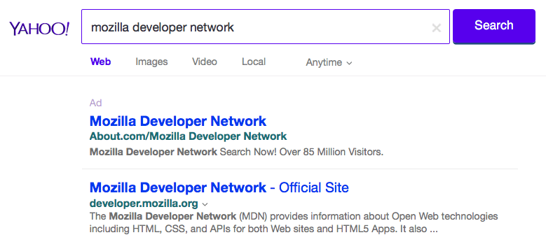

{{LearnSidebar}}{{PreviousMenuNext("Learn/HTML/Introduction_to_HTML/Getting_started", "Learn/HTML/Introduction_to_HTML/HTML_text_fundamentals", "Learn/HTML/Introduction_to_HTML")}}

O {{glossary("Head", "head")}} de um documento HTML é a parte que não é exibida no navegador da Web quando a página é carregada. Ele contém informações como {{glossary("title")}} , links para {{htmlelement("CSS")}} (se você deseja modelar seu conteúdo HTML com CSS), links para favicons personalizados e outros metadados (dados sobre o HTML, como quem o escreveu, e palavras-chave importantes que descrevem o documento.) Neste artigo, abordaremos todas as coisas acima e mais. Dando-lhe uma boa base para lidar com marcação.

<table class="learn-box standard-table">
  <tbody>
    <tr>
      <th scope="row">Pré-requisitos:</th>
      <td>
        <table>
          <tbody>
            <tr>
              <td>
                Familiaridade básica em HTML, tal como
                <a
                  href="/pt-BR/docs/Aprender/HTML/Introducao_ao_HTML/Getting_started"
                  >Iniciando com HTML.</a
                >
              </td>
            </tr>
          </tbody>
        </table>
      </td>
    </tr>
    <tr>
      <th scope="row">Objetivo:</th>
      <td>
        Aprender sobre o cabeçalho HTML, seu propósito, os itens mais
        importantes que ele pode conter e que efeito isso pode ter no documento
        HTML.
      </td>
    </tr>
  </tbody>
</table>

## O que há no cabeçalho HTML?

Vamos rever o simples [Documento HTML que abordamos no artigo anterior:](/pt-BR/docs/Aprender/HTML/Introducao_ao_HTML/Getting_started#Anatomia_de_um_elemento_HTML)

```html
<!doctype html>
<html>
  <head>
    <meta charset="utf-8" />
    <title>Minha página de teste</title>
  </head>
  <body>
    <p>Essa é minha página</p>
  </body>
</html>
```

O cabeçalho HTML é o conteúdo do elemento {{htmlelement("head")}} — ao contrário do conteúdo do elemento {{htmlelement("body")}} (que são exibidos na página quando carregados no navegador), o conteúdo do cabeçalho não é exibido na página, em vez disso, o trabalho do cabeçalho é conter {{glossary("Metadata", "metadados")}} sobre o documento. No exemplo seguinte, o cabeçalho é bem simples:

```html
<head>
  <meta charset="utf-8" />
  <title>Minha página de teste</title>
</head>
```

Em páginas maiores, o cabeçalho pode ter mais conteúdo. Tente acessar um dos seus sites favoritos e use as [ferramentas de desenvolvimento](/pt-BR/docs/Learn/Common_questions/ferramentas_de_desenvolvimento_do_navegador) para verificar o conteúdo do cabeçalho. Nosso objetivo aqui não é mostrar a você como usar tudo o que é possível pôr no cabeçalho, mas te ensinar a usar as coisas mais obvias que você vai querer incluir no cabeçalho, e lhe dar alguma familiaridade. Vamos começar.

## Adicionando um título

Nós já vimos o elemento {{htmlelement("title")}} em ação — ele pode ser usado para adicionar um título ao documento, mas pode ser confundido com o elemento {{htmlelement("h1")}}, que é usado para adicionar um título de nível superior ao conteúdo do body — as vezes também é associado como o título da página. Mas são coisas diferentes!

- O elemento {{htmlelement("h1")}} aparece na página quando é carregado no navegador — geralmente isso deve ser usado uma vez por página, para marcar o título do conteúdo da sua página, (o título da história, ou da notícia, ou o que quer que seja apropriado para o uso).
- O elemento {{htmlelement("title")}} é um metadado que representa o título de todo o document HTML (não o conteúdo do documento).

### Aprendizado ativo: observando um exemplo simples

1. Para começar esta aprendizagem ativa, gostaríamos que você fosse ao nosso depósito GitHub e baixasse uma cópia do nossa página [title-example.html](https://github.com/mdn/learning-area/blob/master/html/introduction-to-html/the-html-head/title-example.html). Para fazer isso:

   1. Copie e cole o código em um novo arquivo de texto no seu editor e salve-o com o nome de index.html em um lugar de fácil acesso.
   2. Pressione o botão "Raw" na página do GitHub, que faz com que o código bruto apareça (possivelmente em uma nova guia do navegador). Em seguida, escolha o menu _Arquivo do navegador> Salvar página como ..._ e escolha um local adequado para salvar o arquivo.

2. Agora abra o arquivo no seu navegador. Você deve ver algo assim:

   Agora deve ser completamente óbvio onde o conteúdo `<h1>` aparece e onde o conteúdo `<title>` aparece!

3. Você também deve tentar abrir o código no seu editor, editar o conteúdo desses elementos e atualizar a página no seu navegador. divirta-se.

O conteúdo do elemento `<title>` também é usado de outras maneiras. Por exemplo, se você tentar favoritar a página, (_Favoritos > Adicionar página aos favoritos_ ou o ícone da estrela na barra de URL no Fireofx), você verá o conteúdo `<title>` preenchido como o nome sugerido do favorito.


Os conteúdos `<title>` também são usados nos resultados de pesquisa, conforme você verá abaixo.

## Metadados: o elemento \<meta>

Metadados é dado descreve dados, e HTML possui uma maneira "oficial" de adicionar metadados a um documento — o elemento {{htmlelement("meta")}}. Claro, as outras coisas em que estamos falando neste artigo também podem ser pensadas como metadados. Existem muitos tipos diferentes de elementos `<meta>` que podem ser incluídos no \<head> da sua página, mas não tentaremos explicar todos eles nesta fase, pois seria muito confuso. Em vez disso, explicaremos algumas coisas que você pode ver comumente, apenas para lhe dar uma idéia.

### Especificando a codificação de caracteres do seu documento

No exemplo que vimos acima, esta linha foi incluída:

```html
<meta charset="utf-8" />
```

Este elemento simplesmente especifica a codificação de caracteres do documento — o conjunto de caracteres que o documento está autorizado a usar. `utf-8` é um conjunto de caracteres universal que inclui praticamente qualquer caractere de qualquer linguagem humana. Isso significa que sua página web poderá lidar com a exibição de qualquer idioma; portanto, é uma boa idéia configurar isso em todas as páginas web que você cria! Por exemplo, sua página poderia lidar com o Inglês e Japonês muito bem:

Se você definir sua codificação de caracteres para `ISO-8859-1`, por exemplo (o conjunto de caracteres para o alfabeto latino), a renderização de sua página ficaria toda bagunçada:


> **Nota:** Alguns navegadores (como o Chrome) corrigem automaticamente as codificações incorretas, então, dependendo do navegador que você usar, você pode não ver esse problema. Ainda assim, você deve definir uma codificação do `utf-8` em sua página, para evitar problemas em outros navegadores.

### Aprendizagem ativa: Experimento com a codificação de caracteres

Para experimentar isso, revise o modelo HTML simples que você obteve na seção anterior em `<title>` (a página [title-example.html](https://github.com/mdn/learning-area/blob/master/html/introduction-to-html/the-html-head/title-example.html)), tente alterar o valor do meta charset para `ISO-8859-1` e adicione o Japonês à sua página . Este é o código que usamos:

```html
<p>Exemplo Japonês:ご飯が熱い</p>
```

### Adicionando um autor e descrição

Muitos elementos `<meta>` incluem atributos de `name` e `content`:

- O `name` especifica o tipo de elemento meta que é; que tipo de informação contém.
- O `content` especifica o conteúdo real do meta.

Dois desses meta-elementos que são úteis para incluir na sua página definem o autor da página e fornecem uma descrição concisa da página. Vejamos um exemplo:

```html
<meta name="author" content="Chris Mills" />
<meta
  name="description"
  content="A Área de Aprendizagem do MDN tem como objetivo
proporcionar iniciantes em Web com tudo o que eles precisam saber
para começar a desenvolver sites e aplicativos." />
```

Especificar um autor é útil de muitas maneiras: é útil para poder descobrir quem escreveu a página, se quiser enviar perguntas sobre o conteúdo que você gostaria de contacta-la. Alguns sistemas de gerenciamento de conteúdo possuem ferramentas para extrair automaticamente as informações do autor da página e disponibilizá-las para seus propósitos.

Especificar uma descrição que inclua palavras-chave relacionadas ao conteúdo da sua página é útil porque tem potencial para tornar sua página mais alta nas pesquisas relevantes realizadas nos mecanismos de busca (tais atividades são denominadas [Search Engine Optimization](/pt-BR/docs/Glossario/SEO) ou {{glossary("SEO")}}.

### Aprendizagem ativa: Uso da descrição nos motores de busca

A descrição também é usada nas páginas de resultados do mecanismo de pesquisa. Vamos passar por um exercício para explorar isso

1. Vá para a [página inicial da Mozilla Developer Network.](/en-US/)
2. Veja a fonte da página (botão direito do mouse/

   <kbd>Ctrl</kbd>

   \+ clique na página, escolha _Ver código-fonte da página_ no menu de contexto).

3. Encontre a meta tag de descrição. Isso parecerá assim:

   ```html
   <meta
     name="description"
     content="A Mozilla Developer Network (MDN) fornece
   informações sobre tecnologias Open Web, incluindo HTML, CSS e API para ambos
   Sites e aplicativos HTML5. Ele também documenta produtos Mozilla, como o sistema operacional Firefox." />
   ```

4. Agora, procure por "Mozilla Developer Network" no seu motor de busca favorito (Utilizamos o Yahoo.) Você notará a descrição `<meta>` e `<title>` elemento usado no resultado da pesquisa — definitivamente vale a pena ter!

   

> **Nota:** No Google, você verá algumas subpáginas relevantes do MDN listadas abaixo do principal link da página inicial do MDN — estes são chamados de sitelinks e são configuráveis nas [Ferramentas para webmasters do Google](http://www.google.com/webmasters/tools/) — uma maneira de melhorar os resultados de pesquisa do seu site no mecanismo de pesquisa do Google.

> **Nota:** Muitos recursos `<meta>` simplesmente não são mais usados. Por exemplo, a palavra-chave `<meta>` elemento (`<meta name="keywords" content="preencha, suas, palavras-chave, aqui">`) — que é suposto fornecer palavras-chave para os motores de busca para determinar a relevância dessa página para diferentes termos de pesquisa — são ignorados pelos motores de busca, porque os spammers estavam apenas preenchendo a lista de palavras-chave com centenas de palavras-chave, influenciando os resultados.

### Outros tipos de metadados

Ao navegar pela web, você também encontrará outros tipos de metadados. Muitos dos recursos que você verá em sites são criações proprietárias, projetados para fornecer a determinados sites (como sites de redes sociais) informações específicas que eles podem usar.

Por exemplo, [Open Graph Data](http://ogp.me/) é um protocolo de metadados que o Facebook inventou para fornecer metadados mais ricos para sites. No código-fonte MDN, você encontrará isso:

```html
<meta
  property="og:image"
  content="https://developer.mozilla.org/mdn-social-share.png" />
<meta
  property="og:description"
  content="A Mozilla Developer Network (MDN) fornece
informações sobre tecnologias Open Web, incluindo HTML, CSS e APIs para ambos os sites da Web
e aplicativos HTML5. Ele também documenta produtos Mozilla, como o sistema operacional Firefox." />
<meta property="og:title" content="Mozilla Developer Network" />
```

Um efeito disso é que, quando você liga a MDN no facebook, o link aparece junto com uma imagem e descrição: uma experiência mais rica para usuários.

O Twitter também possui seus próprios metadados proprietários, o que tem um efeito semelhante quando o URL do site é exibido no twitter.com. Por exemplo:

```html
<meta name="twitter:title" content="Mozilla Developer Network" />
```

## Adicionando ícones personalizados ao seu site

Para enriquecer ainda mais o design do seu site, você pode adicionar referências a ícones personalizados em seus metadados, e estes serão exibidos em determinados contextos. O mais usado é o **favicon** (abreviação de "favorites icon", referindo-se ao seu uso nas listas "favoritos" nos navegadores).

O humilde favicon existe há muitos anos. É o primeiro ícone desse tipo: um ícone 16 pixels quadrados usado em vários lugares. Você pode ver (dependendo do navegador) ícones favoritos exibidos na guia do navegador que contém cada página aberta e ao lado de páginas marcadas no painel de favoritos.

Um favicon pode ser adicionado à sua página:

1. Salvando-o no mesmo diretório que a página de índice do site, salvo no formato `.ico` (a maioria dos navegadores suportará favicons em formatos mais comuns como `.gif` ou `.png`, mas usar o formato ICO irá garantir que ele funcione tão bem como o Internet Explorer 6 .)
2. Adicionando a seguinte linha ao HTML `<head>` para fazer referência a ele:

   ```html
   <link rel="shortcut icon" href="favicon.ico" type="image/x-icon" />
   ```

Aqui está um exemplo de um favicon em um painel de faforitos:


Há muitos outros tipos de ícones para considerar nestes dias também. Por exemplo, você encontrará isso no código-fonte da página inicial do MDN Web Docs:

```html
<!-- iPad de terceira geração com tela retina de alta resolução: -->
<link
  rel="apple-touch-icon-precomposed"
  sizes="144x144"
  href="https://developer.mozilla.org/static/img/favicon144.png" />
<!-- iPhone com tela retina de alta resolução: -->
<link
  rel="apple-touch-icon-precomposed"
  sizes="114x114"
  href="https://developer.mozilla.org/static/img/favicon114.png" />
<!-- iPad de primeira e segunda geração: -->
<link
  rel="apple-touch-icon-precomposed"
  sizes="72x72"
  href="https://developer.mozilla.org/static/img/favicon72.png" />
<!-- iPhone não-Retina, iPod Touch e dispositivos Android 2.1+: -->
<link
  rel="apple-touch-icon-precomposed"
  href="https://developer.mozilla.org/static/img/favicon57.png" />
<!-- favicon básico -->
<link
  rel="shortcut icon"
  href="https://developer.mozilla.org/static/img/favicon32.png" />
```

Os comentários explicam onde cada ícone é usado - esses elementos cobrem coisas como fornecer um ícone de alta resolução agradável para usar quando o site é salvo na tela inicial do iPad.

Não se preocupe muito com a implementação de todos esses tipos de ícone agora — este é um recurso bastante avançado, e você não precisará ter conhecimento disso para avançar no curso. O objetivo principal aqui é permitir que você saiba o que são essas coisas, no caso de você encontrá-las enquanto navega no código-fonte dos outros sites.

> **Nota:** Se o seu site usa uma Política de Segurança de Conteúdo (CSP) para aumentar sua segurança, a política se aplica ao favicon. Se você encontrar problemas com o favicon não carregando, verifique se a diretiva [`img-src`](/pt-BR/docs/Web/HTTP/Headers/Content-Security-Policy/img-src) do cabeçalho [`Content-Security-Policy`](/pt-BR/docs/Web/HTTP/Headers/Content-Security-Policy) não está impedindo o acesso a ele.

## Aplicando CSS e JavaScript ao HTML

Todos os sites que você usar nos dias atuais empregarão o {{glossary("CSS")}} para torná-los legais e o {{glossary("JavaScript")}} para ativar a funcionalidade interativa, como players de vídeo, mapas, jogos e muito mais. Estes são comumente aplicados a uma página web usando o elemento {{htmlelement("link")}} e o elemento {{htmlelement("script")}} , respectivamente.

- O elemento {{htmlelement("link")}} sempre vai no cabeçalho do seu documento. Isso requer dois atributos, rel = "stylesheet", que indica que é a folha de estilo do documento e href, que contém o caminho para o arquivo de folha de estilo:

  ```html
  <link rel="stylesheet" href="meu-arquivo-css.css" />
  ```

- O elemento {{htmlelement("script")}} não precisa ir no cabeçalho; na verdade, muitas vezes é melhor colocá-lo na parte inferior do corpo do documento (antes da tag `</body>` de fechamento), para garantir que todo o conteúdo HTML tenha sido lido pelo navegador antes de tentar aplicar o JavaScript nele (se o JavaScript tentar acessar um elemento que ainda não existe, o navegador gerará um erro.)

  ```html
  <script src="meu-arquivo-js.js"></script>
  ```

  > **Nota:** O elemento `<script>` pode parecer um elemento vazio, mas não é, e, portanto, precisa de uma tag de fechamento. Em vez de apontar para um arquivo de script externo, você também pode escolher colocar seu script dentro do elemento `<script>`.

### Aprendizagem ativa: aplicar CSS e JavaScript a uma página

1. Para iniciar esta aprendizagem ativa, pegue uma cópia dos nossos arquivos [meta-example.html](https://github.com/mdn/learning-area/blob/master/html/introduction-to-html/the-html-head/meta-example.html), [script.js](https://github.com/mdn/learning-area/blob/master/html/introduction-to-html/the-html-head/script.js) e [style.css](https://github.com/mdn/learning-area/blob/master/html/introduction-to-html/the-html-head/style.css) e salve-os em seu computador local no mesmo diretório. Verifique se eles são salvos com os nomes e extensões de arquivo corretos.
2. Abra o arquivo HTML em seu navegador e seu editor de texto.
3. Ao seguir as informações fornecidas acima, adicione os elementos {{htmlelement("link")}} e {{htmlelement("script")}} ao seu HTML, para que seu CSS e JavaScript sejam aplicados ao seu HTML.

Se for feito corretamente, quando você salvar seu HTML e atualizar seu navegador, verá que as coisas mudaram:


- O JavaScript adicionou uma lista vazia à página. Agora, quando você clica em qualquer lugar da lista, uma caixa de diálogo aparecerá pedindo para que você, insira algum texto para um novo item de lista. Quando você pressiona o botão OK, um novo item será adicionado à lista contendo o texto. Quando você clica em um item de lista existente, uma caixa de diálogo será exibida permitindo que você altere o texto do item.
- O CSS fez com que o plano de fundo ficasse verde e o texto se tornasse maior. Ele também estilizou parte do conteúdo que o JavaScript adicionou à página (a barra vermelha com a borda preta é o estilo que o CSS adicionou à lista gerada por JS).

> **Nota:** Se você ficar preso neste exercício e não conseguir aplicar o CSS/JS, tente verificar nossa página de exemplo [css-and-js.html](https://github.com/mdn/learning-area/blob/master/html/introduction-to-html/the-html-head/css-and-js.html).

## Definir o idioma principal do documento

Finalmente, vale a pena mencionar que você pode (e realmente deveria) definir o idioma da sua página. Isso pode ser feito adicionando o [atributo lang](/pt-BR/docs/Web/HTML/Global_attributes/lang) à tag HTML de abertura (como visto no [meta-example.html](https://github.com/mdn/learning-area/blob/master/html/introduction-to-html/the-html-head/meta-example.html) e mostrado abaixo).

```html
<html lang="pt-BR"></html>
```

Isso é útil de várias maneiras. O seu documento HTML será indexado de forma mais eficaz pelos motores de busca se o seu idioma for definido (permitindo que ele apareça corretamente em resultados específicos do idioma, por exemplo), e é útil para pessoas com deficiências visuais usando leitores de tela (por exemplo, a palavra "seis" existe em Francês e Inglês, mas é pronunciado de forma diferente.)

Você também pode definir seções secundárias do seu documento para serem reconhecidas em diferentes idiomas. Por exemplo, podemos configurar nossa seção do idioma Japonês para ser reconhecida como japonesa, assim:

```html
<p>Exemplo japonês: <span lang="jp">ご飯が熱い。</span>.</p>
```

Esses códigos são definidos pelo padrão [ISO 639](https://pt.wikipedia.org/wiki/ISO_639). Você pode encontrar mais sobre eles em [Tags de idioma em HTML e XML](https://www.w3.org/International/articles/language-tags/).

## Resumo

Isso marca o fim de nossa rápida turnê pelo HTML — há muito mais que você pode fazer aqui, mas uma excursão exaustiva seria chata e confusa nesta fase, e nós só queríamos dar uma idéia das coisas mais comuns você encontrará lá, por enquanto! No próximo artigo, veremos o básico do texto HTML.

{{PreviousMenuNext("Learn/HTML/Introduction_to_HTML/Getting_started", "Learn/HTML/Introduction_to_HTML/HTML_text_fundamentals", "Learn/HTML/Introduction_to_HTML")}}
