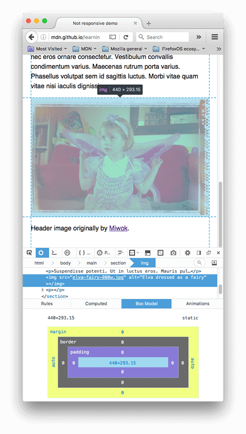
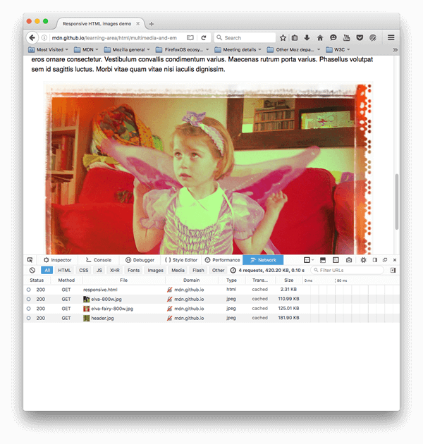

{{LearnSidebar}}{{PreviousMenuNext("Learn/HTML/Multimedia_and_embedding/Adding_vector_graphics_to_the_Web", "Learn/HTML/Multimedia_and_embedding/Mozilla_splash_page", "Learn/HTML/Multimedia_and_embedding")}}

Neste artigo nós iremos aprender sobre o conceito de imagens responsivas —imagens que funcionam em dispositivos com diferentes tamanhos de tela, resoluções e outras funcionalidades— e entrar em contato com quais ferramentas o HTML oferece para ajudar a implementá-las. Imagens responsivas são apenas uma parte do web design responsivo, um futuro [tópico de CSS](/pt-BR/docs/Learn/CSS) para você aprender.

| Pré-requisitos: | Você deve ter visto a [introdução ao HTML](/pt-BR/docs/Learn/HTML/Introduction_to_HTML) e como [adicionar imagens estáticas numa página web](/pt-BR/docs/Learn/HTML/Multimedia_and_embedding/Images_in_HTML). |
| --------------- | ------------------------------------------------------------------------------------------------------------------------------------------------------------------------------------------------------------- |
| Objetivo:       | Aprender como usar funcionalidades como [`srcset`](/pt-BR/docs/Web/HTML/Element/img#srcset) e o elemento {{htmlelement("picture")}} para implementar soluções de imagens responsivas em websites.             |

## Por que imagens responsivas?

Então qual o problema nós estamos tentando resolver com imagens responsivas? Vamos examinar um cenário típico. Um típico website provavelmente tem uma imagem de cabeçalho, para ter uma boa aparência para os visitantes, e talvez mais algumas imagens no conteúdo abaixo. Você provavelmente quer fazer uma imagem do cabeçalho em toda a largura do cabeçalho, e o as imagens no conteúdo caiba dentro de alguma coluna. Vamos dar uma olhada em um exemplo simples disso:


Isto funciona bem em um dispositivo de tela grande, como um laptop ou desktop (você pode [ver o exemplo ao vivo](http://mdn.github.io/learning-area/html/multimedia-and-embedding/responsive-images/not-responsive.html) e encontrar o [código-fonte](https://github.com/mdn/learning-area/blob/master/html/multimedia-and-embedding/responsive-images/not-responsive.html) no Github.) Nós não vamos discutir muito o CSS, exceto para dizer que:

- O conteúdo do \<body> foi colocado para o máximo de 1200 pixels de largura (width) —em viewports acima, o body continua a 1200 pixels e centrado no espaço disponível. Em viewports abaixo, o body vai usar 100% da largura disponível.
- A imagem de cabeçalho foi colocada para estar sempre no centro, não importando a largura do título. Então, se a página está sendo vista em uma tela mais estreita, o detalhe importante no centro da imagem (as pessoas) continuam sendo visto, e o excesso é perdido nos lados. E tem 200 pixels de altura.
- As imagens do conteúdo foram configuradas para caso o elemento body se torne menor que as imagens, então elas começam a diminuir. Assim sempre estarão dentro do body, mesmo que ultrapassando ele.

Isto está bom, mas o problema vem quando você começa a ver a página em uma tela estreita - o cabeçalho parece bom, mas está começando a pegar um tamanho grande para um dispositivo móvel; A primeira imagem do conteúdo por outro lado parece terrível - neste tamanho você mal consegue ver as pessoas nela.


Seria muito melhor mostrar uma versão cortada da imagem que contenha os detalhes importantes quando a página é vista em uma tela estreita, e talvez algo entre as duas para uma tela de largura média como um tablet - isto é comumente conhecido como o **problema de direção artística**.

Ainda, não é preciso embutir estas imagens grandes em páginas se será visto em pequenas telas de celulares; isto é chamado de problema de mudança de resolução - uma imagem rasterizada é um número de pixels de largura e um número de pixels de altura; como nós vimos quando olhamos para [vetores gráficos](/pt-BR/docs/Learn/HTML/Multimedia_and_embedding/Adding_vector_graphics_to_the_Web), uma imagem rasterizada começa a parecer granulada e horrível se é mostrada maior que seu tamanho original (enquanto que um vetor não). E se isto é mostrado muito menor que seu tamanho original, é um desperdício de largura de banda - usuários mobile especialmente não querem ter que gastar seu pacote de dados baixando uma imagem grande feita para desktop, quando uma imagem pequena poderia ser feita para seu dispositivo. Uma situação ideal seria ter múltiplas resoluções disponíveis e apresentar tamanhos apropriados dependendo dos diferentes dispositivos que acessam a página.

Para tornar as coisas mais complicadas, alguns dispositivos tem uma alta resolução, que demanda imagens maiores do que as que você espera para ficar bom. Isto é essencialmente o mesmo problema, mas em um contexto diferente.

Você pode pensar que imagens vetorizadas resolveria estes problemas, e elas resolvem em certo grau - elas têm um tamanho pequeno e se adaptam bem, e você deveria usá-las sempre que possível. Mas elas não são possíveis para todos os tipos de imagem - enquanto elas são ótimas para gráficos simples, padrões, elementos de interface, etc., começa a ficar complexo criar uma imagem baseada em vetor com o tipo de detalhe que você encontraria em uma foto, por exemplo. Formatos de imagens rasterizadas, como JPEGs, são melhores para este tipo como nós vemos no exemplo acima.

Este tipo de problema não existe quando a web começou a existir, no começo dos anos 1990 - naquele tempo somente desktops e laptops navegavam a Web, então engenheiros de navegadores e programadores nem pensavam em implementar soluções. _Tecnologias de imagens responsivas_ foram implementadas recentemente para resolver os problemas indicados acima, permitindo a você oferecer ao navegador vários arquivos de imagens, todas mostrando a mesma coisa mas contendo diferente número de pixels (mudança de resolução), ou diferentes imagens para diferente espaços de alocação (direção de arte).

> **Nota:** As novas funcionalidades discutidas neste artigo — [`srcset`](/pt-BR/docs/Web/HTML/Element/img#srcset)/[`sizes`](/pt-BR/docs/Web/HTML/Element/img#sizes)/{{htmlelement("picture")}} — são todas suportadas nas versões atuais de navegadores mobile e desktop (incluindo Microsoft Edge, embora não suportada pelo Internet Explorer).

## Como você faz para criar imagens responsivas?

Nesta seção, nós iremos ver os dois problemas ilustrados acima e mostrar como resolvê-los usando fucionalidades de imagens responsivas do HTML. Você deve notar que nós iremos focar no elemento HTML {{htmlelement("img")}} para esta seção, como visto na área de conteúdo do exemplo acima - a imagem no cabeçalho da página é somente para decoração, e assim implementada usando imagens de background CSS. [CSS indiscutivelmente tem ferramentas melhores para design responsivo](http://blog.cloudfour.com/responsive-images-101-part-8-css-images/) do que HTML, e nós iremos falar sobre estas ferramentas em um módulo futuro de CSS.

### Mudança de resolução: Diferentes tamanhos

Então, qual é o problema que nós queremos resolver com mudança de resolução? Nós queremos mostrar identico conteúdo da imagem, somente maior ou menor dependendo do dispositivo - esta é a situação que nós temos com a segunda imagem do conteúdo em nosso exemplo. O padrão do elemento {{htmlelement("img")}} tradicionalmente somente permite apontar o navegador para uma única fonte:

```html

```

Nós podemos, entretanto, usar dois novos atributos — [`srcset`](/pt-BR/docs/Web/HTML/Element/img#srcset) e [`sizes`](/pt-BR/docs/Web/HTML/Element/img#sizes) —para fornecer várias fontes adicionais juntamente com sugestões para ajudar o navegador a pegar a correta. Você pode ver um exemplo disso no nosso exemplo [responsive.html](http://mdn.github.io/learning-area/html/multimedia-and-embedding/responsive-images/responsive.html) no Github (ver também [o código fonte](https://github.com/mdn/learning-area/blob/master/html/multimedia-and-embedding/responsive-images/responsive.html)):

```html

```

Os atributos `srcset` e `sizes` parecem complicados, mas não são difíceis de entender se você formata eles como mostrado acima, com uma parte diferente do valor do atributo para cada linha. Cada valor contém uma lista separada por vírgula, e cada parte da lista é dividida em três sub-partes. Vamos percorrer o conteúdo de cada agora:

**`srcset`** define o conjunto de imagens que nós iremos permitir ao navegador escolher, e qual tamanho cada imagem tem. Antes de cada vírgula nós escrevemos:

1. Um **nome do arquivo da imagem** (`elva-fairy-480w.jpg`).
2. Um espaço.
3. A **largura da imagem em pixels** (`480w`) — note que é usada a unidade `w`, e não `px` como você pode esperar. Este é o tamanho real da imagem, que pode ser encontrado no arquivo dela no seu computador (por exemplo no Mac você pode selecionar a imagem no Finder, e pressionar

   <kbd>Cmd</kbd>

   \+

   <kbd>I</kbd>

   para mostrar as informações na tela).

**`sizes`** define um conjunto de condições de mídia (ex.: largura da tela) e indica qual tamanho da imagem deveria ser a melhor escolha, quando certas condições de tela são verdadeiras - Estas são as sugestões que nós falamos antes. Neste caso, antes de cada vírgula nós escrevemos:

1. Uma **condição de mídia** (`(max-width:480px)`) — Você vai aprender mais sobre isso no [tema CSS](/pt-BR/docs/Learn/CSS), mas para agora vamos somente dizer que a condição de mídia descreve um possível estado em que a tela pode estar. Neste caso, nós estamos dizendo "quando a largura da tela é 480px ou menos".
2. Um espaço.
3. A **largura do slot** que a imagem irá preencher quando a condição de mídia for verdadeira (`440px`).

> **Nota:** Para a largura do slot, você pode fornecer um tamanho absoluto (`px`, `em`) ou um tamanho relativo (como porcentagem). Você pode ter notado que o último slot de largura não tem condição de mídia - isto é o padrão que será escolhido quando nenhuma condição for verdadeira. O navegador ignora tudo depois da primeira condição satisfeita, então tenha cuidado com a ordem de condições.

Então, com estes atributos no lugar, o navegador irá:

1. Ver a largura do dispositivo.
2. Ver qual condição de mídia na lista `sizes` é a primeira a ser verdadeira.
3. Ver qual é o slot para aquela condição de mída.
4. Carregar a imagem definida na lista `srcset` que possui o mesmo tamanho do slot ou, se não houver, da primeira imagem que é maior que o tamanho do slot escolhido.

E é isto! Então neste ponto, se um navegador suportado com uma largurar de 480px carregar a página, a condição (`max-width: 480px`) será verdadeira, então o slot `440px` será escolhido, então o `elva-fairy-480w.jpg` será carregada, como a largura inerente (`480w`) é a mais próxima de `440px`. A imagem de 800px é 128KB no disco enquanto que a versão de 480px é somente 63KB - economizando 65KB. Agora imagine se fosse uma página que tivesse várias imagens. Usando esta técnica poderia economizar os dados de usuários de celular.

Navegadores antigos que não suportam estas funcionalidades serão ignorados, seguiremos e carregaremos a imagem definida no atributo [`src`](/pt-BR/docs/Web/HTML/Element/img#src) como normal.

> **Nota:** No {{htmlelement("head")}} do documento você encontrará a linha `<meta name="viewport" content="width=device-width">`: isto força navegadores de celular adotar a largura real para carregar páginas web (alguns navegadores mobile mentem sobre sua largura da janela, e em vez carregam páginas em uma largura grante e então encolhem a página carregada, o que é de muita ajuda para imagens e design responsivos. Nós iremos ensinar mais sobre isso em um módulo futuro).

### Ferramentas de desenvolvimento úteis

Há algumas [ferramenta de desenvolvimento](/pt-BR/docs/Learn/Common_questions/What_are_browser_developer_tools) úteis em navegadores para ajudar a exercitar o necessário para slot de largura, etc, que você precisa usar. Quando eu estava trabalhando neles, eu primeiro carreguei a versão não responsiva do meu exemplo (`not-responsive.html`), então fui no [Modo de Design Responsivo](/pt-BR/docs/Tools/Responsive_Design_Mode) (Ferramentas >Desenvolvimento Web > Modo de Design Responsivo), que permite a você ver o layout da sua página como se ele estivesse visto através de uma variedade de diferentes tamanhos de telas.

Eu configurei a largura da janela para 320px e depois 480px; para cada uma eu fui no [DOM Inspector](/pt-BR/docs/Tools/Page_Inspector), cliquei no elemento {{htmlelement("img")}} no qual nós estamos interessados, então olhei o tamanho na aba Box Model view no lado direito da tela. Isto deve dar para você a dica da largura de imagem que você precisa.



Próximo, você pode checar se o `srcset` está funcionando configurando a largura da janela para a qual você quiser (coloque para uma largura estreita, por exemplo), abrindo o Network Inspector (Ferramentas > Web Developer > Network), então recarregue a página. Isto deve dar a você uma lista do que foi carregado na página, e aqui você pode checar qual arquivo da imagem foi escolhida para baixar.

> **Nota:**Use o Mozilla Firefox para testar `srcset`. O Chrome carrega a melhor imagem se estiver em cache no navegador, anulando o propósito do teste na ferramenta de desenvolvimento.



### Mudança de Resolução: Mesmo tamanho, diferente resoluções

Se você está dando suporte a múltiplas resoluções de vídeo, mas todas veem sua imagem no tamanho real na tela, você pode permitir ao navegador escolher uma resolução apropriada para a imagem usando `srcset` com x indentificadores e sem `sizes` - uma sintaxe um pouco mais fácil! Você pode encontrar um exemplo de como isto parece em [srcset-resolutions.html](http://mdn.github.io/learning-area/html/multimedia-and-embedding/responsive-images/srcset-resolutions.html) (ver também [o código fonte](https://github.com/mdn/learning-area/blob/master/html/multimedia-and-embedding/responsive-images/srcset-resolutions.html)):

```html

```

Neste exemplo, o seguinte CSS é aplicado na imagem, então ela terá uma largura de 320 pixels na tela (também chamado pixels CSS):

```css
img {
  width: 320px;
}
```

Neste caso, `sizes` não é preciso - o navegador simplesmente encontra qual resolução é a que será mostrada, e fornece a mais apropriada definida no `srcset`. Então se o dispositivo que acessa a página tem um padrão de baixa resolução, com um pixel do dispositivo representando cada pixel CSS, a imagem `elva-fairy-320w.jpg` será carregada (o 1x é implícito, então você não precisa incluí-lo). Se o dispositivo tem uma alta resolução de dois pixels do dispositivo para pixel CSS ou mais, a imagem `elva-fairy-640w.jpg` será carregada. A imagem 640px é 93KB, enquanto a 320px é somente 39KB.

### Direção de Arte

Recapitulando, o problema de direção de arte involve querer mudar a imagem mostrada para se adequar a diferentes tamanhos de tela. Por exemplo, se uma foto de um grande panorama com uma pessoa no centro é mostrada em uma página quando visualizada em um navegador de desktop, então é encolhido quando a página é vista em um navegador de celular, ficará ruim pois a pessoa no centro aparecerá bem pequena e difícil de ver. Provavelmente seria melhor mostrar uma imagem menor e em formato retrato (em pé) no celular, que mostrará a pessoa ampliada. O elemento {{htmlelement("picture")}} permite a nós implementar justamente este tipo de solução.

Voltando para o nosso exemplo [not-responsive.html](http://mdn.github.io/learning-area/html/multimedia-and-embedding/responsive-images/not-responsive.html), nós temos uma imagem que precisa de uma direção de arte:

```html

```

Vamos consertar isso, com {{htmlelement("picture")}}! Como [`<video>` e `<audio>`](/pt-BR/docs/Learn/HTML/Multimedia_and_embedding/Video_and_audio_content), O elemento `<picture>` é um invólucro contendo muitos elementos {{htmlelement("source")}} que fornecem muitas fontes diferentes para o navegador escolher, seguido pelo elemento mais importante {{htmlelement("img")}}. O código em [responsive.html](http://mdn.github.io/learning-area/html/multimedia-and-embedding/responsive-images/responsive.html) ficará assim então:

```html
<picture>
  <source media="(max-width: 799px)" srcset="elva-480w-close-portrait.jpg" />
  <source media="(min-width: 800px)" srcset="elva-800w.jpg" />
  
</picture>
```

- Os elementos `<source>` inclui um atributo `media` que contem uma condição de mídia - como no nosso primeiro exemplo `srcset`, estas condições são testadas para qual imagem será mostrada no dispositivo - a primeira que retornar um valor verdadeiro, será escolhida. Neste caso, se a largura da janela é 799px ou menor, a primeira imagem do elemento `<source>` será mostrada. Se a largura da janela é 800px ou maior, será escolhida a segunda.
- Os atributos `srcset` contem o caminho para a imagem que será apresentada. Note que como acabamos de ver acima com ``, `<source>` pode pegar um atributo srcsetcom múltiplas imagens referenciadas, e um atributo sizes também. Então você pode oferecer múltiplas imagens via um elemento `<picture>`, mas também oferecer múltiplas resoluções para cada uma. Na prática, você provavelmente não vai querer fazer isso com frequência.
- Em todos os casos, você deve fornecer um elemento ``, com `src` e `alt`, logo antes do `</picture>`, de outra forma não aparecerá imagens. Assim um padrão será aplicado quando nenhuma condição for atendida (você pode remover o segundo elemento `<source>` neste exemplo), e verificar navegadores que não suportam o elemento `<picture>`.

Este código nos permite mostrar uma imagem adequada em ambas extensas e estreitas telas, como podemos ver abaixo:


> **Nota:** Nota: Você deveria usar o atributo `media` somente em cenários de direção de arte; quando você usa `media`, não oferecendo também condições com o atributo `sizes`.

### Por que não podemos só fazer isso usando CSS ou JavaScript?

Quando o navegador começa a carregar a página, inicia o download de todas as imagens antes do analisador principal ter começado a carregar e interpretar o JavaScript e o CSS da página. Isto é uma técnica útil, a qual diminui o tempo de carregamento médio em 20%. Entretanto, isto não é útil para imagens responsivas, então é necessário implementar soluções como srcset. Você não pode, por exemplo, carregar o elemento {{htmlelement("img")}}, então detectar a largura da janela com JavaScript e mudar dinamicamente o arquivo da imagem para um menor, caso deseje. Até lá, a imagem original deveria já ter sido carregada, e você iria carregar uma menor, o que é ainda pior em termos de imagens responsivas.

### Use bastante formatos de imagens modernos

Há vários novos e excitantes formatos de imagens (como WebP e JPEG-2000) que podem manter baixo tamanho de arquivo e alta qualidade ao mesmo tempo. Entretanto, o suporte do navegador é menor.

`<picture>` permite-nos continuar dando suporte para navegadores antigos. Você pode suprir tipos MIME dentro de atributos `type`, então o navegador pode rejeitar imediatamente arquivos não suportados:

```html
<picture>
  <source type="image/svg+xml" srcset="pyramid.svg" />
  <source type="image/webp" srcset="pyramid.webp" />
  
</picture>
```

- _Não_ use o atributo `media`, a menos que você também precise de direção de arte.
- No elemento `<source>`, você só pode referenciar imagens de tipos declarados em `type`.
- Como antes, você é encorajado a usar uma lista separada por vírgula com `srcset` e `sizes`, caso precise.

## Aprendizado ativo: Implementando suas próprias imagens responsivas

Para esse exercício, nós estamos esperando que você seja corajoso e vá sozinho.. principalmente. Nós queremos que você implemente sua própria adequada direção de arte em tela estreita/ampla usando `<picture>`, e um exemplo de mudança de resolução que use `srcset`.

1. Escreva um simples HTML contendo seu código (use `not-responsive.html` como um ponto de partida, se quiser)
2. Encontre uma boa imagem ampla de um panorama com algum detalhe contido em alguma parte. Crie uma versão de tamanho web usando um editor de imagem, então coloque para mostrar uma pequena parte que amplia o detalhe, e salve em uma segunda imagem (algo como 480px está bom).
3. Use o elemento `<picture>` para implementar uma mudança de imagem!
4. Crie múltiplos arquivos de imagem de diferentes tamanhos, cada um mostrando a mesma imagem.
5. Use `srcset`/`size` para criar um exemplo de mudança de resolução, que sirva para os mesmos tamanhos de imagens em diferentes resoluções, ou diferentes tamanhos de imagens em cada largura de janela.

> **Nota:**Use a ferramenta de desenvolvimento do navegador para ajudar a ver os tamanhos que você precisa, como mencionado acima.

## Sumário

Isto é um geral sobre imagens responsivas - nós esperamos que você tenha aproveitado estas novas técnicas. Recapitulando, há dois problemas que nós discutimos aqui:

- **Direção de Arte:** O problema consiste em apresentar imagens cortadas para diferentes layouts - por exemplo, uma imagem panorâmica mostrada completa em um layout desktop, e uma imagem retrato mostrando o objeto principal ampliado em um layout mobile. Isto pode ser resolvido usando o elemento {{htmlelement("picture")}}.
- **Mudança de resolução:** O problema é apresentar arquivos menores de imagens para dispositivos estreitos, porque eles não precisam de imagens gigantes como em computadores - e também, opcionalmente, que você quer apresentar imagens de diferentes resoluções para alta e baixa densidades de tela. Isto pode resolver usando [vector graphics](/pt-BR/docs/Learn/HTML/Multimedia_and_embedding/Adding_vector_graphics_to_the_Web) (imagens SVG), e os atributos [`srcset`](/pt-BR/docs/Web/HTML/Element/img#srcset) e [`sizes`](/pt-BR/docs/Web/HTML/Element/img#sizes).

Isto também encerra o módulo [Multimedia and embedding](/pt-BR/docs/Learn/HTML/Multimedia_and_embedding)! A única coisa para fazer agora é seguir e tentar nosso teste de multimídia, e ver como você está. Se divirta.

## Veja também

- [Jason Grigsby's excelente introdução a imagens responsivas](http://blog.cloudfour.com/responsive-images-101-definitions)
- [Imagens respondivas: Se você está mudando de resolução, use srcset](https://css-tricks.com/responsive-images-youre-just-changing-resolutions-use-srcset/) — Inclui mais explicação sobre como o navegador resolve qual imagem usar
- {{htmlelement("img")}}
- {{htmlelement("picture")}}
- {{htmlelement("source")}}

{{PreviousMenuNext("Learn/HTML/Multimedia_and_embedding/Adding_vector_graphics_to_the_Web", "Learn/HTML/Multimedia_and_embedding/Mozilla_splash_page", "Learn/HTML/Multimedia_and_embedding")}}
