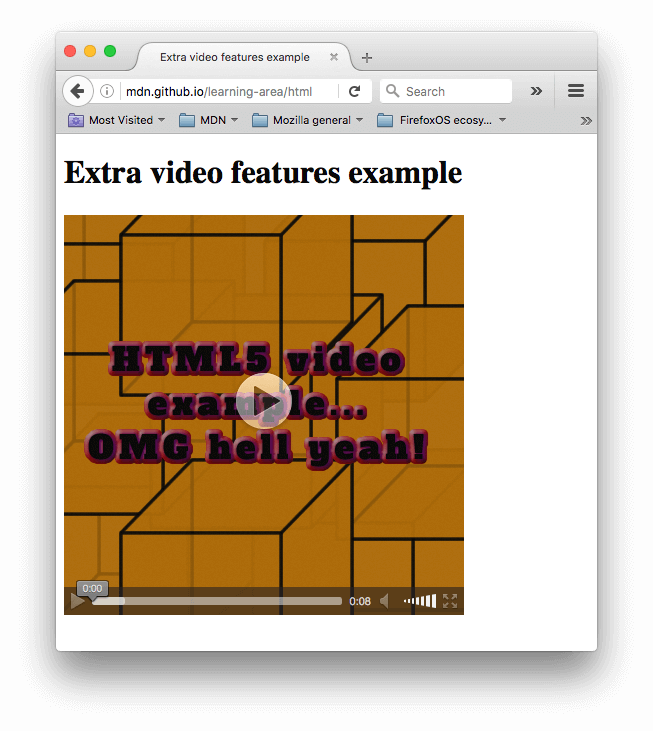

{{LearnSidebar}}{{PreviousMenuNext("Learn/HTML/Multimedia_and_embedding/Images_in_HTML", "Learn/HTML/Multimedia_and_embedding/Other_embedding_technologies", "Learn/HTML/Multimedia_and_embedding")}}

Agora que estamos à vontade para adicionar imagens simples a uma página da Web, o próximo passo é começar a adicionar players de vídeo e áudio aos seus documentos HTML! Neste artigo vamos olhar para fazer exatamente isso com os elementos {{htmlelement("video")}} e {{htmlelement("audio")}} ; Então, vamos terminar de olhar como adicionar legendas/subtítulos aos seus vídeos.

<table class="learn-box standard-table">
  <tbody>
    <tr>
      <th scope="row">Pré-requisitos:</th>
      <td>
        Alfabetização básica em informática,
        <a
          href="/pt-BR/docs/Aprender/Getting_started_with_the_web/instalando_programas_basicos"
          >software básico instalado</a
        >,
        conhecimento básico de
            <a
              href="/pt-BR/docs/Aprender/Getting_started_with_the_web/lidando_com_arquivos"
              >trabalhar com arquivos</a
            >
        ,
        familiaridade com os fundamentos HTML</span></span
        >
        (Como coberto em
            <a
              href="/pt-BR/docs/Aprender/HTML/Introducao_ao_HTML/Getting_started"
              >Introdução ao HTML</a
            >) e
        <a href="/pt-BR/docs/Learn/HTML/Multimedia_and_embedding/Images_in_HTML"
          >Images in HTML</a
        >.
      </td>
    </tr>
    <tr>
      <th scope="row">Objetivo:</th>
      <td>
        Para aprender a incorporar conteúdo de vídeo e áudio em uma página
            da Web e adicionar legendas/subtítulos ao vídeo.
      </td>
    </tr>
  </tbody>
</table>

## Audio e video na web

Os desenvolvedores da Web quiseram usar vídeo e áudio na Web por um longo tempo, desde o início dos anos 2000, quando começamos a ter largura de banda rápida o suficiente para suportar qualquer tipo de vídeo ( Os arquivos de vídeo são muito maiores que o texto ou mesmo imagens.). Nos primeiros dias, as tecnologias web nativas, como o HTML, não tinham a capacidade de incorporar vídeo e áudio na Web, de modo que as tecnologias proprietárias (ou baseado em plugin) como o [Flash](https://pt.wikipedia.org/wiki/Adobe_Flash) (e depois, [Silverlight](https://pt.wikipedia.org/wiki/Silverlight)) tornaram-se populares para lidar com esse conteúdo . Esse tipo de tecnologia funcionou bem, mas teve vários problemas, incluindo não funcionar bem com recursos HTML/CSS, problemas de segurança e problemas de acessibilidade.

Uma solução nativa resolveria muito disso, se bem feita. Felizmente, alguns anos depois, o {{glossary("HTML5")}} especificação tinha tais recursos adicionados, com o {{htmlelement("video")}} e{{htmlelement("audio")}} elementos, e alguns novos brilhantes {{Glossary("JavaScript")}} {{Glossary("API","APIs")}} por controlá-los. Não veremos o JavaScript aqui - apenas os fundamentos básicos que podem ser alcançados com o HTML.

Não ensinaremos como produzir arquivos de áudio e vídeo - isso requer um conjunto de habilidades completamente diferente. Nós fornecemos a você [amostras de arquivos de áudio e vídeo e exemplos de códigos](https://github.com/mdn/learning-area/tree/master/html/multimedia-and-embedding/video-and-audio-content) para sua própria experimentação, caso você não consiga se apossar.

> **Nota:** Antes de começar aqui, você também deve saber que existem algumas {{glossary("OVP","OVPs")}} (fornecedores de vídeo online) como [YouTube](https://www.youtube.com/), [Dailymotion](http://www.dailymotion.com), e [Vimeo](https://vimeo.com/), e provedores de áudio on-line como [Soundcloud](https://soundcloud.com/). Essas empresas oferecem uma maneira conveniente e fácil de hospedar e consumir vídeos, para que você não precise se preocupar com o enorme consumo de largura de banda. Os OVPs geralmente oferecem código pronto para incorporar vídeo / áudio em suas páginas da web. Se você seguir esse caminho, poderá evitar algumas das dificuldades que discutimos neste artigo. Discutiremos esse tipo de serviço um pouco mais no próximo artigo.

### O elemento \<video>

O elemento {{htmlelement("video")}} permite incorporar um vídeo com muita facilidade. Um exemplo realmente simples é assim:

```html
<video src="rabbit320.webm" controls>
  <p>
    Your browser doesn't support HTML5 video. Here is a
    <a href="rabbit320.webm">link to the video</a> instead.
  </p>
</video>
```

Os recursos da nota são:

- [`src`](/pt-BR/docs/Web/HTML/Element/video#src)
  - : Da mesma maneira que para o elemento {{htmlelement("img")}}, O atributo `src` contém um caminho para o vídeo que você deseja incorporar. Funciona exatamente da mesma maneira.
- [`controls`](/pt-BR/docs/Web/HTML/Element/video#controls)
  - : Os usuários devem poder controlar a reprodução de vídeo e áudio (isso é especialmente crítico para pessoas que possuem [epilepsy](https://pt.wikipedia.org/wiki/Epilepsia).) Você deve usar o atributo `controls` para incluir a própria interface de controle do navegador ou criar sua interface usando o apropriado [JavaScript API](/pt-BR/docs/Web/API/HTMLMediaElement). No mínimo, a interface deve incluir uma maneira de iniciar e parar a mídia e ajustar o volume.
- O parágrafo dentro do `<video>` tags
  - : Isso é chamado de **conteúdo alternativo** - será exibido se o navegador que acessa a página não suportar o elemento `<video>`, permitindo fornecer um substituto para navegadores mais antigos. Isso pode ser o que você quiser; nesse caso, fornecemos um link direto para o arquivo de vídeo, para que o usuário possa acessá-lo de alguma forma, independentemente do navegador que estiver usando.

O vídeo incorporado será mais ou menos assim:


Você pode tentar o [exemplo ao vivo](https://mdn.github.io/learning-area/html/multimedia-and-embedding/video-and-audio-content/simple-video.html) aqui (veja também o [código fonte](https://github.com/mdn/learning-area/blob/master/html/multimedia-and-embedding/video-and-audio-content/simple-video.html).)

### Usando vários formatos de origem para melhorar a compatibilidade

Há um problema no exemplo acima, que você já deve ter notado se você tentou acessar o link do video acima em navegadores mais antigos como Internet Explorer ou até mesmo uma versão antiga do Safari. O vídeo não será reproduzido, porque navegadores diferentes suportam diferentes formatos de vídeo (e áudio). Felizmente, existem coisas que você pode fazer para ajudar a evitar que isso seja um problema.

#### Conteúdo de um arquivo de mídia

Primeiro, vamos analisar a terminologia rapidamente. Formatos como MP3, MP4 e WebM são chamados de [arquivos recipiente](https://pt.wikipedia.org/wiki/Arquivo_recipiente) (formatos de contêiner). Eles definem uma estrutura na qual cada faixa de áudio e / ou vídeo que compõe a mídia é armazenada, juntamente com os metadados que descrevem a mídia, quais codecs são usados para codificar seus canais e assim por diante.

As faixas de áudio e vídeo também estão em diferentes formatos, por exemplo:

- Um contêiner WebM geralmente empacota o áudio do Ogg Vorbis com vídeo VP8 / VP9. Isso é suportado principalmente no Firefox e Chrome.
- Um contêiner MP4 geralmente empacota áudio AAC ou MP3 com vídeo H.264. Isso é suportado principalmente no Internet Explorer e Safari.
- O contêiner Ogg mais antigo tende a usar o áudio Ogg Vorbis e o vídeo Ogg Theora. Isso foi suportado principalmente no Firefox e Chrome, mas foi basicamente substituído pelo formato WebM de melhor qualidade.

Existem alguns casos especiais. Por exemplo, para alguns tipos de áudio, os dados de um codec geralmente são armazenados sem um contêiner ou com um contêiner simplificado. Uma dessas instâncias é o codec FLAC, que é armazenado com mais frequência em arquivos FLAC, que são apenas faixas FLAC brutas.

Outra situação é o sempre popular arquivo MP3. Um "arquivo MP3" é na verdade uma faixa de áudio MPEG-1 Audio Layer III (MP3) armazenada em um contêiner MPEG ou MPEG-2. Isso é especialmente interessante, pois embora a maioria dos navegadores não suporte o uso de mídia MPEG nos elementos {{HTMLElement("video")}} e {{HTMLElement("audio")}}, eles ainda podem suportar MP3 devido à sua popularidade.

Um reprodutor de áudio tenderá a reproduzir uma faixa de áudio diretamente, por exemplo um arquivo MP3 ou Ogg. Estes não precisam de contêineres.

> **Nota:** Não é tão simples, como você pode ver no nosso [tabela de compatibilidade de codec de áudio e vídeo](/pt-BR/docs/Web/Media/Formats#Browser_compatibility). Além disso, muitos navegadores de plataforma móvel podem reproduzir um formato não suportado, entregando-o ao reprodutor de mídia do sistema subjacente. Mas isso servirá por enquanto.

#### Suporte a arquivos de mídia em navegadores

Os codecs descritos na seção anterior existem para compactar vídeo e áudio em arquivos gerenciáveis, pois o áudio e o vídeo bruto são extremamente grandes. Cada navegador da web suporta uma variedade de **{{Glossary("Codec","Codecs")}}**, como Vorbis ou H.264, que são usados para converter o áudio e o vídeo compactados em dados binários e vice-versa. Cada codec oferece suas próprias vantagens e desvantagens, e cada contêiner também pode oferecer seus próprios recursos positivos e negativos, afetando suas decisões sobre qual usar.

As coisas se tornam um pouco mais complicadas porque cada navegador não apenas suporta um conjunto diferente de formatos de arquivo de contêiner, como também suporta uma seleção diferente de codecs. Para maximizar a probabilidade de seu site ou aplicativo funcionar no navegador de um usuário, você pode precisar fornecer cada arquivo de mídia usado em vários formatos. Se o seu site e o navegador do usuário não compartilharem um formato de mídia em comum, sua mídia simplesmente não será reproduzida.

Devido à complexidade de garantir que a mídia do aplicativo seja visível em todas as combinações de navegadores, plataformas e dispositivos que você deseja acessar, a escolha da melhor combinação de codecs e contêiner pode ser uma tarefa complicada. Veja [Escolhendo o contêiner certo](/pt-BR/docs/Web/Media/Formats/Containers#choosing_the_right_container) para obter ajuda na seleção do formato de arquivo do contêiner mais adequado às suas necessidades; Da mesma forma, veja [Escolhendo o codec de vídeo](/pt-BR/docs/Web/Media/Formats/Video_codecs#choosing_a_video_codec) e [Escolhendo o codec de aúdio](/pt-BR/docs/Web/Media/Formats/Audio_codecs#choosing_an_audio_codec) para obter ajuda na seleção dos primeiros codecs de mídia a serem usados no seu conteúdo e no seu público-alvo.

Um aspecto adicional a ter em mente: os navegadores móveis podem suportar formatos adicionais não compatíveis com seus equivalentes de desktop, assim como podem não suportar os mesmos formatos da versão para desktop. Além disso, os navegadores de desktop e móveis _podem_ ser projetados para descarregar o manuseio da reprodução de mídia (para todas as mídias ou apenas para tipos específicos que não podem ser tratados internamente). Isso significa que o suporte à mídia depende parcialmente do software que o usuário instalou.

> **Nota:** Você pode estar se perguntando por que essa situação existe. **MP3** (para áudio) e **MP4 / H.264** (para vídeo) são amplamente suportados e de boa qualidade. No entanto, eles também são patenteados - as patentes americanas cobrem o MP3 até pelo menos 2017 e o H.264 até 2027, o que significa que os navegadores que não possuem a patente precisam pagar grandes quantias para suportar esses formatos. Além disso, muitas pessoas evitam, por princípio, software restrito, a favor de formatos abertos. É por isso que precisamos fornecer vários formatos para diferentes navegadores.

Então, como fazemos isso? Dê uma olhada no seguinte [exemplo atualizado](https://github.com/mdn/learning-area/blob/gh-pages/html/multimedia-and-embedding/video-and-audio-content/multiple-video-formats.html)([tente ao vivo aqui](https://mdn.github.io/learning-area/html/multimedia-and-embedding/video-and-audio-content/multiple-video-formats.html), também):

```html
<video controls>
  <source src="rabbit320.mp4" type="video/mp4" />
  <source src="rabbit320.webm" type="video/webm" />
  <p>
    Your browser doesn't support HTML5 video. Here is a
    <a href="rabbit320.mp4">link to the video</a> instead.
  </p>
</video>
```

Aqui nós tiramos o atributo `src` (source) do {{HTMLElement("video")}} tag, mas incluímos os elementos {{htmlelement("source")}} que apontam para suas próprias fontes. Nesse caso, o navegador passará pelo elemento {{HTMLElement("source")}} e reproduza o primeiro que ele possui o codec para suportar. A inclusão de fontes WebM e MP4 deve ser suficiente para reproduzir seu vídeo na maioria das plataformas e navegadores atualmente.

Cada elemento `<source>` também tem um atributo [`type`](/pt-BR/docs/Web/HTML/Element/source#type). Isso é opcional, mas é recomendável que você os inclua - eles contêm o {{glossary("MIME type","MIME types")}} dos arquivos de vídeo, e os navegadores podem lê-los e pular imediatamente os vídeos que não entendem. Se não estiverem incluídos, os navegadores carregarão e tentarão reproduzir cada arquivo até encontrar um que funcione, consumindo ainda mais tempo e recursos.

> **Nota:** Consulte o nosso [guia sobre tipos e formatos de mídias](/pt-BR/docs/Web/Media/Formats) (inglês) para obter ajuda na seleção dos melhores contêineres e codecs para suas necessidades, bem como procurar os tipos MIME certos para especificar cada

### Outros recursos de \<video>

Há vários outros recursos que você pode incluir em um vídeo HTML5. Dê uma olhada no nosso terceiro exemplo, abaixo:

```html
<video
  controls
  width="400"
  height="400"
  autoplay
  loop
  muted
  poster="poster.png">
  <source src="rabbit320.mp4" type="video/mp4" />
  <source src="rabbit320.webm" type="video/webm" />
  <p>
    Your browser doesn't support HTML5 video. Here is a
    <a href="rabbit320.mp4">link to the video</a> instead.
  </p>
</video>
```

Isso nos dará uma saída parecida com esta:

Os novos recursos são:

- [`width`](/pt-BR/docs/Web/HTML/Element/video#width) and [`height`](/pt-BR/docs/Web/HTML/Element/video#height)
  - : Você pode controlar o tamanho do vídeo com esses atributos ou com {{Glossary("CSS")}}. Nos dois casos, os vídeos mantêm sua proporção largura-altura nativa - conhecida como **proporção de tela**. Se a proporção não for mantida pelos tamanhos definidos, o vídeo aumentará para preencher o espaço horizontalmente, e o espaço não preenchido receberá apenas uma cor sólida de fundo por padrão.
- [`autoplay`](/pt-BR/docs/Web/HTML/Element/video#autoplay)
  - : Faz com que o áudio ou o vídeo comece a ser reproduzido imediatamente, enquanto o restante da página está sendo carregado. É aconselhável não usar vídeo (ou áudio) de reprodução automática em seus sites, porque os usuários podem achar isso realmente irritante.
- [`loop`](/pt-BR/docs/Web/HTML/Element/video#loop)
  - : Faz com que o vídeo (ou áudio) comece a ser reproduzido novamente sempre que terminar. Isso também pode ser irritante, portanto, use apenas se for realmente necessário.
- [`muted`](/pt-BR/docs/Web/HTML/Element/video#muted)
  - : Faz com que a mídia seja reproduzida com o som desativado por padrão.
- [`poster`](/pt-BR/docs/Web/HTML/Element/video#poster)
  - : O URL de uma imagem que será exibida antes da reprodução do vídeo. Destina-se a ser usado para uma tela inicial ou tela de publicidade.
- [`preload`](/pt-BR/docs/Web/HTML/Element/video#preload)

  - : Usado para armazenar arquivos grandes em buffer; pode levar um dos três valores:

    - `"none"` não armazena em buffer o arquivo
    - `"auto"` armazena em buffer o arquivo de mídia
    - `"metadata"` armazena em buffer apenas os metadados do arquivo

Você pode encontrar o exemplo acima disponível para [tocar ao vivo no Github](https://mdn.github.io/learning-area/html/multimedia-and-embedding/video-and-audio-content/extra-video-features.html) (veja também o [código fonte](https://github.com/mdn/learning-area/blob/gh-pages/html/multimedia-and-embedding/video-and-audio-content/extra-video-features.html).) Observe que não incluímos o atributo `autoplay` na versão ao vivo - se o vídeo começar a ser reproduzido assim que a página for carregada, você não poderá ver o pôster!

### O elemento \<audio>

O elemento {{htmlelement("audio")}} funciona exatamente como o elemento {{htmlelement("video")}}, com algumas pequenas diferenças, conforme descrito abaixo. Um exemplo típico pode parecer assim:

```html
<audio controls>
  <source src="viper.mp3" type="audio/mp3" />
  <source src="viper.ogg" type="audio/ogg" />
  <p>
    Your browser doesn't support HTML5 audio. Here is a
    <a href="viper.mp3">link to the audio</a> instead.
  </p>
</audio>
```

Isso produz algo como o seguinte em um navegador:


> **Nota:** You can [run the audio demo live](http://mdn.github.io/learning-area/html/multimedia-and-embedding/video-and-audio-content/multiple-audio-formats.html) on Github (also see the [audio player source code](https://github.com/mdn/learning-area/blob/gh-pages/html/multimedia-and-embedding/video-and-audio-content/multiple-audio-formats.html).)

Isso ocupa menos espaço do que um reprodutor de vídeo, pois não há componente visual - você só precisa exibir controles para reproduzir o áudio. Outras diferenças do vídeo HTML5 são as seguintes:

- O elemento {{htmlelement("audio")}} não suporta os atributos `width`/`height` — novamente, não há componente visual; portanto, não há nada para atribuir uma largura ou altura.
- Também não suporta o atributo `poster` — novamente, não há componente visual

Mais do que isso, `<audio>` suporta todos os mesmos recursos que `<video>` — revise as seções acima para obter mais informações sobre elas.

### Reiniciando a reprodução de mídia

A qualquer momento, você pode redefinir a mídia para o início, incluindo o processo de seleção da melhor fonte de mídia, se mais de uma for especificada usando o elemento {{HTMLElement("source")}} — chamando o método {{domxref("HTMLMediaElement.load", "load()")}} do elemento:

```
const mediaElem = document.getElementById("my-media-element");
mediaElem.load();
```

### Detectando adição e remoção de faixas

Você pode monitorar as listas de faixas em um elemento de mídia para detectar quando as faixas são adicionadas ou removidas da mídia do elemento. Por exemplo, você pode assistir ao evento {{event ("addtrack")}} ser disparado no objeto associado {{domxref ("AudioTrackList")}} (recuperado por meio de {{domxref ("HTMLMediaElement.audioTracks")}} ) para ser informado quando as faixas de áudio forem adicionadas à mídia:

```
const mediaElem = document.querySelector("video");
mediaElem.audioTracks.onaddtrack = function(event) {
  audioTrackAdded(event.track);
}
```

Você encontrará mais informações sobre isso na nossa documentação {{domxref ("TrackEvent")}}.

## Exibindo trilhas de texto em vídeo

Agora discutiremos um conceito um pouco mais avançado que é realmente útil para se conhecer. Muitas pessoas não podem ou não querem ouvir o conteúdo de áudio / vídeo que encontram na Web, pelo menos em determinados momentos. Por exemplo:

- Muitas pessoas têm problemas auditivos (mais comumente conhecidos como deficientes auditivos ou surdos), portanto, não conseguem ouvir o áudio.
- Outros podem não conseguir ouvir o áudio porque estão em ambientes barulhentos (como um bar lotado quando um jogo de esportes está sendo exibido) ou podem não querer incomodar os outros se estiverem em um local silencioso (como uma biblioteca).
- As pessoas que não falam o idioma do vídeo podem querer uma transcrição de texto ou mesmo tradução para ajudá-las a entender o conteúdo da mídia.
- Da mesma forma, em ambientes em que a reprodução do áudio seria uma distração ou perturbação (como em uma biblioteca ou quando um parceiro está tentando dormir), ter legendas pode ser muito útil.

Não seria bom poder fornecer a essas pessoas uma transcrição das palavras que estão sendo ditas no áudio / vídeo? Bem, graças ao vídeo HTML5, você pode, com o formato [WebVTT](/pt-BR/docs/Web/API/WebVTT_API) e o elemento {{htmlelement ("track")}}.

> **Nota:** "Transcrever" significa "escrever as palavras faladas como texto". O texto resultante é uma "transcrição".

O WebVTT é um formato para gravar arquivos de texto contendo várias seqüências de texto, juntamente com metadados, como a que horas do vídeo você deseja que cada sequência de texto seja exibida e até informações limitadas sobre estilo / posicionamento. Essas cadeias de texto são chamadas de **pistas** e existem vários tipos de pistas que são usadas para propósitos diferentes. As dicas mais comuns são:

- subtitles
  - : Traduções de material estrangeiro, para pessoas que não entendem as palavras ditas no áudio.
- captions
  - : Transcrições sincronizadas de diálogos ou descrições de sons significativos, para permitir que as pessoas que não conseguem ouvir o áudio entendam o que está acontecendo.
- timed descriptions
  - : Texto que deve ser falado pelo media player para descrever elementos visuais importantes para usuários cegos ou deficientes visuais.

Um arquivo WebVTT típico terá a seguinte aparência:

```
WEBVTT

1
00:00:22.230 --> 00:00:24.606
This is the first subtitle.

2
00:00:30.739 --> 00:00:34.074
This is the second.

  ...
```

Para que isso seja exibido juntamente com a reprodução de mídia HTML, você precisa:

1. Salve-o como um arquivo `.vtt` em um local adequado.
2. Vincule ao arquivo `.vtt` com o elemento {{htmlelement ("track")}}. `<track>` deve ser colocado dentro de `<audio>` ou `<video>`, mas depois de todos os elementos `<source>`. Use o atributo [`kind`](/pt-BR/docs/Web/HTML/Element/track#kind) para especificar se as pistas são `subtitles`, `captions,`ou `descriptions`. Além disso, use [`srclang`](/pt-BR/docs/Web/HTML/Element/track#srclang) para informar ao navegador em que idioma você escreveu as legendas.

Aqui está um exemplo:

```html
<video controls>
  <source src="example.mp4" type="video/mp4" />
  <source src="example.webm" type="video/webm" />
  <track kind="subtitles" src="subtitles_en.vtt" srclang="en" />
</video>
```

Isso resultará em um vídeo com legendas exibidas, mais ou menos assim:


Para mais detalhes, leia [Adicionando legendas e legendas ao vídeo HTML5](/en-US/Apps/Build/Audio_and_video_delivery/Adding_captions_and_subtitles_to_HTML5_video). Você pode [encontrar o exemplo](http://iandevlin.github.io/mdn/video-player-with-captions/) que acompanha este artigo no Github, escrito por Ian Devlin (consulte o [código-fonte](https://github.com/iandevlin/iandevlin.github.io/tree/master/mdn/video-player-with-captions) também.) Este exemplo usa algum JavaScript para permitir que os usuários escolham entre diferentes legendas. Observe que, para ativar as legendas, você precisa pressionar o botão "CC" e selecionar uma opção - inglês, alemão ou espanhol.

> **Nota:** As faixas de texto também ajudam você com o {{glossary ("SEO")}}, pois os mecanismos de pesquisa prosperam especialmente no texto. As trilhas de texto permitem até que os mecanismos de pesquisa sejam vinculados diretamente a um ponto no meio do vídeo.

### Aprendizado ativo: incorporando seu próprio áudio e vídeo

Para esse aprendizado ativo, gostaríamos (idealmente) de você sair para o mundo e gravar alguns de seus próprios vídeos e áudio - a maioria dos telefones hoje em dia permite gravar áudio e vídeo com muita facilidade, e desde que você possa transferi-lo para o seu computador, você pode usá-lo. Talvez você precise fazer algumas conversões para obter um WebM e MP4 no caso de vídeo e um MP3 e Ogg no caso de áudio, mas existem programas suficientes disponíveis para permitir isso sem problemas, como o [Miro Video Converter](http://www.mirovideoconverter.com/) e o [Audacity](https://sourceforge.net/projects/audacity/). Gostaríamos que você experimentasse!

Se você não conseguir obter nenhum vídeo ou áudio, pode usar nossos [exemplos de arquivos de áudio e vídeo](https://github.com/mdn/learning-area/tree/master/html/multimedia-and-embedding/video-and-audio-content) para realizar este exercício. Você também pode usar nosso código de exemplo para referência.

Gostaríamos que você:

1. Salve seus arquivos de áudio e vídeo em um novo diretório no seu computador.
2. Crie um novo arquivo HTML no mesmo diretório, chamado `index.html`.
3. Adicione elementos `<audio>` e `<video>` à página; faça com que eles exibam os controles padrão do navegador.
4. Forneça os dois elementos `<source>` para que os navegadores encontrem o formato de áudio mais compatível e o carreguem. Isso deve incluir atributos de `type`.
5. Dê ao elemento `<video>` um pôster que será exibido antes que o vídeo comece a ser reproduzido. Divirta-se criando seu próprio gráfico de pôster.

Para um bônus adicional, você pode tentar pesquisar faixas de texto e descobrir como adicionar legendas ao seu vídeo.

## Resumo

E isso é um tudo; esperamos que você tenha se divertido brincando com vídeo e áudio em páginas da web! No próximo artigo, veremos outras maneiras de incorporar conteúdo na Web, usando tecnologias como {{htmlelement ("iframe")}}} e {{htmlelement ("object")}}.

## Ver também

- Os elementos de mídia HTML: {{htmlelement("audio")}}, {{htmlelement("video")}}, {{htmlelement("source")}}, {{htmlelement("track")}}.
- [Tecnologias de mídia da Web](/pt-BR/docs/Web/Media).
- [Guia para tipos e formatos de mídia na Web](/pt-BR/docs/Web/Media/Formats).
- [Adicionando legendas e legendas ao vídeo HTML5](/en-US/Apps/Build/Audio_and_video_delivery/Adding_captions_and_subtitles_to_HTML5_video).
- [Entrega de áudio e vídeo:](/pt-BR/docs/Web/Apps/Fundamentals/Audio_and_video_delivery) muitos detalhes sobre como colocar áudio e vídeo em páginas da Web usando HTML e JavaScript.
- [Manipulação de áudio e vídeo:](/pt-BR/docs/Web/Apps/Fundamentals/Audio_and_video_manipulation) muitos detalhes sobre a manipulação de áudio e vídeo usando JavaScript (por exemplo, adicionando filtros).
- Opções automatizadas para [traduzir multimídia.](http://www.inwhatlanguage.com/blog/translate-video-audio/)

{{PreviousMenuNext("Learn/HTML/Multimedia_and_embedding/Images_in_HTML", "Learn/HTML/Multimedia_and_embedding/Other_embedding_technologies", "Learn/HTML/Multimedia_and_embedding")}}
