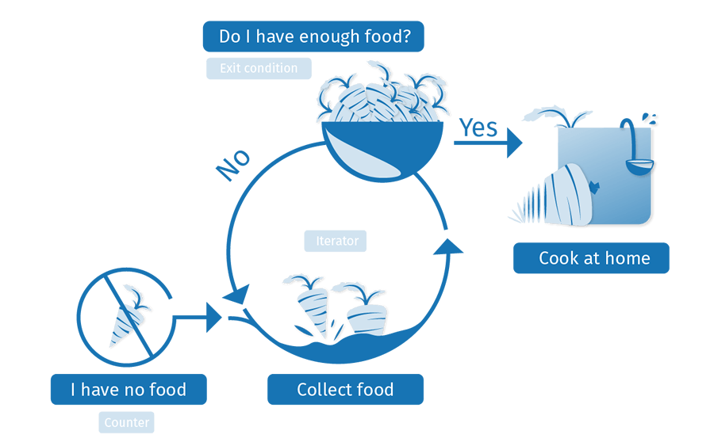

{{LearnSidebar}}{{PreviousMenuNext("Learn/JavaScript/Building_blocks/conditionals","Learn/JavaScript/Building_blocks/Functions", "Learn/JavaScript/Building_blocks")}}

As linguagens de programação são muito úteis para concluir rapidamente tarefas repetitivas, desde vários cálculos básicos até praticamente qualquer outra situação em que você tenha muitos itens semelhantes para manipular. Aqui, veremos as estruturas de loop disponíveis no JavaScript que ajudam com essas necessidades..

<table class="learn-box standard-table">
  <tbody>
    <tr>
      <th scope="row">Prerequisitos:</th>
      <td>
        Conhecimento básico em informática, um básico entendimento de HTML e
        CSS,
        <a href="/pt-BR/docs/Learn/JavaScript/First_steps"
          >JavaScript first steps</a
        >.
      </td>
    </tr>
    <tr>
      <th scope="row">Objectivo:</th>
      <td>Entender como usar loops em JavaScript.</td>
    </tr>
  </tbody>
</table>

## Mantenha-me no loop(laço)

Loops, loops, loops. Além de estarem associados a [populares cereais matinais](https://en.wikipedia.org/wiki/Froot_Loops), [montanhas-russas](https://pt.wikipedia.org/wiki/Montanha-russa) e [produção musical](<https://pt.wikipedia.org/wiki/Loop_(m%C3%BAsica)>), eles também são um conceito importante na programação. O loop de programação é como fazer a mesma coisa repetidas vezes - o que é chamado de **iteração** na linguagem de programação.

Vamos considerar o caso de um agricultor que quer se certificar de que ele terá comida suficiente para alimentar sua família durante a semana. Ele pode usar o seguinte loop para conseguir isso:



Um loop geralmente possui um ou mais dos seguintes itens:

- O **contador**, que é inicializado com um certo valor - este é o ponto inicial do loop ("Iniciar: não tenho comida", figura acima).
- A **condição de saída**, que é o critério no qual o loop pára - geralmente o contador atinge um certo valor. Isso é ilustrado por "Tenho comida suficiente?", na figura acima. Vamos dizer que ele precisa de 10 porções de comida para alimentar sua família.
- Um **iterador**, que geralmente incrementa o contador em uma pequena quantidade a cada loop, sucessivamente, até atingir a condição de saída. Nós não ilustramos explicitamente isso acima, mas poderíamos pensar sobre o agricultor ser capaz de coletar 2 porções de comida por hora. Depois de cada hora, a quantidade de comida que ele coletou é incrementada em dois, e ele verifica se ele tem comida suficiente. Se ele atingiu 10 porções (a condição de saída), ele pode parar de coletar e ir para casa.

No seu {{glossary("pseudocode")}}, isso seria algo como o seguinte:

```
loop(food = 0; foodNeeded = 10) {
  if (food = foodNeeded) {
    exit loop;
    // Nós temos comida o suficiente, Vamos para casa
  } else {
    food += 2; // Passe uma hora coletando mais 2 alimentos(food)
    // loop será executado novamente
  }
}
```

Assim, a quantidade de comida necessária é fixada em 10, e o montante que o agricultor tem atualmente é fixado em 0. Em cada iteração do ciclo, verificamos se a quantidade de alimento que o agricultor tem é igual à quantidade que ele precisa. Se assim for, podemos sair do loop. Se não, o agricultor gasta mais uma hora coletando duas porções de comida, e o laço é executado novamente.

### Porque se importar?

Neste ponto, você provavelmente já entendeu o conceito de alto nível por trás dos loops, mas provavelmente está pensando "OK, ótimo, mas como isso me ajuda a escrever um código JavaScript melhor?" Como dissemos anteriormente, **os loops têm tudo a ver com fazer a mesma coisa repetidas vezes, o que é ótimo para concluir rapidamente tarefas repetitivas**.

Muitas vezes, o código será um pouco diferente em cada iteração sucessiva do loop, o que significa que você pode completar toda uma carga de tarefas que são semelhantes, mas não são totalmente iguais — se você tem muitos cálculos diferentes para fazer, e você quer fazer um diferente do outro, e não o mesmo repetidamente!

Vejamos um exemplo para ilustrar perfeitamente por que os loops são uma coisa tão boa. Digamos que quiséssemos desenhar 100 círculos aleatórios em um elemento {{htmlelement("canvas")}} (pressione o botão Atualizar para executar o exemplo várias vezes para ver os conjuntos aleatórios diferentes):

```html hidden
<!doctype html>
<html>
  <head>
    <meta charset="utf-8" />
    <title>Random canvas circles</title>
    <style>
      html {
        width: 100%;
        height: inherit;
        background: #ddd;
      }

      canvas {
        display: block;
      }

      body {
        margin: 0;
      }

      button {
        position: absolute;
        top: 5px;
        left: 5px;
      }
    </style>
  </head>
  <body>
    <button>Update</button>

    <canvas></canvas>

    <script>
      var btn = document.querySelector("button");
      var canvas = document.querySelector("canvas");
      var ctx = canvas.getContext("2d");

      var WIDTH = document.documentElement.clientWidth;
      var HEIGHT = document.documentElement.clientHeight;

      canvas.width = WIDTH;
      canvas.height = HEIGHT;

      function random(number) {
        return Math.floor(Math.random() * number);
      }

      function draw() {
        ctx.clearRect(0, 0, WIDTH, HEIGHT);
        for (var i = 0; i < 100; i++) {
          ctx.beginPath();
          ctx.fillStyle = "rgba(255,0,0,0.5)";
          ctx.arc(random(WIDTH), random(HEIGHT), random(50), 0, 2 * Math.PI);
          ctx.fill();
        }
      }

      btn.addEventListener("click", draw);
    </script>
  </body>
</html>
```

{{ EmbedLiveSample('Hidden_code', '100%', 400, "", "", "hide-codepen-jsfiddle") }}

Você não precisa entender todo esse código por enquanto, mas vamos ver a parte do código que realmente desenha os 100 círculos:

```js
for (var i = 0; i < 100; i++) {
  ctx.beginPath();
  ctx.fillStyle = "rgba(255,0,0,0.5)";
  ctx.arc(random(WIDTH), random(HEIGHT), random(50), 0, 2 * Math.PI);
  ctx.fill();
}
```

- `random()`, definido anteriormente no código, retorna um número inteiro entre `0` e `x-1`.
- `WIDTH` e `HEIGHT` são a largura e a altura da janela interna do navegador.

Você deve ter notado - estamos usando um loop para executar 100 iterações desse código, cada uma delas desenhando um círculo em uma posição aleatória na página. A quantidade de código necessária seria a mesma se estivéssemos desenhando 100 círculos, 1.000 ou 10.000. Apenas um número tem que mudar.

Se não estivéssemos usando um loop aqui, teríamos que repetir o seguinte código para cada círculo que queríamos desenhar:

```js
ctx.beginPath();
ctx.fillStyle = "rgba(255,0,0,0.5)";
ctx.arc(random(WIDTH), random(HEIGHT), random(50), 0, 2 * Math.PI);
ctx.fill();
```

Isso ficaria muito chato, difícil e lento de manter. Loops são realmente os melhores.

## Loop padrão for

Vamos começar a explorar alguns exemplos específicos de construções de loop. O primeiro e que você usará na maior parte do tempo, é o loop [for](/pt-BR/docs/Web/JavaScript/Reference/Statements/for) - ele tem a seguinte sintaxe:

```
for (inicializador; condição-saída; expressão-final) {
  // código para executar
}
```

Aqui nós temos:

1. A palavra-chave `for`, seguido por parênteses.
2. Dentro do parênteses temos três itens, separados por ponto e vírgula:

   1. O **inicializador**— geralmente é uma variável configurada para um número, que é incrementado para contar o número de vezes que o loop foi executado. É também por vezes referido como uma **variável de contador**.
   2. A **condição-saída** — como mencionado anteriormente, aqui é definido quando o loop deve parar de executar. Geralmente, essa é uma expressão que apresenta um operador de comparação, um teste para verificar se a condição de saída foi atendida.
   3. A **expressão-final** — isso sempre é avaliado (ou executado) cada vez que o loop passou por uma iteração completa. Geralmente serve para incrementar (ou, em alguns casos, decrementar) a variável do contador, aproximando-a do valor da condição de saída.

3. Algumas chaves contêm um bloco de código - esse código será executado toda vez que o loop for iterado.

Vejamos um exemplo real para podermos visualizar o que isso faz com mais clareza.

```js
var cats = ["Bill", "Jeff", "Pete", "Biggles", "Jasmin"];
var info = "My cats are called ";
var para = document.querySelector("p");

for (var i = 0; i < cats.length; i++) {
  info += cats[i] + ", ";
}

para.textContent = info;
```

Isso nos dá a seguinte saída:

```html hidden
<!doctype html>
<html>
  <head>
    <meta charset="utf-8" />
    <title>Basic for loop example</title>
    <style></style>
  </head>
  <body>
    <p></p>

    <script>
      var cats = ["Bill", "Jeff", "Pete", "Biggles", "Jasmin"];
      var info = "My cats are called ";
      var para = document.querySelector("p");

      for (var i = 0; i < cats.length; i++) {
        info += cats[i] + ", ";
      }

      para.textContent = info;
    </script>
  </body>
</html>
```

{{ EmbedLiveSample('Hidden_code_2', '100%', 60, "", "", "hide-codepen-jsfiddle") }}

> **Nota:**Você pode encontrar este [código de exemplo no GitHub](https://github.com/mdn/learning-area/blob/master/javascript/building-blocks/loops/basic-for.html) (também [veja em execução](https://mdn.github.io/learning-area/javascript/building-blocks/loops/basic-for.html)).

Aqui mostra um loop sendo usado para iterar os itens em uma matriz e fazer algo com cada um deles - um padrão muito comum em JavaScript. Aqui:

1. O iterador, `i`, começa em `0` (`var i = 0`).
2. Foi dito para executar até que não seja menor que o comprimento do array dos gatos. Isso é importante - a condição de saída mostra a condição sob a qual o loop ainda será executado. No caso, enquanto `i < cats.length` for verdadeiro, o loop continuará executando.
3. Dentro do loop, nós concatenamos o item de loop atual (`cats[i]` é `cats[o nome do item que está iterado no momento]`) junto com uma vírgula e um espaço, no final da variável `info` . Assim:

   1. Durante a primeira execução, `i = 0`, então `cats[0] + ', '` será concatenado na variável info ("Bill").
   2. Durante a segunda execução, `i = 1`, so `cats[1] + ', '` será concatenado na variável info ("Jeff, ")
   3. E assim por diante. Após cada execução do loop, 1 será adicionado à `i` (`i++`), então o processo será iniciado novamente.

4. Quando `i` torna-se igual a `cats.length`, o loop é interrompido e o navegador passará para o próximo trecho de código abaixo do loop.

> **Nota:** :Nós fizemos a condição de saída `i < cats.length`, e não `i <= cats.length`, porque os computadores contam a partir de 0, não 1 - estamos começando `i` em `0`, e indo até `i = 4` (o index do último item do array). `cats.length` retorna 5, pois há 5 itens no array, mas não queremos chegar até `i = 5`, pois isso retornaria `undefined` para o último item (não há nenhum item no índice 5 do array). Então, portanto, queremos ir até 1 a menos de `cats.length` (`i <`), não é o mesmo que `cats.length` (`i <=`).

> **Nota:** Um erro comum nas condições de saída é usá-las "igual a" (`===`) em vez de dizer "menor ou igual a" (`<=`). Se quiséssemos executar nosso loop até `i = 5`, a condição de saída precisaria ser `i <= cats.length`. Se nós setarmos para `i === cats.length`, o loop não seria executado em todos, porque `i` não é igual a `5` na primeira iteração do loop, a execução pararia imediatamente.

Um pequeno problema que nos resta é que a sentença de saída final não é muito bem formada:

> Meus gatos se chamam: Bill, Jeff, Pete, Biggles, Jasmin,

Neste caso, queremos alterar a concatenação na iteração final do loop, para que não tenhamos uma vírgula no final da frase. Bem, não há problema - podemos muito bem inserir uma condicional dentro do nosso loop for para lidar com este caso especial:

```js
for (var i = 0; i < cats.length; i++) {
  if (i === cats.length - 1) {
    info += "and " + cats[i] + ".";
  } else {
    info += cats[i] + ", ";
  }
}
```

> **Nota:**Você pode encontrar este [código de exemplo no GitHub](https://github.com/mdn/learning-area/blob/master/javascript/building-blocks/loops/basic-for-improved.html) (também [veja em execução](https://mdn.github.io/learning-area/javascript/building-blocks/loops/basic-for-improved.html)).

> **Aviso:** **Importante**: Com **for** - como acontece com todos os loops - você deve certificar-se de que o inicializador está iterado(configurado) para que ele atinja a condição de saída. Caso contrário, o loop continuará indefinidamente executando e o navegador irá forçá-lo a parar ou falhará. Isso é chamado de **loop infinito**.

## Saindo do loop com o break

Se você quiser sair de um loop antes que todas as iterações sejam concluídas, você poderá usar a instrução [break](/pt-BR/docs/Web/JavaScript/Reference/Statements/break). Nós já encontramos isso em um artigo anterior, quando observamos as instruções switch - quando um determinado caso é atendido em uma [condição do switch](/pt-BR/docs/Learn/JavaScript/Building_blocks/conditionals#switch_statements) e que corresponde à expressão de entrada informada, a instrução break sai imediatamente da instrução switch e passa para o trecho de código seguinte.

É o mesmo com loops — um comando `break` irá imediatamente sair do loop e fazer o navegador passar para o código seguinte.

Digamos que quiséssemos pesquisar por uma variedade de contatos e números de telefone e retornar apenas o número que queríamos encontrar? Primeiro, algum HTML simples — um texto {{htmlelement("input")}} permitindo-nos iserir um nome para pesquisar, {{htmlelement("button")}} elemento para submeter a pesquisa e um {{htmlelement("p")}} elemento para mostrar o resultado em:

```html
<label for="search">Search by contact name: </label>
<input id="search" type="text" />
<button>Search</button>

<p></p>
```

Agora para no JavaScript:

```js
var contacts = [
  "Chris:2232322",
  "Sarah:3453456",
  "Bill:7654322",
  "Mary:9998769",
  "Dianne:9384975",
];
var para = document.querySelector("p");
var input = document.querySelector("input");
var btn = document.querySelector("button");

btn.addEventListener("click", function () {
  var searchName = input.value;
  input.value = "";
  input.focus();
  for (var i = 0; i < contacts.length; i++) {
    var splitContact = contacts[i].split(":");
    if (splitContact[0] === searchName) {
      para.textContent =
        splitContact[0] + "'s number is " + splitContact[1] + ".";
      break;
    } else {
      para.textContent = "Contact not found.";
    }
  }
});
```

```html hidden
<!doctype html>
<html>
  <head>
    <meta charset="utf-8" />
    <title>Simple contact search example</title>
    <style></style>
  </head>
  <body>
    <label for="search">Search by contact name: </label>
    <input id="search" type="text" />
    <button>Search</button>

    <p></p>

    <script>
      var contacts = [
        "Chris:2232322",
        "Sarah:3453456",
        "Bill:7654322",
        "Mary:9998769",
        "Dianne:9384975",
      ];
      var para = document.querySelector("p");
      var input = document.querySelector("input");
      var btn = document.querySelector("button");

      btn.addEventListener("click", function () {
        var searchName = input.value;
        input.value = "";
        input.focus();
        for (var i = 0; i < contacts.length; i++) {
          var splitContact = contacts[i].split(":");
          if (splitContact[0] === searchName) {
            para.textContent =
              splitContact[0] + "'s number is " + splitContact[1] + ".";
            break;
          } else if (i === contacts.length - 1)
            para.textContent = "Contact not found.";
        }
      });
    </script>
  </body>
</html>
```

{{ EmbedLiveSample('Hidden_code_3', '100%', 100, "", "", "hide-codepen-jsfiddle") }}

1. Primeiramente, temos algumas definições de variáveis — temos um array com as informações dos contatos, cada item é uma string e contém um nome e um número de telefone separados por dois pontos.
2. Em seguida, anexamos um ouvinte de evento ao botão (`btn`), de modo que quando ele é pressionado, algum código é invocado para executar a pesquisa e retornar os resultados.
3. Armazenamos o valor que foi inserido no input de texto em uma variável chamada `searchName`, antes de limpar a entrada de texto e focar novamente, deixando o campo pronto para a próxima pesquisa.
4. Agora, na parte interessante, o loop for:

   1. Iniciamos o contador em `0`, executamos o loop até que o contador não seja menor que `contacts.length`, e incrementamos `i` com 1 depois e cada iteração do loop.
   2. Dentro do loop, primeiro dividimos o contato atual (`contacts[i]`) no caractere " : " e armazenamos os dois valores resultantes em uma matriz chamada `splitContact`.
   3. Em seguida, usamos uma instrução condicional para testar se o `splitContact[0]` (nome do contato) é igual ao `searchName`. Se for igual, inserimos uma string no parágrafo para mostrar em tela qual é o número do contato e usamos o `break` para encerrar o loop.

5. Após `(contacts.length-1)` iterações, se o nome do contato não corresponder à pesquisa inserida, o texto do parágrafo será definido como "Contato não encontrado" e o loop continuará a iterar.

> **Nota:** Você pode encontrar este [código de exemplo no GitHub](https://github.com/mdn/learning-area/blob/master/javascript/building-blocks/loops/contact-search.html) (também [veja em execução](https://mdn.github.io/learning-area/javascript/building-blocks/loops/contact-search.html) ).

## Ignorando iterações com continue

A instrução [continue](/pt-BR/docs/Web/JavaScript/Reference/Statements/continue) funciona de maneira semelhante ao `break`, mas ao invés de sair inteiramente do loop, ele pula para a próxima iteração do loop. Vejamos outro exemplo que usa um número como entrada e retorna apenas os números que são quadrados de inteiros (números inteiros).

O HTML é basicamente o mesmo do último exemplo - uma entrada de texto simples e um parágrafo para saída. O JavaScript é basicamente o mesmo, embora o próprio loop seja um pouco diferente:

```js
var num = input.value;

for (var i = 1; i <= num; i++) {
  var sqRoot = Math.sqrt(i);
  if (Math.floor(sqRoot) !== sqRoot) {
    continue;
  }

  para.textContent += i + " ";
}
```

Aqui está a saída:

```html hidden
<!doctype html>
<html>
  <head>
    <meta charset="utf-8" />
    <title>Integer squares generator</title>
    <style></style>
  </head>
  <body>
    <label for="number">Enter number: </label>
    <input id="number" type="text" />
    <button>Generate integer squares</button>

    <p>Output:</p>

    <script>
      var para = document.querySelector("p");
      var input = document.querySelector("input");
      var btn = document.querySelector("button");

      btn.addEventListener("click", function () {
        para.textContent = "Output: ";
        var num = input.value;
        input.value = "";
        input.focus();
        for (var i = 1; i <= num; i++) {
          var sqRoot = Math.sqrt(i);
          if (Math.floor(sqRoot) !== sqRoot) {
            continue;
          }

          para.textContent += i + " ";
        }
      });
    </script>
  </body>
</html>
```

{{ EmbedLiveSample('Hidden_code_4', '100%', 100, "", "", "hide-codepen-jsfiddle") }}

1. Nesse caso, a entrada deve ser um número (`num`). O loop `for` recebe um contador começando em 1 (como não estamos interessados em 0 neste caso), uma condição de saída que diz que o loop irá parar quando o contador se tornar maior que o input `num`, e um iterador que adiciona 1 ao contador a cada vez.
2. Dentro do loop, encontramos a raiz quadrada de cada número usando [Math.sqrt(i)](/pt-BR/docs/Web/JavaScript/Reference/Global_Objects/Math/sqrt), e, em seguida, verificamos se a raiz quadrada é um inteiro, testando se é igual a ela mesma quando foi arredondada para o inteiro mais próximo é o que [Math.floor()](/pt-BR/docs/Web/JavaScript/Reference/Global_Objects/Math/floor) faz com o número que é passado).
3. Se a raiz quadrada e a raiz quadrada arredondada não forem iguais (`! ==`), isso significa que a raiz quadrada não é um número inteiro, portanto, não estamos interessados nela. Nesse caso, usamos a instrução `continue` para pular para a próxima iteração de loop sem registrar o número em nenhum lugar.
4. Se a raiz quadrada é um inteiro, nós pulamos o bloco if inteiramente para que a instrução `continue` não seja executada; em vez disso, concatenamos o valor `i` atual mais um espaço até o final do conteúdo do parágrafo.

> **Nota:** Você pode encontrar este [código de exemplo no GitHub](https://github.com/mdn/learning-area/blob/master/javascript/building-blocks/loops/integer-squares.html) (também [veja em execução](https://mdn.github.io/learning-area/javascript/building-blocks/loops/integer-squares.html) ).

## while e o do ... while

`for` não é o único tipo de loop disponível em JavaScript. Na verdade, existem muitos outros, embora você não precise entender tudo isso agora, vale a pena dar uma olhada na estrutura dos outros tipos de loops para que você possa reconhecer a mesma lógica na funcionalidade porém empregada de uma forma diferente.

Primeiro, vamos dar uma olhada no [while](/pt-BR/docs/Web/JavaScript/Reference/Statements/while) loop. A sintaxe deste loop é assim:

```
inicializador
while (condição-saída) {
  // code to run

  expressão-final
}
```

While funciona de maneira muito semelhante ao loop for, exceto que a variável inicializadora é definida antes do loop, e a expressão final é incluída dentro do loop após o código a ser executado - em vez de esses dois itens serem incluídos dentro dos parênteses. A condição de saída está incluída dentro dos parênteses, que são precedidos pela palavra-chave `while` e não por `for`.

Os mesmos três itens ainda estão presentes, e eles ainda são definidos na mesma ordem do loop for - isso faz sentido, já que você ainda precisa ter um inicializador definido antes de poder verificar se ele atingiu a condição de saída ; a condição final é então executada após o código dentro do loop ser executado (uma iteração foi concluída), o que só acontecerá se a condição de saída ainda não tiver sido atingida.

Vamos dar uma olhada novamente no nosso exemplo de lista de gatos, que reescrevemos para usar um loop while:

```js
var i = 0;

while (i < cats.length) {
  if (i === cats.length - 1) {
    info += "and " + cats[i] + ".";
  } else {
    info += cats[i] + ", ";
  }

  i++;
}
```

> **Nota:**Isso ainda funciona da mesma forma esperada — dê uma olhada no [código em execução](http://mdn.github.io/learning-area/javascript/building-blocks/loops/while.html) (também veja o [código fonte completo](https://github.com/mdn/learning-area/blob/master/javascript/building-blocks/loops/while.html)).

O [do...while](/pt-BR/docs/Web/JavaScript/Reference/Statements/do...while) loop é muito semelhante, mas fornece uma variação na estrutura while:

```
initializer
do {
  // code to run

  final-expression
} while (exit-condition)
```

Nesse caso, o inicializador novamente vem em primeiro lugar, antes que o loop seja iniciado. A palavra-chave precede diretamente as chaves que contêm o código a ser executado e a expressão final.

O diferenciador aqui é que a condição de saída vem depois de todo o resto, envolvida em parênteses e precedida por uma palavra-chave while. Em um loop do ... while, o código dentro das chaves é sempre executado uma vez antes da verificação ser feita para ver se deve ser executada novamente (no while e para, a verificação vem primeiro, então o código pode nunca ser executado ).

Vamos reescrever nosso exemplo de listagem de gato novamente para usar um loop do ... while:

```js
var i = 0;

do {
  if (i === cats.length - 1) {
    info += "and " + cats[i] + ".";
  } else {
    info += cats[i] + ", ";
  }

  i++;
} while (i < cats.length);
```

> **Nota:**Novamente, isso funciona exatamente como esperado - dê uma olhada nele [executando no GitHub](https://mdn.github.io/learning-area/javascript/building-blocks/loops/do-while.html) (veja também o [código fonte completo](https://github.com/mdn/learning-area/blob/master/javascript/building-blocks/loops/do-while.html)).

> **Aviso:** **Importante:** Com while e do ... while - como em todos os loops - você deve certificar-se de que o inicializador esteja iterado para que ele atinja a condição de saída. Caso contrário, o loop continuará indefinidamente e o navegador irá forçá-lo a parar ou falhará. Isso é chamado de loop infinito.

## Aprendizado ativo: contagem regressiva!

Nesse exercício, nós queremos que você imprima uma simples contagem regressiva na caixa de saída, de 10 até terminar. Especificamente, queremos que você:

- Faça um loop de 10 até 0. Fornecemos à você um inicializador — `var i = 10;`.
- Para cada iteração, crie um novo parágrafo e o anexe à saída `<div>`, que selecionamos usando `var output = document.querySelector('.output');`. Nos comentários, nós providenciamos a você três linhas de código que precisam ser usadas em algum lugar dentro do loop:

  - `var para = document.createElement('p');` — cria um novo parágrafo.
  - `output.appendChild(para);` — anexa o parágrafo à saída `<div>`.
  - `para.textContent =` — faz o texto dentro do parágrafo ser igual ao que você coloca do lado direito, depois do sinal de igual.

- Números de iteração diferentes exigem que texto diferente seja inserido no parágrafo para essa iteração (você precisará de uma declaração condicional e várias linhas `para.textContent =` ):

  - Se o número é 10, imprima "Contagem regressiva 10" no parágrafo.
  - Se o número é 0, imprima "Lançar!" no parágrafo.
  - Para qualquer outro número, apenas o imprima no parágrafo.

- Lembre-se de incluir um iterador! No entanto, neste exemplo, estamos em contagem regressiva após cada iteração, e não progressiva, então você não vai querer usar `i++` — como você itera para baixo?

Se você cometer um erro, sempre poderá redefinir o exemplo com o botão "Reset". Se você realmente ficar preso, pressione "Show solution" para ver uma solução.

```html hidden
<h2>Live output</h2>
<div class="output" style="height: 410px;overflow: auto;"></div>

<h2>Editable code</h2>
<p class="a11y-label">
  Press Esc to move focus away from the code area (Tab inserts a tab character).
</p>
<textarea id="code" class="playable-code" style="height: 300px;width: 95%">
var output = document.querySelector('.output');
output.innerHTML = '';

// var i = 10;

// var para = document.createElement('p');
// para.textContent = ;
// output.appendChild(para);
</textarea>

<div class="playable-buttons">
  <input id="reset" type="button" value="Reset" />
  <input id="solution" type="button" value="Show solution" />
</div>
```

```css hidden
html {
  font-family: sans-serif;
}

h2 {
  font-size: 16px;
}

.a11y-label {
  margin: 0;
  text-align: right;
  font-size: 0.7rem;
  width: 98%;
}

body {
  margin: 10px;
  background: #f5f9fa;
}
```

```js hidden
var textarea = document.getElementById("code");
var reset = document.getElementById("reset");
var solution = document.getElementById("solution");
var code = textarea.value;
var userEntry = textarea.value;

function updateCode() {
  eval(textarea.value);
}

reset.addEventListener("click", function () {
  textarea.value = code;
  userEntry = textarea.value;
  solutionEntry = jsSolution;
  solution.value = "Show solution";
  updateCode();
});

solution.addEventListener("click", function () {
  if (solution.value === "Show solution") {
    textarea.value = solutionEntry;
    solution.value = "Hide solution";
  } else {
    textarea.value = userEntry;
    solution.value = "Show solution";
  }
  updateCode();
});

var jsSolution =
  "var output = document.querySelector('.output');\noutput.innerHTML = '';\n\nvar i = 10;\n\nwhile(i >= 0) {\n var para = document.createElement('p');\n if(i === 10) {\n para.textContent = 'Contagem regressiva ' + i;\n } else if(i === 0) {\n  para.textContent = 'Lançar!';\n } else {\n para.textContent = i;\n }\n\n output.appendChild(para);\n\n i--;\n}";
var solutionEntry = jsSolution;

textarea.addEventListener("input", updateCode);
window.addEventListener("load", updateCode);

// stop tab key tabbing out of textarea and
// make it write a tab at the caret position instead

textarea.onkeydown = function (e) {
  if (e.keyCode === 9) {
    e.preventDefault();
    insertAtCaret("\t");
  }

  if (e.keyCode === 27) {
    textarea.blur();
  }
};

function insertAtCaret(text) {
  var scrollPos = textarea.scrollTop;
  var caretPos = textarea.selectionStart;

  var front = textarea.value.substring(0, caretPos);
  var back = textarea.value.substring(
    textarea.selectionEnd,
    textarea.value.length,
  );
  textarea.value = front + text + back;
  caretPos = caretPos + text.length;
  textarea.selectionStart = caretPos;
  textarea.selectionEnd = caretPos;
  textarea.focus();
  textarea.scrollTop = scrollPos;
}

// Update the saved userCode every time the user updates the text area code

textarea.onkeyup = function () {
  // We only want to save the state when the user code is being shown,
  // not the solution, so that solution is not saved over the user code
  if (solution.value === "Show solution") {
    userEntry = textarea.value;
  } else {
    solutionEntry = textarea.value;
  }

  updateCode();
};
```

{{ EmbedLiveSample('Active_learning', '100%', 880, "", "", "hide-codepen-jsfiddle") }}

## Aprendizado ativo: preenchendo uma lista de convidados

Nesse exercício, nós queremos que você pegue uma lista de nomes armazenados em um array, e os coloque em uma lista de convidados. Mas não tão fácil — nós não queremos que Phil e Lola estejam nela porque eles são gananciosos e rudes, e sempre comem a comida toda! Nós temos duas listas, uma para convidados aceitos, e uma para convidados recusados.

Especificamente, nós queremos que você:

- Escreva um loop que iterará de 0 até o comprimento do array `people`. Você precisará começar com um inicializador de `var i = 0;`, Mas qual condição de saída você precisa?
- Durante cada iteração de loop, verifique se o item atual do array é igual a "Phil" ou "Lola" usando uma declaração condicional:

  - Se for, concatene o item do array no final do `textContent` do paragrafo `refused`, seguido por uma vírgula e um espaço.
  - Se não for, concatene o item do array no final do `textContent` do paragrafo `admitted`, seguido por uma vírgula e um espaço.

Nós já fornecemos a você:

- `var i = 0;` — Seu inicializador.
- `refused.textContent +=` — o início de uma linha que concatenará algo no final de `refused.textContent`.
- `admitted.textContent +=` — o início de uma linha que concatenará algo no final de `admitted.textContent`.

Questão bônus extra — depois de completar as tarefas acima com sucesso, você terá duas listas de nomes, separados por vírgulas, mas eles estarão desarrumados — haverá uma vírgula no final decada um. Você pode descobrir como escrever linhas que que cortam a última vírgula em cada caso, e adicionar um ponto final? Dê uma olhada no artigo [Métodos úteis de string](/pt-BR/docs/Learn/JavaScript/First_steps/Useful_string_methods) para ajuda.

Se você cometer um erro, sempre poderá redefinir o exemplo com o botão "Reset". Se você realmente ficar preso, pressione "Show solution" para ver uma solução.

```html hidden
<h2>Live output</h2>
<div class="output" style="height: 100px;overflow: auto;">
  <p class="admitted">Admit:</p>
  <p class="refused">Refuse:</p>
</div>

<h2>Editable code</h2>
<p class="a11y-label">
  Press Esc to move focus away from the code area (Tab inserts a tab character).
</p>
<textarea id="code" class="playable-code" style="height: 400px;width: 95%">
var people = ['Chris', 'Anne', 'Colin', 'Terri', 'Phil', 'Lola', 'Sam', 'Kay', 'Bruce'];

var admitted = document.querySelector('.admitted');
var refused = document.querySelector('.refused');
admitted.textContent = 'Admit: ';
refused.textContent = 'Refuse: '

// var i = 0;

// refused.textContent += ;
// admitted.textContent += ;

</textarea>

<div class="playable-buttons">
  <input id="reset" type="button" value="Reset" />
  <input id="solution" type="button" value="Show solution" />
</div>
```

```css hidden
html {
  font-family: sans-serif;
}

h2 {
  font-size: 16px;
}

.a11y-label {
  margin: 0;
  text-align: right;
  font-size: 0.7rem;
  width: 98%;
}

body {
  margin: 10px;
  background: #f5f9fa;
}
```

```js hidden
var textarea = document.getElementById("code");
var reset = document.getElementById("reset");
var solution = document.getElementById("solution");
var code = textarea.value;
var userEntry = textarea.value;

function updateCode() {
  eval(textarea.value);
}

reset.addEventListener("click", function () {
  textarea.value = code;
  userEntry = textarea.value;
  solutionEntry = jsSolution;
  solution.value = "Show solution";
  updateCode();
});

solution.addEventListener("click", function () {
  if (solution.value === "Show solution") {
    textarea.value = solutionEntry;
    solution.value = "Hide solution";
  } else {
    textarea.value = userEntry;
    solution.value = "Show solution";
  }
  updateCode();
});

var jsSolution =
  "var people = ['Chris', 'Anne', 'Colin', 'Terri', 'Phil', 'Lola', 'Sam', 'Kay', 'Bruce'];\n\nvar admitted = document.querySelector('.admitted');\nvar refused = document.querySelector('.refused');\n\nadmitted.textContent = 'Admit: ';\nrefused.textContent = 'Refuse: '\nvar i = 0;\n\ndo {\n if(people[i] === 'Phil' || people[i] === 'Lola') {\n refused.textContent += people[i] + ', ';\n } else {\n admitted.textContent += people[i] + ', ';\n }\n i++;\n} while(i < people.length);\n\nrefused.textContent = refused.textContent.slice(0,refused.textContent.length-2) + '.';\nadmitted.textContent = admitted.textContent.slice(0,admitted.textContent.length-2) + '.';";
var solutionEntry = jsSolution;

textarea.addEventListener("input", updateCode);
window.addEventListener("load", updateCode);

// stop tab key tabbing out of textarea and
// make it write a tab at the caret position instead

textarea.onkeydown = function (e) {
  if (e.keyCode === 9) {
    e.preventDefault();
    insertAtCaret("\t");
  }

  if (e.keyCode === 27) {
    textarea.blur();
  }
};

function insertAtCaret(text) {
  var scrollPos = textarea.scrollTop;
  var caretPos = textarea.selectionStart;

  var front = textarea.value.substring(0, caretPos);
  var back = textarea.value.substring(
    textarea.selectionEnd,
    textarea.value.length,
  );
  textarea.value = front + text + back;
  caretPos = caretPos + text.length;
  textarea.selectionStart = caretPos;
  textarea.selectionEnd = caretPos;
  textarea.focus();
  textarea.scrollTop = scrollPos;
}

// Update the saved userCode every time the user updates the text area code

textarea.onkeyup = function () {
  // We only want to save the state when the user code is being shown,
  // not the solution, so that solution is not saved over the user code
  if (solution.value === "Show solution") {
    userEntry = textarea.value;
  } else {
    solutionEntry = textarea.value;
  }

  updateCode();
};
```

{{ EmbedLiveSample('Active_learning_2', '100%', 680, "", "", "hide-codepen-jsfiddle") }}

## Which loop type should you use?

For basic uses, `for`, `while`, and `do...while` loops are largely interchangeable. They can all be used to solve the same problems, and which one you use will largely depend on your personal preference — which one you find easiest to remember or most intuitive. Let's have a look at them again.

First `for`:

```
for (initializer; exit-condition; final-expression) {
  // code to run
}
```

`while`:

```
initializer
while (exit-condition) {
  // code to run

  final-expression
}
```

and finally `do...while`:

```
initializer
do {
  // code to run

  final-expression
} while (exit-condition)
```

Nós recomendamos o uso do `for`, pelo menos no começo, já que ele é provavelmente a forma mais fácil de lembrar de tudo — o inicializador, a condição de saída, e a expressão final final tudo fica ordenadamente dentro dos parênteses, então é fácil de ver onde eles estão e para verifcar se você não os esqueceu.

> **Nota:** There are other loop types/features too, which are useful in advanced/specialized situations and beyond the scope of this article. If you want to go further with your loop learning, read our advanced [Loops and iteration guide](/pt-BR/docs/Web/JavaScript/Guide/Loops_and_iteration).

## Conclusion

This article has revealed to you the basic concepts behind, and different options available when, looping code in JavaScript. You should now be clear on why loops are a good mechanism for dealing with repetitive code, and be raring to use them in your own examples!

If there is anything you didn't understand, feel free to read through the article again, or [contact us](/en-US/Learn#Contact_us) to ask for help.

## See also

- [Loops and iteration in detail](/pt-BR/docs/Web/JavaScript/Guide/Loops_and_iteration)
- [for statement reference](/pt-BR/docs/Web/JavaScript/Reference/Statements/for)
- [while](/pt-BR/docs/Web/JavaScript/Reference/Statements/while) and [do...while](/pt-BR/docs/Web/JavaScript/Reference/Statements/do...while) references
- [break](/pt-BR/docs/Web/JavaScript/Reference/Statements/break) and [continue](/pt-BR/docs/Web/JavaScript/Reference/Statements/continue) references
- [What's the Best Way to Write a JavaScript For Loop?](https://www.impressivewebs.com/javascript-for-loop/) — some advanced loop best practices

{{PreviousMenuNext("Learn/JavaScript/Building_blocks/conditionals","Learn/JavaScript/Building_blocks/Functions", "Learn/JavaScript/Building_blocks")}}
