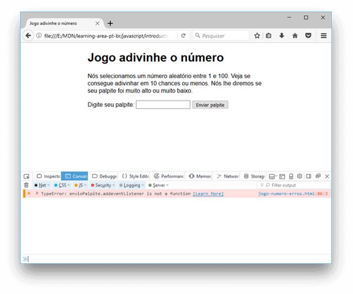
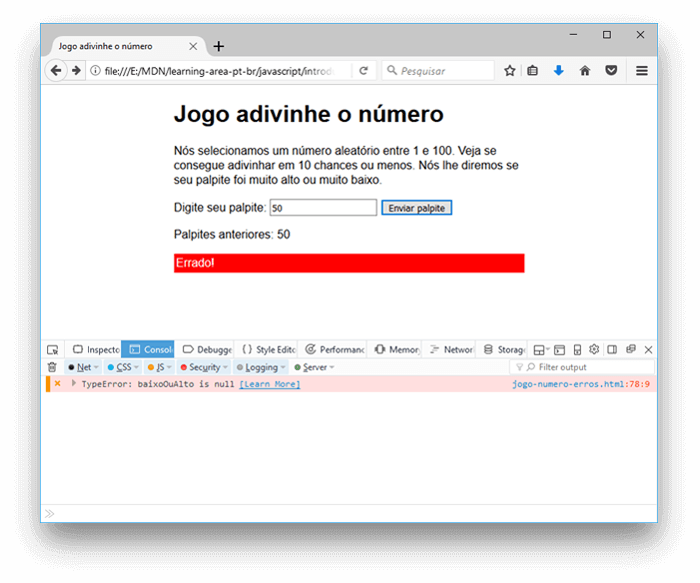
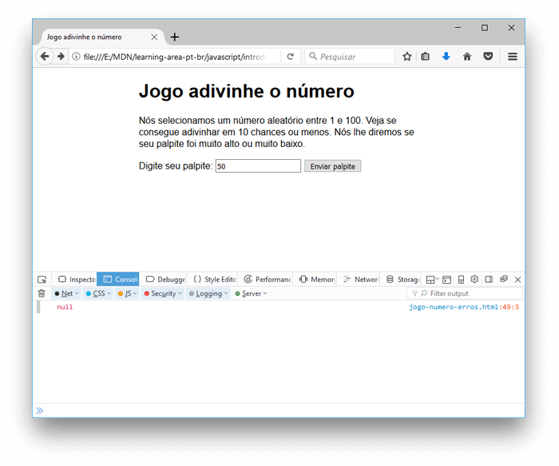

{{LearnSidebar}}{{PreviousMenuNext("Learn/JavaScript/First_steps/A_first_splash", "Learn/JavaScript/First_steps/Variables", "Learn/JavaScript/First_steps")}}

Quando você construiu o jogo "Adivinhe o número" no artigo anterior, você talvez tenha descoberto que ele não funcionou. Não tema — este artigo tem como objetivo impedir que você arranque os cabelos por causa desses problemas, fornecendo-lhe algumas dicas simples de como encontrar e corrigir erros nos programas JavaScript.

<table class="learn-box standard-table">
  <tbody>
    <tr>
      <th scope="row">Pré-requesitos:</th>
      <td>
        <p>
          Conhecimentos básicos de informática, uma compreensão básica de HTML e
          CSS, uma compreensão do que é JavaScript.
        </p>
      </td>
    </tr>
    <tr>
      <th scope="row">Objetivo:</th>
      <td>
        Ganhar habilidade e confiança para começar a resolver problemas simples
        em seu próprio código.
      </td>
    </tr>
  </tbody>
</table>

## Tipos de erros

De um modo geral, quando você faz algo errado no código, existem dois tipos principais de erros que você encontrará:

- **Erros de sintaxe:** são erros de ortografia em seu código que realmente fazem com que o programa não seja executado, ou pare de trabalhar parcialmente - você geralmente receberá algumas mensagens de erro também. Estes geralmente são adequados para consertar, desde que você esteja familiarizado com as ferramentas certas e saiba o que as mensagens de erro significam!
- **Erros lógicos:** são erros onde a sintaxe está realmente correta, mas o código não é o que você pretendia, o que significa que o programa é executado com sucesso, mas dá resultados incorretos. Muitas vezes, eles são mais difíceis de consertar do que erros de sintaxe, pois geralmente não há uma mensagem de erro resultante para direcioná-lo para a origem do erro.

Ok, então não é assim tão simples - há alguns outros diferenciadores à medida que você aprofunda. Mas as classificações acima serão bem úteis nesta fase inicial da sua carreira. Examinaremos esses dois tipos a seguir.

## Um exemplo errôneo

Para começar, voltemos ao nosso jogo de adivinhação - porém desta vez estaremos explorando uma versão que tem alguns erros inseridos propositalmente. Vá até o Github e faça uma cópia local de [jogo-numero-erros.html](https://github.com/mdn/learning-area/blob/main/javascript/introduction-to-js-1/troubleshooting/number-game-errors.html) ([veja-o em execução aqui](https://mdn.github.io/learning-area/javascript/introduction-to-js-1/troubleshooting/number-game-errors.html)).

1. Para começar, abra a cópia local dentro do seu editor de texto favorito, e em seu navegador.
2. Tente jogar o jogo - você notará que, quando você pressiona o botão "Enviar palpite", ele não funciona!

> **Nota:**Talvez você tenha sua própria versão de exemplo do jogo que não funciona, e pode querer consertá-la! Nós ainda gostaríamos que você trabalhasse no artigo com a nossa versão, para que possa aprender as técnicas que estamos ensinando aqui. Daí então você pode voltar e tentar consertar seu exemplo.

Neste ponto, vamos consultar o console do desenvolvedor para ver se identificamos qualquer erro de sintaxe, e então tentar consertá-lo. Você irá aprender como, logo abaixo.

## Consertando erros de sintaxe

Anteriormente no curso, nós fizemos você digitar alguns comandos simples de JavaScript no [console JavaScript](/pt-BR/docs/Learn/Common_questions/What_are_browser_developer_tools) (se você não se lembra como, abra o link anterior). O que é ainda mais útil é o fato do console lhe mostrar mensagens de erro sempre que existir algo errado na sintaxe dentro do JavaScript enviado ao motor de JavaScript do navegador. Agora vamos à caça.

1. Vá até a aba onde você tem aberto o arquivo `jogo-numero-erros.html` e abra o console JavaScript. Você deverá ver uma mensagem de erro sendo exibida:
   
2. Esse é um erro bem fácil de identifcar, e o navegador lhe fornece várias informações úteis para lhe ajudar (a captura de tela acima foi feita no Firefox, mas os outros navegadores oferecem informações similares). Da esquerda para a direita, nós temos:

   - Um "x" laranja para indicar que esse é um erro.
   - Uma mensagem de erro para indicar o que está errado: "TypeError: envioPalpite.addeventListener is not a function"
   - Um link "Learn More" que encaminha à uma página no MDN docs explicando o que esse erro significa em uma quantidade enorme de detalhes.
   - O nome do arquivo JavaScript, que direciona à aba Debugger das ferramentas de desenvolvimento. Se você clicar nesse link, verá a linha exata onde o erro está destatacada.
   - O número da linha onde o erro se encontra, e o número do caractere na linha onde o erro é encontrado primeiro. Neste caso nós temos, linha 86, caractere número 3.

3. Se olharmos para a linha 86 em nosso nosso código de código, vamos encontrar a seguinte linha:

   ```js
   envioPalpite.addeventListener('click', conferir Palpite);
   ```

4. O erro diz o seguinte "envioPalpite.addeventListener is not a function", que significa envioPalpite.addeventListener não é uma funçao. Então provavelmente digitamos algo errado. Se você não estiver certo da digitação correta de parte da sintaxe, é uma boa ideia procurar a funcionalidade no MDN docs. A melhor forma de fazer isso atualmente é pesquisar por "mdn _nome-da-funcionalidade_" em seu mecanismo de buscas favorito. Aqui está um atalho para te salvar algum tempo nesse caso: [`addEventListener()`](/pt-BR/docs/Web/API/Element/addEventListener).
5. Então, olhando nessa essa página, o erro parece ser termos digitado o nome da função errado! Lembre-se de que o JavaScript diferencia letras maiúsculas de minúsculas, então qualquer diferença na digitação ou no uso de letras maiúsculas irá causar um erro. Alterar `addeventListener` para `addEventListener` deverá corrigir esse erro. Faça essa alteração no código do seu arquivo.

> **Nota:** Veja nossa página de referência [TypeError: "x" is not a function](/pt-BR/docs/Web/JavaScript/Reference/Errors/Not_a_function) para mais detalhes sobre esse erro.

### Erros de sintaxe - segundo round

1. Salve o arquivo e atualize a aba do navegador, e você poderá ver que o erro foi corrigido.
2. Agora se você tentar enviar um palpite e pressionar o botão !Enviar palpite" você verá... outro erro!
   
3. Dessa vez o erro informado é "TypeError: baixoOuAlto is null", na linha 78.

   > **Nota:** [`Null`](/pt-BR/docs/Glossary/Null) é um valor especial que significa "nada", ou "sem valor". Então `baixoOuAlto` foi declarado e inicializado, mas não com algum valor significativo — não possui nenhum caractere ou valor.

   > **Nota:** Esse erro não apareceu assim que a página foi carregada porque esse erro ocorreu dentro de uma função (dentro do bloco `conferirPalpite() { ... }` ). Como você irá aprender com mais detalhes no nosso artigo de funções mais tarde, o código localizado dentro de funções roda em um escopo separado do código presente fora das funções. Nesse caso, o código não estava rodando e o erro não estava aparecendo até a função `conferirPalpite()` ser executada na linha 86.

4. Dê uma olhada na linha 78, e você verá o seguinte código:

   ```js
   baixoOuAlto.textContent = "Seu palpite foi muito alto!";
   ```

5. Essa linha está tentando definir a propriedade `textContent` (conteúdo de texto) da variável `baixoOuAlto` como uma sequência de texto, mas isso não está funcionando porque `baixoOuAlto` não contém o que deveria conter. Vamos ver o porquê — tente localizar outras instâncias de `baixoOuAlto` no código. A instância que aparece primeiro no código JavaScript é na linha 48:

   ```js
   var baixoOuAlto = document.querySelector("baixoOuAlto");
   ```

6. Nesse ponto estamos tentando fazer com que a variável contenha uma referência a um elemento no documento HTML. Vamos conferir se o valor é `null` (nulo) depois que essa linha é executada. Adicione o seguinte código na linha 49:

   ```js
   console.log(baixoOuAlto);
   ```

   > **Nota:** [`console.log()`](/pt-BR/docs/Web/API/Console/log) é uma função de debugging (correção de erros) realmente útil que exibe um valor na tela do console. Então ela irá imprimir o valor da variável `baixoOuAlto` na tela do console assim que tentarmos defini-la na linha 48.

7. Salve o arquivo e o atualize no navegador, e você deverá ver agora o resultado do `console.log()` na tela do seu console.
   
   Pois bem, nesse ponto o valor de `baixoOuAlto` e `null`, então definitivamente há um problema com a linha 48.
8. Vamos pensar em qual poderia ser o problema. A linha 48 está usando um método [`document.querySelector()`](/pt-BR/docs/Web/API/Document/querySelector) para pegar a referência do elemento selecionado com um seletor CSS selector (_CSS selector_). Olhando mais acima no nosso código, podemos encontrar o parágrafo em questão:

   ```js
   <p class="baixoOuAlto"></p>
   ```

9. Então nós precisamos de um seletor de classe aqui, que começa com um ponto (.), mas o seletor passado pelo método `querySelector()` na linha 48 não tem o ponto. Esse pode ser o problema! Tente mudar `baixoOuAlto` para `.baixoOuAlto` na linha 48.
10. Tente salvar o arquivo e atualizá-lo no navegador de novo, e a sua declaração `console.log()` deverá retornar o elemento `<p>` que queremos. Ufa! Outro erro resolvido! Você pode deletar a linha do seu `console.log()` agora, ou mantê-la para referência posterior — a escolha é sua.

> **Nota:** Veja nossa página de referência [TypeError: "x" is (not) "y"](/pt-BR/docs/Web/JavaScript/Reference/Errors/Unexpected_type) para mais detalhes sobre esse erro.

### Erros de sintaxe - terceiro round

1. Agora se você tentar jogar novamente, você deve ter mais sucesso — o jogo deve continuar normalmente, até você terminar, ou adivinhando o número, ou ficando sem mais chances.
2. Nesse ponto, o jogo falha mais uma vez, e o mesmo erro do início é exibido — "TypeError: botaoReinicio.addeventListener is not a function"! No entanto, dessa vez é listado vindo da linha 94.
3. Olhando a linha 94, é fácil de ver que nós cometemos o mesmo erro novamente. Só precisamos alterar mais uma vez `addeventListener` para `addEventListener`. Faça isso.

## Um erro de lógica

Nesse ponto, o jogo deve rodar normalmente, porém depois de jogá-lo algumas vezes você irá notar que o número "aleatório" que você tem que adivinhar é sempre igual a 1. Definitivamente não é como queremos que o jogo funcione!

Há sem dúvida um problema na lógica do jogo em algum lugar — o jogo não está retornando nenhum erro;simplesmente não está funcionando corretamente.

1. Procure pela variável `numeroAleatorio`, e as linhas onde o número aleatório é definido primeiro. A instância que armazena o número aleatório que queremos adivinhar no começo do jogo deve estar na linha 44 ou próximo a ela:

   ```js
   var numeroAleatorio = Math.floor(Math.random()) + 1;
   ```

2. E a linha que gera o número aleatório antes de cada jogo subsequente está na linha 113, ou próximo a ela:

   ```js
   numeroAleatorio = Math.floor(Math.random()) + 1;
   ```

3. Para checar se essas linhas são mesmo o problema, vamos recorrer ao nosso amigo `console.log()` de novo — insira a seguinte linha diretamente abaixo de cada uma das duas linhas:

   ```js
   console.log(numeroAleatorio);
   ```

4. Salve o arquivo e atualize o navegador, então jogue algumas vezes — você verá que o `numeroAleatorio` é igual a 1 cada vez em que é exibido no console.

### Trabalhando através da lógica

Para consertar isso, vamos considerar como essa linha está trabalhando. Primeiro, nós invocamos [`Math.random()`](/pt-BR/docs/Web/JavaScript/Reference/Global_Objects/Math/random), que gera um número decimal aleatório entre 0 e 1, ex. 0.5675493843.

```js
Math.random();
```

Em seguida, passamos o resultado invocando `Math.random()` através de [`Math.floor()`](/pt-BR/docs/Web/JavaScript/Reference/Global_Objects/Math/floor), que arredonda o número passado para o menor número inteiro mais próximo. E então adicionamos 1 ao resultado:

```
Math.floor(Math.random()) + 1
```

Arredondando um número decimal aleatório entre 0 e 1 para baixo irá sempre retornar 0, então adicionando 1 a ele sempre retornará 1. Precisamos multiplicar o número aleatório por 100 antes de o arredondarmos para baixo. O código seguinte nos daria um número aleatório entre 0 and 99:

```js
Math.floor(Math.random() * 100);
```

Por isso, queremos adicionar 1, para nos dar um número aleatório entre 1 e 100:

```js
Math.floor(Math.random() * 100) + 1;
```

Tente atualizar as duas linhas dessa forma, então salve e atualize o navegador — o jogo deve agora funcionar como nós queremos que funcione!

## Outros erros comuns

Existem outros erros comuns com os quais você irá esbarrar em seu código. Essa seção destaca a maioria deles.

### _SyntaxError: missing ; before statement_

Erro de sintaxe: faltando ";" antes da declaração. Esse erro geralmente significa que você deixou de inserir um ponto e vírgula ao final de uma de suas linhas de código, mas algumas vezes pode ser mais crítico. Por exemplo, se mudarmos essa linha (número 58) dentro da função `conferirPalpite()`:

```js
var palpiteUsuario = Number(campoPalpite.value);
```

para

```js
var palpiteUsuario === Number(campoPalpite.value);
```

Exibe esse erro porque pensa que você está fazendo algo diferente. Você deve se certificar de não misturar o operador de atribuição (`=`) — que configura uma variável para ser igual a determinado valor — com o operador de igualdade restrita (`===`), que testa se um valor é exatamente igual a outro, e retorna um resultado `true`/`false` (verdadeiro ou falso).

> **Nota:** Veja nossa página de referência [SyntaxError: missing ; before statement](/pt-BR/docs/Web/JavaScript/Reference/Errors/Missing_semicolon_before_statement) para mais detalhes sobre esse erro.

### O programa sempre diz que você ganhou, independentemente do palpite que insira

Isso pode ser outro sintoma de confusão entre o operador de atribuição e o operador de igualdade restrita. Por exemplo, se nós quiséssemos essa linha dentro de `conferirPalpite()`:

```js
if (palpiteUsuario === numeroAleatorio) {
```

para

```js
if (palpiteUsuario = numeroAleatorio) {
```

o teste retornaria sempre `true` (verdadeiro), causando o programa a reportar que o jogo foi vencido. Tome cuidado!

### _SyntaxError: missing ) after argument list_

Erro de sintaxe: faltando ")" depois de listar uma declaração. Esse é bem simples — geralmente significa que deixamos de fechar o parênteses no final ao invocar uma função/método.

> **Nota:** Veja nossa página de referência [SyntaxError: missing ) after argument list](/pt-BR/docs/Web/JavaScript/Reference/Errors/Missing_parenthesis_after_argument_list) para mais detalhes sobre o erro.

### _SyntaxError: missing : after property id_

Erro de sintaxe: faltando ":" depois da propriedade id. Esse erro geralmente se relaciona à formação incorreta de um objeto de JavaScript, mas nesse caso o obtivemos alterando:

```js
function conferirPalpite() {
```

para

```js
function conferirPalpite( {
```

Isso levou o navegador a pensar que estávamos tentando passar todo o conteúdo da função como se fosse um argumento dessa função. Seja cuidadoso com esses parênteses!

### _SyntaxError: missing } after function body_

Erro de sintaxe: faltando "}" depois do corpo da função. Isso é fácil — geralmente significa que você deixou de colocar uma das chaves de uma função ou de uma estrutura condicional. Nós obtemos esse erro deletando uma das chaves de fechamento próximas ao final da função `conferirPalpite()`.

### _SyntaxError: expected expression, got 'string'_ ou _SyntaxError: unterminated string literal_

Erro de sintaxe: esperado uma expressão, obtido uma 'string' e Erro de sintaxe: string literal não terminada. Esses erros geralmente significam que você deixou de colocar aspas no início ou no final da declaração de uma cadeia de texto. No primeiro erro acima, '_string'_ seria substituído pelo(s) caractere(s) encontrado(s) pelo navegador ao invés da aspa no início de uma cadeia de texto. O segundo erro quer dizer que a cadeia de texto não foi finalizada com o caractere de aspa.

Para todos esses erros, pense em como nós abordamos os exemplos em que olhamos no passo a passo. Quando um erro surge, olha o número da linha que é informado, vá até essa linha e veja se consegue localizar o que há de errado. Mantenha em mente que o erro não estará necessariamente nessa linha, e também que o erro pode não ter sido causado exatamente pelo mesmo problema que citamos acima!

> **Nota:** Veja nossas páginas de referência [SyntaxError: Unexpected token](/pt-BR/docs/Web/JavaScript/Reference/Errors/Unexpected_token) e [SyntaxError: unterminated string literal](/pt-BR/docs/Web/JavaScript/Reference/Errors/Unterminated_string_literal) para mais detalhes sobre esses erros.

## Sumário

Então aqui temos, o básico de como resolver erros em programas simples de JavaScript. Não será sempre tão fácil de solucionar o que está errado em seu código, mas pelo menos isso irá te poupar algumas horas de sono e lhe permitir progredir um pouco mais rápido quando as coisas não saírem certas no início da sua jornada de aprendizado.

## Veja também

- Há muitos outros tipos de erros que não listamos aqui; estamos compilando uma referência que explica o que eles significam em detalhes — veja a [referência de erros do JavaScript](/pt-BR/docs/Web/JavaScript/Reference/Errors).
- Se você se deparar com qualquer erro em seu código que não tenha certeza de como resolver mesmo depois de ler este artigo, você pode pedir ajuda! Pergunte na [Área de Discussão e Aprendizagem](https://discourse.mozilla-community.org/t/learning-web-development-marking-guides-and-questions/16294), ou no canal IRC [#mdn](irc://irc.mozilla.org/mdn) em [Mozilla IRC](https://wiki.mozilla.org/IRC). Nos diga quel é o seu erro, e nós iremos tentar te ajudar. Uma amostra do seu código também seria útil.

{{PreviousMenuNext("Learn/JavaScript/First_steps/A_first_splash", "Learn/JavaScript/First_steps/Variables", "Learn/JavaScript/First_steps")}}
