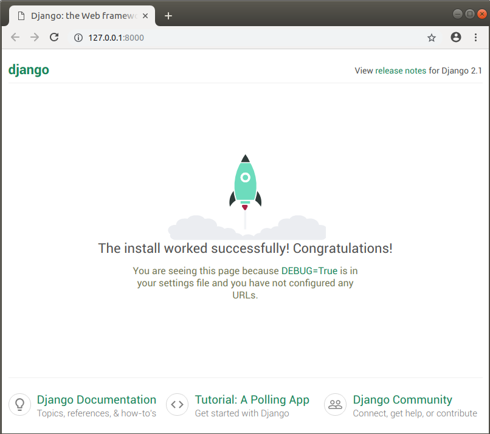

{{LearnSidebar}}{{PreviousMenuNext("Learn/Server-side/Django/Introduction", "Learn/Server-side/Django/Tutorial_local_library_website", "Learn/Server-side/Django")}}

Agora que você sabe para que serve o Django, nós iremos te mostrar como instalar, configurar e testar um ambiente de desenvolvimento no Windows, Linux (Ubuntu), e macOS - seja qual for o sistema operacional (SO) que você usar, este artigo deve fornecê-lo o suficiente para conseguir começar a desenvolver aplicativos Django.

<table class="learn-box standard-table">
  <tbody>
    <tr>
      <th scope="row">Pré-requisitos:</th>
      <td>
        Saber como usar um teminal / linha de comando. Saber instalar softwares
        em seu sistema operacional.
      </td>
    </tr>
    <tr>
      <th scope="row">Objetivo:</th>
      <td>
        Ter uma ambiente de desenvolvimento Django (2.0) operando em seu
        computador.
      </td>
    </tr>
  </tbody>
</table>

## Visão geral do ambiente de desenvolvimento Django

Django facilita muito a configuração em seu computador para iniciar logo o desenvolvimento de aplicações web. Essa seção explica o que você ganha com o ambiente de desenvolvimento e fornece um plano geral de algumas opções de instalação e configuração. O resto do artigo explica o método _recomendado_ de instalar o ambiente Django no Ubuntu, macOS e Windows e como testar.

### O que é o ambiente de desenvolvimento Django?

O ambiente de desenvolvimento é uma instalação do Django em seu computador local para que você use-o para desenvolver e testar apps Django antes de implementá-los em um ambiente de produção

A principal ferramenta que Django fornece é um conjunto de scripts Python para criar e trabalhar com projetos Django, junto com um simples _webserver de desenvolvimento_ que você pode usar para testar localmente (i.e. no seu computador, não em um web server externo) aplicações web Django no seu navegador.

Existem outras ferramentas secundárias que fazem parte do ambiente de desenvolvimento que não cobriremos aqui. Isso inclui coisas como um [editor de texto](/pt-BR/docs/Learn/Common_questions/Available_text_editors) ou IDE para edição de código, e uma ferramenta pra gerenciamento do controle de origem de códigos (como o [Git](https://git-scm.com/)) para administrar com segurança as diferentes versões de seu sistema. Nós estamos assumindo que você já tem um editor de texto instalado.

### Quais são as opções de instalação do Django?

Django é extremamente flexível em termos de como e onde ele pode ser instalado e configurado. Django pode:

- Ser instalado em diferentes sistemas operacionais.
- Ser instalado pelo código-fonte, pelo Python Package Index (PyPi) e, em muitos casos, pelo aplicativo gerenciador de pacotes do computador host.
- Ser configurado para uso de um dos vários bancos de dados, que também podem ser instalados e configurados separadamente.
- Operar no ambiente principal do sistema Python ou em ambientes virtuais Python, separadamente.

Cada opção requer leves diferenças de configuração e instalação. As subseções abaixo explicam algumas de suas escolhas. No resto do artigo nós iremos mostrar como instalar o Django em um pequeno número de sistemas operacionais. No resto do módulo, assumiremos que você tenha instalado o Django em sua máquina.

> **Nota:** Outras possíveis opções de instalação são cobertas pela documentação oficial do Django. Nós linkamos os [documents adequados abaixo](#Veja_também).

#### Quais sistemas operacionais suportam Django?

Aplicações web Django podem rodar em quase todas as maquinas que suportam a linguagem de programação Python 3. Windows, macOS, Linux/Unix e Solaris são alguns desses SO's. A maioria dos computadores atuais devem ter o desempenho necessário para operar Django.

Neste artigo, iremos fornecer instruções para Windows, macOS a Linux/Unix.

#### Qual versão de Python deve ser usada?

Nós recomendamos que use a mais recente versão disponível — no momento que escrevo é Python 3.7.1.

Se necessário, versões a partir de Python 3.5 podem ser usadas (o suporte para Python 3.5 irá acabar em versões futuras).

> **Nota:** Python 2.7 não pode ser usado com Django 2.1 (A série Django 1.11.x é a última que suporta Python 2.7).

#### Onde posso baixar o Django?

Existem três lugares para fazer o download do Django:

- Python Package Repository (PyPi), usando o comando _pip_. Esta é a melhor forma de conseguir a última versão estável do Django.
- A partir de uma versão do gerenciador de pacotes de seu computador. Distribuições de Django que são empacotadas com o sistema operacional oferecem uma "instalação familiar". Contudo, note que a versão disponível pode ser um pouco antiga, e que pode ser instalada apenas dentro do sistema ambiente do Python (podendo ser algo que você não queira).
- Instalar pelo código-fonte. Você pode pegar a última versão acessível do código do Django e instalar no seu computador. Não é recomendado aos iniciantes, mas é necessário quando você se sentir pronto para contribuir com o Django.

Este artigo mostra a instalação pelo Pypi, pois queremos a última versão estável do Django.

#### Qual banco de dados?

Django suporta (principalmente) quatro bancos de dados (PostgreSQL, MySQL, Oracle, e SQLite ), contudo, existem bibliotecas community que fornecem níveis variados de suporte para outros populares bancos de dados SQL e NoSQL. Nós recomendamos que você use o mesmo banco de dados tanto para produção quanto para desenvolvimento (embora o Django abstraia muitas das diferenças dos bancos de dados usando seu Object-Relational Mapper (ORM), ainda há [problemas em potencial](https://docs.djangoproject.com/en/2.1/ref/databases/) que é melhor evitar).

Neste artigo (e na maior parte deste módulo) nós usaremos o banco de Dados _SQLite_, que armazena dados em um arquivo. SQLite é destinado para uso sendo um banco de dados leve e que não consegue suportar uma demanda muito alta. Entretanto, uma excelente opção para aplicações de que focam em leitura de dados.

> **Nota:** Django é configurado por padrão a usar SQLite ao iniciar seu projeto usando as ferramentas padrão (django-admin). É uma ótima escolha quando você está começando, porque não requer configurações adicionais ou instalações.

#### Instalar em todo o sistema ou em um ambiente virtual Python?

Quando você instala Python 3 você pega um único ambiente global que é compartilhado por todo o código Python 3. Enquanto você pode instalar qualquer pacote Python que quiser no ambiente, você pode instalar apenas uma versão particular de cada pacote por vez.

> **Nota:** Aplicações Python instaladas no ambiente global têm forte potêncial de entrar em conflito entre si (i.e. se elas dependem de versões diferentes do mesmo pacote).

Se você instalar Django no ambiente padrão/global você só será capaz de ter uma versão do Django em seu computador. Isto pode ser um problema se você quer criar novos websites (usando a versão mais recente do Django) enquanto ainda realiza manutenção nos websites que dependem das versões antigas.

Pensando nisso, desenvolvedores experientes de Python/Django normalmente executam apps Python dentro de um _ambiente virtual Python_ independente. Isso permite usar diferentes ambientes Django em um único computador. A própria equipe de desenvolvedores Django recomenda o uso de ambientes virtuais Python!

Esse módulo assume que você instalou o Django em um ambiente virtual, nós iremos mostrá-lo como fazer isso logo abaixo.

## Instalando Python 3

Você deve ter Python instalado em seu sistema operacional para usar Django. Se você estiver usando _Python 3_, também precisará da ferramenta [Python Package Index](https://pypi.python.org/pypi) — _pip3_ — que é usada para administrar (instalar, editar, remover) pacotes/bibliotecas Python usadas por Django e seus outros aplicativos Python.

Essa parte explica brevemente como você pode checar quais versões de Python estão disponíveis e instalar novas versões se necessário (em Ubuntu 18.04, macOS e Windows 10).

> **Nota:** Dependendo da sua plataforma, você também pode instalar Python/pip3 no seu sistema operacional através de seu próprio gerenciador de pacotes ou por outros mecanismos. Para a maioria das plataformas, você pode baixar os arquivos necessários para instalação em <https://www.python.org/downloads/> e instalá-los usando o método específico da plataforma em questão.

### Ubuntu 18.04

Ubuntu Linux 18.04 LTS inclui Python 3.6.6 por padrão. Você pode confirmar isso executando o seguinte comando no Terminal:

```bash
python3 -V
 Python 3.6.6
```

Contudo, o Python Package Index, que você precisará para instalar pacotes para Python 3 (incluindo Django), **não** está disponível por padrão. Você pode instalar pip3 pelo Terminal usando:

```bash
sudo apt install python3-pip
```

### macOS

macOS "El Capitan" e outras versões mais recentes não incluem Python 3. Você pode confirmar isto executando os comandos abaixo no Terminal:

```bash
python3 -V
 -bash: python3: command not found
```

Você pode instalar Python 3 (com a ferramenta pip3) facilmente em [python.org](https://www.python.org/):

1. Baixe o instalador exigido:

   1. Acesse <https://www.python.org/downloads/>
   2. Selecione o botão **Download Python 3.7.1** (o número exato da versão menor pode diferir).

2. Localize o arquivo usando _o Finder_, e clique duplo no arquivo do pacote. Siga os passos da instalação dos prompts.

Agora você pode confirmar se tudo deu certo checando o _Python 3_ como mostrado abaixo:

```bash
python3 -V
 Python 3.7.1
```

Você pode checar se _pip3_ está instalado listando todos os pacotes disponíveis.

```bash
pip3 list
```

### Windows 10

Windows não inclui Python por padrão, mas você pode instalá-lo facilmente (com a ferramenta _pip3_) em [python.org](https://www.python.org/):

1. Baixe o instalador exigido:

   1. Acesse <https://www.python.org/downloads/>
   2. Selecione o botão **Download Python 3.7.1** (o número exato da versão menor pode diferir).

2. Instale Python com um clique duplo no arquivo baixado e siga a instalação dos prompts.
3. Tenha certeza que a caixa "Add Python to PATH" está checada.

Você pode verificar se o Python 3 foi instalado colocando o seguinte texto no Prompt de Comando

```bash
py -3 -V
 Python 3.7.1
```

O instalador do Windows incorpora _pip3_ (o administrador de pacotes Python) por padrão. Você pode facilmente listar os pacotes instalados com o comando abaixo:

```bash
pip3 list
```

> **Nota:** O instalador deve ter configurado tudo que você precisa antes para esse comando funcionar. Se for exibida uma mensagem que Python não encontrou, você pode ter esquecido de adicioná-lo ao PATH do Sistema. Você pode fazer isso exexutando o instalador novamente, selecionando "Modify", e checando a caixa chamada " Add Python to environment variables " na segunda tela.

## Usando Django em um ambiente virtual Python

As bibliotecas que nós iremos usar para criar nossos ambientes virtuais são [virtualenvwrapper](https://virtualenvwrapper.readthedocs.io/en/latest/index.html) (Linux e macOS) e [virtualenvwrapper-win](https://pypi.python.org/pypi/virtualenvwrapper-win) (Windows), sendo que ambas usam a ferramenta [virtualenv](/pt-BR/docs/Python/Virtualenv). as bibliotecas criam uma interface consistente para manusear interfaces em todas plataformas;

### Instalando o software de ambiente virtual

#### Instalação do ambiente virtual no Ubuntu

Após instalar Python e pip, você pode instalar _virtualenvwrapper_ (que inclui*virtualenv*). O guia oficial para a instalação pode ser encontrado [aqui](http://virtualenvwrapper.readthedocs.io/en/latest/install.html), ou siga as instruções abaixo.

Instale a ferramenta usando _pip3_:

```bash
sudo pip3 install virtualenvwrapper
```

Em seguida, adicione as linhas abaixo no fim de seu arquivo shell startup (este é um arquivo oculto nomeado **.bashrc** em seu diretório home). Isto coloca a localização de onde seus ambientes virtuais deveriam estar, a localização dos diretórios para desevolvimento de projetos e a localização do script instalado com o pacote.

```bash
export WORKON_HOME=$HOME/.virtualenvs
export VIRTUALENVWRAPPER_PYTHON=/usr/bin/python3
export VIRTUALENVWRAPPER_VIRTUALENV_ARGS=' -p /usr/bin/python3 '
export PROJECT_HOME=$HOME/Devel
source /usr/local/bin/virtualenvwrapper.sh
```

> **Nota:** As variáveis `VIRTUALENVWRAPPER_PYTHON` e `VIRTUALENVWRAPPER_VIRTUALENV_ARGS` apontam para a localização em uma instalação normal de Python 3, e `source /usr/local/bin/virtualenvwrapper.sh` aponta para a localização normal do script `virtualenvwrapper.sh` Se _virtualenv_ não funciona quando você testa, uma coisa a se verificar é se o Python e o script estão na localização esperada (e então alterar o arquivo de startup com os caminhos corretos).
>
> Você pode encontrar a localização correta no seu sistema usando os comandos `which virtualenvwrapper.sh` e `which python3`.

Recarregue o arquivo de startup executando o seguinte comando no Terminal:

```bash
source ~/.bashrc
```

Após executar o comando, você deveria ver scripts como esses:

```bash
virtualenvwrapper.user_scripts creating /home/ubuntu/.virtualenvs/premkproject
virtualenvwrapper.user_scripts creating /home/ubuntu/.virtualenvs/postmkproject
...
virtualenvwrapper.user_scripts creating /home/ubuntu/.virtualenvs/preactivate
virtualenvwrapper.user_scripts creating /home/ubuntu/.virtualenvs/postactivate
virtualenvwrapper.user_scripts creating /home/ubuntu/.virtualenvs/get_env_details
```

Agora você pode criar um novo ambiente virtual com o comando `mkvirtualenv`.

#### Instalação do ambiente virtual no macOS

Instalar _virtualenvwrapper_ no macOS é quase a mesma coisa que instalar no Ubuntu (novamente, você pode seguir as instruções do [guia oficial de instalação](http://virtualenvwrapper.readthedocs.io/en/latest/install.html) ou as instruções abaixo).

Instale _virtualenvwrapper_ (e _virtualenv_) usando _pip_ como abaixo.

```bash
sudo pip3 install virtualenvwrapper
```

Então adicione as seguintes linhas no arquivo de startup do seu shell.

```bash
export WORKON_HOME=$HOME/.virtualenvs
export VIRTUALENVWRAPPER_PYTHON=/usr/bin/python3
export PROJECT_HOME=$HOME/Devel
source /usr/local/bin/virtualenvwrapper.sh
```

> **Nota:** A variável `VIRTUALENVWRAPPER_PYTHON` aponta para uma localização em uma instalação normal de Python 3, e `source /usr/local/bin/virtualenvwrapper.sh` aponta para a localização comum do script `virtualenvwrapper.sh`. Se _virtualenv_ não funciona quando você testa, uma coisa a se verificar é se o Python e o script estão na localização esperada (e então alterar o arquivo de startup com os caminhos corretos).
>
> Por exemplo, uma instalação teste no macOS termina com as seguintes linhas no arquivo de startup:
>
> ```bash
> export WORKON_HOME=$HOME/.virtualenvs
> export VIRTUALENVWRAPPER_PYTHON=/Library/Frameworks/Python.framework/Versions/3.7/bin/python3
> export PROJECT_HOME=$HOME/Devel
> source /Library/Frameworks/Python.framework/Versions/3.7/bin/virtualenvwrapper.sh
> ```
>
> Você pode encontrar a localização correta no seu sistema usando os comandos `which virtualenvwrapper.sh` e `which python3`.

São as mesmas linhas digitadas no Ubuntu, mas o arquivo de startup é diferente nomeado como **.bash_profile**, oculto no seu diretório home.

> **Nota:** Se você não acha o arquivo **.bash_profile** pelo finder, você pode abir pelo terminal usando o _nano_.
>
> Os comandos são como esses:
>
> ```
> cd ~  # Navigate to my home directory
> ls -la #List the content of the directory. YOu should see .bash_profile
> nano .bash_profile # Open the file in the nano text editor, within the terminal
> # Scroll to the end of the file, and copy in the lines above
> # Use Ctrl+X to exit nano, Choose Y to save the file.
> ```

Atualize o arquivo de startup fazendo o seguinte chamado no terminal:

```bash
source ~/.bash_profile
```

Com isso, você deveria ver alguns scripts na tela do terminal sendo executados (os mesmos scripts da instalação no Ubuntu). Agora você está apto a criar um novo ambiente virtual pelo comando `mkvirtualenv`.

#### Instalação do ambiente virtual no Windows 10

Instalar [virtualenvwrapper-win](https://pypi.python.org/pypi/virtualenvwrapper-win) é ainda mais simples que instalar _virtualenvwrapper_, porque você não precisa configurar onde a ferramenta armazena as informações do ambiente virtual (pois é um valor padrão). Tudo que você precisa fazer é rodar o seguinte comando no Prompt de Comando.

```
pip3 install virtualenvwrapper-win
```

Agora você pode criar um novo ambiente virtual com o comando `mkvirtualenv`.

### Criando um ambiente virtual

Uma vez que você tenha instalado _virtualenvwrapper_ ou _virtualenvwrapper-win_, trabalhar com ambientes virtuais é bem parecido em todas as plataformas.

Agora você pode criar um novo ambiente virtual com o comando `mkvirtualenv`. Ao executar esse comando, você verá o ambiente sendo configurado (o que você verá varia um pouco em cada plataforma). Quando o comando encerrar a configuração, o ambiente virtual estará ativo — você pode ver isso porque no topo do prompt (aquela barra de título do programa) estará escrito o nome do ambiente entre colchetes (abaixo nós mostramos como é a criação do ambiente no Ubuntu, mas o comando é igual para o Windows/macOS).

```
$ mkvirtualenv my_django_environment

Running virtualenv with interpreter /usr/bin/python3
...
virtualenvwrapper.user_scripts creating /home/ubuntu/.virtualenvs/t_env7/bin/get_env_details
(my_django_environment) ubuntu@ubuntu:~$
```

Agora que você está em um ambiente virtual, você pode instalar Django e iniciar o desenvolvimento.

> **Nota:** De agora em diante, esse artigo (na verdade todo o módulo) está supondo que todos os comando serão executados em um ambiente virtual Python como o que configuramos acima.

### Usando um ambiente virtual

Existem apenas alguns poucos comandos que você deveria conhecer (há mais comandos que você pode encontrar na documentação da ferramenta, porém, os comandos abaixo serão os que você usará regularmente):

- `deactivate` — Encerra o ambiente virtual Python corrente.
- `workon` — Lista ambientes virtuais disponíveis.
- `workon name_of_environment` — Ativa o ambiente virtual Python especificado.
- `rmvirtualenv name_of_environment` — Remove o ambiente especificado.

## Instalando o Django

Após criar um ambiente virtual e usado o comando `workon` para ativá-lo, você pode usar _pip3_ para instalar o Django.

```bash
pip3 install django
```

Você pode testar a instalação do Django executando o seguinte comando (isso apenas testa se o Python pode achar o módulo Django):

```bash
# Linux/macOS
python3 -m django --version
 2.1.5

# Windows
py -3 -m django --version
 2.1.5
```

> **Nota:** Se o comando Windows acima não mostrar um módulo django, tente:
>
> ```bash
> py -m django --version
> ```
>
> No Windows, os scripts _Python 3_ são iniciados prefixando o comando com `py -3`, embora isso possa variar de acordo com sua instalação. Tente omitir o modificador `-3` se você encontrar algum problema com os comandos. No Linux/macOS, o comando é `python3`.

> **Aviso:** **Importante**: O resto deste **módulo** usa o comando _Linux_ para chamar o Python 3 (`python3`). Se você está usando o Windows, substitua o prefixo por: `py -3`

## Testando sua instalação

O teste acima funciona, mas não é muito divertido. Um teste mais interessante é criar o esqueleto de um projeto e vê-lo funcionando. Para fazer isso, para isso navegue em seu prompt de comando/terminal até o diretório que quer armazenar seus aplicativos Django. Crie uma pasta para seu site e navegue nela.

```bash
mkdir django_test
cd django_test
```

Agora você pode criar um novo site chamado "_mytestsite_" usando a ferramenta **django-admin**. Após criar o site você pode navegar dentro da pasta onde encontrará o script principal para gerenciar projetos, nomeado **manage.py**.

```bash
django-admin startproject mytestsite
cd mytestsite
```

Nós podemos rodar o _web server de desenvolvimento_ dentro dessa pasta usando o **manage.py** e o comando `runserver`, como mostrado.

```bash
$ python3 manage.py runserver
Performing system checks...

System check identified no issues (0 silenced).

You have 15 unapplied migration(s). Your project may not work properly until you apply the migrations for app(s): admin, auth, contenttypes, sessions.
Run 'python manage.py migrate' to apply them.

December 16, 2018 - 07:06:30
Django version 2.1.5, using settings 'mytestsite.settings'
Starting development server at http://127.0.0.1:8000/
Quit the server with CONTROL-C.
```

> **Nota:** Acima foi mostrado o comando em Linux/macOS. Você já pode ignorar o aviso sobre "15 unapplied migration(s)"!

Uma vez que o servidor está operando, você pode acessar o site colocando a seguinte URL no seu navegador local:`http://127.0.0.1:8000/`. Você deveria ver um site como esse:


## Resumo

Agora você tem um ambiente de desenvolvimento em Django funcionando em seu computador.

Na seção _Testando sua instalação_ você viu brevemente como criar um website Django usando `django-admin startproject`, e executá-lo em seu navegador usando um web server de desenvolvimento (`python3 manage.py runserver`). No próximo artigo nós iremos expandir esse processo, construindo uma aplicação web simples, mas completa.

## Veja também

- [Guia de Instalação Rápida](https://docs.djangoproject.com/en/2.1/intro/install/) (documentação Django)
- [Como instalar Django — Guia completo](https://docs.djangoproject.com/en/2.1/topics/install/) (documentação Django) - inclui informações para remover o Django
- [Como instalar Django no Windows](https://docs.djangoproject.com/en/2.1/howto/windows/) (documentação Django)

{{PreviousMenuNext("Learn/Server-side/Django/Introduction", "Learn/Server-side/Django/Tutorial_local_library_website", "Learn/Server-side/Django")}}
