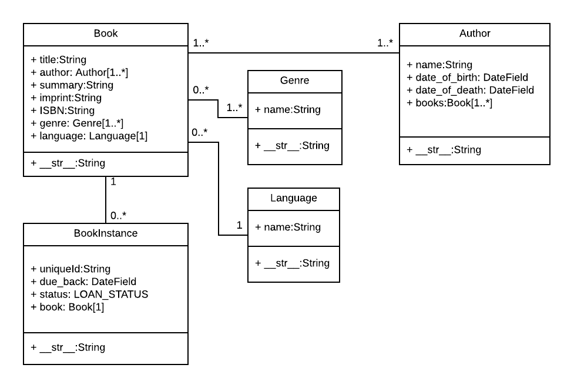

{{LearnSidebar}}{{PreviousMenuNext("Learn/Server-side/Django/skeleton_website", "Learn/Server-side/Django/Admin_site", "Learn/Server-side/Django")}}

Este artigo mostra como definir os modelos para o website [LocalLibrary](/pt-BR/docs/Learn/Server-side/Django/Tutorial_local_library_website). Ele explica o que é um modelo, como ele é declarado e mostra algum dos principais tipos de campo. Ele também mostra brevemente algumas das principais formas pelas quais você pode acessar dados do modelo.

<table class="learn-box standard-table">
  <tbody>
    <tr>
      <th scope="row">Pré-requisitos:</th>
      <td>
        <a href="/pt-BR/docs/Learn/Server-side/Django/skeleton_website"
          >Django Tutorial Part 2: Criar um esqueleto de um site</a
        >.
      </td>
    </tr>
    <tr>
      <th scope="row">Objetivo:</th>
      <td>
        Ser capaz de projetar e criar seus próprios modelos, escolhendo os
        campos de forma apropriada.
      </td>
    </tr>
  </tbody>
</table>

## Visão Geral

Aplicativos Django acessam e gerenciam dados através de objetos Python chamados de modelos (models). Modelos definem a _estrutura_ dos dados armazenados, incluindo os tipos de campos e possivelmente também o seu tamanho máximo, valores default, opções de listas de seleção, texto de ajuda para documentação, texto de labels para formulários, etc. A definição do modelo é independente do banco de dados - você pode escolher um tipo de banco como parte das configurações do seu projeto. Uma vez que você tenha escolhido qual banco será utilizado você precisa conversar diretamente com ele - você somente escreve a estrutura do seu modelo e outros códigos, e o Django faz todo o trabalho sujo de comunicação com o banco para você.

Este tutorial mostra como definir e acessar os modelos para o website [LocalLibrary website](/pt-BR/docs/Learn/Server-side/Django/Tutorial_local_library_website).

## Projetando os modelos para o website [LocalLibrary](/pt-BR/docs/Learn/Server-side/Django/Tutorial_local_library_website)

Antes de começarmos a criar nossos modelos, vale a pena perder alguns minutos pensando sobre os dados que iremos guardar e as relações entre os diferentes modelos que serão criados.

Sabemos que precisamos armazenar informação sobre os livros (título, resumo, autor, idioma, gênero, ISBN) e também que existem várias cópias do mesmo livro na biblioteca (com um id único, status de disponibilidade, etc.). Talvez queiramos armazenar mais informações sobre o autor além de somente seu nome, até porque existem vários autores com o mesmo nome, ou com nomes parecidos. Queremos ordernar a busca dos livros por título, autor, idioma e gênero.

Quando estamos projetando nossos modelos, faz sentido criar modelos separados para cada "objeto". Em nosso caso de estudo, os "objetos" são os livros (a informação de cada livro, não a cópia em si), as cópias dos livros (um livro pode ter mais de uma cópia) e os autores.

Você pode também utilizar modelos para representar opções em uma lista de seleção (por exemplo numa lista suspensa), o que é melhor do que trabalhar com opções predefinidas — isso é recomendado quando nem todas as opções são conhecidas ou podem mudar de acordo com um filtro. Obviamente, para nosso tutorial, modelos candidatos para esse caso são o gênero e o idioma.

Após decidirmos nossos modelos e campos, precisamos pensar no relacionamento dessas informações. Django permite que você defina relações que são um pra um (`OneToOneField`), um pra muitos (`ForeignKey`) e muitos pra muitos (`ManyToManyField`).

Com isso em mente, os diagramas UML de associação, mostram abaixo os modelos que definiremos nesse caso (como caixas).



Como acima, criamos modelos para `Book` (que contém os detalhes genéricos do livro),
`BookInstance` (contém os status das cópias físicas e específicas dos livros disponíveis no sistema) e `Author`. Também decidimos ter um modelo para o gênero (`Genre`), para que os valores possam ser criados/selecionados através da interface administrativa. Decidimos não ter um modelo para o `BookInstance: status` - pois, codificamos os valores em (`LOAN_STATUS`) porque não esperamos que isso mude. Dentro de cada uma das caixas você pode ver o nome do modelo, os campos nomes e tipos e também os métodos e seus tipos de retorno.

O diagrama também mostra as relações entre os modelos, incluindo suas multiplicidades. As multiplicidades são os números no diagrama que mostram as quantidades (máxima e mínima) que cada modelo pode estar presente nos relacionamentos. Por exemplo, a linha que conecta as caixas mostra que `Book` e um `Genre` estão relacionados. Os números próximos ao modelo `Genre` mostram que um livro deve ter um ou mais gêneros (ou quantos você quiser), enquanto os números do outro lado da linha, ao lado do modelo `Book` mostram que um gênero pode ter zero ou muitos livros associados.

> **Nota:** A próxima seção fornece uma explicação básica sobre como os modelos são definidos e usados. Ao ler sobre isso, considere como vamos construir cada um dos modelos conforme o diagrama acima.

## Model primer

Esta seção fornece uma breve visão sobre como um modelo é definido e alguns dos mais importantes campos e argumentos dos campos.

### Definição do Modelo

Modelos são geralmente definidos no arquivo **models.py** em uma aplicação. Eles são implementados como subclasse de `django.db.models.Model`, e podem incluir campos, métodos e metadados. O fragmento de código abaixo, mostra um modelo "típico", chamado `MyModelName`:

```
from django.db import models

class MyModelName(models.Model):
    """Uma típica classe definindo um modelo, derivada da classe Model."""

    # Campos
    my_field_name = models.CharField(max_length=20, help_text='Enter field documentation')
    ...

    # Metadados
    class Meta:
        ordering = ['-my_field_name']

    # Métodos
    def get_absolute_url(self):
        """Retorna a url para acessar uma instancia específica de MyModelName."""
        return reverse('model-detail-view', args=[str(self.id)])

    def __str__(self):
        """ String para representar o objeto MyModelName (no site Admin)."""
        return self.my_field_name
```

Nas seções abaixa, exploraremos detalhadamente cada um dos recursos dentro do modelo:

#### Campos (Fields)

Um modelo pode ter um número árbitrário de campos, de qualquer tipo — cada um representa uma coluna de dados que queremos armazenar em uma de nossas tabelas de banco de dados. Cada registro do banco de dados (row - linha) consitirá em um valor de cada campo. Vamos ver o exemplo visto acima:

```python
my_field_name = models.CharField(max_length=20, help_text='Enter field documentation')
```

Nosso exemplo acima tem um único campo chamado `my_field_name`, do tipo `models.CharField` - o que significa que este campo conterá strings de caracteres alfanuméricos. Os tipos de cada campo são atribuídos usando classes específicas, que determinam o tipo de registro usado para armazenar os dados no banco de dados, juntamente com os critérios de validação a serem usados quando os valores são recebidos de um formulário HTML (ou seja, o que constitui um valor válido). Os tipos de cada campo também podem receber argumentos que especifiquem como o campo é armazenado ou pode ser usado. Neste caso, estamos dando ao nosso campo dois argumentos:

- `max_length=20` — Afima que o valor máximo do comprimento desse campo é de 20 caracteres.
- `help_text='Enter field documentation'` — fornece um rótulo de texto para exibir uma ajuda para os usuários saberem qual valor fornecer, quando esse valor é inserido por um usuário por meio de um formulário HTML.

O nome do campo é usado para se referir a ele em consultas e modelos. Os campos também têm um rótulo, que é especificado como um argumento `(verbose_name)` ou inferido ao capitalizar a primeira letra do nome da variável do campo e substituindo quaisquer sublinhados por um espaço (por exemplo, `my_field_name` teria um rótulo padrão de `My field name`).

A ordem em que os campos são declarados afetará sua ordem padrão, se um modelo for representado em um formulário (por exemplo, no site Admin), embora isso possa ser substituído.

##### Argumentos comuns de um campo

Os seguintes argumentos são comuns e podem ser usados quando declaramos muitos ou a maioria dos diferentes tipos de campos:

- [help_text](https://docs.djangoproject.com/en/2.1/ref/models/fields/#help-text): Fornece um rótulo de texto para formulários HTML (por exemplo, no site admin), conforme descrito acima.
- [verbose_name](https://docs.djangoproject.com/en/2.1/ref/models/fields/#verbose-name): Um nome legível para o campo usado nos rótulos de campo. Se não for especificado, o Django irá inferir o nome detalhado do campo `name`.
- [default](https://docs.djangoproject.com/en/2.1/ref/models/fields/#default): O valor padrão para o campo. Isso pode ser um valor ou um objeto que pode ser chamado. Cada vez que o objeto for chamado será criado um novo registro.
- [null](https://docs.djangoproject.com/en/2.1/ref/models/fields/#null): Se for `True`, o Django armazenará valores em branco como `NULL` no banco de dados, para campos onde isso é apropriado (um `CharField` irá armazenar uma string vazia). O padrão é `False`.
- [blank](https://docs.djangoproject.com/en/2.1/ref/models/fields/#blank):Se for `True`, o campo poderá ficar em branco nos seus formulários. O padrão é `False`, o que significa que a validação de formulário do Django forçará você a inserir um valor. Isso é frequentemente usado com `null = True`, porque se você permitir valores em branco, também desejará que o banco de dados possa representá-los adequadamente.
- [choices](https://docs.djangoproject.com/en/2.1/ref/models/fields/#choices): Um grupo de escolhas para este campo. Se isso for fornecido, o padrão widget de formulário correspondente será uma caixa de seleção com essas opções, em vez do campo de texto padrão.
- [primary_key](https://docs.djangoproject.com/en/2.1/ref/models/fields/#primary-key):Se `True`, define o campo atual como a chave primária do modelo (uma chave primária é uma coluna especial do banco de dados, designada para identificar exclusivamente as diferentes tabelas) . Se nenhum campo for especificado como a chave primária, o Django adicionará automaticamente um campo para essa finalidade.

Existem muitas outras opções - você pode ver [a lista completa de opções aqui](https://docs.djangoproject.com/en/2.1/ref/models/fields/#field-options).

##### Tipos comuns de um campo

A lista a seguir descreve alguns dos tipos de campos mais usados.

- [CharField](https://docs.djangoproject.com/en/2.1/ref/models/fields/#django.db.models.CharField) é usado para definir um tamanho fixo (médio a curto) para a string. Você deve especificar o `max_length (tamanho máximo) para o dado que será armazenado.`
- [TextField](https://docs.djangoproject.com/en/2.1/ref/models/fields/#django.db.models.TextField) é usado para grandes strings de comprimento variado. Você pode especificar um `max_length` (tamanho máximo) para o campo, mas isso é usado somente quando o campo é exibido em formulários (forms) (ele não é imposto no nível do banco de dados).
- [IntegerField](https://docs.djangoproject.com/en/2.1/ref/models/fields/#django.db.models.IntegerField) é um campo para armazenar números inteiros e para validar valores inseridos como números inteiros em formulários.
- [DateField](https://docs.djangoproject.com/en/2.1/ref/models/fields/#datefield) e [DateTimeField](https://docs.djangoproject.com/en/2.1/ref/models/fields/#datetimefield) são usados para armazenar / representar datas e informações de data / hora (como os objetos Python `datetime.date` in e `datetime.datetime`, respectivamente). Esses campos também podem declarar os parâmetros (mutuamente exclusivos) `auto_now = True` (para definir o campo para a data atual toda vez que o modelo é salvo), `auto_now_add` (para definir a data em que o primeiro modelo foi criado) e `default` (para definir uma data padrão que pode ser substituída pelo usuário).
- [EmailField](https://docs.djangoproject.com/en/2.1/ref/models/fields/#emailfield) é usada para armazenara e validar em endereço de email.
- [FileField](https://docs.djangoproject.com/en/2.1/ref/models/fields/#filefield) e [ImageField](https://docs.djangoproject.com/en/2.1/ref/models/fields/#imagefield) são usados para carregar arquivos e imagens respectivamente, (o `ImageField` simplesmente valida de forma adicional que o arquivo enviado é uma imagem). Eles têm parâmetros para definir como e onde os arquivos enviados são armazenados.
- [AutoField](https://docs.djangoproject.com/en/2.1/ref/models/fields/#autofield) é um tipo especial de `IntegerField` que é incrementada automaticamente. Uma chave primária desse tipo é adicionada de forma automatica ao seu modelo, se você não especificar explicitamente um.
- [ForeignKey](https://docs.djangoproject.com/en/2.1/ref/models/fields/#foreignkey) é usado para especificar um relacionamento um-para-muitos com outro modelo do banco de dados (por exemplo, um carro tem um fabricante, mas um fabricante pode fazer muitos carros). O lado "um" do relacionamento é o modelo que contém a "chave" (os modelos que contêm uma "chave estrangeira" referem-se a essa "chave" e estão no lado "muitos" de tal relacionamento).
- [ManyToManyField](https://docs.djangoproject.com/en/2.1/ref/models/fields/#manytomanyfield) é usado para especificar um relacionamento muitos-para-muitos (por exemplo, um livro pode ter vários gêneros e cada gênero pode conter vários livros). Em nosso aplicativo de biblioteca, usaremos isso de maneira muito semelhante às `ForeignKeys`, mas elas podem ser usadas de maneiras mais complicadas para descrever as relações entre os grupos. Eles têm o parâmetro `on_delete` para definir o que acontece quando o registro associado é excluído (por exemplo, um valor de `models.SET_NULL` simplesmente definiria o valor como `NULL`).

Existem muitos outros tipos de campos, incluindo campos para diferentes tipos de números (big integers, small integers, floats), booleanos, URLs, slugs, unique ids e outras informações "relacionadas ao tempo" (duração, tempo, etc.) . Você pode ver a [lista completa AQUI](https://docs.djangoproject.com/en/2.1/ref/models/fields/#field-types).

#### Metadados (metadada)

Você pode declarar o nível de modelo para os metadados declarando `class Meta`, como mostrado.

```python
class Meta:
    ordering = ['-my_field_name']
```

Um dos recursos mais úteis desses metadados é controlar a ordem padrão dos registros retornados, quando você consulta o tipo de modelo. Você faz isso especificando a ordem de correspondência em uma lista de nomes para ordenar (`ordering`) o atributo , conforme mostrado acima. A ordem dependerá do tipo de campo (os campos de caractere são classificados em ordem alfabética, enquanto os campos de data são classificados em ordem cronológica). Como mostrado acima, você pode prefixar o nome do campo com um símbolo de menos (-) para inverter a ordem de classificação.

Então, como exemplo, se optássemos por ordenar livros como este por padrão:

```python
ordering = ['title', '-pubdate']
```

Os livros seriam classificados em ordem alfabética por título, de A-Z e depois por data de publicação dentro de cada título, do mais recente ao mais antigo.

Outro atributo comum é `verbose_name`, um nome detalhado para a classe no singular e plural:

```python
verbose_name = 'BetterName'
```

Outros atributos úteis permitem que você crie e aplique novas "permissões de acesso" para o modelo (as permissões padrão são aplicadas automaticamente), permitem a ordenação com base em outro campo ou declarar que a classe é "abstrata" (uma classe base que você não pode criar registros, e em vez disso, serão derivadas para criar outros modelos).

Muitas das outras opções de metadados controlam qual banco de dados deve ser usado para o modelo e como os dados são armazenados (eles são realmente úteis somente se você precisar mapear um modelo para um banco de dados existente).

A lista completa de opções de metadados pode ser encontrada aqui: [Opções de modelos de metadados](https://docs.djangoproject.com/en/2.1/ref/models/options/) (Django docs).

#### Métodos

Um modelo também pode ter métodos.

**Minimamente, em cada modelo você deve definir o método de classe padrão do Python `__str__()` para retornar uma string legível para cada objeto.** Essa sequência é usada para representar registros individuais no site de administração (e em qualquer outro lugar que você precise se referir a uma instância de modelo). Muitas vezes isso retornará um campo de título ou nome do modelo.

```python
def __str__(self):
    return self.field_name
```

Outro método comum a incluir nos modelos do Django é o `get_absolute_url()`, que retorna uma URL para exibir registros de modelos individuais no site (se você definir esse método, o Django adicionará automaticamente um botão "View on Site" às telas de edição de registros do modelo o site Admin). Um padrão típico para `get_absolute_url ()` é mostrado abaixo.

```python
def get_absolute_url(self):
    """Retorna o URL para acessar uma instância específica do modelo."""
    return reverse('model-detail-view', args=[str(self.id)])
```

> **Nota:**Supondo que você usará URLs como `/ myapplication / mymodelname / 2` para exibir registros individuais para seu modelo (onde "2" é o `id` para um registro específico), você precisará criar um mapeador de URL para passar a resposta e id para uma "vista detalhada do modelo" (que fará o trabalho necessário para exibir o registro). A função `reverse ()` acima é capaz de "inverter" seu mapeador de url (no caso acima chamado 'model-detail-view') para criar uma URL do formato correto.
>
> Claro que para fazer este trabalho você ainda tem que escrever o mapeamento de URL, visão e modelo!

Você também pode definir outros métodos que desejar e chamá-los de seu código ou modelos (desde que eles não utilizem nenhum parâmetro).

### Gestão de modelos

Depois de definir suas classes de modelo, você pode usá-las para criar, atualizar ou excluir registros e executar consultas para obter todos os registros ou subconjuntos específicos de registros. Mostraremos como fazer isso no tutorial quando definirmos nossas visualizações, mas aqui está um breve resumo.

#### Criando e modificando registros

Para criar um registro, você pode definir uma instância do modelo e, em seguida, chamar `save ()`.

```python
# Crie um novo registro usando o construtor do modelo.
record = MyModelName(my_field_name="Instance #1")

# Salve o objeto no banco de dados.
record.save()
```

> **Nota:** Se você não tiver declarado qualquer campo como primary_key, o novo registro receberá um automaticamente, com o ID do nome do campo. Você poderia consultar este campo depois de salvar o registro acima e ele teria um valor de 1.

Você pode acessar os campos nesse novo registro usando a sintaxe de ponto e alterar os valores. Você precisa chamar `save ()` para armazenar valores modificados no banco de dados.

```python
# Acessar valores de campo de modelo usando atributos do Python.
print(record.id) # should return 1 for the first record.
print(record.my_field_name) # should print 'Instance #1'

# Altere o registro modificando os campos e, em seguida, chamando save ().
record.my_field_name = "New Instance Name"
record.save()
```

#### Procurando por registros

Você pode procurar registros que correspondam a um determinado critério usando o atributo de objetos do modelo (fornecido pela classe base).

> **Nota:**Explicar como procurar registros usando nomes de campos e modelos "abstratos" pode ser um pouco confuso. Na discussão abaixo, vamos nos referir a um modelo de livro com campos de título e gênero, onde o gênero também é um modelo com um único `nome` de campo.

Podemos obter todos os registros para um modelo como um `QuerySet`, usando `objects.all()`. O `QuerySet` é um objeto iterável, o que significa que ele contém um número de objetos que podemos iterar / percorrer.

```python
all_books = Book.objects.all()
```

O método `filter ()` do Django nos permite filtrar o `QuerySet` retornado para corresponder a um campo especificado de **texto** ou **numérico** em relação a um critério específico. Por exemplo, para filtrar por livros que contenham "wild" no título e, em seguida, contá-los, poderíamos fazer o seguinte.

```python
wild_books = Book.objects.filter(title__contains='wild')
number_wild_books = Book.objects.filter(title__contains='wild').count()
```

Os campos a serem correspondidos e o tipo de correspondência são definidos no nome do parâmetro de filtro, usando o formato: `field_name_match_type` (observe o sublinhado duplo entre título e contém acima). Acima, estamos filtrando o título com uma correspondência de maiúsculas e minúsculas. Existem muitos outros tipos de correspondência que você pode fazer: icontains (insensitivo a maiúsculas e minúsculas), iexact (correspondência exata que não diferencia maiúsculas e minúsculas), exata (correspondência exata diferencia maiúsculas de minúsculas), gt (maior que), startswith, etc. é [aqui](https://docs.djangoproject.com/en/2.1/ref/models/querysets/#field-lookups).

Em alguns casos, você precisará filtrar um campo que defina um relacionamento um-para-muitos com outro modelo (por exemplo, uma `ForeignKey`). Nesse caso, você pode "indexar" campos no modelo relacionado com sublinhados duplos adicionais. Por exemplo, para filtrar livros com um padrão de gênero específico, você terá que indexar o `nome` por meio do campo de `gênero`, conforme mostrado abaixo:

```python
# Combinará em: ficção, ficção científica, não-ficção etc.
books_containing_genre = Book.objects.filter(genre__name__icontains='fiction')
```

> **Nota:** Você pode usar sublinhados (`__`) para navegar quantos níveis de relacionamentos (`ForeignKey / ManyToManyField`) desejar. Por exemplo, um `Livro` que tinha tipos diferentes, definidos usando um relacionamento "cover" adicional, pode ter um nome de parâmetro: `type__cover__name__exact = 'hard'`.

Há muito mais que você pode fazer com as consultas, incluindo pesquisas para trás de modelos relacionados, encadeando filtros, retornando um conjunto menor de valores, etc. Para obter mais informações, consulte [Fazendo consultas](https://docs.djangoproject.com/en/2.1/topics/db/queries/) (Django Docs).

## Definindo os modelos LocalLibrary

Nesta seção, começaremos a definir os modelos para a biblioteca. Abra models.py (em / locallibrary / catalog /). O código na parte superior da página importa o módulo de models, que contém os modelos da classe base do models. Modelo do qual nossos models herdarão.

```python
from django.db import models

# Create your models here.
```

### Genre model

Copie o código do model `Genre` , que aparece a baixo, e cole no seu arquivo `models.py` , abaixo do código de importação. Esse model guarda informaçoes sobre a categoria do livro — por exemplo se é ficção ou não ficção, romance ou história, etc. Como mencionado acima, criamos o genero como um model em vez de um campo de texto ou um lista de seleção para que os possíveis generos criados possam ser gerenciados pelo banco de dados, em vez de serem codificados.

```
class Genre(models.Model):
    """Model representing a book genre."""
    name = models.CharField(max_length=200, help_text='Enter a book genre (e.g. Science Fiction)')

    def __str__(self):
        """String for representing the Model object."""
        return self.name
```

O model tem apenas um campo do tipo `CharField` (`name`), que é usado para descrever o genero (esse campo é limitado a 200 caracteres e tem um `help_text`). No final da classe Genre declaramos o metodo `__str__()` que retorna o nome do genero definido por um registro especifico. Não foi definido um argumento `verbose_name` , assim o campo será referenciado como `Name` nos forms.

### Book model

Copie o model Book abaixo e cole novamente ao final do seu arquivo. O model Book representa todas as informações disponíveis sobre um livro de maneira geral, mas não incluí detalhes sobre o formato do encadernamento ou disponibilidade para empréstimo. O model usa um `CharField` para representar o `title` (tílutlo) do livro e o `isbn` (veja que o `isbn` recebe um rótulo como "ISBN", usando o primeiro parâmetro não nomeado, porque, de outra forma, o rótulo ficaria "Isbn"). O model usa `TextField` para o campo `summary` porque ele precisa ser um tanto longo.

```
from django.urls import reverse # Used to generate URLs by reversing the URL patterns

class Book(models.Model):
    """Model representing a book (but not a specific copy of a book)."""
    title = models.CharField(max_length=200)

    # Foreign Key used because book can only have one author, but authors can have multiple books
    # Author as a string rather than object because it hasn't been declared yet in the file
    author = models.ForeignKey('Author', on_delete=models.SET_NULL, null=True)

    summary = models.TextField(max_length=1000, help_text='Enter a brief description of the book')
    isbn = models.CharField('ISBN', max_length=13, help_text='13 Character <a href="https://www.isbn-international.org/content/what-isbn">ISBN number</a>')

    # ManyToManyField used because genre can contain many books. Books can cover many genres.
    # Genre class has already been defined so we can specify the object above.
    genre = models.ManyToManyField(Genre, help_text='Select a genre for this book')

    def __str__(self):
        """String for representing the Model object."""
        return self.title

    def get_absolute_url(self):
        """Returns the url to access a detail record for this book."""
        return reverse('book-detail', args=[str(self.id)])
```

Genre é um campo `ManyToManyField`, de forma que um livro pode ter múltiplos gêneros e um gênero pode ter muitos livros. O campor Author é declarado como um `ForeignKey`, logo, cada livro terá somente um autor, mas um autor por der muitos livros (na prática, um livro pode ter múltiplos autores, mas não nesta implementação!)

Em ambos tipos de campo, a classe model relacionada é declarada como primeiro campo não nomeado usando a classe model ou contendo o nome do modelo relacionado. Você deve usar o nome do model como uma string se a classe associada ainda não tiver sido definida no arquivo, antes de referenciá-la. Outro parâmetro de interesse no campo `author` é `null=True`, o qual permite ao banco de dados armazer um valor `Null` se nenhum autor for selecionado, e, `on_delete=models.SET_NULL`, o qual definirá o valor `author` como `Null` se o registro do autor associado for excluído.

O mode também defini `__str__()`, usando o `title` do livro para representar o registro do `Book`. O método final, `get_absolute_url()`, retorna a URL que pode ser usada para acessar o registro detalhado deste modelo (para que isto funcione, teremos que definir um mapa de URL com o nome `book-detail` e associá-la a uma view e a um template.).

### BookInstance model

Em seguida, copie o modelo `BookInstance` (exibido a abaixo) depois dos outros modelos. O `BookInstance` representa um exemplar específico do livro que pode ser emprestado, indica se ela está disponível ou a data programada de restituição, "imprint" ou detalhes da versão, e, um id único do livro na biblioteca.

Alguns dos campos e métodos serão familiares agora. O model usa

- `ForeignKey` para identificar o `Book` associado (cada livro pode ter muitos exemplares, porém uma cópia pode ter sometne um `Book`).
- `CharField` para representar o imprint (edição específica) do livro.

```python
import uuid # Required for unique book instances

class BookInstance(models.Model):
    """Model representing a specific copy of a book (i.e. that can be borrowed from the library)."""
    id = models.UUIDField(primary_key=True, default=uuid.uuid4, help_text='Unique ID for this particular book across whole library')
    book = models.ForeignKey('Book', on_delete=models.SET_NULL, null=True)
    imprint = models.CharField(max_length=200)
    due_back = models.DateField(null=True, blank=True)

    LOAN_STATUS = (
        ('m', 'Maintenance'),
        ('o', 'On loan'),
        ('a', 'Available'),
        ('r', 'Reserved'),
    )

    status = models.CharField(
        max_length=1,
        choices=LOAN_STATUS,
        blank=True,
        default='m',
        help_text='Book availability',
    )

    class Meta:
        ordering = ['due_back']

    def __str__(self):
        """String for representing the Model object."""
        return f'{self.id} ({self.book.title})'
```

Nós declaramos adicionalmente alguns tipos novos de campos:

- `UUIDField` é usado no campo `id` para definí-lo como `primary_key` deste model. Este tipo de campo aloca um valor único global para cada instância (um para cada livro encontrado na biblioteca).
- `DateField` é usado para a data `due_back` (na qual o livro deve retonar e ficar disponível após um empréstimo ou uma manutenção). O valor pode ser `blank` ou `null` (para quando o livro estiver disponível). O model metadata (`Class Meta`) usa este campo para ordenar os registros quando eles são retornados em uma query.
- `status` é um `CharField` que define uma lista de opção/seleção. Como pode ser visto, nós definimos uma dupla contendo pares de valores-chave e a passamos no argumento da opção. O valor do par valor-chave é um valor que o usuário pode selecionar, enquanto que a chave é o valor que realmetne será salvo se a opção for selecionada. Nós também definimos um valor default como "m" (maintenance), uma vez que os livros serão inicialmente criados como indisponíveis até que eles sejam disponibilizados nas prateleiras.

O model `__str__()` representa o objeto `BookInstance` usando a combinação do seu id único e o título do `Book` associado.

> **Nota:** Um pouco sobre Python:
>
> - Começando com Python 3.6, pode ser usada a sintaxe de interpolação (também conhecida como f-strings): `f'{self.id} ({self.book.title})'`.
> - Em versões anteriores deste tutorial, nós estávamos usando a sintaxe de [formatted string](https://www.python.org/dev/peps/pep-3101/), a qual também é uma maneira válida de formatar strings em Python (e.g. `'{0} ({1})'.format(self.id,self.book.title)`).

### Author model

Copie o model `Author` (exibido abaixo) na sequência do código existente em **models.py**.

Todos os campos/métodos já devem ser familiares agora. O model define um autor como tendo um nome, sobrenome, data de nascimento e data de morte (opcionalmente). Ele especifica que `__str__()` retorna por default sobrenome e nome, nesta ordem. O método `get_absolute_url()` reverte o mapaeamento da URL `author-detail` para obter a URL de display individual author.

```python
class Author(models.Model):
    """Model representing an author."""
    first_name = models.CharField(max_length=100)
    last_name = models.CharField(max_length=100)
    date_of_birth = models.DateField(null=True, blank=True)
    date_of_death = models.DateField('Died', null=True, blank=True)

    class Meta:
        ordering = ['last_name', 'first_name']

    def get_absolute_url(self):
        """Returns the url to access a particular author instance."""
        return reverse('author-detail', args=[str(self.id)])

    def __str__(self):
        """String for representing the Model object."""
        return f'{self.last_name}, {self.first_name}'
```

## Rode novamente a migração do banco de dados

Todos os modelos foram criados. Agora rode a migração do banco de dados para adicioná-los ao seu banco de dados.

```
python3 manage.py makemigrations
python3 manage.py migrate
```

## Language model — desafio

Considere que um benfeitor local doe uma quantidade de livros escritos em outro idioma (digamos, Farsi). O desafio é desenvolver como eles seriam melhor representados no website da nossa biblioteca, e, então, adicioná-lo no models.

Algumas coisas a considerar:

- O idioma seria associado ao `Book`, `BookInstance`, ou algum outro objeto?
- Os diferentes idiomas seriam representados usando model, como campo de texto livre ou codificado como uma lista de seleção?

Depois de decidido, adicione o campo. Pode ser visto o que decidimos no Github [aqui](https://github.com/mdn/django-locallibrary-tutorial/blob/master/catalog/models.py).

## Resumo

Neste artículo vimos como os models são definidos, e, então, usamos esta informação para desenhar e implementar modelos apropriados para o website _LocalLibrary_.

Neste ponto faremos um rápido desvio da criação do site para ver o _Django Administration site_. Este site nos permitirá adicionar alguns dados à biblioteca, os quais podemos então exibir usando nossos próprios views e templates (ainda não criados).

## Veja também

- [Escrevendo nossa primeira app Django, parte 2](https://docs.djangoproject.com/en/2.1/intro/tutorial02/) (Django docs)
- [Fazendo queries](https://docs.djangoproject.com/en/2.1/topics/db/queries/) (Django Docs)
- [Referência a QuerySet API](https://docs.djangoproject.com/en/2.1/ref/models/querysets/) (Django Docs)

{{PreviousMenuNext("Learn/Server-side/Django/skeleton_website", "Learn/Server-side/Django/Admin_site", "Learn/Server-side/Django")}}
