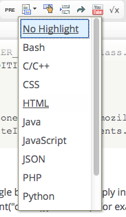
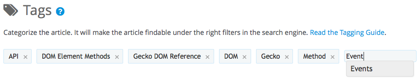

{{MDNSidebar}}

Em um esforço para apresentar a documentação de maneira organizada, padronizada e fácil de ler a guia de estilo MDN Web Docs descreve como o texto deve ser organizado, escrito, formatado, e assim por diante. Estas sao orientações mais do que regras estritas. Nos estamos mais interessados em conteúdo do que em formatação, então não se sinta obrigado a aprender a guia de estilo antes de contribuir. Não fique chateado/a ou surpreso/a caso algum/a voluntário/a trabalhador/a edite o seu trabalho de acordo com esta guia.

Se você esta procurando por coisas específicas sobre como determinado tipo de página deve ser estruturado, veja a [página sobre guia de layout MDN](/pt-BR/docs/MDN/Contribute/Content/Layout).

Os aspetos relacionado a linguagem desta guia aplicam-se principalmente a documentação em Inglês. Outras idiomas devem ter (e são bem-vindos a criar) seu próprio guia de estilo. Estes devem ser publicados como sub-páginas da página do time de localização.

Para os estilos padrão que se aplicam ao conteúdo escrito por outros sites que não sejam a MDN, referir-se a [guia de estilo Única Mozilla](http://www.mozilla.org/pt-BR/styleguide/).

## Básico

O melhor lugar para começar em qualquer publicação extensa sobre guia de estilo é com padrões de texto muito simples para ajudar a manter a consistência da documentação. As seguintes seções esboçam alguns destes padrões básicos para ajudar você.

### Título das Páginas

Títulos de páginas são usados em resultados de pesquisa e também usados para estruturar a hierarquia da página na lista de breadcrumb(literalmente migalhas de pão) na parte superior da página. O título da página (que é exibido na parte superior da página e nos resultados de pesquisa) pode ser diferente da página "slug", que é a parte do URL da página que segue _"\<local>/docs/"._

#### Maisuculização de títulos e cabeçalhos

Títulos de páginas e seções de cabeçalho devem usar letras maiúsculas no estilo da frase (Maiúsculas so na primeira palavra e nomes próprios) em vez de letras maiúsculas no estilo de título:

- **Correto**: "Um novo método para criar sobreposições Javascript"
- **Incorreto**: "Um Novo Método para Criar Sobreposições Javascript"

Nós temos muitas páginas antigas que foram escritas antes que essa regra de estilo fosse estabelecida. Sinta-se livre para atualizá-las se achar necessário. Estamos atualizando-as gradualmente.

#### Escolhendo títulos e slugs

Slugs de página devem ser mantidas curtas; quando criar um novo nível de hierarquia, o componente do novo nível no slug, geralmente, deve ser só uma ou duas palavras.

Títulos de páginas, por outro lado, podem ser grandes o quanto quiser, sendo razoável, e devem ser descritivos.

#### Criando novas subárvores

Quando você precisar adicionar vários artigos sobre um tópico ou um assunto do tópico, você normalmente fará isso criando uma página de destino e adicionando subpáginas para cada um dos artigos individuais. A página de destino deve abrir com um ou dois parágrafos descrevendo o tópico ou a técnologia e, em seguida, fornecer uma lista de subpáginas com descrições de cada página. Você pode automatizar a inserção de páginas na lista usando algumas macros que criamos.

Por exemplo, considere a guia [JavaScript](/pt-BR/docs/Web/JavaScript), que é estruturada da seguinte forma:

- [JavaScript/Guide](/pt-BR/docs/Web/JavaScript/Guide) - Página principal do sumário.
- [JavaScript/Guide/JavaScript Overview](/pt-BR/docs/Web/JavaScript/Guide/JavaScript_Overview)
- [JavaScript/Guide/Functions](/pt-BR/docs/JavaScript/Guide/Functions)
- [JavaScript/Guide/Details of the Object Model](/pt-BR/docs/JavaScript/Guide/Details_of_the_Object_Model)

Tente evitar colocar seu artigo no topo da hierarquia, o que torna lento o site e menos eficiente a pesquisa e a navegação.

### Orientações gerais do conteúdo do artigo

Quando estiver escrevendo qualquer documento é importante conhecer o quanto falar. Se ficar divagando muito o artigo fica tedioso de ler e ninguém ira usa-lo. Escolher a quantidade certa a falar sobre o assunto é muito importante por diversas razões. Entre essas razões: assegurar que o leitor encontre a informação que eles precisam, prover suficiente material de qualidade para os engines de pesquisa poderem analizar e classificar o artigo de maneira adequada. Iremos discutir ao respeito disso aqui. Para aprender um pouco mais sobre como fazer as páginas são classificadas pelos engines de pesquisa, vejam o artigo [Como escrever SEO para MDN](/pt-BR/docs/MDN/Contribute/Howto/Write_for_SEO).

### Seções, parágrafos e novas linhas

Use os níveis de cabeçalho em ordem decrescente na hierarquia: {{HTMLElement("h2")}} depois {{HTMLElement("h3")}} depois {{HTMLElement("h4")}}, sem pular níveis. {{HTMLElement("h2")}} é o maior nível permitido, pois {{HTMLElement("h1")}} está reservado para o título da página. Se perceber que precisará de mais de 3 ou 4 níveis de cabeçalho, considere fragmentar seu artigo em artigos menores, ou colocando uma landing page, linkando estes com o [Next](https://github.com/mdn/yari/blob/main/kumascript/macros/Next.ejs), [Previous](https://github.com/mdn/yari/blob/main/kumascript/macros/Previous.ejs), e [PreviousNext](https://github.com/mdn/yari/blob/main/kumascript/macros/PreviousNext.ejs) macros.

O Enter (ou Return) do seu teclado inicia um novo parágrafo. Para inserir uma nova linha sem espaço, faça Shift + Enter.

#### Algumas regras

- Não crie listas com apenas um item. Não divida um tópico em um. No mínimo dois, ou nenhum.
- Não crie cabeçalhos em sequência. É visualmente feio, e é importante para os leitores apresentar algum texto antes de iniciar outras seções.
- Evite usar macros de cabeçalhos, com exceção de algumas macros específicas para tal.
- Não use estilos e classes nos cabeçalhos; especificamente falando do elemento \<code>. Portanto, não faça um cabeçalho "Usando a interface `SuperAmazingThing`". Em vez disso, escreva "Usando a interface SuperAmazingThing".

### Text formatting and styles

Use the "Formatting Styles" drop-down list to apply predefined styles to selected content.

> **Nota:** The "Note" style is used to call out important notes, like this one.

> **Aviso:** Similarly, the "Warning" style creates warning boxes like this.

Unless specifically instructed to do so, **do not** use the HTML `style` attribute to manually style content. If you can't do it using a predefined class, drop into [Matrix](https://chat.mozilla.org/#/room/#mdn:mozilla.org) and ask for help.

### Code sample style and formatting

#### Tabs and line breaks

Use two spaces per tab in all code samples. Code should be indented cleanly, with open-brace ("{") characters on the same line as the statement that opens the block. For example:

```js
if (condition) {
  /* handle the condition */
} else {
  /* handle the "else" case */
}
```

Long lines shouldn't be allowed to stretch off horizontally to the extent that they require horizontal scrolling to read. Instead, break at natural breaking points. Some examples follow:

```js
if (class.CONDITION || class.OTHER_CONDITION || class.SOME_OTHER_CONDITION
       || class.YET_ANOTHER_CONDITION ) {
  /* something */
}

var toolkitProfileService = Components.classes["@mozilla.org/toolkit/profile-service;1"]
                           .createInstance(Components.interfaces.nsIToolkitProfileService);
```

#### Inline code formatting

Use the "Code" button (labeled with two angle brackets "<>") to apply inline code-style formatting to function names, variable names, and method names (this uses the {{HTMLElement("code")}} element). For example, "the `frenchText()` function".

Method names should be followed by a pair of parentheses: `doSomethingUseful()`. This helps to differentiate methods from other code terms.

#### Syntax highlighting

Entire lines (or multiple lines) of code should be formatted using syntax highlighting rather than the {{HTMLElement("code")}} element. Click the "pre" button in the toolbar to create the preformatted content box in which you'll then write your code. Then, with the text entry cursor inside the code box, select the appropriate language from the language list button to the right of the "pre" button, as seen in the screenshot to the right. The following example shows text with JavaScript formatting:

```js
for (var i = 0, j = 9; i <= 9; i++, j--)
  document.writeln("a[" + i + "][" + j + "]= " + a[i][j]);
```

If no appropriate transformation is available, use the `pre` tag without specifying a language ("No Highlight" in the language menu).

```
x = 42;
```

#### Styling HTML element references

There are various specific rules to follow when writing about HTML elements, in order to consistently describe the various components of elements, and to ensure that they're properly linked to detailed documentation.

- Element names
  - : Use the [`HTMLElement`](https://github.com/mdn/yari/blob/main/kumascript/macros/HTMLElement.ejs) macro, which creates a link to the page for that element. For example, writing \\{{HTMLElement("title")}} produces "{{HTMLElement("title")}}". If you don't want to create a link, **enclose the name in angle brackets** and use "Code (inline)" style (e.g., `<title>`).
- Attribute names
  - : Use **bold face**.
- Attribute definitions
  - : Use the [`htmlattrdef`](https://github.com/mdn/yari/blob/main/kumascript/macros/htmlattrdef.ejs) macro (e.g., \\{{htmlattrdef("type")}}) for the definition term, so that it can be linked to from other pages, then use the [`htmlattrxref`](https://github.com/mdn/yari/blob/main/kumascript/macros/htmlattrxref.ejs) macro (e.g., \\{{htmlattrxref("attr","element")}}) to reference attribute definitions.
- Attribute values
  - : Use "Code (inline)" style, and do not use quotation marks around strings, unless needed by the syntax of a code sample. E.g.: When the **type** attribute of an `<input>` element is set to `email` or `tel` ...
- Labeling attributes
  - : Use labels like {{HTMLVersionInline(5)}} thoughtfully. For example, use them next to the bold attribute name but not for every occurrence in your body text.

### Latin abbreviations

#### In notes and parentheses

- Common Latin abbreviations (etc., i.e., e.g.) may be used in parenthetical expressions and in notes. Use periods in these abbreviations.

  - **Correct**: Web browsers (e.g. Firefox) can be used ...
  - **Incorrect**: Web browsers e.g. Firefox can be used ...
  - **Incorrect**: Web browsers, e.g. Firefox, can be used ...
  - **Incorrect**: Web browsers, (eg: Firefox) can be used ...

#### In running text

- In regular text (i.e. text outside of notes or parentheses), use the English equivalent of the abbreviation.

  - **Correct**: ... web browsers, and so on.
  - **Incorrect**: ... web browsers, etc.
  - **Correct**: Web browsers such as Firefox can be used ...
  - **Incorrect**: Web browsers e.g. Firefox can be used ...

#### Meanings and English equivalents of Latin abbreviations

| Abbrev | Latin            | English                 |
| ------ | ---------------- | ----------------------- |
| cf.    | _confer_         | compare                 |
| e.g.   | _exempli gratia_ | for example             |
| et al. | _et alii_        | and others              |
| etc.   | _et cetera_      | and so forth, and so on |
| i.e.   | _id est_         | that is, in other words |
| N.B.   | _nota bene_      | note well               |
| P.S.   | _post scriptum_  | postscript              |

> **Nota:** Always consider whether it's truly beneficial to use a Latin abbreviation. Some of these are used so rarely that many readers won't understand the meaning, and others are often confused with one another. And be sure that **you** use them correctly, if you choose to do so. For example, be careful not to confuse "e.g." with "i.e.", which is a common error.

### Acronyms and abbreviations

#### Capitalization and periods

Use full capitals and delete periods in all acronyms and abbreviations, including organizations such as "US" and "UN".

- **Correct**: XUL
- **Incorrect**: X.U.L.; Xul

#### Expansion

On the first mention of a term on a page, expand acronyms likely to be unfamiliar to users. When in doubt, expand it, or, better, link it to the article or [glossary](/pt-BR/docs/Glossary) entry describing the technology.

- **Correct**: "XUL (XML User Interface Language) is Mozilla's XML-based language..."
- **Incorrect**: "XUL is Mozilla's XML-based language..."

#### Plurals of acronyms and abbreviations

For plurals of acronyms or abbreviations, add _s_. Don't use an apostrophe. Ever. Please.

- **Correct**: CD-ROMs
- **Incorrect**: CD-ROM's

### Capitalization

Use standard English capitalization rules in body text, and capitalize "World Wide Web" and "Web".

Keyboard keys should use sentence-style capitalization, not all-caps capitalization. For example, "Enter" not "ENTER."

### Contractions

Use contractions (e.g. "don't", "can't", "shouldn't") if you prefer. We're not that formal!

### Pluralization

Use English-style plurals, not the Latin- or Greek-influenced forms.

- **Correct**: syllabuses, octopuses
- **Incorrect**: syllabi, octopi

### Hyphenation

Hyphenate compounds when the last letter of the prefix is a vowel and is the same as the first letter of the root.

- **Correct**: email, re-elect, co-op
- **Incorrect**: e-mail, reelect, coop

### Gender-neutral language

It is a good idea to use gender-neutral language in any kind of writing where gender is irrelevant to the subject matter, to make the text as inclusive as possible. So for example, if you are talking about the actions of a specific man, usage of he/his would be fine, but if the subject is a person of either gender, he/his isn't really appropriate.

Let's take the following example:

> A confirmation dialog appears, asking the user if he allows the web page to make use of his web cam.

> A confirmation dialog appears, asking the user if she allows the web page to make use of her web cam.

Both versions in this case are gender-specific. This could be fixed by using gender-neutral pronouns:

> A confirmation dialog appears, asking the user if they allow the web page to make use of their web cam.

> **Nota:** MDN allows the use of this very common syntax (which is controversial among usage authorities), in order to make up for the lack of a neutral gender in English. The use of the third-person plural as a neutral gender pronoun (that is, using "they," them", "their," and "theirs") is an accepted practice, commonly known as "[singular 'they.'](http://en.wikipedia.org/wiki/Singular_they)"

You can use both genders:

> A confirmation dialog appears, asking the user if he or she allows the web page to make use of his/her web cam.

making the users plural:

> A confirmation dialog appears, asking the users if they allow the web page to make use of their web cams.

The best solution, of course, is to rewrite and eliminate the pronouns completely:

> A confirmation dialog appears, requesting the user's permission for web cam access.

> A confirmation dialog box appears, which asks the user for permission to use the web cam.

The last way of dealing with the problem is arguably better, as it is not only grammatically more correct but removes some of the complexity associated with dealing with genders across different languages that may have wildly varying gender rules. This can make translation easier, both for readers reading English, then translating it into their own language as they read, and for localizers translating articles into their own language.

### Numbers and numerals

#### Dates

For dates (not including dates in code samples) use the format "January 1, 1990".

- **Correct**: February 24, 2006
- **Incorrect**: February 24th, 2006; 24 February, 2006; 24/02/2006

Alternately, you can use the YYYY/MM/DD format.

- **Correct**: 2006/02/24
- **Incorrect**: 02/24/2006; 24/02/2006; 02/24/06

#### Decades

For decades, use the format "1990s". Don't use an apostrophe.

- **Correct**: 1990s
- **Incorrect**: 1990's

#### Plurals of numerals

For plurals of numerals add "s". Don't use an apostrophe.

- **Correct**: 486s
- **Incorrect**: 486's

#### Commas

In running text, use commas only in five-digit and larger numbers.

- **Correct**: 4000; 54,000
- **Incorrect**: 4,000; 54000

### Punctuation

#### Serial comma

**Use the serial comma**. The serial (also known as "Oxford") comma is the comma that appears before the conjunction in a series of three or more items.

- **Correct**: I will travel on trains, planes, and automobiles.
- **Incorrect**: I will travel on trains, planes and automobiles.

> **Nota:** This is in contrast to the [One Mozilla style guide](http://www.mozilla.org/pt-BR/styleguide/), which specifies that the serial comma is not to be used. MDN is an exception to this rule.

### Spelling

For words with variant spellings, always use the first entry at [Answers.com](http://www.answers.com/library/Dictionary). Do not use variant spellings.

- **Correct**: localize, honor
- **Incorrect**: localise, honour

### Terminology

#### Obsolete vs. deprecated

It's important to be clear on the difference between the terms **obsolete** and **deprecated**.

- Obsolete:
  - : On MDN, the term **obsolete** marks an API or technology that is not only no longer recommended, but also no longer implemented in the browser. For Mozilla-specific technologies, the API is no longer implemented in Mozilla code; for Web standard technology, the API or feature is no longer supported by current, commonly-used browsers.
- Deprecated:
  - : On MDN, the term **deprecated** marks an API or technology that is no longer recommended, but is still implemented and may still work. These technologies will in theory eventually become _obsolete_ and be removed, so you should stop using them. For Mozilla-specific technologies, the API is still supported in Mozilla code; for Web standard technology, the API or feature has been removed or replaced in a recent version of the defining standard.

#### HTML elements

Use "elements" to refer to HTML and XML elements, rather than "tags". In addition, they should almost always be wrapped in "<>", and should be in the {{HTMLElement("code")}} style. Also, at least the first time you reference a given element in a section should use the [`HTMLElement`](https://github.com/mdn/yari/blob/main/kumascript/macros/HTMLElement.ejs) macro, to create a link to the documentation for the element (unless you're writing within that element's reference document page).

- **Correct**: the {{HTMLElement("span")}} element
- **Incorrect**: the span tag

#### User interface actions

In task sequences, describe user interface actions using the imperative mood. Identify the user interface element by its label and type.

- **Correct**: Click the Edit button.
- **Incorrect**: Click Edit.

### Voice

While the active voice is generally preferred, the passive voice is also acceptable, given the informal feel of our content. Try to be consistent, though.

## Wiki markup and usage

### External links

To automatically create a link to a Bugzilla bug, use this template:

```
\{{Bug(322603)}}
```

This results in:

{{Bug(322603)}}

For WebKit bugs, you can use this template:

```
\{{Webkitbug("322603")}}
```

This results in:

{{Webkitbug("322603")}}

### Page tags

Tags provide meta information about a page and/or indicate that a page has specific improvements needed to its content. Every page in the wiki should have tags. You can find details on tagging in our [How to properly tag pages](/pt-BR/docs/MDN/Contribute/Howto/Tag) guide.

The tagging interface lives at the bottom of a page while you're in edit mode, and looks something like this:



To add a tag, click in the edit box at the end of the tag list and type the tag name you wish to add. Tags will autocomplete as you type. Press enter (or return) to submit the new tag. Each article may have as many tags as needed. For example, an article about using JavaScript in AJAX programming might have both "JavaScript" and "AJAX" as tags.

To remove a tag, simply click the little "X" icon in the tag.

#### Tagging pages that need work

In addition to using tags to track information about the documentation's quality and content, we also use them to mark articles as needing specific types of work.

#### Tagging obsolete pages

Use the following tags for pages that are not current:

- _Junk_: Use for spam, pages created by mistake, or content that is so bad that it should be deleted. Pages with this tag are deleted from time to time.
- _Obsolete_: Use for content that is technically superceded, but still valid in context. For example an HTML element that is obsolete in HTML5 is still valid in HTML 4.01. You can also use the [`obsolete_header`](https://github.com/mdn/yari/blob/main/kumascript/macros/Obsolete_Header.ejs) macro to put a prominent banner on the topic.
- _Archive_: Use for content that is technically superceded and no longer useful. If possible, add a note to the topic referring readers to a more current topic. For example, a page that describes how to use the Mozilla CVS repository should refer readers to a current topic on using Mercurial repos. (If no corresponding current topic exists, use the _NeedsUpdate_ tag, and add an explanation on the Talk page.) Pages with the Archive tag are eventually moved from the main content of MDN to the [Archive](/pt-BR/docs/Archive) section.

### SEO summary

The SEO summary is a very short summary of the page. It will be reported as a summary of the article to robots crawling the site, and will then appear in search results for the page. It is also used by macros that automate the construction of landing pages inside MDN itself.

By default, the first pagragraph of the page is used as the SEO summary. However you can override this behavior by marking a section with the ["SEO summary" style in the WYSIWYG editor](/pt-BR/docs/Project:MDN/Contributing/Editor_guide/Editing#Formatting_styles).

### Landing pages

**Landing pages** are pages at the root of a topic area of the site, such as the main [CSS](/pt-BR/docs/CSS) or [HTML](/pt-BR/docs/HTML) pages. They have a standard format that consists of three areas:

1. A brief (typically one paragraph) overview of what the technology is and what it's used for. See [Writing a landing page overview](#writing_a_landing_page_overview) for tips.
2. A two-column list of links with appropriate headings. See [Creating a page link list](#creating_a_page_link_list) for guidelines.
3. An **optional** "Browser compatibility" section at the bottom of the page.

#### Creating a page link list

The link list section of an MDN landing page consists of two columns. These are created using the following HTML:

```html
<div class="row topicpage-table">
  <div class="section">
    ... left column contents ...
  </div>
  <div class="section">
    ... right column contents ...
  </div>
</div>
```

The left column should be a list of articles, with an `<h2>` header at the top of the left column explaining that it's a list of articles about the topic (for example "Documentation and tutorials about foo"); this header should use the CSS class "Documentation". Below that is a `<dl>` list of articles with each article's link in a `<dt>` block and a brief one-or-two sentence summary of the article in the corresponding `<dd>` block.

The right column should contain one or more of the following sections, in order:

- Getting help from the community
  - : This should provide information on Matrix rooms and mailing lists available about the topic. The heading should use the class "Community".
- Tools
  - : A list of tools the user can look at to help with the use of the technology described in this section of MDN. The heading should use the class "Tools".
- Related topics
  - : A list of links to landing pages for other, related, technologies of relevance. The heading should use the class "Related_Topics".

**<<\<finish this once we finalize the landing page standards>>>**

## Using, inserting images

It's sometimes helpful to provide an image in an article you create or modify, especially if the article is very technical. To include an image:

1. Attach the desired image file to the article (at the bottom of every article in edit mode)
2. Create an image in the WYSIWYG editor
3. In the WYSIWYG editor in the drop-down list listing attachments, select the newly created attachment which is your image
4. Press OK.

## Other References

### Preferred style guides

If you have questions about usage and style not covered here, we recommend referring to the [Economist style guide](http://www.economist.com/research/StyleGuide/) or, failing that, the [Chicago Manual of Style](http://www.amazon.com/gp/product/0226104036/).

### Preferred dictionary

For questions of spelling, please refer to [Answers.com](http://www.answers.com/library/Dictionary). The spell-checker for this site uses American English. Please do not use variant spellings (e.g., use _honor_ rather than _honour_).

We will be expanding the guide over time, so if you have specific questions that aren't covered in this document, please send them to the [MDC mailing list](/pt-BR/docs/Project:Community) or [project lead](/User:Sheppy) so we know what should be added.

### MDN-specific

- [Custom CSS classes](/pt-BR/docs/Project:Custom_CSS_Classes) defined for all MDC pages.
- [Custom templates](/pt-BR/docs/Project:Custom_Templates) created for use on MDC, with explanations.

### Language, grammar, spelling

If you're interested in improving your writing and editing skills, you may find the following resources to be helpful.

- [On Writing Well](http://www.amazon.com/Writing-Well-30th-Anniversary-Nonfiction/dp/0060891548), by William Zinsser (Amazon link)
- [Style: The Basics of Clarity and Grace](http://www.amazon.com/Style-Basics-Clarity-Grace-4th/dp/0205830765/), by Joseph Williams and Gregory Colomb (Amazon link)
- [American Heritage Book of English Usage](http://www.bartleby.com/64/)
- [Common Errors in English](http://www.wsu.edu/~brians/errors/)
- [English Grammar FAQ](http://www-personal.umich.edu/~jlawler/aue.html) (alt.usage.english)
- [Bob's quick guide to the apostrophe, you idiots](http://www.angryflower.com/bobsqu.gif) (funny)
- [Merriam-Webster's Concise Dictionary of English Usage](http://www.amazon.com/Merriam-Websters-Concise-Dictionary-English-Usage/dp/B004L2KNI2) (Amazon link): Scholarly but user-friendly, evidence-based advice; very good for non-native speakers, especially for preposition usage.
