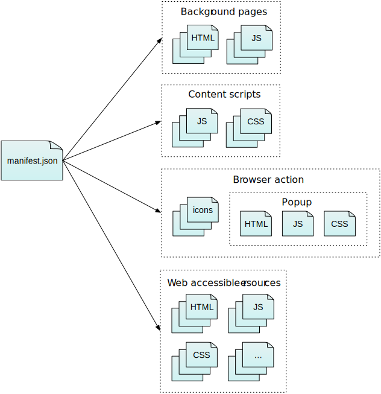

Uma extensão consiste de uma coleção de arquivos, empacotados para distribuição e instalação. Nesse artigo vamos falar rapidamente sobre os arquivos que podem estar presentes em uma extensão.

Toda extensão contém um arquivo chamado ["manifest.json"](/pt-BR/Add-ons/WebExtensions/Anatomy_of_a_WebExtension#manifest.json). Ele pode conter ponteiros para quatro outros tipos de arquivos:

- [background pages](/pt-BR/Add-ons/WebExtensions/Anatomy_of_a_WebExtension#Background_pages): implementação de lógica de longa duração
- [content scripts](/pt-BR/Add-ons/WebExtensions/Anatomy_of_a_WebExtension#Content_scripts): executado no contexto de páginas web
- [browser action files](/pt-BR/Add-ons/WebExtensions/Anatomy_of_a_WebExtension#Browser_actions): implementação de botões na toolbar
- [web accessible resources](/pt-BR/Add-ons/WebExtensions/Anatomy_of_a_WebExtension#Web_accessible_resources): torna o conteúdo do pacote acessível a páginas web e scripts de conteúdo



## manifest.json

Esse é o único arquivo que está presente em toda WebExtension. Ele contém metadados básicos sobre a extensão, tais como o nome, a versão e as permissões que ela necessita. Também provê ponteiros para outros arquivos na extensão.

Para mais detalhes sobre o arquivo "manifest.json", acesse a [página de referência.](/pt-BR/Add-ons/WebExtensions/manifest.json)

## Background pages

Muitas vezes as WebExtensions precisam manter um estado ou performance operativa de longa duração, independentemente do ciclo de vida das páginas ou janelas do navegador. As background pages e os scripts servem pra isso.

Background scripts são carregados assim que a extensão tem sua carga concluída, e permanecem carregados até que ela seja desativada ou desinstalada. No script você pode fazer uso de qualquer uma das WbExtensions APIs.

Os background scripts não possuem acesso direto às páginas web. No entanto, eles podem carregar scripts de conteúdo na página, e podem se comunicar com os scripts de conteúdo usando uma API de envio de mensagens.

Você pode incluir uma background page usando a chave `background` no "manifest.json". Você não precisa informar a sua própria background page. Se você incluir uma página de background, um arquivo vazio será criado.

```json
// manifest.json

"background": {
  "scripts": ["background-script.js"]
}
```

No entanto, você pode escolher informar a página de background como um arquivo HTML a parte:

```json
// manifest.json

"background": {
  "page": "background-page.html"
}
```

## Scripts de conteúdo

Use os scripts de conteúdo para acessar e manipular páginas web. Scripts de conteúdo são carregados dentro das páginas web e executados em um contexto particular nessa página.

Eles podem ver e manipular páginas DOM,

Scripts de conteúdo podem ver e manipular o DOM das páginas, da mesma forma como os scripts normais carregados pela página.

Ao contrário dos scripts normais, os scripts de conteúdo podem:

- fazer requisições XHR cross-domain
- utilizar um pequeno subconjunto de WebExtension APIs
- trocar mensagens com os scripts de background e acessar indiretamente todas as WebExtensions APIs.

Scripts de conteúdo não podem acessar diretamente os scripts normais da página, mas podem trocar mensagens com eles através do uso da API window\.postMessage.

Normalmente, quando falamos de scripts de conteúdo, estamos nos referindo a JavaScript, mas é possível injetar CSS em paginas web que utilizam o mesmo mecanismo.

Você pode injetar scripts de conteúdo em páginas web de duas formas: anexando os scripts para todas as páginas correspondentes a um padrão de URL, ou através de programação a partir de um script de background.

Para injetar scripts em páginas com base na URL, use a chave `content_scripts` no "manifest.json", informando um ou mais scripts e um array com os padrões:

```json
// manifest.json

"content_scripts": [
  {
    "matches": ["*://*.mozilla.org/*"],
    "js": ["my-script.js"]
  }
]
```

Se a URL da página corresponder aos padrões passados na chave `matches`, os scripts passados na chave `js` serão carregados.

Para injetar os scripts na página via programação (por exemplo, quando o usuário clicar em um botão) use a API `tabs`:

```js
// background.js

chrome.tabs.executeScript({
  file: "my-script.js",
});
```

Aprenda mais sobre scripts de conteúdo lendo sua [documentação](/pt-BR/Add-ons/SDK/Guides/Content_Scripts).

## Ações de navegador

Uma "ação de navegador" é um botão que você pode adicionar na barra de ferramentas do Firefox. O botão tem um ícone. Você pode informar múltiplos ícones em diferentes tamanhos: fazendo isso, o navegador irá selecionar o ícone mais adequado para a densidade de pixels da tela.

Opcionalmente, você pode definir um popup para o botão usando HTML, CSS e JavaScript.

Se você não definir um popup, quando o usuário clicar no botão um evento será disparado, que pode ser ouvido nos scripts de background.

Se você define um popup, o evento não é disparado: ao invés disso, o popup será mostrado para que o usuário possa interagir. Os scripts executados em popup são capazes de utilizar WebExtension APIs.

Para aprender mais sobre ações de navegador, consulte a página da API.

## Recursos acessíveis na web

Recursos acessíveis na web são recursos como imagens, HTML, CSS, JavaScript, que podem ser incluídos na extensão e quer tornar acessível aos scripts de conteúdo e aos scripts da página. Eles podem ser referenciados a partir de scripts de página e de conteúdo, usando um URI scheme especial.

Por exemplo, se um script de conteúdo quer inserir algumas imagens em páginas da web, você pode incluí-los na extensão e torná-los acessíveis na web. Em seguida o script de conteúdo pode criar e acrescentar tags [img](/pt-BR/docs/Web/HTML/Element/img) que fazem referência às imagens através do atributo `src`.

Para entender mais, veja a documentação sobre chaves no manifest.json em [recursos acessíveis na web.](/pt-BR/docs/Mozilla/Add-ons/WebExtensions/manifest.json/web_accessible_resources)
