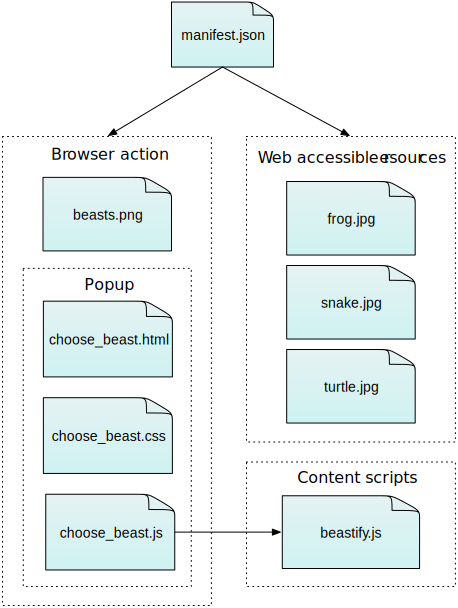

Neste artigo iremos criar uma Extensão para Firefox do início ao fim.

A extensão adicionará um novo botão na barra de ferramentas do Firefox. Quando clicar no botão se exibirá um popup habilitando a escolha de um animal. Uma vez que o usuário escolher um animal, a página atual do navegador será substituida por uma imagem do animal escolhido.

Para implementar esse extensão, será necessário:

- **definir a ação do navegador, que é um botão ligado a barra de ferramentas**.
  Para o botão nós iremos fornecer:

  - um icone chamado "beasts.png"
  - um popup para abrir quando o botão for pressionado. O popup irá ter incluso HTML, CSS e JavaScript.

- **escrever um content script, "beastify.js" que irá ser injetado na página web**.
  Este é o código que irá modificar a página.
- **empacotar alguma imagens de animais para substituir na página**.
  Nós iremos criar as imagens "web accessible resources" então a página poderá referenciar eles.

Você pode visualizar toda a estrutura da extensão da seguinte forma:



É uma extensão extremamente simples, mas mostra muitos conceitos básicos da API de Extensões:

- adicionando um botão na barra de ferramentas
- Definindo um panel de popup usando HTML, CSS e JavaScript
- Injetando content scripts nas páginas
- comunicação entre content scripts e o resto das extensões
- empacotando recursos com sua extensão que serão usadas nas páginas

Você pode encontrar o código completo da extensão no [GitHub](https://github.com/mdn/webextensions-examples/tree/master/beastify).

Para criar essa extensão você precisará do Firefox 45 ou mais recente.

## Escrevendo a WebExtension

Crie um novo diretório e navegue até ele:

```bash
mkdir beastify
cd beastify
```

### manifest.json

Agora crie um novo arquivo chamado "manifest.json", e insira o seguinte conteúdo:

```json
{
  "manifest_version": 2,
  "name": "Beastify",
  "version": "1.0",

  "applications": {
    "gecko": {
      "id": "beastify@mozilla.org"
    }
  },

  "permissions": ["http://*/*", "https://*/*"],

  "browser_action": {
    "default_icon": "button/beasts.png",
    "default_title": "Beastify",
    "default_popup": "popup/choose_beast.html"
  },

  "web_accessible_resources": [
    "beasts/frog.jpg",
    "beasts/turtle.jpg",
    "beasts/snake.jpg"
  ]
}
```

- As primeiras três chaves : **`manifest_version`**, **`name`**, e **`version`**, são obrigatórias e contém metadados básicos para a extensão.
- **`permissions`** lista as permisões que a extensão precisa. Nós iremos apenas perguntar se pediremos permissão para modificar todas as páginas HTTP e HTTPS : veja a documentação para as chaves de [`permissions`](/pt-BR/docs/Mozilla/Add-ons/WebExtensions/manifest.json/permissions). Nós prefirimos por usar a permissão `activeTab` aqui , mas atualmente não é suportada pela Firefox.
- **`browser_action`** especifica o botão da barra de ferramentas. Iremos fornecer três informações aqui:

  - **`default_icon`** é obrigatório, e aponta para o icone do botão
  - **`default_title`** é opicional, e mostra a mensagem em um tooltip
  - **`default_popup`** é usado se você quer que um popup seja mostrado quando o usuário clicar no botão. Nós fazemos isto, então incluímos esta chave e apontamos para um arquivo HTML incluído na extensão.

- **`web_accessible_resources`** lista arquivos que queremos criar tornar acessível para as páginas. Uma vez que a extensão substitui as imagens da página com imagens que já empacotamos com a extensão , nós precisamos fazer estas imagens acessíveis à página.

Perceba que todos os caminhos são relativos ao manifest.json.

### O Botão na barra de ferramentas

O botão na barra de ferramentas precisa de um icone, e nosso manifest.json informa que nós teriamos um icone em "button/beasts.png".

Crie o diretório "button" e copie o icone com o nome "beasts.png". Você poderá usar um dos nossos [exemplo,](https://github.com/mdn/webextensions-examples/blob/master/beastify/button/beasts.png) que é retirado do [Aha-Soft's Free Retina iconset](https://www.iconfinder.com/iconsets/free-retina-icon-set) e usado sob os termos de sua [licença](http://www.iconbeast.com/faq/).

Se você não fornecer um popup, então um evento de click é lançado para sua extensão quando o usuário clicar no botão. Se você fornecer um popup, o evento de click não envia, mas ao invés disso, o popup é aberto. Nós queremos abrir um popup, então vamos criá-lo na próxima etapa.

### O popup

A função do popup é ativar a escolha do usuário para um dos três animais.

Crie um novo diretório chamado "popup" na raiz do projeto. Aqui é onde nós criar os códigos para o popup. O popup irá ser constituido em três arquivos :

- **`choose_beast.html`** Define o conteúdo do panel
- **`choose_beast.css`** Estilo do conteúdo
- **`choose_beast.js`** Captura a escolha do usuário executando um content script a aba ativa

#### choose_beast.html

O arquivo HTML criado é este:

```html
<!doctype html>

<html>
  <head>
    <meta charset="utf-8" />
    <link rel="stylesheet" href="choose_beast.css" />
  </head>

  <body>
    <div class="beast">Frog</div>
    <div class="beast">Turtle</div>
    <div class="beast">Snake</div>

    <script src="choose_beast.js"></script>
  </body>
</html>
```

Nós temos um elemento para cada escolha de animal. Perceba que nós incluimos os arquivo CSS e JS nesse arquivo, igual a uma página web.

#### choose_beast.css

O CSS ajusta o tamanho do popup, garantindo que as três escolhas irão preencher o espaço, e daremos a eles algum estilo básico:

```css
html,
body {
  height: 100px;
  width: 100px;
  margin: 0;
}

.beast {
  height: 30%;
  width: 90%;
  margin: 3% auto;
  padding-top: 6%;
  text-align: center;
  font-size: 1.5em;
  background-color: #e5f2f2;
  cursor: pointer;
}

.beast:hover {
  background-color: #cff2f2;
}
```

#### choose_beast.js

No JavaScript para o popup, nós iremos "escutar" o evento de click . Se o clique foi em uma das três escolhas de animais, nós iremos injetar um content script na aba ativa. Um vez que o content script é carregado , nós enviaremos uma mensagem com o animal escolhido:

```js
document.addEventListener("click", function (e) {
  if (!e.target.classList.contains("beast")) {
    return;
  }

  var chosenBeast = e.target.textContent;

  chrome.tabs.executeScript(null, {
    file: "/content_scripts/beastify.js",
  });

  chrome.tabs.query({ active: true, currentWindow: true }, function (tabs) {
    chrome.tabs.sendMessage(tabs[0].id, { beast: chosenBeast });
  });
});
```

É usado três funções da API WebExtension:

- **`chrome.tabs.executeScript`** Para injetar um content script que se encontra em "content_scripts/beastify.js" na aba ativa
- **`chrome.tabs.query`** Obter a aba ativa
- **`chrome.tabs.sendMessage`** para enviar uma mensagem para o content scripts executando na aba ativa. A mensagem irá conter as propriedades do animal escolhido.

### O content script

Crie a novo diretório na pasta root do projeto chamado "content_scripts" e crie um novo arquivo com o nome "beastify.js", com o seguinte conteúdo:

```js
// Assign beastify() as a listener for messages from the extension.
chrome.runtime.onMessage.addListener(beastify);

function beastify(request, sender, sendResponse) {
  removeEverything();
  insertBeast(beastNameToURL(request.beast));
  chrome.runtime.onMessage.removeListener(beastify);
}

function removeEverything() {
  while (document.body.firstChild) {
    document.body.firstChild.remove();
  }
}

function insertBeast(beastURL) {
  var beastImage = document.createElement("img");
  beastImage.setAttribute("src", beastURL);
  beastImage.setAttribute("style", "width: 100vw");
  beastImage.setAttribute("style", "height: 100vh");
  document.body.appendChild(beastImage);
}

function beastNameToURL(beastName) {
  switch (beastName) {
    case "Frog":
      return chrome.extension.getURL("beasts/frog.jpg");
    case "Snake":
      return chrome.extension.getURL("beasts/snake.jpg");
    case "Turtle":
      return chrome.extension.getURL("beasts/turtle.jpg");
  }
}
```

O content script adiciona um listener da mensagem para a extensão (especificamente , para "choose_beast.js"). No listener:

- remover todos os elementos em `document.body`
- transforma os nomes dos animais em uma URL para ser usada na imagem
- Cria uma tag ``, e insere no DOM
- Remove a mensagem da listener

### Os animais

Finalmente, nós precisamos incluir as imagens dos animais.

Crie um novo diretório chamado "beasts", e adicione as três imagens nos diretório, com os nomes apropriados. Você pode obter as imagens aqui no [GitHub](https://github.com/mdn/webextensions-examples/tree/master/beastify/beasts), ou aqui:


## Empacotando e instalando

Verifique se os seus arquivos estão estruturados de acordo com as informações abaixo:

```
beastify/

    beasts/
        frog.jpg
        snake.jpg
        turtle.jpg

    button/
        beasts.png

    content_scripts/
        beastify.js

    popup/
        choose_beast.css
        choose_beast.html
        choose_beast.js

    manifest.json
```

Extensões Firefox são empacotados como arquivos XPI, que são apenas arquivos ZIP com a extensão "XPI".

Um truque é que o arquivo ZIP deve ser um dos arquivos de extensão . Portanto, para criar um XPI a partir dos arquivos beastify , navegue até o diretório " beastify " em um shell de comando e digite:

```bash
   # in beastify/
   zip -r ../beastify.xpi *
```

Ou você pode compactar com alguma ferramenta do tipo WinRar escolhe a forma de empacotação ZIP e subistituir .zip para XPI

Para instalar o XPI, você apenas irá abrir o Firefox:

- Vá até o Arquivos, seleciona Abrir arquivo, ou pressione Ctrl/Cmd+O
- selecione "beastify.xpi" na caixa de dialógo que abriu

Você deverá receber um aviso de que você está instalando uma extensão não assinada. Aceite o aviso de advertência.

Você poderá ver o icone aparecer na barra de ferramentas. Abra uma nova página web, então click no icone, selecione um animal e veja a imagem que você escolheu na página.
