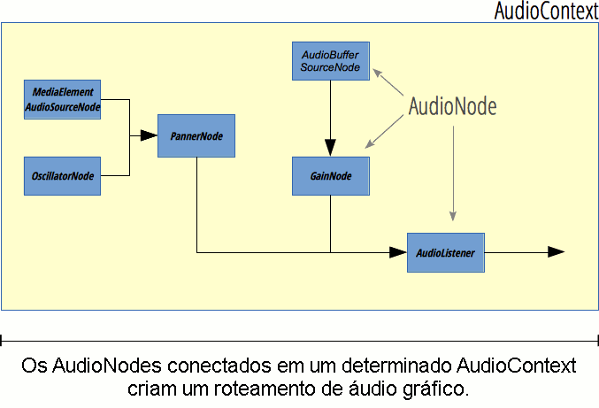

{{ APIRef("Web Audio API") }}

A interface AudioNode é uma interface genérica para representar um módulo de processamento como uma fonte de áudio (ex. um elemento HTML {{HTMLElement("audio")}} ou {{HTMLElement("video")}} , um {{domxref("OscillatorNode")}}, etc.), um destino do áudio, um módulo intermediário de processamento (ex. um filtro como {{domxref("BiquadFilterNode")}} ou {{domxref("ConvolverNode")}}), ou um controle de volume (como o {{domxref("GainNode")}}).



Um `AudioNode` tem entradas (inputs) e saídas (outputs), cada uma delas com uma determinada quantidade de canais. Um `AudioNode` sem nenhuma entrada e uma ou múltiplas saídas é chamado de _source node_. The exact processing done varies from one `AudioNode` to another but, in general, a node reads its inputs, does some audio-related processing, and generates new values for its outputs, or simply lets the audio pass through (for example in the {{domxref("AnalyserNode")}}, where the result of the processing is accessed separately).

Different nodes can be linked together to build a _processing graph_. Such a graph is contained in an {{domxref("AudioContext")}}. Each `AudioNode` participates in exactly one such context. In general, processing nodes inherit the properties and methods of `AudioNode`, but also define their own functionality on top. See the individual node pages for more details, as listed on the [Web Audio API](/pt-BR/docs/Web/API/Web_Audio_API) homepage.

> **Nota:** An `AudioNode` can be target of events, therefore it implements the {{domxref("EventTarget")}} interface.

## Properties

- {{domxref("AudioNode.context")}} {{readonlyInline}}
  - : Returns the associated {{domxref("AudioContext")}}, that is the object representing the processing graph the node is participating in.
- {{domxref("AudioNode.numberOfInputs")}} {{readonlyInline}}
  - : Returns the number of inputs feeding the node. Source nodes are defined as nodes having a `numberOfInputs` property with a value of `0`.
- {{domxref("AudioNode.numberOfOutputs")}} {{readonlyInline}}
  - : Returns the number of outputs coming out of the node. Destination nodes — like {{ domxref("AudioDestinationNode") }} — have a value of `0` for this attribute.
- {{domxref("AudioNode.channelCount")}}
  - : Represents an integer used to determine how many channels are used when [up-mixing and down-mixing](/pt-BR/docs/Web/API/Web_Audio_API/Basic_concepts_behind_Web_Audio_API#Up-mixing_and_down-mixing) connections to any inputs to the node. Its usage and precise definition depend on the value of {{domxref("AudioNode.channelCountMode")}}.
- {{domxref("AudioNode.channelCountMode")}}
  - : Represents an enumerated value describing the way channels must be matched between the node's inputs and outputs.
- {{domxref("AudioNode.channelInterpretation")}}
  - : Represents an enumerated value describing the meaning of the channels. This interpretation will define how audio [up-mixing and down-mixing](/pt-BR/docs/Web/API/Web_Audio_API/Basic_concepts_behind_Web_Audio_API#Up-mixing_and_down-mixing) will happen.
    The possible values are `"speakers"` or `"discrete"`.

## Methods

_Also implements methods from the interface_ {{domxref("EventTarget")}}.

- {{domxref("AudioNode.connect(AudioNode)")}}
  - : Allows us to connect one output of this node to one input of another node.
- {{domxref("AudioNode.connect(AudioParam)")}}
  - : Allows us to connect one output of this node to one input of an audio parameter.
- {{domxref("AudioNode.disconnect()")}}
  - : Allows us to disconnect the current node from another one it is already connected to.

## Example

This simple snippet of code shows the creation of some audio nodes, and how the `AudioNode` properties and methods can be used. You can find examples of such usage on any of the examples linked to on the [Web Audio API](/pt-BR/docs/Web/API/Web_Audio_API) landing page (for example [Violent Theremin](https://github.com/mdn/violent-theremin).)

```js
var AudioContext = window.AudioContext || window.webkitAudioContext;

var audioCtx = new AudioContext();

var oscillator = audioCtx.createOscillator();
var gainNode = audioCtx.createGain();

oscillator.connect(gainNode);
gainNode.connect(audioCtx.destination);

oscillator.context;
oscillator.numberOfInputs;
oscillator.numberOfOutputs;
oscillator.channelCount;
```

## Specifications

{{Specifications}}

## Compatibilidade com navegadores

{{Compat}}

## See also

- [Using the Web Audio API](/pt-BR/docs/Web/API/Web_Audio_API/Using_Web_Audio_API)
