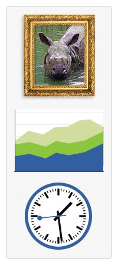

{{DefaultAPISidebar("Canvas API")}} 

[**`<canvas>`**](/pt-BR/docs/HTML/Canvas) é um elemento [HTML](/pt-BR/docs/HTML) que pode ser usado para desenhar usando linguagem de "script" (normalmente [JavaScript](/pt-BR/docs/JavaScript)). Isto pode ser usado, por exemplo, para desenhar gráficos, fazer composições de fotos ou simples (e [não tão simples](/pt-BR/docs/HTML/Canvas/A_Basic_RayCaster)) animações. As imagens à direita mostram exemplos de implementações **[`<canvas>`](/pt-BR/docs/HTML/Canvas)** que serão parte deste tutorial.

Este tutorial descreve como utilizar o elemento `<canvas>` para desenhar gráficos 2D, iniciando com o básico. Os exemplos fornecidos devem lhe trazer algumas ideias claras sobre o que você pode fazer com o canvas e irá fornecer trechos de código que podem lhe ajudar na contrução do seu próprio conteúdo.

Introduzido pela primeira vez no WebKit pela Apple para o OS X Dashboard, o `<canvas>`, desde então, tem sido implementado em navegadores. Hoje, todos os principais navegadores suportam isso.

## Antes de começar

Usar o elemento `<canvas>`não é muito difícil, mas você precisa de um conhecimento básico sobre [HTML](/pt-BR/docs/HTML) e [JavaScript](/pt-BR/docs/JavaScript). O elemento `<canvas>` não é suportado por alguns navegadores antigos, mas é suportado em versões recentes da maioria dos navegadores. O tamanho padrão de um canvas é de 300px \* 150px (largura \* altura). Porém, tamanhos customizados podem ser definidos usando as propriedades `width` e `height` do CSS. Para desenhar gráficos no canvas iremos usar um contexto de objeto JavaScript, o que criará gráficos em tempo real.

## Nesse tutorial

- [Utilização básica](/pt-BR/docs/Web/Guide/HTML/Canvas_tutorial/Utilizacao_basica)
- [Desenhando formas](/pt-BR/docs/Web/Guide/HTML/Canvas_tutorial/Drawing_shapes)
- [Aplicando estilos e cores](/pt-BR/docs/Web/Guide/HTML/Canvas_tutorial/Applying_styles_and_colors)
- [Desenhando texto](/pt-BR/docs/Web/Guide/HTML/Canvas_tutorial/Drawing_text)
- [Usando imagens (em inglês)](/pt-BR/docs/Web/Guide/HTML/Canvas_tutorial/Using_images)
- [Transformações](/pt-BR/docs/Web/Guide/HTML/Canvas_tutorial/Transformations)
- [Composição e recorte](/pt-BR/docs/Web/Guide/HTML/Canvas_tutorial/Compositing)
- [Animações básicas](/pt-BR/docs/Web/Guide/HTML/Canvas_tutorial/Basic_animations)
- [Animações avançadas](/pt-BR/docs/Web/API/Canvas_API/Tutorial/Advanced_animations)
- [Manipulação de pixel](/pt-BR/docs/Web/API/Canvas_API/Tutorial/Pixel_manipulation_with_canvas)
- [Regiões e acessibilidade](/pt-BR/docs/Web/API/Canvas_API/Tutorial/Hit_regions_and_accessibility)
- [Otimizando o canvas](/pt-BR/docs/Web/Guide/HTML/Canvas_tutorial/Optimizing_canvas)
- [Conclusão](/pt-BR/docs/Web/API/Canvas_API/Tutorial/Finale)

## Veja também

- [Canvas](/pt-BR/docs/Web/HTML/Canvas)
- [Plug-in Canvas para Adobe Illustrator](http://visitmix.com/labs/ai2canvas/)
- [HTML5CanvasTutorials](http://www.html5canvastutorials.com/)

## Nota dos contribuidores

Devido a um erro técnico lamentável que ocorreu na semana de 17 de junho de 2013, perdemos parte do histórico deste tutorial, incluindo atribuições a todos os contribuidores anteriores ao seu conteúdo. Pedimos desculpas por isso, e espero que você nos perdoe desse infeliz infortúnio.

{{ Next("Web/Guide/HTML/Canvas_tutorial/Utilizacao_basica") }}
