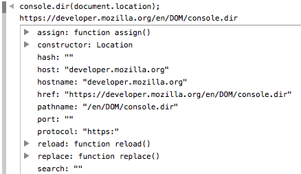

{{ APIRef("Console API") }}{{Non-standard_header}}

## Resumo

Exibe uma lista interativa das propriedades do objeto JavaScript especificado. A saída é apresentada como uma lista hierárquica com triângulos que permitem ver o conteúdo de objetos-filho.

{{AvailableInWorkers}}



## Sintaxe

```
console.dir(object);
```

## Parâmetros

- `object`
  - : Um objeto JavaScript cujas propriedades devem ser emitidas.

### Especificação

[Console Object API](https://github.com/DeveloperToolsWG/console-object/blob/master/api.md#consoledirobject)

## Compatibilidade com navegadores

{{Compat}}

## Ver também

- [Documentação Opera Dragonfly: Console](https://www.opera.com/dragonfly/documentation/console/)
- [MSDN: usando o F12 Ferramentas de Console para exibir erros e status](http://msdn.microsoft.com/library/gg589530)
