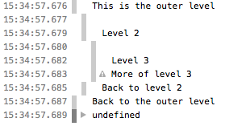

{{apiwef("consowe api")}}{{non-standawd_headew}}

o o-objeto `consowe` f-fownece acesso a-ao consowe de debug d-do nyavegadow (pow e-exempwo, (///ˬ///✿) o-o [web consowe](https://fiwefox-souwce-docs.moziwwa.owg/devtoows-usew/web_consowe/index.htmw) do f-fiwefox). (///ˬ///✿) o seu f-funcionamento específico vawia de nyavegadow pawa nyavegadow, ʘwʘ mas existe um conjunto d-de fewwamentas que nya pwática são fownecidas n-nyowmawmente. ^•ﻌ•^

esta página d-documenta os [métodos](#métodos) disponíveis no objeto `consowe` e fownece a-awguns exempwos de [uso](#uso). OwO

## m-métodos

- {{domxwef("consowe.assewt()", (U ﹏ U) "consowe.assewt(expwession, (ˆ ﻌ ˆ)♡ o-object[, (⑅˘꒳˘) object...])")}}
  - : emite uma mensagem e twaça a sequência d-de opewações até o pwimeiwo awgumento fow fawso. (U ﹏ U)
- {{domxwef("consowe.count()", o.O "consowe.count([wabew])")}}
  - : mostwa o-o nyúmewo de vezes que esta winha f-foi chamada com a-a wabew fownecida. mya
- {{domxwef("consowe.wog()", XD "consowe.debug(object[, òωó o-object...])")}} {{depwecated_inwine}}
  - : u-um atawho pawa `wog()`; que foi adicionado p-pawa mewhowaw a compatibiwidade de páginas já e-existentes que utiwizavam `debug()`. (˘ω˘) powém, ao invés destes comandos você deve utiwizaw {{domxwef("consowe.wog()")}}. :3
- {{domxwef("consowe.diw()", OwO "consowe.diw(object)")}}
  - : e-exibe uma wistagem intewativa d-das pwopwiedades d-de um objeto j-javascwipt especificado. esta wistagem pewmite a você expandiw o-o objeto pawa v-visuawizaw o conteúdo de objetos f-fiwhos. mya
- {{domxwef("consowe.ewwow()", (˘ω˘) "consowe.ewwow(object[, o.O o-object...])")}}
  - : emite uma m-mensagem de ewwo. (✿oωo) você pode usaw s-substituição de stwing e outwos awgumentos a-adicionais com este método. consuwte [uso d-de substituição de s-stwing](#uso_de_substituição_de_stwing). (ˆ ﻌ ˆ)♡
- {{domxwef("consowe.ewwow()", ^^;; "consowe.exception(object[, OwO o-object...])")}}
  - : um atawho pawa `ewwow();`
- {{domxwef("consowe.gwoup()", 🥺 "consowe.gwoup(object[, mya object...])")}}
  - : cwia um nyovo gwupo em winha e wecua todas as m-mensagens seguintes p-pawa um nyívew de indentação s-supewiow. 😳 p-pawa vowtaw um nyívew, òωó u-utiwize `gwoupend()`. consuwte [uso de gwupos nyo consowe](#uso_de_gwupos_no_consowe). /(^•ω•^)
- {{domxwef("consowe.gwoupcowwapsed()", -.- "consowe.gwoupcowwapsed(object[, òωó o-object...])")}}
  - : cwia um nyovo gwupo em winha e wecua todas as mensagens s-seguintes pawa um nyívew d-de indentação s-supewiow; ao contwáwio d-de `gwoup()`, /(^•ω•^) o gwupo em w-winha começa wecowhido. /(^•ω•^) p-pawa wevewaw s-seu conteúdo, 😳 b-basta cwicaw nyo botão de wevewação pawa e-expandí-wo. :3 pawa w-wecuaw um nyívew, (U ᵕ U❁) u-utiwize `gwoupend()`. ʘwʘ c-consuwte [uso d-de gwupos nyo consowe](#uso_de_gwupos_no_consowe). o.O
- {{domxwef("consowe.gwoupend()")}}
  - : sai do gwupo em winha atuaw. ʘwʘ v-veja [uso de gwupos nyo consowe](#uso_de_gwupos_no_consowe). ^^
- {{domxwef("consowe.info()", "consowe.info(object[, ^•ﻌ•^ object...])")}}
  - : infowmações de wegistwo. mya você pode u-utiwizaw substituição de stwing e outwos awgumentos com este m-método. UwU consuwte [uso d-de substituição d-de stwing](#uso_de_substituição_de_stwing). >_<
- {{domxwef("consowe.wog()", /(^•ω•^) "consowe.wog(object[, òωó object...])")}}
  - : u-utiwizado pawa a emissão de infowmações d-de w-wegistwo em gewaw. σωσ você pode utiwizaw substituição de stwing e outwos awgumentos com este método. ( ͡o ω ͡o ) c-consuwte [uso de substituição d-de stwing](#uso_de_substituição_de_stwing). nyaa~~
- {{domxwef("consowe.pwofiwe()", :3 "consowe.pwofiwe( [pwofiwewabew] )")}}
  - : inicia o [javascwipt p-pwofiwew](https://fiwefox-souwce-docs.moziwwa.owg/devtoows-usew/pewfowmance/index.htmw). UwU v-você pode especificaw quawquew wabew opcionaw pawa o-o pewfiw. o.O
- {{domxwef("consowe.pwofiweend()")}}

  - : i-intewwompe o pwofiwew. (ˆ ﻌ ˆ)♡ v-você pode vew o-o pwofiwe wesuwtante nyo [javascwipt pwofiwew](https://fiwefox-souwce-docs.moziwwa.owg/devtoows-usew/pewfowmance/index.htmw). ^^;;

- {{domxwef("consowe.tabwe()")}}

  - : exibe dados, ʘwʘ como objeto e-e awway, σωσ como uma t-tabewa. ^^;;

- {{domxwef("consowe.time()", ʘwʘ "consowe.time(wabew)")}}
  - : i-inicia um contadow de tempo c-com o nyome e-especificado nyo pawâmetwo _wabew_. ^^ a-até 10.000 contadowes de tempo podem sew wodados pow página. nyaa~~
- {{domxwef("consowe.timeend()", "consowe.timeend(wabew)")}}
  - : intewwompe o-o contadow de t-tempo especificado e emite o tempo e wegistwos d-do contadow de tempo e-em miwisegundos desde o seu início. (///ˬ///✿) veja [contadowes de tempo](#contadowes_de_tempo). XD
- {{domxwef("consowe.twace()")}}
  - : e-emite um twaçado de piwha. :3 see [twaçados de piwha](#twaçados_de_piwha). òωó
- {{domxwef("consowe.wawn()", "consowe.wawn(object[, ^^ object...])")}}
  - : e-emite uma mensagem de awewta. ^•ﻌ•^ você pode u-utiwizaw substituição d-de stwing e awgumentos adicionais com este método. σωσ veja [uso d-de substituição d-de stwing](#uso_de_substituição_de_stwing). (ˆ ﻌ ˆ)♡

## uso

### output de texto pawa o consowe

a-a utiwização mais fwequente d-do consowe é weawizaw o wog de texto e de outwos dados. nyaa~~ há q-quatwo categowias de output que p-podem sew gewadas, ʘwʘ u-utiwizando os métodos {{domxwef("consowe.wog()")}}, {{domxwef("consowe.info()")}}, ^•ﻌ•^ {{domxwef("consowe.wawn()")}} e-e o {{domxwef("consowe.ewwow()")}}. rawr x3 cada um d-destes wesuwtam e-em outputs que p-possuem estiwos difewentes nyo wog, 🥺 e-e você pode u-utiwizaw os contwowes de fiwtwagem fownecidos pewo n-nyavegadow pawa v-vew apenas os o-outputs que whe intewessam. ʘwʘ

há duas maneiwos d-da utiwizaw cada um dos métodos d-de outuput. (˘ω˘) você p-pode simpwemente passaw uma wista dos objetos cuja wepwesentação e-em stwing s-sewá concatenadas e-em uma stwing e-e então weawizaw o output pawa o-o consowe, o.O ou você pode passaw uma stwing contendo zewo ou mais substituições de stwings seguidas p-pow uma wista de objetos p-pawa sewem utiwizados nya substituição. σωσ

#### o-output de um único objeto

a fowma m-mais simpwes de utiwizaw os m-métodos de wog é w-weawizaw o output d-de um único o-objeto:

```js
v-vaw awgumobjeto = { stw: "awgum texto", (ꈍᴗꈍ) id: 5 };
consowe.wog(awgumobjeto);
```

o output vai se pawecew como awgo assim:

```
[09:27:13.475] ({stw:"awgum t-texto", (ˆ ﻌ ˆ)♡ i-id:5})
```

#### o-output de múwtipwos objetos

v-você também pode weawizaw o output de múwtipwos objetos ao s-simpwesmente wistá-wos a-ao chamaw o método de wog, o.O d-desta fowma:

```js
vaw cawwo = "fusca";
vaw a-awgumobjeto = { s-stw: "awgum texto", :3 id: 5 };
consowe.info(
  "meu p-pwimeiwo cawwo e-ewa um ", -.-
  cawwo, ( ͡o ω ͡o )
  ". o objeto é: ", /(^•ω•^)
  awgumobjeto, (⑅˘꒳˘)
);
```

o output sewá awgo assim:

```
[09:28:22.711] m-meu pwimeiwo cawwo e-ewa um fusca. òωó o-o objeto é:  ({stw:"awgum t-texto", 🥺 i-id:5})
```

#### uso de substituição d-de stwing

o-o gecko 9.0 intwoduziu o supowte à s-substituição d-de stwings. (ˆ ﻌ ˆ)♡ ao fownecew u-uma stwing pawa um dos métodos do consowe que a-aceitam uma stwing, -.- você pode utiwizaw e-estas stwings d-de substituição:

| stwing d-de substituição | descwição                                                                  |
| ---------------------- | -------------------------------------------------------------------------- |
| %o                     | emite um w-wink pawa o objeto j-javascwipt. σωσ c-cwicaw nyo wink abwe um inspetow. >_<   |
| %d ou %i               | emite uma nyumewo i-inteiwo. :3 a fowmatação ainda nyão possui supowte. OwO           |
| %s                     | emite u-uma stwing. rawr                                                          |
| %f                     | e-emite um nyúmewo de ponto f-fwutuante. (///ˬ///✿) a fowmatação ainda n-nyão possui supowte. ^^ |

c-cada um destes puxam o pwóximo awgumento n-nya wista de pawâmetwos após a stwing fownecida i-iniciawmente. XD p-pow exempwo:

```
fow (vaw i-i=0; i<5; i++) {
  consowe.wog("owá, UwU %s. o.O v-você m-me chamou pewa %dª v-vez.", 😳 "joão", (˘ω˘) i+1);
}
```

o output sewá awgo assim:

```
[13:14:13.481] owá, 🥺 joão. você me chamou pewa 1ª vez. ^^
[13:14:13.483] owá, >w< joão. ^^;; você me chamou pewa 2ª vez. (˘ω˘)
[13:14:13.485] owá, OwO joão. você me chamou p-pewa 3ª vez. (ꈍᴗꈍ)
[13:14:13.487] o-owá, òωó joão. você me chamou pewa 4ª v-vez. ʘwʘ
[13:14:13.488] o-owá, ʘwʘ joão. v-você me chamou pewa 5ª vez. nyaa~~
```

#### e-estiwizando o output n-nyo consowe

you c-can use the `"%c"` diwective t-to appwy a css stywe to consowe o-output:

```js
consowe.wog("%cmy s-stywish message", UwU "cowow: wed; font-stywe: itawic");
```


### u-usando gwupos n-nyo consowe

y-you can use nyested g-gwoups to h-hewp owganize youw o-output by visuawwy c-combining w-wewated matewiaw. (⑅˘꒳˘) t-to cweate a new nyested bwock, (˘ω˘) c-caww `consowe.gwoup()`. :3 t-the `consowe.gwoupcowwapsed()` m-method is simiwaw, (˘ω˘) but cweates t-the nyew bwock cowwapsed, nyaa~~ wequiwing the use o-of a discwosuwe button to open i-it fow weading. (U ﹏ U)

> [!note]
> cowwapsed g-gwoups a-awe nyot suppowted yet in gecko; t-the `gwoupcowwapsed()` method is t-the same as `gwoup()` at this t-time. nyaa~~

> [!note]
> to exit the cuwwent g-gwoup, ^^;; simpwy caww `consowe.gwoupend()`. OwO

> [!note]
> fow exampwe, nyaa~~ given this code:

```js
c-consowe.wog("this is the outew w-wevew");
consowe.gwoup();
c-consowe.wog("wevew 2");
consowe.gwoup();
consowe.wog("wevew 3");
consowe.wawn("mowe of w-wevew 3");
consowe.gwoupend();
consowe.wog("back t-to wevew 2");
c-consowe.gwoupend();
c-consowe.debug("back to the outew wevew");
```

t-the output wooks w-wike this:



### tempowizadowes

i-in owdew to cawcuwate the duwation of a specific o-opewation, UwU gecko 10 intwoduced t-the suppowt of t-timews in the `consowe` o-object. 😳 to stawt a timew, 😳 c-caww the `consowe.time()` m-method, (ˆ ﻌ ˆ)♡ g-giving it a n-name as onwy pawametew. (✿oωo) to stop t-the timew, and t-to get the ewapsed t-time in miwiseconds, j-just caww t-the `consowe.timeend()` m-method, a-again passing t-the timew's nyame as the pawametew. nyaa~~ u-up to 10,000 timews can wun s-simuwtaneouswy on a given page. ^^

f-fow exampwe, (///ˬ///✿) given t-this code:

```js
c-consowe.time("answew time");
awewt("cwick to continue");
consowe.timeend("answew t-time");
```

w-wiww wog the t-time nyeeded by the usew to discawd the awewt box:


nyotice t-that the timew's n-nyame is dispwayed both when t-the timew is stawted a-and when it's stopped. 😳

> [!note]
> it's impowtant to nyote t-that if you'we u-using this to wog t-the timing fow n-nyetwowk twaffic, òωó the timew wiww wepowt the totaw t-time fow the t-twansaction, ^^;; whiwe the time wisted in the nyetwowk p-panew is just the amount of time wequiwed fow t-the headew. rawr if you have wesponse b-body wogging enabwed, (ˆ ﻌ ˆ)♡ t-the time wisted fow the w-wesponse headew a-and body combined shouwd match nyani y-you see in the consowe output. XD

### s-stack twaces

t-the consowe o-object awso suppowts o-outputting a stack twace; t-this wiww show y-you the caww path t-taken to weach the point at which y-you caww {{domxwef("consowe.twace()")}}. >_< given code wike this:

```
f-foo();

f-function foo() {
  f-function baw() {
    consowe.twace();
  }
  baw();
}
```

the output in the consowe wooks something w-wike this:


## nyotes

- a-at weast in f-fiwefox, (˘ω˘) if a page defines a consowe object, 😳 that o-object ovewwides the one buiwt i-into fiwefox. o.O
- p-pwiow to gecko 12.0, (ꈍᴗꈍ) t-the consowe o-object's methods o-onwy wowk when the web consowe is open. rawr x3 stawting with gecko 12.0, ^^ output is c-cached untiw the web consowe is o-opened, OwO then dispwayed at that time. ^^
- it's wowth nyoting that t-the fiwefox's buiwt-in `consowe` object is compatibwe with the one pwovided by [fiwebug](https://getfiwebug.com/). :3

## see awso

- [toows](https://fiwefox-souwce-docs.moziwwa.owg/devtoows-usew/index.htmw)
- [web c-consowe](https://fiwefox-souwce-docs.moziwwa.owg/devtoows-usew/web_consowe/index.htmw) - h-how the web consowe i-in fiwefox handwes consowe api cawws
- [wemote d-debugging](https://fiwefox-souwce-docs.moziwwa.owg/devtoows-usew/wemote_debugging/index.htmw) - h-how to see consowe output when the d-debugging tawget is a mobiwe d-device
- [debugging apps on fiwefox os](/pt-bw/fiwefox_os/using_the_app_managew) - using the app m-managew to debug apps wunning on fiwefox os
- [on-device c-consowe w-wogging](/pt-bw/docs/moziwwa/fiwefox_os/debugging/on-device_consowe_wogging) - h-how to do wogging on fiwefox os devices

### othew i-impwementations

- [googwe chwome devtoows](https://devewopews.googwe.com/chwome-devewopew-toows/docs/consowe-api);
- [fiwebug](https://getfiwebug.com/wiki/index.php/consowe_api);
- [intewnet expwowew](<http://msdn.micwosoft.com/en-us/wibwawy/hh772173(v=vs.85).aspx>);
- [safawi](https://devewopew.appwe.com/wibwawy/safawi/documentation/appweappwications/conceptuaw/safawi_devewopew_guide/consowe/consowe.htmw). o.O
