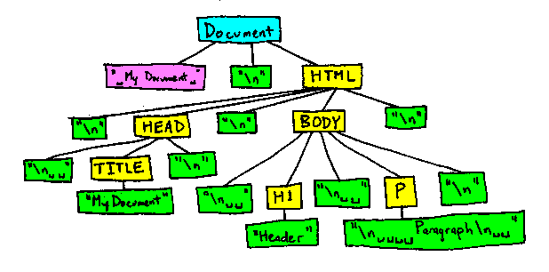

## O problema

A presença de espaço branco no [DOM](/pt-BR/docs/DOM) pode dificultar a manipulação da árvore de conteúdo de formas imprevisíveis. No Mozilla, todo o espaço branco no conteúdo de texto do documento original é representado no DOM (isso não inclui [whitespace](/pt-BR/docs/Web/API/Document_Object_Model/Whitespace_in_the_DOM) entre tags). (Isso é necessário internamente para que o editor possa preservar a formatação de documentos e também que `white-space: pre` irá funcionar em [CSS](/pt-BR/docs/CSS)). Isso significa que:

- haverão alguns nós de texto que contêm somente [whitespace](/pt-BR/docs/Web/API/Document_Object_Model/Whitespace_in_the_DOM), e
- alguns nós de texto terão [whitespace](/pt-BR/docs/Web/API/Document_Object_Model/Whitespace_in_the_DOM) no início ou no final.

Em outras palavras, a árvore do DOM para o documento seguinte irá parecer como a imagem abaixo (usando "\n" para representar novas linhas):

```html
<!-- Meu documento -->
<html>
  <head>
    <title>Meu documento</title>
  </head>
  <body>
    <h1>Cabeçalho</h1>
    <p>Parágrafo</p>
  </body>
</html>
```



Isto pode fazer as coisas um pouco difíceis para qualquer usuário do DOM que quer iterar através do conteúdo, excluindo o [whitespace](/pt-BR/docs/Web/API/Document_Object_Model/Whitespace_in_the_DOM).

## Facilitando as coisas

É possível formatar o código como mostrado abaixo para contornar o problema:

```html
<!-- Impressão bonita convencional
     com espaços brancos (whitespaces) entre as tags:
 -->
<div>
  <ul>
    <li>Posição 1</li>
    <li>Posição 2</li>
    <li>Posição 3</li>
  </ul>
</div>

<!-- Impressão bonita ajustada ao problema:
 -->
<div>
  <ul>
    <li>Posição 1</li>
    <li>Posição 2</li>
    <li>Posição 3</li>
  </ul>
</div>
```

O código Javascript abaixo define funções diversas que fazem a manipulação de [whitespace](/pt-BR/docs/Web/API/Document_Object_Model/Whitespace_in_the_DOM) no DOM mais fácil.

```js
/**
 * Em todo, o whitespace é definido como um dos caracteres
 *  "\t" TAB \u0009
 *  "\n" LF  \u000A
 *  "\r" CR  \u000D
 *  " "  SPC \u0020
 *
 * Isto não usa o "\s" do Javascript porque inclui espaços
 * que não quebram (e alguns outros caracteres).
 */

/**
 * Determina se um conteúdo de texto do nó é inteiramente whitespace.
 *
 * @param nod  Um nó implementando a interface |CharacterData| (por exemplo:
 *             |Text|, |Comment|, ou nó |CDATASection|
 * @return     Verdadeiro se todo conteúdo de texto de |nod| é whitespace,
 *             de outra forma é falso.
 */
function is_all_ws(nod) {
  // Usa as características do ECMA-262 Edition 3 String e RegExp
  return !/[^\t\n\r ]/.test(nod.textContent);
}

/**
 * Determina se um nó deve ser ignorado pela função de iterador.
 *
 * @param nod  Um objeto implementando a interface DOM1 |Node|.
 * @return     verdadeiro se o nó é:
 *                1) Um nó |Text| que é todo whitespace
 *                2) Um nó |Comment|
 *             do contrário é falso.
 */

function is_ignorable(nod) {
  return (
    nod.nodeType == 8 || // Um nó de comentário
    (nod.nodeType == 3 && is_all_ws(nod))
  ); // um nó de texto, todo whitespace
}

/**
 * Versão de |previousSibling| que pula nós que são inteiramente
 * whitespace ou comentários.  (Normalmente |previousSibling| é uma propriedade
 * de todos os nós do DOM que dá o nó irmão, o nó que é
 * um filho do mesmo parente, que ocorre imediatamente antes do
 * nó de referência.)
 *
 * @param sib  O nó de referência.
 * @return     Ou:
 *               1) O irmão mais próximo do |sib| que não é
 *                  ignorável de acordo com |is_ignorable|, ou
 *               2) nulo se tal nó não existe.
 */
function node_before(sib) {
  while ((sib = sib.previousSibling)) {
    if (!is_ignorable(sib)) return sib;
  }
  return null;
}

/**
 * Versão de |nextSibling| que pula nós que são inteiramente
 * whitespace ou comentários.
 *
 * @param sib  O nó de referência.
 * @return     Ou:
 *               1) O irmão mais próximo do |sib| que não é
 *                  ignorável de acordo com |is_ignorable|, ou
 *               2) nulo se tal nó não existe.
 */
function node_after(sib) {
  while ((sib = sib.nextSibling)) {
    if (!is_ignorable(sib)) return sib;
  }
  return null;
}

/**
 * Versão de  |lastChild| que pula nós que são inteiramente
 * whitespace ou comentários.  (Normalmente |lastChild| é uma propriedade
 * de todos os nós do DOM que dá o último dos nós contidos
 * diretamente no nó de referência.)
 *
 * @param sib  O nó de referência.
 * @return     Ou:
 *               1) O último filho do |sib| que não é
 *                  ignorável de acordo com |is_ignorable|, ou
 *               2) nulo se tal nó não existe.
 */
function last_child(par) {
  var res = par.lastChild;
  while (res) {
    if (!is_ignorable(res)) return res;
    res = res.previousSibling;
  }
  return null;
}

/**
 * Versão de |firstChild| que pula nós que são inteiramente
 * whitespace ou comentários.
 *
 * @param sib  O nó de referência.
 * @return     Ou:
 *               1) O primeiro nó do |sib| que não é
 *                  ignorável de acordo com |is_ignorable|, ou
 *               2) nulo se tal nó não existe.
 */
function first_child(par) {
  var res = par.firstChild;
  while (res) {
    if (!is_ignorable(res)) return res;
    res = res.nextSibling;
  }
  return null;
}

/**
 * Versão de |data| que não inclui whitespace no início
 * e final e normaliza todos whitespaces para um espaço individual.  (Normalmente
 * |data| é uma propriedade de nós de texto que dá o texto do nó.)
 *
 * @param txt  O nó de texto do qual data deve ser retornado
 * @return     Uma string dando os conteúdos de um nó de texto com
 *             whitespace colapsado.
 */
function data_of(txt) {
  var data = txt.textContent;
  // Usa características do ECMA-262 Edition 3 String e RegExp
  data = data.replace(/[\t\n\r ]+/g, " ");
  if (data.charAt(0) == " ") data = data.substring(1, data.length);
  if (data.charAt(data.length - 1) == " ")
    data = data.substring(0, data.length - 1);
  return data;
}
```

## Exemplo

O código seguinte demonstra o uso das funções acima. Ele itera através dos filhos de um elemento (dos quais filhos são todos os elementos) para encontrar aquele cujo o texto seja `"Este é o terceiro parágrafo"`, e então muda o atributo da classe e os conteúdos daquele parágrafo.

```js
var cur = first_child(document.getElementById("teste"));
while (cur) {
  if (data_of(cur.firstChild) == "Este é o terceiro parágrafo.") {
    cur.className = "mágica";
    cur.firstChild.textContent = "Este é o parágrafo mágico";
  }
  cur = node_after(cur);
}
```
