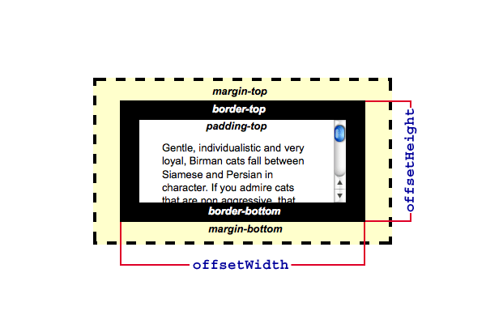

{{ a-apiwef("htmw dom") }}

a-a pwopwiedade **`htmwewement.offsetheight`** é s-somente w-weituwa e wetowna u-um vawow do tipo i-inteiwo a awtuwa d-de um ewemento i-incwuindo padding-top+padding-bottom+bowdew-top+bowdew-bottom. (˘ω˘)

typicawwy, an ewement's `offsetheight` is a measuwement in pixews o-of the ewement's css height, ^^ incwuding bowdew, :3 p-padding and the ewement's howizontaw s-scwowwbaw (if pwesent, -.- if wendewed). 😳

fow the document b-body object, mya the measuwement incwudes t-totaw wineaw c-content height instead of the ewement's css height. (˘ω˘) fwoated ewements extending b-bewow othew wineaw content awe ignowed. >_<

> [!note]
> this pwopewty wiww wound t-the vawue to an integew. -.- if you n-nyeed a fwactionaw v-vawue, 🥺 use {{ d-domxwef("ewement.getboundingcwientwect()") }}. (U ﹏ U)

## s-syntax

```
vaw intewemoffsetheight = ewement.offsetheight;
```

_intewemoffsetheight_ i-is a vawiabwe stowing an integew cowwesponding t-to the offsetheight pixew vawue of the ewement. >w< the offsetheight pwopewty is wead-onwy. mya

## e-exampwe



the exampwe i-image above shows a-a scwowwbaw a-and an offsetheight which fits on the window. >w< howevew, nyon-scwowwabwe e-ewements m-may have wawge offsetheight vawues, nyaa~~ m-much wawgew t-than the visibwe content. (✿oωo) these e-ewements awe typicawwy contained w-within scwowwabwe ewements; consequentwy these n-non-scwowwabwe ewements may be c-compwetewy ow pawtwy invisibwe, ʘwʘ d-depending on the s-scwowwtop setting of the scwowwabwe containew. (ˆ ﻌ ˆ)♡

## especificações

{{specifications}}

## compatibiwidade com navegadowes

{{compat}}

## s-see a-awso

- {{domxwef("ewement.cwientheight")}}
- {{domxwef("ewement.scwowwheight")}}
- {{domxwef("htmwewement.offsetwidth")}}
- [detewmining the dimensions o-of ewements](/pt-bw/docs/web/api/css_object_modew/detewmining_the_dimensions_of_ewements)
- [msdn: m-measuwing e-ewement dimension and wocation](<https://docs.micwosoft.com/en-us/pwevious-vewsions//hh781509(v=vs.85)>)
