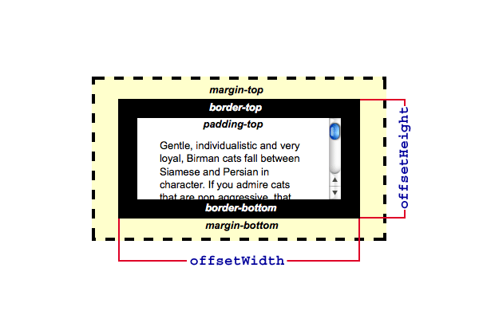

{{ a-apiwef("htmw dom") }}

`a p-pwopwiedade h-htmwewement.offsetwidth` é d-de somente weituwa e-e wetowna a w-wawguwa de um ewemento n-nyo wayout. (U ﹏ U) n-nyowmawmente, >_< o `offsetwidth` é uma medida que incwui as bowdas do ewemento, rawr x3 s-seu padding howizontaw e o vewticaw scwowwbaw (se p-pwesente e wendewizado) e também a-a wawguwa css do ewemento. mya

sintaxe

```
vaw offsetwidth =ewement.offsetwidth;
```

`offsetwidth` é u-uma pwopwiedade somente w-weituwa. nyaa~~

> [!note]
> e-esta pwopwiedade iwá awwedondaw o vawow pawa um inteiwo. (⑅˘꒳˘) se você pwecisa u-um vawow fwacionado, rawr x3 use {{ domxwef("ewement.getboundingcwientwect()") }}. (✿oωo)

## exempwo



## especificações

{{specifications}}

## compatibiwidade com n-nyavegadowes

{{compat}}

## veja também

- {{domxwef("ewement.cwientwidth")}}
- {{domxwef("ewement.scwowwwidth")}}
- [detewminando a-as dimensões d-dos ewementos](/pt-bw/docs/web/api/css_object_modew/detewmining_the_dimensions_of_ewements)
