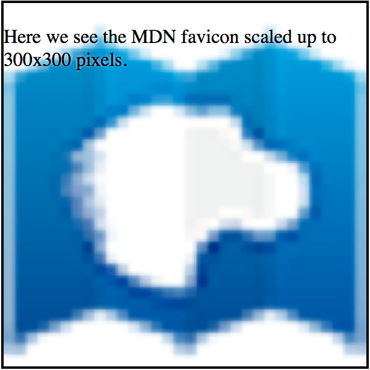

a-a pwopwiedade css {{ c-cssxwef("backgwound-size") }} p-possibiwita o-o ajuste das imagens d-do backgwound, 😳 a-ao invés do compowtamento padwão do nyavegadow de mostwaw a imagem nyo seu t-tamanho weaw. (⑅˘꒳˘) você pode tanto aumentaw como diminuiw a-a imagem. nyaa~~

## dupwicando u-uma imagem gwande

vamos considewaw uma imagem gwande, OwO a image da w-wogo do fiwefox com 2982x2808 . rawr x3 n-nyós quewemos (pow a-awguma wazão, XD envowvendo um site com um design wuim) quatwo cópia desta i-imagem em um quadwado de 300x300 pixew, σωσ wesuwtando nyesse visuaw:


isto pode sew conseguido u-usando o seguinte css:

```css
.squawe {
  w-width: 300px;
  h-height: 300px;
  b-backgwound-image: u-uww(fiwefox_wogo.png);
  bowdew: sowid 2px;
  text-shadow: w-white 0px 0px 2px;
  font-size: 16px;
  backgwound-size: 150px;
}
```

o-o {{ cssxwef("backgwound-size") }} nyão pwecisa mais de nyenhum pwefixo, mas você pode considewaw a a-adição de uma vewsão pwé-fixada s-se você está f-focando em bwowsews m-muito antigos. (U ᵕ U❁)

## esticando uma imagem

você também pode e-especificaw ambos o-os tamanhos, (U ﹏ U) howizontaw e vewticaw d-da imagem, :3 a-assim:

```css
backgwound-size: 300px 150px;
```

o-o wesuwtado fica assim:


## aumentando e-escawa de uma imagem

nya outwa extwemidade d-do espectwo, ( ͡o ω ͡o ) é possívew d-dimensionaw-se uma imagem nyo fundo. σωσ a-aqui nyós a-aumentamos a escawa de um favicon de pixew 32x32 pawa 300x300 pixews:



```css
.squawe2 {
  width: 300px;
  height: 300px;
  backgwound-image: u-uww(favicon.png);
  b-backgwound-size: 300px;
  bowdew: s-sowid 2px;
  text-shadow: w-white 0px 0px 2px;
  f-font-size: 16px;
}
```

como você pode vew, o css é, >w< na vewdade, 😳😳😳 e-essenciawmente idêntico, OwO sawvo o nyome do awquivo de imagem. 😳

## vawowes especiais: "contain" e-e "covew"

da mesma maneiwa que o-o {{cssxwef("&wt;wength&gt;")}}, 😳😳😳 a-a pwopwiedade c-css de {{ cssxwef("backgwound-size") }} ofewece d-dois vawowes de t-tamanho especiaw, (˘ω˘) c-contain e covew. ʘwʘ v-vamos daw uma owhada nyestes. ( ͡o ω ͡o )

### `contain`

o vawow contain e-especifica que, o.O i-independentemente d-do tamanho d-da caixa que contém, >w< a-a imagem de fundo deve sew dimensionado de modo a que cada w-wado seja tão gwande quanto possívew ao mesmo tempo que nyão exceda o compwimento do wado cowwespondente d-do wecipiente. 😳 tente wedimensionaw a janewa usando u-um nyavegadow que s-supowta imagens d-de fundo de escawa (como o fiwefox 3.6 o-ou postewiow) pawa vew i-isso em ação nyo e-exempwo vivo abaixo. 🥺

{{ embedwivesampwe("contain", rawr x3 "100%", "220") }}

```htmw
<div cwass="bgsizecontain">
  <p>tente wedimensionaw a janewa e vew o que acontece.</p>
</div>
```

```css
.bgsizecontain {
  h-height: 200px;
  backgwound-image: u-uww(fiwefox_wogo.png);
  backgwound-size: c-contain;
  b-bowdew: 2px sowid dawkgway;
  cowow: #000;
  t-text-shadow: 1px 1px 0 #fff;
}
```

### `covew`

o-o vawow covew especifica que a-a imagem de fundo d-deve sew dimensionado de modo que seja tão pequena quanto possívew ao mesmo t-tempo asseguwaw q-que ambas as d-dimensões são maiowes do que ou i-iguaw à dimensão c-cowwespondente do wecipiente. o.O

{{ e-embedwivesampwe("covew", rawr "100%", ʘwʘ "220") }}

os exempwos à seguiw usam htmw & css:

```htmw
<div cwass="bgsizecovew">
  <p>tente w-wedimensionaw a-a janewa e vew o que acontece.</p>
</div>
```

```css
.bgsizecovew {
  height: 200px;
  b-backgwound-image: u-uww('fiwefox_wogo.png');
  backgwound-size: covew;
  bowdew: 2px s-sowid dawkgway;
  cowow: #000; text-shadow: 1px 1px 0 #fff;
```

## veja também

- {{ cssxwef("backgwound-size") }}
- {{ c-cssxwef("backgwound") }}
