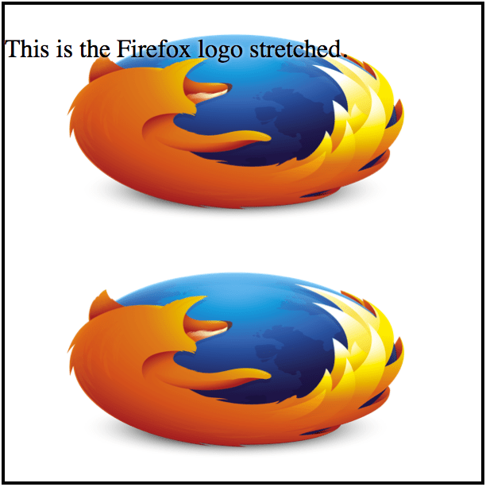

A propriedade CSS {{ cssxref("background-size") }} possibilita o ajuste das imagens do background, ao invés do comportamento padrão do navegador de mostrar a imagem no seu tamanho real. Você pode tanto aumentar como diminuir a imagem.

## Duplicando uma imagem grande

Vamos considerar uma imagem grande, a image da logo do Firefox com 2982x2808 . Nós queremos (por alguma razão, envolvendo um site com um design ruim) quatro cópia desta imagem em um quadrado de 300x300 pixel, resultando nesse visual:


Isto pode ser conseguido usando o seguinte CSS:

```css
.square {
  width: 300px;
  height: 300px;
  background-image: url(firefox_logo.png);
  border: solid 2px;
  text-shadow: white 0px 0px 2px;
  font-size: 16px;
  background-size: 150px;
}
```

O {{ cssxref("background-size") }} não precisa mais de nenhum prefixo, mas você pode considerar a adição de uma versão pré-fixada se você está focando em browsers muito antigos.

## Esticando uma imagem

Você também pode especificar ambos os tamanhos, horizontal e vertical da imagem, assim:

```css
background-size: 300px 150px;
```

O resultado fica assim:



## Aumentando escala de uma imagem

Na outra extremidade do espectro, é possível dimensionar-se uma imagem no fundo. Aqui nós aumentamos a escala de um favicon de pixel 32x32 para 300x300 pixels:


```css
.square2 {
  width: 300px;
  height: 300px;
  background-image: url(favicon.png);
  background-size: 300px;
  border: solid 2px;
  text-shadow: white 0px 0px 2px;
  font-size: 16px;
}
```

Como você pode ver, o CSS é, na verdade, essencialmente idêntico, salvo o nome do arquivo de imagem.

## Valores especiais: "contain" e "cover"

Da mesma maneira que o {{cssxref("&lt;length&gt;")}}, a propriedade CSS de {{ cssxref("background-size") }} oferece dois valores de tamanho especial, contain e cover. Vamos dar uma olhada nestes.

### `contain`

O valor contain especifica que, independentemente do tamanho da caixa que contém, a imagem de fundo deve ser dimensionado de modo a que cada lado seja tão grande quanto possível ao mesmo tempo que não exceda o comprimento do lado correspondente do recipiente. Tente redimensionar a janela usando um navegador que suporta imagens de fundo de escala (como o Firefox 3.6 ou posterior) para ver isso em ação no exemplo vivo abaixo.

{{ EmbedLiveSample("contain", "100%", "220") }}

```html
<div class="bgSizeContain">
  <p>Tente redimensionar a janela e ver o que acontece.</p>
</div>
```

```css
.bgSizeContain {
  height: 200px;
  background-image: url(firefox_logo.png);
  background-size: contain;
  border: 2px solid darkgray;
  color: #000;
  text-shadow: 1px 1px 0 #fff;
}
```

### `cover`

O valor cover especifica que a imagem de fundo deve ser dimensionado de modo que seja tão pequena quanto possível ao mesmo tempo assegurar que ambas as dimensões são maiores do que ou igual à dimensão correspondente do recipiente.

{{ EmbedLiveSample("cover", "100%", "220") }}

Os exemplos à seguir usam HTML & CSS:

```html
<div class="bgSizeCover">
  <p>Tente redimensionar a janela e ver o que acontece.</p>
</div>
```

```css
.bgSizeCover {
  height: 200px;
  background-image: url('firefox_logo.png');
  background-size: cover;
  border: 2px solid darkgray;
  color: #000; text-shadow: 1px 1px 0 #fff;
```

## Veja Também

- {{ cssxref("background-size") }}
- {{ cssxref("background") }}
