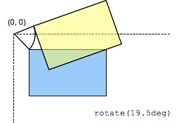

{{CSSRef}}

A função [CSS](/pt-BR/docs/Web/CSS) **`rotate()`** define uma transformação que gira um elemento em torno de um ponto fixo no plano 2D, sem deformá-lo. O resultado é um tipo de dados {{cssxref("&lt;transform-function&gt;")}}.



O eixo de rotação passa por uma origem, definido pela propriedade CSS {{ cssxref("transform-origin") }}.

## Sintaxe

A quantidade de rotação criada por `rotate()` é especificado por um {{cssxref("&lt;angle&gt;")}}. Se positivo, o movimento será no sentido horário; Se negativo, ela será no sentido anti-horário. Uma rotação de 180° é chamada de _point reflection_ (reflexão do ponto).

```
rotate(a)
```

### Valores

- `a`
  - : É um {{ cssxref("&lt;angle&gt;") }} representando o ângulo da rotação. Um ângulo positivo indica uma rotação no sentido horário, um ângulo negativo no sentido anti-horário.

<table class="standard-table">
  <thead>
    <tr>
      <th scope="col">Coordenadas cartesianas em ℝ<sup>2</sup></th>
      <th scope="col">Coordenadas homogêneas em ℝℙ<sup>2</sup></th>
      <th scope="col">Coordenadas cartesianas em ℝ<sup>3</sup></th>
      <th scope="col">Coordenadas homogêneas em ℝℙ<sup>3</sup></th>
    </tr>
  </thead>
  <tbody>
    <tr>
      <td colspan="1" rowspan="2">
        <math
          ><mfenced
            ><mtable
              ><mtr><mtd>cos(a)</mtd><mtd>-sin(a)</mtd></mtr>
              <mtr><mtd>sin(a)</mtd><mtd>cos(a)</mtd></mtr></mtable
            ></mfenced
          ></math
        >
      </td>
      <td>
        <math
          ><mfenced
            ><mtable
              ><mtr><mtd>cos(a)</mtd><mtd>-sin(a)</mtd><mtd>0</mtd></mtr
              ><mtr><mtd>sin(a)</mtd><mtd>cos(a)</mtd><mtd>0</mtd></mtr
              ><mtr><mtd>0</mtd><mtd>0</mtd><mtd>1</mtd></mtr></mtable
            ></mfenced
          ></math
        >
      </td>
      <td colspan="1" rowspan="2">
        <math
          ><mfenced
            ><mtable
              ><mtr><mtd>cos(a)</mtd><mtd>-sin(a)</mtd><mtd>0</mtd></mtr
              ><mtr><mtd>sin(a)</mtd><mtd>cos(a)</mtd><mtd>0</mtd></mtr
              ><mtr><mtd>0</mtd><mtd>0</mtd><mtd>1</mtd></mtr></mtable
            ></mfenced
          ></math
        >
      </td>
      <td colspan="1" rowspan="2">
        <math
          ><mfenced
            ><mtable
              ><mtr
                ><mtd>cos(a)</mtd><mtd>-sin(a)</mtd><mtd>0</mtd
                ><mtd>0</mtd></mtr
              ><mtr
                ><mtd>sin(a)</mtd><mtd>cos(a)</mtd><mtd>0</mtd><mtd>0</mtd></mtr
              ><mtr><mtd>0</mtd><mtd>0</mtd><mtd>1</mtd><mtd>0</mtd></mtr
              ><mtr
                ><mtd>0</mtd><mtd>0</mtd><mtd>0</mtd><mtd>1</mtd></mtr
              ></mtable
            ></mfenced
          ></math
        >
      </td>
    </tr>
    <tr>
      <td><code>[cos(a) sin(a) -sin(a) cos(a) 0 0]</code></td>
    </tr>
  </tbody>
</table>

## Exemplos

### HTML

```html
<div>Normal</div>
<div class="rotated">Rotated</div>
```

### CSS

```css
div {
  width: 80px;
  height: 80px;
  background-color: skyblue;
}

.rotated {
  transform: rotate(45deg); /* Equal to rotateZ(45deg) */
  background-color: pink;
}
```

### Resultado

{{EmbedLiveSample("Examples", "auto", 180)}}

## Compatibilidade do navegador

Por favor, veja o tipo de dados [`<transform-function>`](/pt-BR/docs/Web/CSS/transform-function#Browser_compatibility) para informações de compatibilidade.

## Veja também

- {{cssxref("transform")}}
- {{cssxref("&lt;transform-function&gt;")}}
- [`rotate3d()`](/pt-BR/docs/Web/CSS/transform-function/rotate3d)
