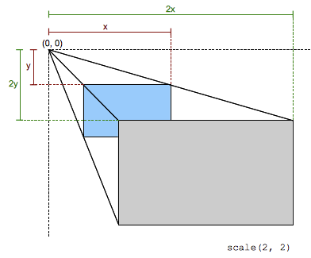

{{CSSRef}}

A função [CSS](/pt-BR/docs/Web/CSS) **`scale()`** define uma transformação que redimensiona um elemento no plano 2D. Como o redimensionamento é definido por um vetor, ele pode transformar as dimensões verticais e horizontais em escalas diferentes. Seu resultado é um dado do tipo {{cssxref("&lt;transform-function&gt;")}}.



Essa transformação de redimensionamento é caracterizada por um vetor bidimensional. Suas coordenadas definem o quanto cada direção deve ser redimensionada. Se as duas coordenadas forem iguais, o redimensionamento é uniforme (_isotrópico_) e a proporção do elemento é preservada (isto é uma [transformação homotética](https://en.wikipedia.org/wiki/Homothetic_transformation)).

Quando o valor de uma coordenada está fora do alcance \[-1, 1], o elemento cresce ao longo daquela dimensão; quando está dentro, ele encolhe. Se for negativo, o resultado é um [ponto de reflexão](https://en.wikipedia.org/wiki/Point_reflection) naquela dimensão. O valor 1 não tem efeito.

> **Nota:** A função `scale()` apenas redimensiona em 2D Para redimensionar em 3D, use [`scale3d()`](/pt-BR/docs/Web/CSS/transform-function/scale3d) ao invés.

## Sintaxe

A função `scale()` é especificada com um ou dois valores, que representam a quantidade de redimensionamento a ser aplicada em cada direção.

```
scale(sx)

scale(sx, sy)
```

### Valores

- `sx`
  - : Um {{cssxref("&lt;number&gt;")}} representando a abscissa do vetor de redimensionamento.
- `sy`
  - : Um {{cssxref("&lt;number&gt;")}} representando a ordenada do vetor de redimensionamento. Se não for definida, seu valor padrão é`sx`, resultando em um redimensionamento uniforme que preserva a proporção do elemento.

<table class="standard-table">
  <thead>
    <tr>
      <th scope="col">Coordenadas cartesianas em ℝ<sup>2</sup></th>
      <th scope="col">Coordenadas homogêneas em ℝℙ<sup>2</sup></th>
      <th scope="col">Coordenadas cartesianas em ℝ<sup>3</sup></th>
      <th scope="col">Coordenadas homogêneas em ℝℙ<sup>3</sup></th>
    </tr>
  </thead>
  <tbody>
    <tr>
      <td colspan="1" rowspan="2">
        <math
          ><mfenced
            ><mtable
              ><mtr><mtd>sx</mtd><mtd>0</mtd></mtr>
              <mtr><mtd>0</mtd><mtd>sy</mtd></mtr></mtable
            ></mfenced
          ></math
        >
      </td>
      <td>
        <math
          ><mfenced
            ><mtable
              ><mtr>sx<mtd>0</mtd><mtd>0</mtd></mtr
              ><mtr>0<mtd>sy</mtd><mtd>0</mtd></mtr
              ><mtr><mtd>0</mtd><mtd>0</mtd><mtd>1</mtd></mtr></mtable
            ></mfenced
          ></math
        >
      </td>
      <td colspan="1" rowspan="2">
        <math
          ><mfenced
            ><mtable
              ><mtr>sx<mtd>0</mtd><mtd>0</mtd></mtr
              ><mtr>0<mtd>sy</mtd><mtd>0</mtd></mtr
              ><mtr><mtd>0</mtd><mtd>0</mtd><mtd>1</mtd></mtr></mtable
            ></mfenced
          ></math
        >
      </td>
      <td colspan="1" rowspan="2">
        <math
          ><mfenced
            ><mtable
              ><mtr>sx<mtd>0</mtd><mtd>0</mtd><mtd>0</mtd></mtr
              ><mtr><mtd>0</mtd><mtd>sy</mtd><mtd>0</mtd><mtd>0</mtd></mtr
              ><mtr><mtd>0</mtd><mtd>0</mtd><mtd>1</mtd><mtd>0</mtd></mtr
              ><mtr
                ><mtd>0</mtd><mtd>0</mtd><mtd>0</mtd><mtd>1</mtd></mtr
              ></mtable
            ></mfenced
          ></math
        >
      </td>
    </tr>
    <tr>
      <td><code>[sx 0 0 sy 0 0]</code></td>
    </tr>
  </tbody>
</table>

## Exemplos

### Redimensionando as dimensões X e Y juntas

#### HTML

```html
<div>Normal</div>
<div class="scaled">Redimensionado</div>
```

#### CSS

```css
div {
  width: 80px;
  height: 80px;
  background-color: skyblue;
}

.scaled {
  transform: scale(0.7); /* Equal to scaleX(0.7) scaleY(0.7) */
  background-color: pink;
}
```

#### Resultado

{{EmbedLiveSample("Scaling_the_X_and_Y_dimensions_together", "200", "200")}}

### Redimensionando dimensões X e Y separadamente e transladando a origem

#### HTML

```html
<div>Normal</div>
<div class="scaled">Redimensionado</div>
```

#### CSS

```css
div {
  width: 80px;
  height: 80px;
  background-color: skyblue;
}

.scaled {
  transform: scale(2, 0.5); /* Igual a scaleX(2) scaleY(0.5) */
  transform-origin: left;
  background-color: pink;
}
```

#### Resultado

{{EmbedLiveSample("Scaling_X_and_Y_dimensions_separately_and_translating_the_origin", "200", "200")}}

## Compatibilidade com navegadores

Veja o dado do tipo [`<transform-function>`](/pt-BR/docs/Web/CSS/transform-function#Browser_compatibility) para informações de compatibilidade.

## Ver também

- {{cssxref("transform")}}
- {{cssxref("&lt;transform-function&gt;")}}
- [`scale3d()`](/pt-BR/docs/Web/CSS/transform-function/scale3d)
