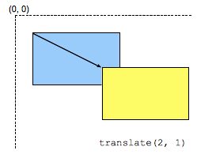

{{CSSRef}}

A função [CSS](/pt-BR/docs/Web/CSS) **`translate()`** reposiciona um elemento na direção horizontal e/ou vertical. O seu resultado é um tipo de dado {{cssxref("&lt;transform-function&gt;")}}.



Esta transformação é caracterizada por um vetor bidimensional. Suas coordenadas definem o quanto o elemento se move em cada direção.

## Sintaxe

```css
/* Valores <length-percentage> únicos */
transform: translate(200px);
transform: translate(50%);

/* Valores <length-percentage> duplos */
transform: translate(100px, 200px);
transform: translate(100px, 50%);
transform: translate(30%, 200px);
transform: translate(30%, 50%);
```

### Valores

- Valores `<length-percentage>` únicos
  - : Este valor é um {{cssxref("length")}} ou {{cssxref("percentage")}} representando a abcissa (horizontal, coordenada x) do vetor de translação. A ordenada (vertical, coordenada y) do vetor de translação será definida como `0`. Por exemplo, `translate(2)` é equivalente a `translate(2, 0)`. Um valor percentual refere-se à largura da caixa de referência definida pela propriedade {{cssxref("transform-box")}}.
- Valores `<length-percentage>` duplos
  - : Este valor descreve dois {{cssxref("length")}} ou valores {{cssxref("percentage")}} representando tanto a abcissa (coordenada x) quanto a ordenada (coordenada y) do vetor de translação. Uma porcentagem como primeiro valor refere-se à largura, como segunda parte da altura da caixa de referência definida pela propedade {{cssxref("transform-box")}}.

<table class="standard-table">
  <thead>
    <tr>
      <th scope="col">Coordenadas cartesianas em ℝ<sup>2</sup></th>
      <th scope="col">Coordenadas homogêneas emℝℙ<sup>2</sup></th>
      <th scope="col">Coordenadas cartesianas em ℝ<sup>3</sup></th>
      <th scope="col">Coordenadas homogêneas em ℝℙ<sup>3</sup></th>
    </tr>
  </thead>
  <tbody>
    <tr>
      <td colspan="1" rowspan="2">
        <p>
          Uma translação não é uma transformação linear em ℝ<sup>2</sup> e não
          pode ser representada usando uma matriz de coordenadas cartesianas.
        </p>
      </td>
      <td>
        <math
          ><mfenced
            ><mtable
              ><mtr>1<mtd>0</mtd><mtd>tx</mtd></mtr
              ><mtr>0<mtd>1</mtd><mtd>ty</mtd></mtr
              ><mtr><mtd>0</mtd><mtd>0</mtd><mtd>1</mtd></mtr></mtable
            ></mfenced
          ></math
        >
      </td>
      <td colspan="1" rowspan="2">
        <math
          ><mfenced
            ><mtable
              ><mtr>1<mtd>0</mtd><mtd>tx</mtd></mtr
              ><mtr>0<mtd>1</mtd><mtd>ty</mtd></mtr
              ><mtr><mtd>0</mtd><mtd>0</mtd><mtd>1</mtd></mtr></mtable
            ></mfenced
          ></math
        >
      </td>
      <td colspan="1" rowspan="2">
        <math
          ><mfenced
            ><mtable
              ><mtr>1<mtd>0</mtd><mtd>0</mtd><mtd>tx</mtd></mtr
              ><mtr>0<mtd>1</mtd><mtd>0</mtd><mtd>ty</mtd></mtr
              ><mtr><mtd>0</mtd><mtd>0</mtd><mtd>1</mtd><mtd>0</mtd></mtr
              ><mtr
                ><mtd>0</mtd><mtd>0</mtd><mtd>0</mtd><mtd>1</mtd></mtr
              ></mtable
            ></mfenced
          ></math
        >
      </td>
    </tr>
    <tr>
      <td><code>[1 0 0 1 tx ty]</code></td>
    </tr>
  </tbody>
</table>

### Sintaxe formal

```
translate({{cssxref("length-percentage")}} , {{cssxref("length-percentage")}}?)
```

## Exemplos

### Usando uma conversão de eixo único

#### HTML

```html
<div>Estático</div>
<div class="moved">Movido</div>
<div>Estático</div>
```

#### CSS

```css
div {
  width: 60px;
  height: 60px;
  background-color: skyblue;
}

.moved {
  transform: translate(
    10px
  ); /* Igual a: translateX(10px) ou translate(10px, 0) */
  background-color: pink;
}
```

#### Resultado

{{EmbedLiveSample("Using_a_single-axis_translation", 250, 250)}}

### Combinando a translação do eixo y e do eixo x

#### HTML

```html
<div>Estático</div>
<div class="moved">Movido</div>
<div>Estático</div>
```

#### CSS

```css
div {
  width: 60px;
  height: 60px;
  background-color: skyblue;
}

.moved {
  transform: translate(10px, 10px);
  background-color: pink;
}
```

#### Resultado

{{EmbedLiveSample("Combining_y-axis_and_x-axis_translation", 250, 250)}}

## Especificações

| Especificações                                                                 | Estado                       | Comentário        |
| ------------------------------------------------------------------------------ | ---------------------------- | ----------------- |
| {{SpecName('CSS3 Transforms', '#funcdef-transform-translate', 'translate()')}} | {{Spec2('CSS3 Transforms')}} | Definição inicial |

## Compatibilidade com navegadores

Verifique o tipo de dado [`<transform-function>`](/pt-BR/docs/Web/CSS/transform-function#Browser_compatibility) para informações de compatibilidade.

## Veja também

- {{cssxref("transform")}}
- {{cssxref("&lt;transform-function&gt;")}}
