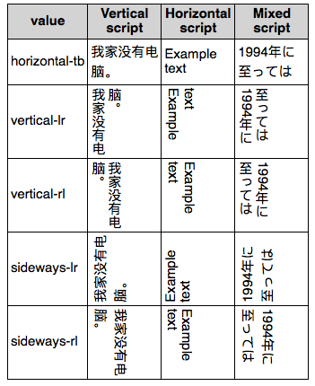

{{CSSRef}}

A propriedade CSS **`writing-mode`** define se as linhas do texto são dispostas horizontalmente ou verticalmente e a direção que os blocos seguem

```css
/* Valores das palavras-chave */
writing-mode: horizontal-tb;
writing-mode: vertical-rl;
writing-mode: vertical-lr;

/* Valores globais */
writing-mode: inherit;
writing-mode: initial;
writing-mode: unset;
```

## Sintaxe

A propriedade especifica o _comportamento de fluxo do bloco,_ que é a maneira em que os containers são empilhados ou distribuídos, e a direção em que o conteudo é alinhado ou disposto dentro dos containers. Assim a propriedade `writing-mode` também determina a distribuição do conteúdo no nível de bloco

{{cssinfo}}

### Values

- `horizontal-tb`
  - : Conteúdo é disposto horizontalmente da esquerda para a direita, verticalmente de cima para baixo. A próxima linha horizontal é posicionada abaixo da linha anterior.
- `vertical-rl`
  - : Conteúdo é disposto verticalmente de cima para baixo, horizontalmente da direita para a esquerda. A proxima linha vertical é posicionada à esquerda da linha anterior.
- `vertical-lr`
  - : Conteúdo é disposto verticalmente de cima para baixo, horizontalmente da esquerda para a direita. A proxima linha vertical é posicionada à direita da linha anterior.
- `sideways-rl` {{experimental_inline}}
  - : Conteúdo é disposto verticalmente de cima para baixo e todos os glifos, até mesmo os que estão em uma escrita vertical, são colocados lado a lado para a direita.
- `sideways-lr` {{experimental_inline}}
  - : Conteúdo é disposto verticalmente de cima para baixo e todos os glifos, até mesmo os que estão em uma escrita vertical, são colocados lado a lado para a esquerda.
- `lr` {{deprecated_inline}}
  - : Descontinuado exceto para docmentos SVG1. Para CSS, use `horizontal-tb`.
- `lr-tb` {{deprecated_inline}}
  - : Descontinuado exceto para docmentos SVG1. Para CSS, use `horizontal-tb`.
- `rl` {{deprecated_inline}}
  - : Descontinuado exceto para docmentos SVG1. Para CSS, use `horizontal-tb`.
- `tb` {{deprecated_inline}}
  - : Descontinuado exceto para docmentos SVG1. Para CSS, use `vertical-lr`.
- `tb-rl` {{deprecated_inline}}
  - : Descontinuado exceto para docmentos SVG1. Para CSS, use `vertical-rl`.

### Sintaxe formal

{{csssyntax}}

## Exemplo

Esse exemplo demonstra todos os modos de escrita, mostrando cada um com texto e várias línguas.

### HTML

O HTML é simplesmente um {{HTMLElement("table")}} com cada modo de escrita em uma linha com uma coluna mostrando texto em diversos scripts usando esse modo de escrita.

```html
<table>
  <tr>
    <th>value</th>
    <th>Vertical script</th>
    <th>Horizontal script</th>
    <th>Mixed script</th>
  </tr>
  <tr>
    <td>horizontal-tb</td>
    <td class="example Text1"><span>我家没有电脑。</span></td>
    <td class="example Text1"><span>Example text</span></td>
    <td class="example Text1"><span>1994年に至っては</span></td>
  </tr>
  <tr>
    <td>vertical-lr</td>
    <td class="example Text2"><span>我家没有电脑。</span></td>
    <td class="example Text2"><span>Example text</span></td>
    <td class="example Text2"><span>1994年に至っては</span></td>
  </tr>
  <tr>
    <td>vertical-rl</td>
    <td class="example Text3"><span>我家没有电脑。</span></td>
    <td class="example Text3"><span>Example text</span></td>
    <td class="example Text3"><span>1994年に至っては</span></td>
  </tr>
  <tr>
    <td>sideways-lr</td>
    <td class="example Text4"><span>我家没有电脑。</span></td>
    <td class="example Text4"><span>Example text</span></td>
    <td class="example Text4"><span>1994年に至っては</span></td>
  </tr>
  <tr>
    <td>sideways-rl</td>
    <td class="example Text5"><span>我家没有电脑。</span></td>
    <td class="example Text5"><span>Example text</span></td>
    <td class="example Text5"><span>1994年に至っては</span></td>
  </tr>
</table>
```

### CSS

```css hidden
table {
  border-collapse: collapse;
}
td,
th {
  border: 1px black solid;
  padding: 3px;
}
th {
  background-color: lightgray;
}
.example {
  height: 75px;
  width: 75px;
}
```

O CSS que ajusta a direcionalidade do conteúdo é algo como esse:

```css
.example.Text1 span,
.example.Text1 {
  writing-mode: horizontal-tb;
  -webkit-writing-mode: horizontal-tb;
  -ms-writing-mode: horizontal-tb;
}

.example.Text2 span,
.example.Text2 {
  writing-mode: vertical-lr;
  -webkit-writing-mode: vertical-lr;
  -ms-writing-mode: vertical-lr;
}

.example.Text3 span,
.example.Text3 {
  writing-mode: vertical-rl;
  -webkit-writing-mode: vertical-rl;
  -ms-writing-mode: vertical-rl;
}

.example.Text4 span,
.example.Text4 {
  writing-mode: sideways-lr;
  -webkit-writing-mode: sideways-lr;
  -ms-writing-mode: sideways-lr;
}

.example.Text5 span,
.example.Text5 {
  writing-mode: sideways-rl;
  -webkit-writing-mode: sideways-rl;
  -ms-writing-mode: sideways-rl;
}
```

{{EmbedLiveSample("Example", 400, 500)}}

### Resultado atual

Essa é uma imagem mostrando o que o resultado deve parecer, no caso do suporte do seu navegador para `writing-mode` estiver incompleto.



## Especificação

| Especificação                                                     | Status                          | Comentário                              |
| ----------------------------------------------------------------- | ------------------------------- | --------------------------------------- |
| {{SpecName("CSS3 Writing Modes", "#block-flow", "writing-mode")}} | {{Spec2("CSS3 Writing Modes")}} | Definição inicial                       |
| {{SpecName("CSS4 Writing Modes", "#block-flow", "writing-mode")}} | {{Spec2("CSS4 Writing Modes")}} | Adicionar `sideways-lr` e `sideways-rl` |

## Compatibilidade com navegadores

{{Compat("css.properties.writing-mode")}}

## See also

- SVG [`writing-mode`](/pt-BR/docs/Web/SVG/Attribute/writing-mode) attribute
- {{Cssxref("direction")}}
- {{Cssxref("unicode-bidi")}}
- {{Cssxref("text-orientation")}}
- {{Cssxref("text-combine-upright")}}
