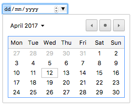
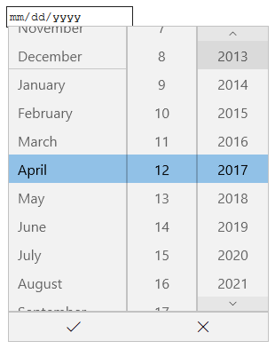
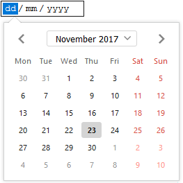
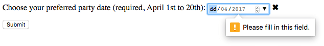

Os elementos {{htmlelement("input")}} do tipo **`date`** cria campos de entrada que permite o usuário informar uma data, como também usar uma caixa de texto que valida automaticamente o conteúdo, ou usando uma interface de seleção de data especial. O valor resultante inclui ano, mês e dia, mas não o `horário`. Os tipos de entrada [time](/pt-BR/docs/Web/HTML/Element/input/time) e [`datetime-local`](/pt-BR/docs/Web/HTML/Element/input/datetime-local) permitem informar horário e data/hora.

A interface do usuário do controle varia geralmente de navegador para navegador; neste momento o suporte é irregular, veja [Browser compatibility](#browser_compatibility) para maiores detalhes. Nos navegadores sem suporte, o controle é rebaixado graciosamente para um [`<input type="text">`](/pt-BR/docs/Web/HTML/Element/input/text) simples.

```html
<input id="date" type="date" />
```

{{ EmbedLiveSample('Basic_example', 600, 40) }}

Entre os navegadores que suportam uma interface personalizada para selecionar datas é o controle de data do Chrome/Opera, que se parece com:



O controle de data do Edge se parece assim:



O controle de data do Firefox se parece assim:



<table class="properties">
  <tbody>
    <tr>
      <td>
        <strong><a href="#value">Value</a></strong>
      </td>
      <td>
        Um {{domxref("DOMString")}} que representa uma data no formato
        AAAA-MM-DD ou vazio
      </td>
    </tr>
    <tr>
      <td><strong>Eventos</strong></td>
      <td>{{event("change")}} e {{event("input")}}</td>
    </tr>
    <tr>
      <td><strong>Atributos Comuns Suportados</strong></td>
      <td>
        <a href="/pt-BR/docs/Web/HTML/Element/input#autocomplete"><code>autocomplete</code></a>,
        <a href="/pt-BR/docs/Web/HTML/Element/input#list"><code>list</code></a>,
        <a href="/pt-BR/docs/Web/HTML/Element/input#readonly"><code>readonly</code></a> e
        <a href="/pt-BR/docs/Web/HTML/Element/input#step"><code>step</code></a>
      </td>
    </tr>
    <tr>
      <td><strong>Atributos IDL</strong></td>
      <td>
        <code>list</code>, <code>value</code>, <code>valueAsDate</code>,
        <code>valueAsNumber</code>.
      </td>
    </tr>
    <tr>
      <td><strong>Métodos</strong></td>
      <td>
        {{domxref("HTMLInputElement.select", "select()")}},
        {{domxref("HTMLInputElement.stepDown", "stepDown()")}},
        {{domxref("HTMLInputElement.stepUp", "stepUp()")}}
      </td>
    </tr>
  </tbody>
</table>

## Valores

Um {{domxref("DOMString")}} representa o valor data informada na entrada. Você pode definir o valor padrão para a entrada incluindo uma data dentro do atributo [`value`](/pt-BR/docs/Web/HTML/Element/input#value), como:

```html
<input id="date" type="date" value="2017-06-01" />
```

{{ EmbedLiveSample('Value', 600, 40) }}

Uma coisa para perceber é que o formato da data mostrada difere do `value` atual— o formato da data mostrada será escolhido baseado na localização definida no navegador do usuário, enquanto que a data em `value` sempre será formatado como `yyyy-mm-dd`.

Você pode, além disso, obter e definir o valor da data em JavaScript usando a propriedade {{domxref("HTMLInputElement.value", "value")}} do elemento de entrada, por exemplo:

```js
var dateControl = document.querySelector('input[type="date"]');
dateControl.value = "2017-06-01";
```

Este código localiza o primeiro elemento {{HTMLElement("input")}} que o `type` é `date` e define seu valor para a data 2017-06-01 (1 de junho de 2017).

## Atributos adicionais

Além dos atributos disponíveis para todos os elementos {{HTMLElement("input")}}, as caixas de texto de data oferecem os seguintes atributos:

| Atributo                | Descrição                                                                                                 |
| ----------------------- | --------------------------------------------------------------------------------------------------------- |
| [`max`](#max)           | A maior data aceitável                                                                                    |
| [`min`](#min)           | A menor data aceitável                                                                                    |
| [`readonly`](#readonly) | Se o conteúdo da caixa de texto é somente leitura                                                         |
| [`step`](#step)         | O intervalo a ser usado, quando clicar nos botões de seta para baixo e para cima, e também para validação |

## Usando caixas de texto de data

Caixas de texto de data se mostra conveniente à primeira vista — eles fornecem uma interface simples para escolha de datas e normalizam o formato da data enviado para o servidor, independentemente da localização do usuário. Contudo, há problemas com o `<input type="date">` por causa do suporte limitado do navegador.

Iremos dar uma olhada em usos básicos e mais complexos de `<input type="date">`, então aconselharemos sobre como atenuar os problemas de suporte dos navegadores (veja [Handling browser support](#handling_browser_support)). Claro, esperamos que ao longo do tempo o supore dos navegadores sejam mais universal e este problema desapareça.

### Uso básico da data

O uso mais simples de `<input type="date">` envolve a combinação de um `<input>` básico e o elemento {{htmlelement("label")}}, como pode ser visto abaixo:

```html
<form>
  <div>
    <label for="diaa">Informe a data do seu aniversário:</label>
    <input type="date" id="diaa" name="diaa" />
  </div>
</form>
```

{{ EmbedLiveSample('Basic_uses_of_date', 600, 40) }}

### Definindo data mínima e máxima

Você pode usar os atributos [`min`](/pt-BR/docs/Web/HTML/Element/input#min) e [`max`](/pt-BR/docs/Web/HTML/Element/input#max) para restringir as datas que podem ser escolhidas pelo usuário. No próximo exemplo nós definimos uma data mínima como `2017-04-01` e data máxima como `2017-04-30`:

```html
<form>
  <div>
    <label for="festa">Escolha a sua data preferida da festa:</label>
    <input
      type="date"
      id="festa"
      name="festa"
      min="2017-04-01"
      max="2017-04-30" />
  </div>
</form>
```

{{ EmbedLiveSample('Setting_maximum_and_minimum_dates', 600, 40) }}

O resultado aqui será apenas que as dias de Abril de 2017 serão selecionados — apenas a parte "dias" do texto será editável e datas fora de Abril não serão rolados na ferramenta de seleção de data.

> **Note:** **Observação**: Você deve conhecer o uso do atributo [`step`](/pt-BR/docs/Web/HTML/Element/input#step) para variar o número de dias pulados cada vez que a data é incrementada (ex.: talvez você queira deixar que os Sábados sejam selecionáveis). Contudo, isto não parece funcionar eficiente de qualquer implementação em tempo de escrita.

### Controlando o tamanho da entrada

`<input type="date">` não suporta atributos de tamanho de formulário como [`size`](/pt-BR/docs/Web/HTML/Element/input#size). Você poderá recorrer ao [CSS](/pt-BR/docs/Web/CSS) para modificar o tamanho.

## Validação

Por padrão `<input type="date">` não aplica nenhuma validação de entrada de valores. As implementações da interface geralmente não deixam você informar nada que não seja uma data — o que é útil — mas você pode continuar deixando o campo vazio ou (em navegadores onde a entrada converte para o tipo `text`) informar uma data inválida (ex.: o 32 de Abril).

Se você usa [`min`](/pt-BR/docs/Web/HTML/Element/input#min) e [`max`](/pt-BR/docs/Web/HTML/Element/input#max) para restringir datas disponíveis (ver [Definindo data mínima e máxima](#definindo_data_mínima_e_máxima)), os navegadores suportados mostrarão um erro se você tentar submeter uma data fora da faixa. Contudo, você terá que verificar os resultados para ter certeza que o valor está entre estas datas, uma vez que são aplicadas apenas se o selecionador de data for totalmente suportado pelo dispositivo do usuário.

Adicionalmente, você pode usar o atributo [`required`](/pt-BR/docs/Web/HTML/Element/input#required) para tornar o preenchimento da data obrigatório — novamente, um erro será mostrado se você tentar submeter um campo de data vazia. Isto, finalmente, deve funcionar em muitos navegadores.

Vamos dar uma olhada em um exemplo — aqui nós definimos datas mínima e máxima e deixamos o campo como obrigatório:

```html
<form>
  <div>
    <label for="festa"
      >Escolha sua data preferida da festa (obrigatório, de 1º a 20 de
      abril):</label
    >
    <input
      type="date"
      id="festa"
      name="festa"
      min="2017-04-01"
      max="2017-04-20"
      required />
    <span class="validity"></span>
  </div>
  <div>
    <input type="submit" />
  </div>
</form>
```

Se você tentar submeter o formulário com uma data imcompleta (ou com uma data fora da faixa), o navegador mostrará um erro. Tente executar o exemplo agora:

{{ EmbedLiveSample('Validation', 600, 100) }}

Aqui tem uma captura de tela que mostra o resultado se seu navegador não suporta:



Aqui tem o CSS utilizado no exemplo acima. Nós usamos as propriedades CSS {{cssxref(":valid")}} e {{cssxref(":invalid")}} para estilizar a caixa de texto dependendo se o valor atual é válido ou não. Colocamos ícones num {{htmlelement("span")}} próximo a caixa de entrada, não dentro da caixa, porque no Chrome o conteúdo gerado é colocado dentro do controle do formulário, e não seria estilzado ou mostrado eficientemente.

```css
div {
  margin-bottom: 10px;
  display: flex;
  align-items: center;
}

label {
  display: inline-block;
  width: 300px;
}

input:invalid + span:after {
  content: "✖";
  padding-left: 5px;
}

input:valid + span:after {
  content: "✓";
  padding-left: 5px;
}
```

> **Warning:** **Importante**: A validação do formulário HTML não subtitui scripts que validam se a entrada de dados está em um formato apropriado. É muito fácil para alguém fazer ajustes no HTML que permitam sobrepor a validação ou removê-lo inteiramente. Também é possível simplesmente sobrepor seu HTML inteiramente e submeter os dados diretamente ao seu servidor. Se seu código server-side falhar na validação do dado que recebe pode ocorreu um desaste quando os dados forem submetidos inapropriadamente formatado (ou dado pode ser muito grande, ou é do tipo errado e assim por diante).

## Manipulação do suporte do navegador

Como mencionado acima, o maior problema em usar caixas de entrada de data em tempo de escrita é o [suporte do navegador](#browser_compatibility). Por exemplo, o selecionador de data no Firefox para Android se parece com isso:


Navegadores que não suportam graciosamente rebaixa para uma caixa de texto comum, mas criam problemas em termos de consistência da interface do usuário (o controle apresentado será diferente) e a manipulação do dado.

O segundo problema é mais sério que os anterirores; como mencionamos antes, com um campo de texto de data o valor atual sempre é normalizado pelo formato `yyyy-mm-dd`. Com a caixa de texto comum, por outro lado, por padrão do navegador não há reconhecimento de qual formato a data deve ter e há muitos modos diferentes em que as pessoas escrevem datas. Por exemplo:

- `ddmmyyyy`
- `dd/mm/yyyy`
- `mm/dd/yyyy`
- `dd-mm-yyyy`
- `mm-dd-yyyy`
- `Month dd yyyy`

Um jeito de contornar isso é colocar um atributo [`pattern`](/pt-BR/docs/Web/HTML/Element/input#pattern) na caixa de texto de data. Sempre que a caixa de texto de data não usá-lo, a caixa de texto devolverá um erro. Por exemplo, tente ver o que o seguinte exemplo faz num navegador sem suporte:

```html
<form>
  <div>
    <label for="diaa">Informe a data do seu aniversário:</label>
    <input
      type="date"
      id="bday"
      name="diaa"
      required
      pattern="[0-9]{4}-[0-9]{2}-[0-9]{2}" />
    <span class="validity"></span>
  </div>
  <div>
    <input type="submit" />
  </div>
</form>
```

{{ EmbedLiveSample('Handling_browser_support', 600, 100) }}

Se você submetê-lo, verá que o navegador agora mostra uma mensagem de erro (e destaca a caixa de texto como inválido) se o que foi informado não combinam com o padrão `nnnn-nn-nn`, onde `n` é um número entre 0 e 9. Claro, isto não parará as pessoas de informar datas inválidas ou datas formatadas incorretamente, como `yyyy-dd-mm` (onde nós precisamos de `yyyy-mm-dd`). Então continua sendo um problema.

```css hidden
div {
  margin-bottom: 10px;
}

input:invalid + span {
  position: relative;
}

input:invalid + span:after {
  content: "✖";
  position: absolute;
  right: -18px;
}

input:valid + span {
  position: relative;
}

input:valid + span:after {
  content: "✓";
  position: absolute;
  right: -18px;
}
```

A melhor maneira de lidar com datas nos formulários de um modo entre navegadores no momento é obter do usuário o dia, mês e ano em controles separados (elementos {{htmlelement("select")}} são bem populares; veja abaixo uma implementação) ou use uma biblioteca JavaScript como o [selecionador de data do jQuery](https://jqueryui.com/datepicker/).

## Atributos

Beside the attributes listed below, this element can have any of the [global attributes](/pt-BR/docs/HTML/Global_attributes).

- {{htmlattrdef("mozactionhint")}} {{non-standard_inline}}
  - : Specifies an "action hint" used to determine how to label the enter key on mobile devices with virtual keyboards. Supported values are `go`, `done`, `next`, `search`, and `send`; these automatically get mapped to the appropriate string (and are case-insensitive).
- {{htmlattrdef("autofocus")}}
  - : This Boolean attribute lets you specify that a form control should have input focus when the page loads, unless the user overrides it, for example by typing in a different control. Only one form element in a document can have the **autofocus** attribute, which is a Boolean. It cannot be applied if the **type** attribute is set to `hidden` (that is, you cannot automatically set focus to a hidden control).
- {{htmlattrdef("disabled")}}
  - : This Boolean attribute indicates that the form control is not available for interaction. In particular, the `click` event [will not be dispatched](https://html.spec.whatwg.org/multipage/forms.html#enabling-and-disabling-form-controls:-the-disabled-attribute) on disabled controls. Also, a disabled control's value isn't submitted with the form.
- {{htmlattrdef("form")}}
  - : The form element that the input element is associated with (its _form owner_). The value of the attribute must be an **id** of a {{HTMLElement("form")}} element in the same document. If this attribute is not specified, this `<input>` element must be a descendant of a {{HTMLElement("form")}} element. This attribute enables you to place `<input>` elements anywhere within a document, not just as descendants of their form elements. An input can only be associated with one form.
- {{htmlattrdef("formaction")}}
  - : The URI of a program that processes the information submitted by the input element, if it is a submit button or image. If specified, it overrides the [`action`](/pt-BR/docs/Web/HTML/Element/form#action) attribute of the element's form owner.
- {{htmlattrdef("formenctype")}}

  - : If the input element is a submit button or image, this attribute specifies the type of content that is used to submit the form to the server. Possible values are:

    - `application/x-www-form-urlencoded`: The default value if the attribute is not specified.
    - `multipart/form-data`: Use this value if you are using an {{HTMLElement("input")}} element with the [`type`](/pt-BR/docs/Web/HTML/Element/input#type) attribute set to `file`.
    - `text/plain`

    If this attribute is specified, it overrides the [`enctype`](/pt-BR/docs/Web/HTML/Element/form#enctype) attribute of the element's form owner.

- {{htmlattrdef("formmethod")}}

  - : If the input element is a submit button or image, this attribute specifies the HTTP method that the browser uses to submit the form. Possible values are:

    - `post`: The data from the form is included in the body of the form and is sent to the server.
    - `get`: The data from the form are appended to the **form** attribute URI, with a '?' as a separator, and the resulting URI is sent to the server. Use this method when the form has no side-effects and contains only ASCII characters.

    If specified, this attribute overrides the [`method`](/pt-BR/docs/Web/HTML/Element/form#method) attribute of the element's form owner.

- {{htmlattrdef("formnovalidate")}}
  - : If the input element is a submit button or image, this Boolean attribute specifies that the form is not to be validated when it is submitted. If this attribute is specified, it overrides the [`novalidate`](/pt-BR/docs/Web/HTML/Element/form#novalidate) attribute of the element's form owner.
- {{htmlattrdef("formtarget")}}

  - : If the input element is a submit button or image, this attribute is a name or keyword indicating where to display the response that is received after submitting the form. This is a name of, or keyword for, a _browsing context_ (for example, tab, window, or inline frame). If this attribute is specified, it overrides the [`target`](/pt-BR/docs/Web/HTML/Element/form#target) attribute of the elements's form owner. The following keywords have special meanings:

    - `_self`: Load the response into the same browsing context as the current one. This value is the default if the attribute is not specified.
    - `_blank`: Load the response into a new unnamed browsing context.
    - `_parent`: Load the response into the parent browsing context of the current one. If there is no parent, this option behaves the same way as `_self`.
    - `_top`: Load the response into the top-level browsing context (that is, the browsing context that is an ancestor of the current one, and has no parent). If there is no parent, this option behaves the same way as `_self`.

- {{htmlattrdef("inputmode")}}

  - : A hint to the browser for which keyboard to display. This attribute applies when the value of the **type** attribute is text, password, email, or url. Possible values are:

    - `verbatim`: Alphanumeric, non-prose content such as usernames and passwords.
    - `latin`: Latin-script input in the user's preferred language with typing aids such as text prediction enabled. For human-to-computer communication such as search boxes.
    - `latin-name`: As _latin_, but for human names.
    - `latin-prose`: As _latin_, but with more aggressive typing aids. For human-to-human communication such as instant messaging for email.
    - `full-width-latin`: As _latin-prose_, but for the user's secondary languages.
    - `kana`: Kana or romaji input, typically hiragana input, using full-width characters, with support for converting to kanji. Intended for Japanese text input.
    - `katakana`: Katakana input, using full-width characters, with support for converting to kanji. Intended for Japanese text input.
    - `numeric`: Numeric input, including keys for the digits 0 to 9, the user's preferred thousands separator character, and the character for indicating negative numbers. Intended for numeric codes, e.g. credit card numbers. For actual numbers, prefer using \<input type="number">
    - `tel`: Telephone input, including asterisk and pound key. Use \<input type="tel"> if possible instead.
    - `email`: Email input. Use \<input type="email"> if possible instead.
    - `url`: URL input. Use \<input type="url"> if possible instead.

- {{htmlattrdef("list")}}
  - : Identifies a list of pre-defined options to suggest to the user. The value must be the **id** of a {{HTMLElement("datalist")}} element in the same document. The browser displays only options that are valid values for this input element.
- {{htmlattrdef("max")}}
  - : The maximum value for this item, which must not be less than its minimum (**min** attribute) value.
- {{htmlattrdef("min")}}
  - : The minimum value for this item, which must not be greater than its maximum (**max** attribute) value.
- {{htmlattrdef("name")}}
  - : The name of the control, which is submitted with the form data.
- {{htmlattrdef("readonly")}}
  - : This Boolean attribute indicates that the user cannot modify the value of the control.
- {{htmlattrdef("required")}}
  - : This attribute specifies that the user must fill in a value before submitting a form. It cannot be used when the **type** attribute is `hidden`, `image`, or a button type (`submit`, `reset`, or `button`). The {{cssxref(":optional")}} and {{cssxref(":required")}} CSS pseudo-classes will be applied to the field as appropriate.
- {{htmlattrdef("selectionDirection")}}
  - : The direction in which selection occurred. This is "forward" if the selection was made from left-to-right in an LTR locale or right-to-left in an RTL locale, or "backward" if the selection was made in the opposite direction. This can be "none" if the selection direction is unknown.
- {{htmlattrdef("spellcheck")}}
  - : Setting the value of this attribute to `true` indicates that the element needs to have its spelling and grammar checked. The value `default` indicates that the element is to act according to a default behavior, possibly based on the parent element's own `spellcheck` value. The value `false` indicates that the element should not be checked.
- {{htmlattrdef("step")}}
  - : Works with the **min** and **max** attributes to limit the increments at which a numeric or date-time value can be set. It can be the string `any` or a positive floating point number. If this attribute is not set to `any`, the control accepts only values at multiples of the step value greater than the minimum.
- {{htmlattrdef("value")}}
  - : The initial value of the control. This attribute is optional.
    Note that when reloading the page, Gecko and IE [will ignore the value specified in the HTML source](https://bugzilla.mozilla.org/show_bug.cgi?id=46845#c186), if the value was changed before the reload.
- {{htmlattrdef("x-moz-errormessage")}} {{non-standard_inline}}
  - : This Mozilla extension allows you to specify the error message to display when a field doesn't successfully validate.

## Examples

To create a widget to display a date, use:

```html
<input type="date" />
```

## Navegadores compatíveis

{{Compat("html.elements.input.type_date")}}

## Veja também

- The generic {{HTMLElement("input")}} element and the interface used to manipulate it, {{domxref("HTMLInputElement")}}
- [Date and Time picker tutorial](/pt-BR/docs/Web/Guide/HTML/Forms/The_native_form_widgets#Date_and_time_picker)
- [Bug 1283381 - Firefox bug to implement](https://bugzilla.mozilla.org/show_bug.cgi?id=1283381)
