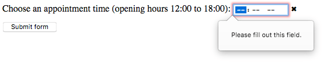

{{HTMLSidebar}}

Elementos `<input>` do tipo **`time`** (hora) criam campos de inserção que permitem que o usuário digite horários facilmente (horas e minutos e, opcionalmente, segundos).

A interface de usuário deste tipo de campo varia de navegador para navegador. A maioria dos navegadores modernos é compatível com ele exceto pelo Safari, o único grande navegador que ainda não o implementou; no Safari (e em qualquer outro navegador que ainda não suporte `<time>`), ele regride para [`<input type="text">`](/pt-BR/docs/Web/HTML/Element/input/text).

{{EmbedInteractiveExample("pages/tabbed/input-time.html", "tabbed-standard")}}

## Aparência

### Chrome e Opera

No Chrome/Opera, o campo de `time` é simples, com espaços onde o usuário pode inserir horas e minutos (no formato 24 horas), além de setas para cima e para baixo que servem para, respectivamente, incrementar e decrementar o componente atualmente selecionado. Um botão "X" também é apresentado para limpar o conteúdo do campo.


### Firefox

O campo de `time` do Firefox é bem parecido com o do Chrome, exceto pela ausência das setas para cima e para baixo e por estar no formato 12 horas (com um espaço adicional para inserir AM ou PM).


### Edge

O campo de `time` do Edge é melhor elaborado, abrindo um seletor de hora e minuto com rolagem infinita. Assim como o Chrome, ele também adota o formato 24 horas:


<table class="properties">
  <tbody>
    <tr>
      <td>
        <strong><a href="#value">Value</a></strong>
      </td>
      <td>
        Uma {{domxref("DOMString")}} representando um horário, ou vazia.
      </td>
    </tr>
    <tr>
      <td><strong>Eventos</strong></td>
      <td>{{event("change")}} e {{event("input")}}.</td>
    </tr>
    <tr>
      <td><strong>Atributos comuns suportados</strong></td>
      <td>
        <a href="/pt-BR/docs/Web/HTML/Element/input#autocomplete"><code>autocomplete</code></a>,
        <a href="/pt-BR/docs/Web/HTML/Element/input#list"><code>list</code></a>,
        <a href="/pt-BR/docs/Web/HTML/Element/input#readonly"><code>readonly</code></a> e
        <a href="/pt-BR/docs/Web/HTML/Element/input#step"><code>step</code></a>.
      </td>
    </tr>
    <tr>
      <td><strong>Atributos IDL</strong></td>
      <td>
        <code>value</code>, <code>valueAsDate</code>,
        <code>valueAsNumber</code> e <code>list</code>.
      </td>
    </tr>
    <tr>
      <td><strong>Métodos</strong></td>
      <td>
        {{domxref("HTMLInputElement.select", "select()")}},
        {{domxref("HTMLInputElement.stepDown", "stepDown()")}}
        e {{domxref("HTMLInputElement.stepUp", "stepUp()")}}.
      </td>
    </tr>
  </tbody>
</table>

## Valor

Uma {{domxref("DOMString")}} contendo o valor do horário inserido no campo. Você pode definir um valor padrão para o campo incluindo um horário válido no atributo [`value`](/pt-BR/docs/Web/HTML/Element/input#value) ao criar o elemento `<input>`, tipo assim:

```html
<label for="hora-cons">Escolha o horário da consulta: </label>
<input id="hora-cons" type="time" name="hora-cons" value="13:30" />
```

{{ EmbedLiveSample('value-sample1', 600, 60) }}

Você também pode obter e definir o valor do campo via JavaScript usando a propriedade {{domxref("HTMLInputElement.value")}}, por exemplo:

```js
var campoHora = document.querySelector('input[type="time"]');
campoHora.value = "15:30";
```

### Formato do valor do horário

O `value` do campo de `time` está sempre no formato 24 horas: `"hh:mm"`, não importa o formato usado na inserção. Esse formato muitas vezes é escolhido baseado no idioma/local do usuário (ou mesmo pelo agente de usuário). Se o horário incluir segundos (veja [Usando o atributo step](#usando_o_atributo_step)), o formato sempre é `"hh:mm:ss"`.

No próximo exemplo, você pode ver o modo como o valor do campo de horário varia entre o que foi digitado e o que ele retorna.

Mas antes, vamos dar uma conferida no HTML. Ele é bem simpless, contando com label (rótulo) e input (campo) do jeito que já vimos antes, com a adição de um elemento {{HTMLElement("p")}} com um {{HTMLElement("span")}} que mostra o valor do campo de `time`:

```html
<form>
  <label for="horaInicio">Hora de início: </label>
  <input type="time" id="horaInicio" />
  <p>
    Valor do campo <code>time</code>:
    <code> "<span id="value">n/a</span>"</code>.
  </p>
</form>
```

No código JavaScript, chamamos um método que monitora o evento {{event("input")}}, que é disparado sempre que o conteúdo de um elemento `<input>` muda. Toda vez que ele dispara, o conteúdo do `<span>` é substituído pelo novo valor do campo de horário.

```js
var horaInicio = document.getElementById("horaInicio");
var valueSpan = document.getElementById("value");

startTime.addEventListener(
  "input",
  function () {
    valueSpan.innerText = startTime.value;
  },
  false,
);
```

{{EmbedLiveSample("Time_value_format", 600, 80)}}

Quando um formulário que inclui um campo de `time` é enviado, o valor é codificado antes de ser incluído nos dados do formulário. Nesse caso, o valor correspondente ao campo de horário sempre estará no formato `"name=hh%3Amm"`, ou `"name=hh%3Amm%3ass"` caso ele conte com segundos (veja [Usando o atributo step](#usando_o_atributo_step)).

## Usando campos de horário

Apesar de que, entre os campos dos tipos data e horário, o de horário tenha a maior presença entre os navegadores, ele ainda não tem presença universal. Logo, é provável que você vá precisar fornecer uma maneira alternativa de se inserir data e hora, para que os usuários do Safari (e de outros navegadores sem suporte) ainda consigam inserir horários facilmente.

A seguir, vamos conferir casos de uso básicos e complexos do `<input type="time">`, além de dar conselhos sobre como contornar a questão dos navegadores na seção (see [Lidando com navegadores sem suporte](#lidando_com_navegadores_sem_suporte)).

### Usos básicos de horário

O caso de uso mais simples do `<input type="time">` envolve uma combinação básica dos elementos `<input>` e {{htmlelement("label")}} como vemos abaixo:

```html
<form>
  <label for="hora-cons">Escolha o horário da consulta: </label>
  <input id="hora-cons" type="time" name="hora-cons" />
</form>
```

{{ EmbedLiveSample('Basic_uses_of_time', 600, 40) }}

### Controlando o tamanho do campo

O elemento `<input type="time">` não é compatível com atributos de dimensionamento de formulários tais como [`size`](/pt-BR/docs/Web/HTML/Element/input#size), já que horários quase sempre tem o mesmo número de caracteres. Você terá que recorrer ao [CSS](/pt-BR/docs/Web/CSS) para ajustar tamanhos.

### Usando o atributo step

Você pode usar o atributo [`step`](/pt-BR/docs/Web/HTML/Element/input#step) para variar a quantidade de tempo pulada sempre que o horário for incrementado/decrementado (por exemplo, para fazer com que o horário avançe ou volte em 10 minutos ao clicar nas setinhas ao lado do campo).

> **Note:** Esta propriedade pode se comportar de maneira inesperada em alguns navegadores. Por isso, ela não é 100% confiável.

O atributo recebe um valor igual ao número de segundos que você quer que o valor seja incrementado - o valor padrão é 60 segundos, ou 1 minuto. Se você especificar um valor menor que 60 segundos (1 minuto), o campo `time` vai mostrar uma área de inserção de segundos junto com as de hora e minuto:

```html
<form>
  <label for="hora-cons">Escolha o horário da consulta: </label>
  <input id="hora-cons" type="time" name="hora-cons" step="2" />
</form>
```

{{ EmbedLiveSample('Using_the_step_attribute', 600, 40) }}

No Chrome e no Opera, que são os únicos navegadores que mostram botões de setas para aumentar/diminuir o valor, clicar nas setinhas muda o valor em dois segundos, mas não afeta as horas e minutos. Para poder usar essa funcionalidade com minutos e horas, você precisa especificar o número de minutos (ou horas) em segundos (por exemplo, 120 para 2 minutos, ou 7200 para 2 horas).

No Firefox, não são mostrados botões de setas; logo, o valor de `step` não é usado. No entanto, adicionar esse atributo _por si só_ já adiciona a área de inserção de segundos ao lado da de minutos.

O valor de `step` parece não ter efeito no Edge.

> **Note:** Ao que parece, usar o atributo `step` faz com que a validação não funcione adequadamente (como podemos ver na seção seguinte).

## Validação

Por padrão, `<input type="time">` não aplica nenhum tipo de validação nos valores inseridos (fora o próprio agente de usuário impedir que sejam inseridos valores diferentes de horários). Isso é útil (considerando que o agente de usuário seja completamente compatível com campos do tipo `time`), mas nem sempre devemos esperar que o valor desse campo seja realmente um horário, já que ele pode ser uma string vazia (`""`), o que é permitido. Também é possível que o valor se pareça com um horário válido, mas que esteja incorreto, como `"25:05"`.

### Definindo horários mínimo e máximo

Você pode usar os atributos [`min`](/pt-BR/docs/Web/HTML/Element/input#min) e [`max`](/pt-BR/docs/Web/HTML/Element/input#max) para restringir a faixa de horário válida que o usuário pode escolher. No seguinte exemplo, definimos `12:00` como o horário mínimo e `18:00` como o horário máximo:

```html
<form>
  <label for="hora-cons"
    >Escolha o horário da consulta (aberto das 12:00 às 18:00):
  </label>
  <input id="hora-cons" type="time" name="hora-cons" min="12:00" max="18:00" />
  <span class="validacao"></span>
</form>
```

{{ EmbedLiveSample('Setting_maximum_and_minimum_times', 600, 40) }}

Aqui está o CSS usado no exemplo acima. Nele, fazemos uso das propriedades CSS {{cssxref(":valid")}} e {{cssxref(":invalid")}} para estilizar o campo com base na validade ou não do conteúdo atual dele. Tivemos que colocar os ícones em um {{htmlelement("span")}} ao lado do campo, e não no campo em si, porque no Chrome o conteúdo gerado é colocado denteo do campo do formulário e não pode ser efetivamente mostrado ou estilizado.

```css
div {
  margin-bottom: 10px;
  position: relative;
}

input[type="number"] {
  width: 100px;
}

input + span {
  padding-right: 30px;
}

input:invalid + span:after {
  position: absolute;
  content: "✖";
  padding-left: 5px;
}

input:valid + span:after {
  position: absolute;
  content: "✓";
  padding-left: 5px;
}
```

O resultado disso é que:

- Apenas horários entre 12:00 e 18:00 serão vistos como válidos; horários fora dessa faixa serão tratados como inválidos.
- Dependendo do navegador usado, você pode perceber que os horários fora da faixa especificada não podem nem mesmo ser selecionados pelo seletor de hora (ex.: Edge).

### Tornando campos de horário obrigatórios

Além do mais, você pode usar o atributo [`required`](/pt-BR/docs/Web/HTML/Element/input#required) para tornar obrigatória a inserção de um horário. Como resultado, os navegadores compatíves irão mostrar um erro se você tentar enviar um horário fora da proporção adequada ou que esteja em branco.

Vamos ver um exemplo. Nele, colocamos um horário mínimo e um máximo, além de tornarmos o campo obrigatório.

```html
<form>
  <div>
    <label for="hora-cons"
      >Escolha o horário da consulta (aberto das 12:00 às 18:00):
    </label>
    <input
      id="hora-cons"
      type="time"
      name="hora-cons"
      min="12:00"
      max="18:00"
      required />
    <span class="validacao"></span>
  </div>
  <div>
    <input type="submit" value="Enviar formulário" />
  </div>
</form>
```

Se você tentar enviar o formulário com um horário incompleto (ou com um horário fora da faixa válida), o navegador vai mostrar um erro. Experimente brincar com esse exemplo agora:

{{ EmbedLiveSample('Making_times_required', 600, 120) }}

Here's a screenshot for those of you who aren't using a browser that supports `time` inputs:



> **Warning:** **Important**: HTML form validation is _not_ a substitute for scripts that ensure that the entered data is in the proper format. It's far too easy for someone to make adjustments to the HTML that allow them to bypass the validation, or to remove it entirely. It's also possible for someone to simply bypass your HTML entirely and submit the data directly to your server. If your server-side code fails to validate the data it receives, disaster could strike when improperly-formatted data is submitted (or data which is too large, of the wrong type, and so forth).

## Handling browser support

As mentioned above, Safari and a few other, less common, browsers don't yet support time inputs natively. In general, otherwise, support is good — especially on mobile platforms, which tend to have very nice user interfaces for specifying a time value. For example, the `time` picker on Chrome for Android looks like this:


Browsers that don't support time inputs gracefully degrade to a text input, but this creates problems both in terms of consistency of user interface (the presented control will be different), and data handling.

The second problem is the more serious; as mentioned previously, `time` inputs' values are always normalized to the format `hh:mm` or `hh:mm:ss`. With a text input, on the other hand, by default the browser has no idea of what format the time should be in, and there multiple ways in which people write times, such as:

- `3.00 pm`
- `3:00pm`
- `15:00`
- `3 o'clock in the afternoon`
- etc.

One way around this is to put a [`pattern`](/pt-BR/docs/Web/HTML/Element/input#pattern) attribute on your `time` input. Even though the `time` input doesn't use it, the `text` input fallback will. For example, try viewing the following demo in a browser that doesn't support time inputs:

```html
<form>
  <div>
    <label for="appt-time"
      >Choose an appointment time (opening hours 12:00 to 18:00):
    </label>
    <input
      id="appt-time"
      type="time"
      name="appt-time"
      min="12:00"
      max="18:00"
      required
      pattern="[0-9]{2}:[0-9]{2}" />
    <span class="validity"></span>
  </div>
  <div>
    <input type="submit" value="Submit form" />
  </div>
</form>
```

{{ EmbedLiveSample('Handling_browser_support', 600, 100) }}

If you try submitting it, you'll see that non-supporting browsers now display an error message (and highlight the input as invalid) if your entry doesn't match the pattern `nn:nn`, where `n` is a number from 0 to 9. Of course, this doesn't stop people from entering invalid dates, or incorrectly formatted dates that follow the pattern.

Then there's the problem of the user having no idea exactly what format the time is expected to be in.

```css hidden
div {
  margin-bottom: 10px;
  position: relative;
}

input[type="number"] {
  width: 100px;
}

input + span {
  padding-right: 30px;
}

input:invalid + span:after {
  position: absolute;
  content: "✖";
  padding-left: 5px;
}

input:valid + span:after {
  position: absolute;
  content: "✓";
  padding-left: 5px;
}
```

The best way to deal with times in forms in a cross-browser way, for the time being, is to get the user to enter the hours and minutes (and seconds if required) in separate controls ({{htmlelement("select")}} elements are popular; see below for an example), or use JavaScript libraries such as the [jQuery timepicker plugin](http://timepicker.co/).

## Examples

In this example, we create two sets of interface elements for choosing times: a native picker created with `<input type="time">`, and a set of two {{htmlelement("select")}} elements for choosing hours/minutes in older browsers that don't support the native input.

{{ EmbedLiveSample('Examples', 600, 140) }}

The HTML looks like so:

```html
<form>
  <div class="nativeTimePicker">
    <label for="appt-time"
      >Choose an appointment time (opening hours 12:00 to 18:00):
    </label>
    <input
      id="appt-time"
      type="time"
      name="appt-time"
      min="12:00"
      max="18:00"
      required />
    <span class="validity"></span>
  </div>
  <p class="fallbackLabel">
    Choose an appointment time (opening hours 12:00 to 18:00):
  </p>
  <div class="fallbackTimePicker">
    <div>
      <span>
        <label for="hour">Hour:</label>
        <select id="hour" name="hour"></select>
      </span>
      <span>
        <label for="minute">Minute:</label>
        <select id="minute" name="minute"></select>
      </span>
    </div>
  </div>
</form>
```

The hour and minutes values for their `<select>` elements are dynamically generated.

```css hidden
div {
  margin-bottom: 10px;
  position: relative;
}

input[type="number"] {
  width: 100px;
}

input + span {
  padding-right: 30px;
}

input:invalid + span:after {
  position: absolute;
  content: "✖";
  padding-left: 5px;
}

input:valid + span:after {
  position: absolute;
  content: "✓";
  padding-left: 5px;
}
```

The other part of the code that may be of interest is the feature detection code — to detect whether the browser supports `<input type="time">`, we create a new {{htmlelement("input")}} element, set its `type` to `time`, then immediately check what its type is set to — non-supporting browsers will return `text`, because the `time` type falls back to type `text`. If `<input type="time">` is not supported, we hide the native picker and show the fallback picker UI ({{htmlelement("select")}}s) instead.

```js
// define variables
var nativePicker = document.querySelector(".nativeTimePicker");
var fallbackPicker = document.querySelector(".fallbackTimePicker");
var fallbackLabel = document.querySelector(".fallbackLabel");

var hourSelect = document.querySelector("#hour");
var minuteSelect = document.querySelector("#minute");

// hide fallback initially
fallbackPicker.style.display = "none";
fallbackLabel.style.display = "none";

// test whether a new date input falls back to a text input or not
var test = document.createElement("input");
test.type = "time";
// if it does, run the code inside the if() {} block
if (test.type === "text") {
  // hide the native picker and show the fallback
  nativePicker.style.display = "none";
  fallbackPicker.style.display = "block";
  fallbackLabel.style.display = "block";

  // populate the hours and minutes dynamically
  populateHours();
  populateMinutes();
}

function populateHours() {
  // populate the hours <select> with the 6 open hours of the day
  for (var i = 12; i <= 18; i++) {
    var option = document.createElement("option");
    option.textContent = i;
    hourSelect.appendChild(option);
  }
}

function populateMinutes() {
  // populate the minutes <select> with the 60 hours of each minute
  for (var i = 0; i <= 59; i++) {
    var option = document.createElement("option");
    option.textContent = i < 10 ? "0" + i : i;
    minuteSelect.appendChild(option);
  }
}

// make it so that if the hour is 18, the minutes value is set to 00
// — you can't select times past 18:00
function setMinutesToZero() {
  if (hourSelect.value === "18") {
    minuteSelect.value = "00";
  }
}

hourSelect.onchange = setMinutesToZero;
minuteSelect.onchange = setMinutesToZero;
```

## Specifications

| Specification                                                                                 | Status                   | Comments |
| --------------------------------------------------------------------------------------------- | ------------------------ | -------- |
| {{SpecName('HTML WHATWG', 'forms.html#time-state-(type=time)', '&lt;input type="time"&gt;')}} | {{Spec2('HTML WHATWG')}} |          |

## Compatibilidade com navegadores

{{Compat}}

## See also

- The generic {{HTMLElement("input")}} element and the interface used to manipulate it, {{domxref("HTMLInputElement")}}
- [Date and Time picker tutorial](/pt-BR/docs/Web/Guide/HTML/Forms/The_native_form_widgets#Date_and_time_picker)
- [`<input type="datetime-local">`](/pt-BR/docs/Web/HTML/Element/input/datetime-local), [`<input type="date">`](/pt-BR/docs/Web/HTML/Element/input/date), [`<input type="week">`](/pt-BR/docs/Web/HTML/Element/input/week), and [`<input type="month">`](/pt-BR/docs/Web/HTML/Element/input/month)
