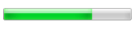

o elemento HTML progress (\<progress>) é usado para visualizar o progresso de uma tarefa. Embora as especifidades de como é mostrado ficam a cargo do desenvolvedor, tipicamente, é mostrado como uma barra de progresso.

## Contexto de uso

| Conteúdo permitido     | [Conteúdo de texto](/pt-BR/docs/HTML/Content_categories#phrasing_content)                                                         |
| ---------------------- | --------------------------------------------------------------------------------------------------------------------------------- |
| Omissão de Tag         | Nenhum, ambas as tags (abertura e encerramento) são obrigatórias                                                                  |
| Elemento pai permitido | Conteúdo fraseado (phrasing content), mas não deve haver descendentes do elemento progress                                        |
| Documento normativo    | [HTML5, seção 4.10.16](https://www.whatwg.org/specs/web-apps/current-work/multipage/the-button-element.html#the-progress-element) |

## Atributos

Como todos os outros elementos HTML, este elemento tem os atributos globais [(global attributes](https://developer-new.mozilla.org/en/HTML/Global_attributes))

- `max`
  - : Este atributo descreve quanto trabalho é demandado pela tarefa indicada pelo elemento progress.
- `value`
  - : Este atributo especifica quanto da tarefa foi concluído. Se este não existir, a barra de progresso é indeterminada; isso indica que uma atividade está em progresso sem previsão de quanto tempo é esperado para que seja concluída.

Você pode usar a propriedade {{ cssxref("orient") }} para especificar se a barra de progresso deve ser renderizada horizontalmente (padrão) ou verticalmente. A pseudo-classe {{ cssxref(":indeterminate") }} pode ser associada a barras de progresso indeterminadas.

## Interface DOM

Este elemento implementa a interface HTMLProgressElement.

## Exemplos

```html
<progress value="70" max="100">70 %</progress>
```

### Resultado

[View Live Examples](https://mdn.dev/archives/media/samples/html/progress.html)

No Mac OS X, o progresso resultante deve aparecer assim:



No Windows, o progresso resultante deve aparecer assim:


### Exemplos adicionais

Veja {{ cssxref("orient") }}.

## Compatibilidade com navegadores

{{Compat}}

## Veja também

- {{ cssxref("orient") }}
- {{ cssxref(":indeterminate") }}
