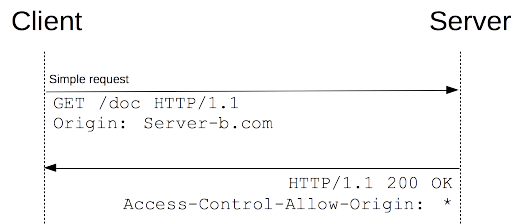
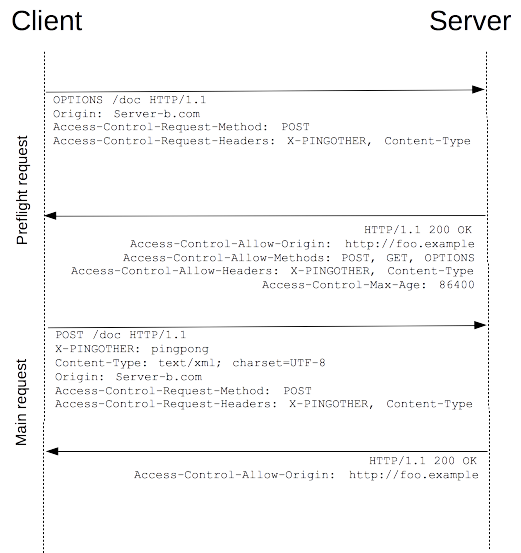

{{HTTPSidebar}}

{{Glossary("CORS")}} - Cross-Origin Resource Sharing (Compartilhamento de recursos com origens diferentes) é um mecanismo que usa cabeçalhos adicionais {{Glossary("HTTP")}} para informar a um navegador que permita que um aplicativo Web seja executado em uma origem (domínio) com permissão para acessar recursos selecionados de um servidor em uma origem distinta. Um aplicativo Web executa uma **requisição _cross-origin_ HTTP** ao solicitar um recurso que tenha uma origem diferente (domínio, protocolo e porta) da sua própria origem.

Um exemplo de requisição _cross-origin_: o código JavaScript _frontend_ de um aplicativo web disponível em `http://domain-a.com` usa {{domxref ("XMLHttpRequest")}} para fazer uma requisição para `http://api.domain-b.com/data.json`.

Por motivos de segurança, navegadores restringem requisições _cross-origin_ HTTP iniciadas por scripts. Por exemplo, `XMLHttpRequest` e [Fetch API](/pt-BR/docs/Web/API/Fetch_API) seguem a [política de mesma origem](/pt-BR/docs/Web/Security/Same-origin_policy) (_same-origin policy_). Isso significa que um aplicativo web que faz uso dessas APIs só poderá fazer solicitações para recursos de mesma origem da qual o aplicativo foi carregado, a menos que a resposta da outra origem inclua os cabeçalhos CORS corretos.


O mecânismo CORS suporta requisições seguras do tipo _cross-origin e_ transferências de dados entre navegadores e servidores web. Navegadores modernos usam o CORS em uma API contêiner, como `XMLHttpRequest` ou [Fetch](/pt-BR/docs/Web/API/Fetch_API), para ajudar a reduzir os riscos de requisições _cross-origin_ HTTP.

## Quem deve ler este artigo?

Todos, realmente.

Este artigo destina-se a administradores da Web, desenvolvedores de servidores e desenvolvedores front-end. Os navegadores modernos lidam com os componentes do lado cliente em compartilhamento entre origens, incluindo cabeçalhos e aplicação de políticas. Mas esse novo padrão significa que os servidores precisam lidar com novos cabeçalhos de requisição e resposta. Outro artigo para desenvolvedores de servidores que discutem [compartilhamento _cross-origin_ a partir de uma perspectiva de servidor (com fragmentos de código PHP)](/en-US/docs/Web/HTTP/Server-Side_Access_Control), pode ser uma leitura complementar.

## Quais solicitações usam o CORS?

Esse [padrão de compartilhamento _cross-origin_](https://fetch.spec.whatwg.org/#http-cors-protocol) é usado para habilitar solicitações HTTP entre sites para:

- Chamadas {{domxref("XMLHttpRequest")}} ou [Fetch API](/pt-BR/docs/Web/API/Fetch_API) pela comunicação entre origens diferentes, tal como discutido acima.
- Web Fonts (para o uso de fontes pelo _cross-domain_ em `@font` do CSS), [para que os servidores possam implantar fontes TrueType que só podem ser carregadas em origens diferentes e usadas por sites com autorização para isso](https://www.w3.org/TR/css-fonts-3/#font-fetching-requirements).
- [Texturas WebGL](/pt-BR/docs/Web/API/WebGL_API/Tutorial/Using_textures_in_WebGL).
- _Frames_ de Imagens/vídeos desenhados em uma tela usando {{domxref("CanvasRenderingContext2D.drawImage()", "drawImage()")}}.

Este artigo é uma discussão geral sobre _Cross-Origin Resource Sharing_ (Compartilhamento de recursos com origens diferentes) e inclui uma discussão de cabeçalhos HTTP necessários.

## Visão Geral

O padrão _Cross-Origin Resource Sharing_ trabalha adicionando novos [cabeçalhos HTTP](/pt-BR/docs/Web/HTTP/Headers) que permitem que os servidores descrevam um conjunto de origens que possuem permissão a ler uma informação usando o navegador. Além disso, para métodos de requisição HTTP que podem causar efeitos colaterais nos dados do servidor (em particular, para métodos HTTP diferentes de {{HTTPMethod("GET")}} ou para uso de {{HTTPMethod("POST")}} com certos [MIME types](/pt-BR/docs/Web/HTTP/Basics_of_HTTP/MIME_types)), a especificação exige que navegadores "pré-enviem" a requisição, solicitando os métodos suportados pelo servidor com um método de requisição HTTP {{HTTPMethod("OPTIONS")}} e, após a "aprovação", o servidor envia a requisição verdadeira com o método de requisição HTTP correto. Servidores também podem notificar clientes se "credenciais" (incluindo [Cookies](/pt-BR/docs/Web/HTTP/Cookies) e dados de autenticação HTTP) devem ser enviadas com as requisições.

Falhas no CORS resultam em erros, mas por questões de segurança, detalhes sobre erros não estão disponíveis no código JavaScript. O código tem apenas conhecimento de que ocorreu um erro. A única maneira para determinar especificamente o que ocorreu de errado é procurar no console do navegador por mais detalhes.

Seções subsequentes discutem cenários, assim como fornecem um detalhamento dos cabeçalhos HTTP utilizados.

## Exemplos de cenários com controle de acesso

Aqui, apresentamos três cenários que ilustram como _Cross-Origin Resource Sharing_ funciona. Todos estes exemplos usam o objeto {{domxref("XMLHttpRequest")}}, que pode ser utilizado para fazer requisições entre origens em qualquer navegador compatível.

Os snippets JavaScript inclusos nessas seções (e instâncias executáveis de código do lado servidor que tratam corretamente essas requisições entre origens) podem ser encontrados "em ação" aqui: <http://arunranga.com/examples/access-control/>, e irão funcionar em navegadores que suportam `XMLHttpRequest` entre origens.

Uma discussão sobre _Cross-Origin Resource Sharing_ a partir da perspectiva do servidor (incluindo snippets de código PHP) pode ser encontrada no artigo [Server-Side Access Control (CORS)](/pt-BR/docs/Web/HTTP/Server-Side_Access_Control).

### Requisições simples

Algumas requisições não acionam um [pré-envio CORS](/pt-BR/docs/Web/HTTP/Access_control_CORS#Preflighted_requests). Essas são denominadas neste artigo como "requisições simples" (_simple request_), embora a especificação {{SpecName('Fetch')}} (que define CORS) não utilize esse termo. Uma requisição que não aciona um [pré-envio CORS](/pt-BR/docs/Web/HTTP/Access_control_CORS#Preflighted_requests) — denominada "requisição simples" — é uma que **atende todas as seguintes condições**:

- Os únicos métodos permitidos são:

  - {{HTTPMethod("GET")}}
  - {{HTTPMethod("HEAD")}}
  - {{HTTPMethod("POST")}}

- Além dos cabeçalhos definidos automaticamente pelo agente do usuário (por exemplo, {{HTTPHeader("Connection")}}, {{HTTPHeader("User-Agent")}} ou [qualquer um dos outros cabeçalhos com nomes definidos na especificação Fetch como "_forbidden header name_"](https://fetch.spec.whatwg.org/#forbidden-header-name)), os únicos cabeçalhos que podem ser definidos manualmente são [aqueles cujo a especificação Fetch define como sendo um "_CORS-safelisted request-header_"](https://fetch.spec.whatwg.org/#cors-safelisted-request-header), que são:

  - {{HTTPHeader("Accept")}}
  - {{HTTPHeader("Accept-Language")}}
  - {{HTTPHeader("Content-Language")}}
  - {{HTTPHeader("Content-Type")}} (porém observe os requisitos adicionais abaixo)

- Os únicos valores permitidos para o {{HTTPHeader("Content-Type")}} do cabeçalho são:

  - `application/x-www-form-urlencoded`
  - `multipart/form-data`
  - `text/plain`

- Nenhum _event listener_ é registrado em qualquer objeto {{domxref("XMLHttpRequestUpload")}} usado na requisição, estes são acessados usando a propriedade {{domxref("XMLHttpRequest.upload")}}.
- Nenhum objeto {{domxref("ReadableStream")}} é usado na requisição.

> **Nota:** Esses são os mesmos tipos de requisições entre origens distintas que o conteúdo da web já pode realizar e nenhum dado dado de resposta é liberado ao solicitante, a menos que o servidor envie um cabeçalho adequado. Portanto, sites que impedem a falsificação de requisições entre origens não tem nada a temer em relação ao controle de acesso HTTP.

> **Nota:** O WebKit Nightly e Safari Technology Preview impõem restrições adicionais nos valores permitidos nos cabeçalhos {{HTTPHeader("Accept")}}, {{HTTPHeader("Accept-Language")}} e {{HTTPHeader("Content-Language")}}. Caso algum destes cabeçalhos tenham valores "não-padronizados", o WebKit/Safari não considera que a requisição atenda as condições para uma "requisição simples". O que o WebKit/Safari considera valores "não-padronizados" para estes cabeçalhos não é documentado exceto nos seguintes bugs do WebKit: _[Require preflight for non-standard CORS-safelisted request headers Accept, Accept-Language, and Content-Language](https://bugs.webkit.org/show_bug.cgi?id=165178), [Allow commas in Accept, Accept-Language, and Content-Language request headers for simple CORS](https://bugs.webkit.org/show_bug.cgi?id=165566)_ e _[Switch to a blacklist model for restricted Accept headers in simple CORS requests](https://bugs.webkit.org/show_bug.cgi?id=166363)_. Nenhum outro navegador implementa estas restrições adicionais, pois elas não são parte da especificação.

Por exemplo, suponha que o conteúdo web no domínio `http://foo.example` deseje chamar (`invocation` do exemplo abaixo) um outro conteúdo no domínio `http://bar.other`. Esse código Javascript pode estar hospedado em foo.example:

```js
var invocation = new XMLHttpRequest();
var url = "http://bar.other/resources/public-data/";

function callOtherDomain() {
  if (invocation) {
    invocation.open("GET", url, true);
    invocation.onreadystatechange = handler;
    invocation.send();
  }
}
```

Isso fará uma troca simples entre cliente e servidor, utilizando o cabeçalho CORS para tratar os privilégios.



Neste caso, vamos ver o que o navegador enviará ao servidor e vamos olhar como o servidor responde:

```http
GET /resources/public-data/ HTTP/1.1
Host: bar.other
User-Agent: Mozilla/5.0 (Macintosh; U; Intel Mac OS X 10.5; en-US; rv:1.9.1b3pre) Gecko/20081130 Minefield/3.1b3pre
Accept: text/html,application/xhtml+xml,application/xml;q=0.9,*/*;q=0.8
Accept-Language: en-us,en;q=0.5
Accept-Encoding: gzip,deflate
Accept-Charset: ISO-8859-1,utf-8;q=0.7,*;q=0.7
Connection: keep-alive
Referer: http://foo.example/examples/access-control/simpleXSInvocation.html
Origin: http://foo.example


HTTP/1.1 200 OK
Date: Mon, 01 Dec 2008 00:23:53 GMT
Server: Apache/2.0.61
Access-Control-Allow-Origin: *
Keep-Alive: timeout=2, max=100
Connection: Keep-Alive
Transfer-Encoding: chunked
Content-Type: application/xml

[XML Data]
```

As linhas de 1 a 10 são enviadas no header. Note que o cabeçalho principal da requisição HTTP aqui é {{HTTPHeader("Origin")}} na linha 10, o qual revela que a chamada é proveniente de um conteúdo no domínio `http://foo.example`.

As linhas de 13 a 22 mostram a resposta HTTP do servidor no domínio `http://bar.other`. Nesta resposta, o servidor envia de volta um cabeçalho {{HTTPHeader("Access-Control-Allow-Origin")}} exibido na linha 16. O uso dos cabeçalhos {{HTTPHeader("Origin")}} e {{HTTPHeader("Access-Control-Allow-Origin")}} mostram o protocolo de controle de acesso em seu uso mais simples. Neste caso, o servidor responde com `Access-Control-Allow-Origin: *`, o que significa que o recurso pode ser acessado por **qualquer** domínio pela comunicação entre origens. Se os proprietários dos recursos em `http://bar.other` desejarem restringir o acesso ao conteúdo para o mesmo ser apenas de `http://foo.example`, eles retornaram:

`Access-Control-Allow-Origin: http://foo.example`

Observe que, agora, nenhum dominio além de `http://foo.example` (identificado na requisição pelo cabeçalho ORIGIN: como na linha 10) pode acessar o recurso pela comunicação entre origens. O cabeçalho `Access-Control-Allow-Origin` deve conter o valor que foi enviado no cabeçalho `Origin` da requisição.

### Requisições com pré-envio

Ao contrário de ["requisições simples" (discutido acima)](/pt-BR/docs/Web/HTTP/Access_control_CORS#Simple_requests), requisições com "pré-envio" (_Preflighted requests_) primeiramente enviam uma requisição HTTP através do método {{HTTPMethod("OPTIONS")}} para obter um recurso em outro domínio, a fim de determinar se de fato a requisição atual é segura para envio. Requisições entre sites possuem pré-envio, já que podem interferir em dados do usuário.

Em particular, uma requisição tem um pré-envio **se qualquer das seguintes condições** for verdadeira:

- **Se** a requisição usa algum dos seguintes métodos:

  - {{HTTPMethod("PUT")}}
  - {{HTTPMethod("DELETE")}}
  - {{HTTPMethod("CONNECT")}}
  - {{HTTPMethod("OPTIONS")}}
  - {{HTTPMethod("TRACE")}}
  - {{HTTPMethod("PATCH")}}

- **Ou se**, além dos cabeçalhos definidos automaticamente pelo agente do usuário (por exemplo, {{HTTPHeader("Connection")}}, {HTTPHeader("User-Agent")}} ou [qualquer **OUTRO** cabeçalho com um nome definido na especificação Fetch como "_forbidden header name_"](https://fetch.spec.whatwg.org/#forbidden-header-name)), a requisição inclui quaisquer cabeçalhos **além** [daqueles que a especificação Fetch define como sendo um "_CORS-safelisted request-header_"](https://fetch.spec.whatwg.org/#cors-safelisted-request-header), que são:

  - {{HTTPHeader("Accept")}}
  - {{HTTPHeader("Accept-Language")}}
  - {{HTTPHeader("Content-Language")}}
  - {{HTTPHeader("Content-Type")}} (porém observe os requisitos adicionais abaixo)
  - [`DPR`](http://httpwg.org/http-extensions/client-hints.html#dpr)
  - {{HTTPHeader("Downlink")}}
  - [`Save-Data`](http://httpwg.org/http-extensions/client-hints.html#save-data)
  - [`Viewport-Width`](http://httpwg.org/http-extensions/client-hints.html#viewport-width)
  - [`Width`](http://httpwg.org/http-extensions/client-hints.html#width)

- **Ou se** o {{HTTPHeader("Content-Type")}} do cabeçalho **tem** **outro** valor que:

  - `application/x-www-form-urlencoded`
  - `multipart/form-data`
  - `text/plain`

- **Ou se** um ou mais _event listener_ estiver registrado em um objeto {{domxref ("XMLHttpRequestUpload")}} usado nessa requisição.
- **Ou se** um objeto {{domxref("ReadableStream")}} é usado nessa requisição.

> **Nota:** WebKit Nightly e Safari Technology Preview colocam restrições adicionais nos valores permitidos dos cabeçalhos {{HTTPHeader("Accept")}}, {{HTTPHeader("Accept-Language")}} e {{HTTPHeader("Content-Language")}}. Caso qualquer um desses cabeçalhos tenha algum valor fora do padrão (non-standard), o WebKit/Safari faz o pré-envio da requisição. O que o WebKit/Safari considera como valor "non-standard" para tais cabeçalhos não está documentado, exceto nos seguintes bugs do WebKit: [Require preflight for non-standard CORS-safelisted request headers Accept, Accept-Language, and Content-Language](https://bugs.webkit.org/show_bug.cgi?id=165178), [Allow commas in Accept, Accept-Language, e Content-Language request headers for simple CORS](https://bugs.webkit.org/show_bug.cgi?id=165566) e [Switch to a blacklist model for restricted Accept headers in simple CORS requests](https://bugs.webkit.org/show_bug.cgi?id=166363). Nenhum outro navegador implementa estas restrições adicionais, pois elas não são parte da especificação.

O exemplo a seguir é de uma requisição com pré-envio.

```js
var invocation = new XMLHttpRequest();
var url = 'http://bar.other/resources/post-here/';
var body = '<?xml version="1.0"?><person><name>Arun</name></person>';

function callOtherDomain(){
  if(invocation)
    {
      invocation.open('POST', url, true);
      invocation.setRequestHeader('X-PINGOTHER', 'pingpong');
      invocation.setRequestHeader('Content-Type', 'application/xml');
      invocation.onreadystatechange = handler;
      invocation.send(body);
    }
}

......
```

No exemplo acima, a linha 3 cria um XML para enviar com a requisição `POST` da linha 8. Também, na linha 9, é definido um cabeçalho de uma requisição HTTP "personalizada" (non-standard) com (`X-PINGOTHER: pingpong`). Tais cabeçalhos não fazem parte do protocolo HTTP/1.1, mas podem ser usados para aplicações web. Já que a requisição usa um Content-Type do tipo `application/xml` e como é uma requisição personalizada, esta requisição faz um pré-envio.



(Observação: conforme descrito abaixo, a requisição POST real não inclui os cabeçalhos Access-Control-Request- \*; eles são necessários apenas para a requisição OPTIONS.)

Vamos conferir a comunicação completa que ocorre entre cliente e servidor. A primeira comunicação é a _requisição com pré-envio/resposta_:

```shell
OPTIONS /resources/post-here/ HTTP/1.1
Host: bar.other
User-Agent: Mozilla/5.0 (Macintosh; U; Intel Mac OS X 10.5; en-US; rv:1.9.1b3pre) Gecko/20081130 Minefield/3.1b3pre
Accept: text/html,application/xhtml+xml,application/xml;q=0.9,*/*;q=0.8
Accept-Language: en-us,en;q=0.5
Accept-Encoding: gzip,deflate
Accept-Charset: ISO-8859-1,utf-8;q=0.7,*;q=0.7
Connection: keep-alive
Origin: http://foo.example
Access-Control-Request-Method: POST
Access-Control-Request-Headers: X-PINGOTHER, Content-Type


HTTP/1.1 200 OK
Date: Mon, 01 Dec 2008 01:15:39 GMT
Server: Apache/2.0.61 (Unix)
Access-Control-Allow-Origin: http://foo.example
Access-Control-Allow-Methods: POST, GET, OPTIONS
Access-Control-Allow-Headers: X-PINGOTHER, Content-Type
Access-Control-Max-Age: 86400
Vary: Accept-Encoding, Origin
Content-Encoding: gzip
Content-Length: 0
Keep-Alive: timeout=2, max=100
Connection: Keep-Alive
Content-Type: text/plain
```

Uma vez que a requisição com pré-envio é completa, a requisição efetiva será enviada:

```shell
POST /resources/post-here/ HTTP/1.1
Host: bar.other
User-Agent: Mozilla/5.0 (Macintosh; U; Intel Mac OS X 10.5; en-US; rv:1.9.1b3pre) Gecko/20081130 Minefield/3.1b3pre
Accept: text/html,application/xhtml+xml,application/xml;q=0.9,*/*;q=0.8
Accept-Language: en-us,en;q=0.5
Accept-Encoding: gzip,deflate
Accept-Charset: ISO-8859-1,utf-8;q=0.7,*;q=0.7
Connection: keep-alive
X-PINGOTHER: pingpong
Content-Type: text/xml; charset=UTF-8
Referer: http://foo.example/examples/preflightInvocation.html
Content-Length: 55
Origin: http://foo.example
Pragma: no-cache
Cache-Control: no-cache

<?xml version="1.0"?><person><name>Arun</name></person>


HTTP/1.1 200 OK
Date: Mon, 01 Dec 2008 01:15:40 GMT
Server: Apache/2.0.61 (Unix)
Access-Control-Allow-Origin: http://foo.example
Vary: Accept-Encoding, Origin
Content-Encoding: gzip
Content-Length: 235
Keep-Alive: timeout=2, max=99
Connection: Keep-Alive
Content-Type: text/plain

[Some GZIP'd payload]
```

As linhas de 1 a 12 acima representam a requisição com pré-envio tendo o método {{HTTPMethod("OPTIONS")}}. O navegador determina que precisa fazer este envio baseado nos parâmetros da requisição do código JavaScript acima utilizado, para que o servidor possa responder caso seja aceitável o envio da requisição com os dados parâmetros da mesma. OPTIONS é um método HTTP/1.1 usado para determinar informações complementares dos servidores, sendo o mesmo um método {{Glossary("safe")}}, o que significa que não pode ser utilizado para troca de recurso. Note que junto da requisição OPTIONS, outros dois cabeçalhos são enviados (linhas 10 e 11, respectivamente):

```
Access-Control-Request-Method: POST
Access-Control-Request-Headers: X-PINGOTHER, Content-Type
```

O cabeçalho {{HTTPHeader("Access-Control-Request-Method")}} notifica o servidor como sendo uma parte da requisição com pré-envio que, quando a requisição efetiva é enviada, será enviada com uma requisição de método `POST`. O cabeçalho {{HTTPHeader("Access-Control-Request-Headers")}} notifica o servidor que quando a requisição efetiva fora enviada, será enviada com os seguintes cabeçalhos personalizados `X-PINGOTHER` e `Content-Type`. O servidor agora tem a oportunidade para definir se deseja aceitar uma requisição sob estas condições.

As linhas 14 a 26 acima são as respostas que o servidor devolve, indicando que o método (`POST`) e os cabeçalhos (`X-PINGOTHER`) da requisição são aceitáveis. Em particular, vejamos as linhas 17 a 20:

```
Access-Control-Allow-Origin: http://foo.example
Access-Control-Allow-Methods: POST, GET, OPTIONS
Access-Control-Allow-Headers: X-PINGOTHER, Content-Type
Access-Control-Max-Age: 86400
```

O servidor responde com `Access-Control-Allow-Methods` e diz que `POST`, `GET`, e `OPTIONS` são métodos viáveis para requerir o recurso em questão. Perceba que este cabeçalho é similar ao cabeçalho da resposta {{HTTPHeader("Allow")}}, mas usado estritamente dentro do contexto do controle de acesso.

O servidor envia também `Access-Control-Allow-Headers` com um valor de "`X-PINGOTHER, Content-Type`", confirmando estes são cabeçalhos permitidos a serem usados com a requisição efetiva. Assim como `Access-Control-Allow-Methods`, `Access-Control-Allow-Headers` é uma lista de cabeçalhos aceitáveis, separados por vírgula.

Por fim, {{HTTPHeader("Access-Control-Max-Age")}} traz o valor em segundos de quão longo pode ser mantida em cache a resposta da requisição pré-envio sem o envio de outra requisição pré-envio. Neste caso, 86400 segundos são 24 horas. Note que cada browser tem um [valor interno máximo](/pt-BR/docs/Web/HTTP/Headers/Access-Control-Max-Age) que toma precedência quado `Access-Control-Max-Age` for maior.

#### Requisições com pré-envio e redirecionamento

Not all browsers currently support following redirects after a preflighted request. If a redirect occurs after a preflighted request, some browsers currently will report an error message such as the following.

> The request was redirected to 'https\://example.com/foo', which is disallowed for cross-origin requests that require preflight

> Request requires preflight, which is disallowed to follow cross-origin redirect

The CORS protocol originally required that behavior but [was subsequently changed to no longer require it](https://github.com/whatwg/fetch/commit/0d9a4db8bc02251cc9e391543bb3c1322fb882f2). However, not all browsers have implemented the change, and so still exhibit the behavior that was originally required.

So until all browsers catch up with the spec, you may be able to work around this limitation by doing one or both of the following:

- change the server-side behavior to avoid the preflight and/or to avoid the redirect—if you have control over the server the request is being made to
- change the request such that it is a [simple request]#simple_requests) that doesn't cause a preflight

But if it's not possible to make those changes, then another way that may be possible is to this:

1. Make a [simple request](#simple_requests) (using {{domxref("Response.url")}} for the Fetch API, or {{domxref("XMLHttpRequest.responseURL")}}) to determine what URL the real preflighted request would end up at.
2. Make another request (the "real" request) using the URL you obtained from `Response.url` or `XMLHttpRequest.responseURL` in the first step.

However, if the request is one that triggers a preflight due to the presence of the `Authorization` header in the request, you won't be able to work around the limitation using the steps above. And you won't be able to work around it at all unless you have control over the server the request is being made to.

### Requisições com credenciais

The most interesting capability exposed by both {{domxref("XMLHttpRequest")}} or [Fetch](/pt-BR/docs/Web/API/Fetch_API) and CORS is the ability to make "credentialed" requests that are aware of [HTTP cookies](/pt-BR/docs/Web/HTTP/Cookies) and HTTP Authentication information. By default, in cross-site {{domxref("XMLHttpRequest")}} or [Fetch](/pt-BR/docs/Web/API/Fetch_API) invocations, browsers will **not** send credentials. A specific flag has to be set on the {{domxref("XMLHttpRequest")}} object or the {{domxref("Request")}} constructor when it is invoked.

In this example, content originally loaded from `http://foo.example` makes a simple GET request to a resource on `http://bar.other` which sets Cookies. Content on foo.example might contain JavaScript like this:

```js
var invocation = new XMLHttpRequest();
var url = "http://bar.other/resources/credentialed-content/";

function callOtherDomain() {
  if (invocation) {
    invocation.open("GET", url, true);
    invocation.withCredentials = true;
    invocation.onreadystatechange = handler;
    invocation.send();
  }
}
```

Line 7 shows the flag on {{domxref("XMLHttpRequest")}} that has to be set in order to make the invocation with Cookies, namely the `withCredentials` boolean value. By default, the invocation is made without Cookies. Since this is a simple `GET` request, it is not preflighted, but the browser will **reject** any response that does not have the {{HTTPHeader("Access-Control-Allow-Credentials")}}: `true` header, and **not** make the response available to the invoking web content.


Here is a sample exchange between client and server:

```shell
GET /resources/access-control-with-credentials/ HTTP/1.1
Host: bar.other
User-Agent: Mozilla/5.0 (Macintosh; U; Intel Mac OS X 10.5; en-US; rv:1.9.1b3pre) Gecko/20081130 Minefield/3.1b3pre
Accept: text/html,application/xhtml+xml,application/xml;q=0.9,*/*;q=0.8
Accept-Language: en-us,en;q=0.5
Accept-Encoding: gzip,deflate
Accept-Charset: ISO-8859-1,utf-8;q=0.7,*;q=0.7
Connection: keep-alive
Referer: http://foo.example/examples/credential.html
Origin: http://foo.example
Cookie: pageAccess=2


HTTP/1.1 200 OK
Date: Mon, 01 Dec 2008 01:34:52 GMT
Server: Apache/2.0.61 (Unix) PHP/4.4.7 mod_ssl/2.0.61 OpenSSL/0.9.7e mod_fastcgi/2.4.2 DAV/2 SVN/1.4.2
X-Powered-By: PHP/5.2.6
Access-Control-Allow-Origin: http://foo.example
Access-Control-Allow-Credentials: true
Cache-Control: no-cache
Pragma: no-cache
Set-Cookie: pageAccess=3; expires=Wed, 31-Dec-2008 01:34:53 GMT
Vary: Accept-Encoding, Origin
Content-Encoding: gzip
Content-Length: 106
Keep-Alive: timeout=2, max=100
Connection: Keep-Alive
Content-Type: text/plain


[text/plain payload]
```

Although line 11 contains the Cookie destined for the content on `http://bar.other`, if bar.other did not respond with an {{HTTPHeader("Access-Control-Allow-Credentials")}}`: true` (line 19) the response would be ignored and not made available to web content.

#### Solicitações credenciadas e curingas (_wildcards_)

When responding to a credentialed request, the server **must** specify an origin in the value of the `Access-Control-Allow-Origin` header, instead of specifying the "`*`" wildcard.

Because the request headers in the above example include a `Cookie` header, the request would fail if the value of the `Access-Control-Allow-Origin` header were "\*". But it does not fail: Because the value of the `Access-Control-Allow-Origin` header is "`http://foo.example`" (an actual origin) rather than the "`*`" wildcard, the credential-cognizant content is returned to the invoking web content.

Note that the `Set-Cookie` response header in the example above also sets a further cookie. In case of failure, an exception—depending on the API used—is raised.

All of these examples can be [seen working here](http://arunranga.com/examples/access-control/). The next section deals with the actual HTTP headers.

## Os cabeçalhos de resposta HTTP

This section lists the HTTP response headers that servers send back for access control requests as defined by the Cross-Origin Resource Sharing specification. The previous section gives an overview of these in action.

### Access-Control-Allow-Origin

A returned resource may have one {{HTTPHeader("Access-Control-Allow-Origin")}} header, with the following syntax:

```
Access-Control-Allow-Origin: <origin> | *
```

The `origin` parameter specifies a URI that may access the resource. The browser must enforce this. For requests **without** credentials, the server may specify "\*" as a wildcard, thereby allowing any origin to access the resource.

For example, to allow `http://mozilla.org` to access the resource, you can specify:

```
Access-Control-Allow-Origin: http://mozilla.org
```

If the server specifies an origin host rather than "\*", then it could also include Origin in the Vary response header to indicate to clients that server responses will differ based on the value of the Origin request header.

### Access-Control-Expose-Headers

The {{HTTPHeader("Access-Control-Expose-Headers")}} header lets a server whitelist headers that browsers are allowed to access. For example:

```
Access-Control-Expose-Headers: X-My-Custom-Header, X-Another-Custom-Header
```

This allows the `X-My-Custom-Header` and `X-Another-Custom-Header` headers to be exposed to the browser.

### Access-Control-Max-Age

The {{HTTPHeader("Access-Control-Max-Age")}} header indicates how long the results of a preflight request can be cached. For an example of a preflight request, see the above examples.

```
Access-Control-Max-Age: <delta-seconds>
```

The `delta-seconds` parameter indicates the number of seconds the results can be cached.

### Access-Control-Allow-Credentials

The {{HTTPHeader("Access-Control-Allow-Credentials")}} header Indicates whether or not the response to the request can be exposed when the `credentials` flag is true. When used as part of a response to a preflight request, this indicates whether or not the actual request can be made using credentials. Note that simple `GET` requests are not preflighted, and so if a request is made for a resource with credentials, if this header is not returned with the resource, the response is ignored by the browser and not returned to web content.

```
Access-Control-Allow-Credentials: true
```

[Credentialed requests](#Requisições_com_credenciais) are discussed above.

### Access-Control-Allow-Methods

O {{HTTPHeader("Access-Control-Allow-Methods")}} cabeçalho especifica o método ou os métodos permitidos ao acessar o recurso. Isso é usado em resposta há uma requisição preflight. As condições na qual a requisição é preflight são discutidas à seguir.

```
Access-Control-Allow-Methods: <method>[, <method>]*
```

An example of a [preflight request is given above](#Preflighted_requests), including an example which sends this header to the browser.

### Access-Control-Allow-Headers

The {{HTTPHeader("Access-Control-Allow-Headers")}} header is used in response to a [preflight request](#Preflighted_requests) to indicate which HTTP headers can be used when making the actual request.

```
Access-Control-Allow-Headers: <field-name>[, <field-name>]*
```

## Os cabeçalhos de solicitação HTTP

This section lists headers that clients may use when issuing HTTP requests in order to make use of the cross-origin sharing feature. Note that these headers are set for you when making invocations to servers. Developers using cross-site {{domxref("XMLHttpRequest")}} capability do not have to set any cross-origin sharing request headers programmatically.

### Origin

The {{HTTPHeader("Origin")}} header indicates the origin of the cross-site access request or preflight request.

```
Origin: <origin>
```

The origin is a URI indicating the server from which the request initiated. It does not include any path information, but only the server name.

> **Nota:** The `origin` can be the empty string; this is useful, for example, if the source is a `data` URL.

Note that in any access control request, the {{HTTPHeader("Origin")}} header is **always** sent.

### Access-Control-Request-Method

The {{HTTPHeader("Access-Control-Request-Method")}} is used when issuing a preflight request to let the server know what HTTP method will be used when the actual request is made.

```
Access-Control-Request-Method: <method>
```

Examples of this usage can be [found above.](#Preflighted_requests)

### Access-Control-Request-Headers

The {{HTTPHeader("Access-Control-Request-Headers")}} header is used when issuing a preflight request to let the server know what HTTP headers will be used when the actual request is made.

```
Access-Control-Request-Headers: <field-name>[, <field-name>]*
```

Examples of this usage can be [found above](#Preflighted_requests).

## Especificações

| Specification                                   | Status             | Comment                                                                          |
| ----------------------------------------------- | ------------------ | -------------------------------------------------------------------------------- |
| {{SpecName('Fetch', '#cors-protocol', 'CORS')}} | {{Spec2('Fetch')}} | New definition; supplants [W3C CORS](https://www.w3.org/TR/cors/) specification. |

## Compatibilidade com navegadores

{{Compat("http.headers.Access-Control-Allow-Origin")}}

### Notas de compatibilidade

- Internet Explorer 8 and 9 expose CORS via the `XDomainRequest` object, but have a full implementation in IE 10.
- While Firefox 3.5 introduced support for cross-site XMLHttpRequests and Web Fonts, certain requests were limited until later versions. Specifically, Firefox 7 introduced the ability for cross-site HTTP requests for WebGL Textures, and Firefox 9 added support for Images drawn on a canvas using `drawImage`.

## Veja também

- [CORS errors](/pt-BR/docs/Web/HTTP/CORS/Errors)
- [Enable CORS: I want to add CORS support to my server](https://enable-cors.org/server.html)
- {{domxref("XMLHttpRequest")}}
- [Fetch API](/pt-BR/docs/Web/API/Fetch_API)
- [Using CORS with All (Modern) Browsers](http://www.kendoui.com/blogs/teamblog/posts/11-10-03/using_cors_with_all_modern_browsers.aspx)
- [Using CORS - HTML5 Rocks](http://www.html5rocks.com/en/tutorials/cors/)
- [Code Samples Showing `XMLHttpRequest` and Cross-Origin Resource Sharing](https://arunranga.com/examples/access-control/)
- [Client-Side & Server-Side (Java) sample for Cross-Origin Resource Sharing (CORS)](https://github.com/jackblackevo/cors-jsonp-sample)
- [Cross-Origin Resource Sharing From a Server-Side Perspective (PHP, etc.)](/pt-BR/docs/Web/HTTP/Server-Side_Access_Control)
- [Stack Overflow answer with "how to" info for dealing with common problems](https://stackoverflow.com/questions/43871637/no-access-control-allow-origin-header-is-present-on-the-requested-resource-whe/43881141#43881141):

  - How to avoid the CORS preflight
  - How to use a CORS proxy to get around _"No Access-Control-Allow-Origin header"_
  - How to fix _"Access-Control-Allow-Origin header must not be the wildcard"_
