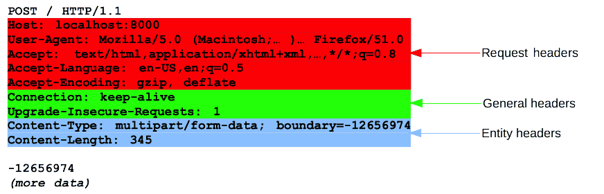

{{HTTPSidebar}}

Dados são trocados entre servidor e cliente por meio de mensagens HTTP. Há dois tipos de mensagens: _requisições_ (requests) enviadas pelo cliente para disparar uma ação no servidor, e _respostas_ (responses), a réplica do servidor.

Mensagens HTTP são compostas de informação textual codificada em ASCII, e se espalham por multiplas linhas. Em HTTP/1.1, e versões anteriores do protocolo, estas mensagens eram abertamente enviadas através da conexão. Em HTTP/2, a mensagem antes legível por humanos é agora dividida em quadros HTTP, resultando em otimização e melhora de desempenho.

Desenvolvedores Web, ou webmasters, raramente lidam com essas mensagens textuais diretamente: um programa, um navegador, um proxy, ou um servidor Web, executam essa ação. Eles proveem mensagens HTTP por meio de arquivos de configuração (para proxys ou servidores), APIs (para navegadores) ou outras interfaces.


O mecanismo de enquadramento binário foi projetado de modo a não requerer qualquer alteração das APIs ou arquivos de configuração aplicados: ele é transparente para o usuário.

Requisições e respostas HTTP compartilham estrutura similar e são compostas de:

1. Uma _linha inicial_ (_start-line)_ que descreve as requisições a serem implementadas, ou seu status de sucesso ou falha. Esta linha inicial é sempre uma única.
2. Um conjunto opcional de cabeçalhos HTTP especificando a requisição, ou descrevendo o corpo incluso na mensagem.
3. Uma linha em branco (_empty line_) indicando que toda meta-informação para a requisição já foi enviada.
4. Um _corpo_ (_body_) contendo dados associados à requisição (como o conteúdo de um formulário HTML), ou o documento associado à resposta. A presença do corpo e seu tamanho são especificados pela linha inicial e os cabeçalhos HTTP.

A linha inicial e os cabeçalhos HTTP da mensagem HTTP são conjuntamente chamados de _cabeça_ (_head_) da requisição, enquanto o que ela carrega, a sua carga, é conhecida como corpo.


## Requisições HTTP

### Linha inicial

Requisições HTTP são mensagens enviadas pelo cliente para iniciar uma ação no servidor. Suas linhas iniciais contêm três elementos:

1. Um _[método HTTP](/pt-BR/docs/Web/HTTP/Methods)_, um verbo (como {{HTTPMethod("GET")}}, {{HTTPMethod("PUT")}} ou {{HTTPMethod("POST")}}) ou um nome (como {{HTTPMethod("HEAD")}} ou {{HTTPMethod("OPTIONS")}}), que descrevem a ação a ser executada. Por exemplo, `GET` indica que um recurso deve ser obtido ou `POST` significa que dados são inseridos no servidor (criando ou modificando um recurso, ou gerando um documento temporário para mandar de volta).
2. O _alvo da requisição_, normalmente um {{glossary("URL")}}, ou o caminho absoluto do protocolo, porta e domínio são em geral caracterizados pelo contexto da requisição. O formato deste alvo varia conforme o método HTTP. Pode ser

   - Um caminho absoluto, seguido de um `'?'` e o texto da consulta. Esta é a forma mais comum, conhecida como a _forma original_, e é usada com os métodos `GET`, `POST`, `HEAD`, e `OPTIONS`.
     `POST / HTTP/1.1 GET /background.png HTTP/1.0 HEAD /test.html?query=alibaba HTTP/1.1 OPTIONS /anypage.html HTTP/1.0`
   - Uma URL completa, conhecida como a _forma absoluta_, usada principalmente com `GET` quando conectado a um proxy.
     `GET http://developer.mozilla.org/pt-BR/docs/Web/HTTP/Messages HTTP/1.1`
   - O componente autoridade de um URL, que consiste no nome do domínio e opcionalmente uma porta (prefixada por `':'`), chamada de _forma autoridade_. Só usada com `CONNECT` ao estabelecer um túnel HTTP.
     `CONNECT developer.mozilla.org:80 HTTP/1.1`
   - A _forma asterisco_, um simples asterisco (`'*'`), usada com `OPTIONS`. Representa o servidor como um todo.
     `OPTIONS * HTTP/1.1`

3. A _versão HTTP_, que define a estrutura do restante da mensagem, atuando como um indicador da versão esperada para uso na resposta.

### Cabeçalhos

[Cabeçalhos HTTP](/pt-BR/docs/Web/HTTP/Headers) de uma requisição seguem a mesma estrutura básica de um cabeçalho HTTP: uma cadeia de caracteres insensível à caixa seguida de dois pontos (`':'`) e um valor cuja estrutura depende do cabeçalho. O cabeçalho inteiro, incluindo o valor, consiste em uma única linha, que pode ser bem grande.

Há numerosos cabeçalhos de requisição disponíveis. Eles podem ser divididos em vários grupos:

- _Cabeçalhos gerais_, como {{HTTPHeader("Via")}}, se aplicam à mensagem como um todo.
- _Cabeçalhos de requisição_, como {{HTTPHeader("User-Agent")}}, {{HTTPHeader("Accept-Type")}}, modificam a requisição, especificando-a mais (como {{HTTPHeader("Accept-Language")}}), dando-a contexto (como {{HTTPHeader("Referer")}}), ou restringindo-a condicionalmente (como {{HTTPHeader("If-None")}}).
- _Cabeçalhos de entidade_, como {{HTTPHeader("Content-Length")}} que se aplicam ao corpo da mensagem. Obviamente este cabeçalho não será transmitido se não houver corpo na requisição.



### Corpo

A parte final da requisição é o corpo. Nem todas as requisições tem um: as que pegam recursos, como `GET`, `HEAD`, DELETE, ou OPTIONS, usualmente não precisam de um. Algumas requisições enviam dados ao servidor a fim de atualizá-lo: é o caso frequente de requisições `POST` (contendo dados de formulário HTML).

Corpos podem ser divididos, a grosso modo, em duas categorias:

- Corpos de recurso-simples, consistindo em um único arquivo, definido pelos dois cabeçalhos: {{HTTPHeader("Content-Type")}} e {{HTTPHeader("Content-Length")}}.
- [Corpos de recurso-múltiplo](/pt-BR/docs/Web/HTTP/Basics_of_HTTP/MIME_types#multipartform-data), consistindo em um corpo de múltiplas partes, cada uma contendo uma porção diferente de informação. Este é tipicamente associado à [Formulários HTML](/pt-BR/docs/Web/Guide/HTML/Forms).

## Respostas HTTP

### Linha de status

A linha inicial de uma resposta HTTP, chamada de _linha de status_, contém a seguinte informação:

1. A versão do _protocolo_, normalmente `HTTP/1.1`.
2. Um _código de status_, indicando o sucesso ou falha da requisição. Códigos de status comuns são {{HTTPStatus("200")}}, {{HTTPStatus("404")}}, ou {{HTTPStatus("302")}}
3. Um texto de status. Uma descrição textual breve, puramente informativa, do código de status a fim de auxiliar o entendimento da mensagem HTTP por humanos.

Uma linha de status típica se parece com: `HTTP/1.1 404 Not Found.`

### Cabeçalhos

[Cabeçalhos HTTP](/pt-BR/docs/Web/HTTP/Headers) para respostas seguem a mesma estrutura de qualquer outro cabeçalho: uma cadeia de caracteres insensível à caixa seguida de dois pontos (`':'`) e um valor cuja estrutura depende do tipo de cabeçalho. O cabeçalho inteiro, incluindo o valor, consiste em uma única linha.

Há numerosos cabeçalhos de resposta disponíveis. Eles podem ser divididos em vários grupos:

- _Cabeçalhos gerais_, como {{HTTPHeader("Via")}}, aplicam-se à toda mensagem.
- _Cabeçalhos de resposta_, como {{HTTPHeader("Vary")}} e {{HTTPHeader("Accept-Ranges")}}, dão informação adicional sobre o servidor, que não cabe na linha de status.
- _Cabeçalhos de entidade_, como {{HTTPHeader("Content-Length")}}, aplicam-se ao corpo da resposta. Obviamente este cabeçalho não será transmitido se não houver corpo na resposta.


### Corpo

A última parte de uma resposta é o corpo. Nem toda resposta tem um: aquelas com código de status {{HTTPStatus("201")}} ou {{HTTPStatus("204")}} normalmente não tem.

Corpos podem ser divididos, a grosso modo, em três categorias:

- Corpos de recurso simples que consistem em um único arquivo de tamanho conhecido, definido pelos dois cabeçalhos: {{HTTPHeader("Content-Type")}} e {{HTTPHeader("Content-Length")}}.
- Corpos de recurso simples que consistem em um único arquivo de tamanho desconhecido, codificado aos pedaços com {{HTTPHeader("Transfer-Encoding")}} ajustado para `chunked`.
- [Corpos de recurso múltiplo](/pt-BR/docs/Web/HTTP/Basics_of_HTTP/MIME_types#multipartform-data), que consiste em um corpo com múltiplas partes, cada uma contendo diferentes seções de informação. Estes são relativamente raros.

## Quadros HTTP/2

Mensagens HTTP/1.x têm algumas desvantagens quanto ao desempenho:

- Os cabeçalhos, ao contrário dos corpos, não são compactados.
- Cabeçalhos com frequência são similares entre uma mensagem e a seguinte, ainda assim são repetidos entre conexões.
- Nenhuma multiplexação pode ser feita. É necessário abrir várias conexões no mesmo servidor: e conexões TCP quentes são mais eficientes que frias.

HTTP/2 introduz um passo extra: ele divide mensagens HTTP/1.x em quadros que são embutidos em um fluxo. Quadros de dados e de cabeçalho são separados, isto permite a compressão do cabeçalho. Muitos fluxos podem ser conjugados, um processo chamado de multiplexação, permitindo mais eficiência nas conexões TCP subjacentes.


```
Connection
```

Quadros HTTP agora são transparentes aos desenvolvedores web. Isso é um passo adicional no HTTP/2, entre mensagens HTTP/1.1 e o protocolo de transporte subjacente. Nenhuma mudança é necessária nas API usadas pelo desenvolvedor web para utilizar quadros; quando disponível tanto no navegador quanto no servidor, HTTP/2 é ativado e usado.

## Conclusão

Mensagens HTTP são a chave ao usar HTTP; sua estrutura é simples e elas são altamente extensíveis. O mecanismo de enquadramento do HTTP/2 adiciona uma nova camada intermediária entre a sintaxe HTTP/1.x e o protocolo de transporte subjacente, sem modificá-lo fundamentalmente: construído sobre mecanismos provados.
