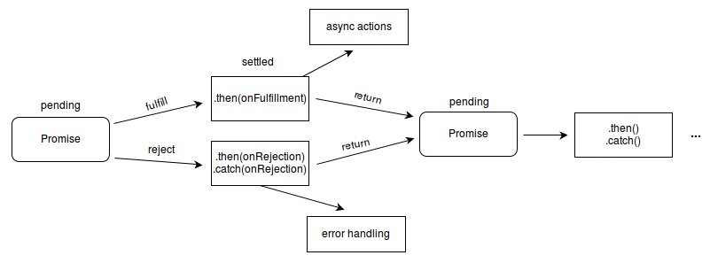

{{jsSidebar("JavaScript Guide")}} {{PreviousNext("Web/JavaScript/Guide/Grammar_and_types", "Web/JavaScript/Guide/Loops_and_iteration")}}

O JavaScript suporta um conjunto compacto de declarações, especificamente de fluxo de controle, que você pode utilizar para atribuir uma grande interatividade a páginas web. Este capítulo fornece uma visão geral destas declarações.

Veja a [Referência do JavaScript](/pt-BR/docs/Web/JavaScript/Reference/Statements) para detalhes sobre as declarações mostradas neste capítulo. No código em JavaScript, o caractere ponto e vírgula (`;`) é utilizado para separar declarações.

Toda expressão também é uma declaração. Veja [Expressões e Operadores](/pt-BR/docs/Web/JavaScript/Guide/Expressions_and_Operators) para informações completas sobre expressões.

## Declaração em bloco

Uma declaração em bloco é utilizada para agrupar declarações. O bloco é delimitado por um par de chaves:

```
{
   declaracao_1;
   declaracao_2;
   .
   .
   .
   declaracao_n;
}
```

### Exemplo

Declarações em bloco são utilizadas geralmente com declarações de fluxo de controle (ex. `if`, `for`, `while`).

```js
while (x < 10) {
  x++;
}
```

Aqui, `{ x++; }` é a declaração de bloco.

**Importante**: Antes de ECMAScript 6 o JavaScript **não** possuía escopo de bloco. Variáveis introduzidas dentro de um bloco possuem como escopo a função ou o script em que o bloco está contido, e, definir tais variáveis tem efeito muito além do bloco em si. Em outras palavras, declarações de bloco não introduzem um escopo. Embora blocos "padrão" sejam uma sintaxe válida não utilize-os, em JavaScript, pensando que funcionam como em C ou Java porque eles não funcionam da maneira que você acredita. Por exemplo:

```js
var x = 1;
{
  var x = 2;
}
console.log(x); // exibe 2
```

Este código exibe 2 porque a declaração `var x` dentro do bloco possui o mesmo escopo que a declaração `var x` antes do bloco. Em C ou Java, o código equivalente exibiria 1.

## Declarações condicionais

Uma declaração condicional é um conjunto de comandos que são executados caso uma condição especificada seja verdadeira. O JavaScript suporta duas declarações condicionais: `if...else` e `switch`.

### Declaração if...else

Use a declaração `if` para executar alguma declaração caso a condição lógica for verdadeira. Use a cláusula opcional `else` para executar alguma declaração caso a condição lógica for falsa. Uma declaração `if` é declarada da seguinte maneira:

```
if (condicao) {
  declaracao_1;
} else {
  declaracao_2;
}
```

onde `condicao` pode ser qualquer expressão que seja avaliada como verdadeira ou falsa. Veja [Boolean](/pt-BR/docs/Web/JavaScript/Reference/Global_Objects/Boolean#Description) para uma explicação sobre o que é avaliado como `true` e `false`. Se `condicao` for avaliada como verdadeira, declaracao`_1` é executada; caso contrário, `declaracao_2` é executada. `declaracao_1` e `declaracao_2` podem ser qualquer declaração, incluindo declarações `if` aninhadas.

Você pode também combinar declarações utilizando `else if` para obter várias condições testadas em sequência, como o seguinte:

```
if (condicao) {
  declaracao_1;
} else if (condicao_2) {
  declaracao_2;
} else if (condicao_n) {
  declaracao_n;
} else {
  declaracao_final;
}
```

Para executar várias declarações, agrupe-as em uma declaração em bloco (`{ ... }`). Em geral, é uma boa prática sempre utilizar declarações em bloco, especialmente ao aninhar declarações `if`:

```
if (condicao) {
    declaracao_1_executada_se_condicao_for_verdadeira;
    declaracao_2_executada_se_condicao_for_verdadeira;
} else {
    declaracao_3_executada_se_condicao_for_falsa;
    declaracao_4_executada_se_condicao_for_falsa;
}
```

Recomenda-se não utilizar atribuições simples em uma expressão condicional porque o símbolo de atribuição poderia ser confundido com o de igualdade ao dar uma olhada no código. Por exemplo, não utilize o seguinte código:

```js-nolint example-bad
if (x = y) {
  /* faça a coisa certa */
}
```

Caso tenha que utilizar uma atribuição em uma expressão condicional, uma prática comum é colocar parênteses adicionais em volta da atribuição. Por exemplo:

```js
if ((x = y)) {
  /* faça a coisa certa */
}
```

#### Valores avaliados como falsos

Os seguintes valores são avaliados como falsos:

- `false`
- `undefined`
- `null`
- `0`
- `NaN`
- string vazia (`""`)

Todos os outros valores, incluindo todos os objetos, são avaliados como verdadeiros quando passados para uma declaração condicional.

Não confunda os valores booleanos primitivos `true` e `false` com os valores de `true` e `false` do objeto [Boolean](/pt-BR/docs/Web/JavaScript/Reference/Global_Objects/Boolean#Description). Por exemplo:

```
var b = new Boolean(false);
if (b) // esta condição é avaliada como verdadeira
if (b == true) // esta condição é avaliada como falsa
```

#### Exemplo

No exemplo a seguir, a função `verifiqueDados` retorna verdadeiro se o número de caracteres em um objeto `Text` for três; caso contrário, exibe um alerta e retorna `falso`.

```js
function verifiqueDados() {
  if (document.form1.tresCaracteres.value.length == 3) {
    return true;
  } else {
    alert(
      "Informe exatamente três caracteres. " +
        document.form1.tresCaracteres.value +
        " não é válido.",
    );
    return false;
  }
}
```

### Declaração switch

Uma declaração `switch` permite que um programa avalie uma expressão e tente associar o valor da expressão ao rótulo de um `case`. Se uma correspondência é encontrada, o programa executa a declaração associada. Uma declaração `switch` se parece com o seguinte:

```
switch (expressao) {
   case rotulo_1:
      declaracoes_1
      [break;]
   case rotulo_2:
      declaracoes_2
      [break;]
   ...
   default:
      declaracoes_padrao
      [break;]
}
```

O programa primeiramente procura por uma cláusula `case` com um rótulo que corresponda ao valor da expressão e então transfere o controle para aquela cláusula, executando as declaracoes associadas. Se nenhum rótulo correspondente é encontrado, o programa procura pela cláusula opcional `default` e, se encontrada, transfere o controle àquela cláusula, executando as declarações associadas. Se nenhuma cláusula `default` é encontrada, o programa continua a execução a partir da declaracao seguinte ao `switch`. Por convenção, a cláusula `default` é a última, mas não é necessário que seja assim.

A instrução `break` associada a cada cláusula `case`, garante que o programa sairá do `switch` assim que a declaração correspondente for executada e que continuará a execução a partir da declaração seguinte ao `switch`. Se a declaração `break` for omitida, o programa continua a execução a partir da próxima declaração dentro do `switch`.

#### Exemplo

No exemplo a seguir, se `tipofruta` for avaliada como `"Banana"`, o programa faz a correspondência do valor com case `"Banana"` e executa a declaração associada. Quando o `break` é encontrado, o programa termina o `switch` e executa a declaração seguinte ao condicional. Se o `break` fosse omitido, a declaração de case `"Cereja"` também seria executada.

```js
switch (tipofruta) {
  case "Laranja":
    console.log("O quilo da laranja está R$0,59.<br>");
    break;
  case "Maçã":
    console.log("O quilo da maçã está R$0,32.<br>");
    break;
  case "Banana":
    console.log("O quilo da banana está R$0,48.<br>");
    break;
  case "Cereja":
    console.log("O quilo da cereja está R$3,00.<br>");
    break;
  case "Manga":
    console.log("O quilo da manga está R$0,56.<br>");
    break;
  case "Mamão":
    console.log("O quilo do mamão está R$2,23.<br>");
    break;
  default:
    console.log("Desculpe, não temos " + tipofruta + ".<br>");
}
console.log("Gostaria de mais alguma coisa?<br>");
```

## Declarações de Manipulação de Error

Você pode chamar uma exceção usando a declaração `throw` e manipulá-la usando a declaração `try...catch`.

- Declaração throw
- [Declaração `try...catch`](#try_catch_statement)

### Tipos de exceções

Praticamente pode-se utilizar `throw` em qualquer objeto de JavaScript. Todavia, nem todos os objetos ativados por `throw` são igualmente criados. Embora seja bastante comum tratar números ou strings como erros usando `throw`, é frequentemente mais eficiente usar alguns tipos de exceções especificamente criadas para esses propósitos:

- [ECMAScript exceptions](/pt-BR/docs/Web/JavaScript/Reference/Global_Objects#Fundamental_objects)
- {{domxref("DOMException")}} and {{domxref("DOMError")}}

### `Declaração throw`

Use a declaração `throw` para lançar uma exceção. Quando você lança uma exceção, você especifica a expressão contendo o valor a ser lançado:

```
throw expressão;
```

Você pode lançar qualquer expressão, não apenas expressões de um tipo específico. O código a seguir lança várias exceções de diferentes tipos:

```js
throw "Error2"; // tipo string
throw 42; // tipo numérico
throw true; // tipo booleano
throw {
  toString: function () {
    return "Eu sou um objeto!";
  },
};
```

> **Nota:**Você pode especificar um objeto quando você lança uma exceção. Você pode então, referenciar as propriedades de um objeto no bloco catch. O exemplo a seguir cria um objeto myUserException do tipo userException e o usa em uma declaração throw.

```js
// Cria um objeto do tipo UserException
function UserException(mensagem) {
  this.mensagem = mensagem;
  this.nome = "UserException";
}

// Realiza a conversão da exceção para uma string adequada quando usada como uma string.
// (ex. pelo console de erro)
UserException.prototype.toString = function () {
  return this.name + ': "' + this.message + '"';
};

// Cria uma instância de um tipo de objeto e lança ela
throw new UserException("Valor muito alto");
```

### `Declaração try...catch`

A declaração `try...catch` coloca um bloco de declarações em try, e especifica uma ou mais respostas para uma exceção lançada. Se uma exceção é lançada, a declaração `try...catch` pegá-a.

A declaração `try...catch` é composta por um bloco `try`, que contém uma ou mais declarações, e zero ou mais blocos `catch`, contendo declarações que especificam o que fazer se uma exceção é lançada no bloco `try`. Ou seja, você deseja que o bloco `try` tenha sucesso, e se ele não tiver êxito, você quer o controle passado para o bloco `catch`. Se qualquer declaração do bloco `try` (ou em uma função chamada dentro do bloco `try`) lança uma exceção, o controle é imediatamente mudado para o bloco `catch`. Se nenhuma exceção é lançada no bloco `try`, o bloco `catch` é ignorado. O bloco `finally` executa após os blocos `try` e `catch` executarem, mas antes das declarações seguinte ao bloco `try...catch.`

O exemplo a seguir usa a declaração `try...catch`. O exemplo chama uma função que recupera o nome de um mês no array com base no valor passado para a função. Se o valor não corresponde ao número de um mês (1-12), uma exceção é lançada com o valor "`InvalidMonthNo`" e as declarações no bloco `catch` define a váriavel `monthName` para `unknown`.

```js
function getMonthName(mo) {
  mo = mo - 1; // Ajusta o número do mês para o índice do array (1 = Jan, 12 = Dec)
  var months = [
    "Jan",
    "Feb",
    "Mar",
    "Apr",
    "May",
    "Jun",
    "Jul",
    "Aug",
    "Sep",
    "Oct",
    "Nov",
    "Dec",
  ];
  if (months[mo]) {
    return months[mo];
  } else {
    throw "InvalidMonthNo"; //lança uma palavra-chave aqui usada.
  }
}

try {
  // statements to try
  monthName = getMonthName(myMonth); // função poderia lançar uma exceção
} catch (e) {
  monthName = "unknown";
  logMyErrors(e); // passa a exceção para o manipulador de erro -> sua função local.
}
```

#### O bloco `catch`

Você pode usar um bloco `catch` para lidar com todas as exceções que podem ser geradas no bloco `try`.

```
catch (catchID) {
  declaracoes
}
```

O bloco `catch` específica um identificador (`catchID` na sintaxe anterior), que contém o valor especificado pela declaração `throw`; você pode usar esse identificador para obter informações sobre a exceção que foi lançada. JavaScript cria este identificador quando o bloco `catch` é inserido; o identificador dura enquanto o bloco `catch` está em execução, depois que termina a execução do bloco `catch`, o identificador não estará mais disponível.

Por exemplo, o seguinte código lança uma exceção. Quando a exceção ocorre, o controle é transferido para o bloco `catch`.

```js
try {
  throw "myException"; // lança  uma exceção
} catch (e) {
  // declarações de lidar com as exceções
  logMyErrors(e); // passar a exceção para o manipulador de erro
}
```

#### O bloco `finally`

O bloco `finally` contém instruções para executar após os blocos `try` e `catch`, mas antes das declarações seguinte a declaração `try...catch`. O bloco `finally` é executado com ou sem o lançamento de uma exceção. Se uma exceção é lançada, a declaração no bloco `finally` executa, mesmo que nenhum bloco `catch` processe a exceção.

Você pode usar bloco `finally` para deixar a falha de seu script agradável quando uma exceção ocorre; por exemplo, você pode precisar liberar um recurso que seu script tem amarrado. O exemplo a seguir abre um arquivo e então executa instruções que usam o arquivo (JavaScript do lado do servidor permite que você acesse arquivos). Se um exceção é lançada enquanto o arquivo é aberto, o bloco `finally` fecha o arquivo antes do script falhar.

```js
openMyFile();
try {
  writeMyFile(theData); //Isso pode lançar um erro
} catch (e) {
  handleError(e); // Se temos um erro temos que lidar com ele
} finally {
  closeMyFile(); // Sempre feche o recurso
}
```

Se o bloco `finally` retornar um valor, este valor se torna o valor de toda a entrada `try-catch-finally`, independente de quaisquer declarações de retorno nos blocos `try` e `catch`:

```js
function f() {
  try {
    console.log(0);
    throw "bogus";
  } catch (e) {
    console.log(1);
    return true; // essa declaração de retorno é suspensa
    // até que o bloco finally seja concluído
    console.log(2); // não executa
  } finally {
    console.log(3);
    return false; // substitui o "return" anterior
    console.log(4); // não executa
  }
  // "return false" é executado agora
  console.log(5); // não executa
}
f(); // exibe 0, 1, 3; retorna false
```

Substituições de valores de retorno pelo bloco `finally` também se aplica a exceções lançadas ou re-lançadas dentro do bloco `catch`:

```js
function f() {
  try {
    throw "bogus";
  } catch (e) {
    console.log('captura interior "falso"');
    throw e; // essa instrução throw é suspensa até
    // que o bloco finally seja concluído
  } finally {
    return false; // substitui "throw" anterior
  }
  // "return false" é executado agora
}

try {
  f();
} catch (e) {
  // isto nunca é executado porque o throw dentro
  // do catch é substituído
  // pelo return no finally
  console.log('captura exterior "falso"');
}

// SAIDA
// captura interior "falso"
```

#### Aninhando declarações try...catch

Você pode aninhar uma ou mais declarações `try...catch`. Se uma declaração `try...catch` interior não tem um bloco `catch`, o delimitador do bloco `try...catch` da declaração `catch` é verificado por uma correspondência.

### Utilizando objetos de `erro`

Dependendo do tipo de erro, você pode ser capaz de usar as propriedade 'name' e 'message' para pegar uma mensagem mais refinada. A propriedade 'name' fornece a classe geral de erro (ex., 'DOMException' ou 'Error'), enquanto 'message' geralmente oferece uma mensagem mais sucinta do que se poderia obter através da conversão do objeto de erro para uma string.

Se você está lançando suas próprias exceções, a fim de tirar proveito dessas propriedades (como o seu bloco catch não discrimina entre suas próprias exceções e as exceções próprias da linguagem), você pode usar o construtor Error. Por exemplo:

```js
function doSomethingErrorProne () {
  if (ourCodeMakesAMistake()) {
    throw (new Error('A mensagem'));
  } else {
    doSomethingToGetAJavascriptError();
  }
}
....
try {
  doSomethingErrorProne();
}
catch (e) {
  console.log(e.name); // exibe 'Error'
  console.log(e.message); // exibe 'A mensagem' ou uma mensagem de erro em JavaScript
}
```

## Promises

Começando com ECMAScript 6, JavaScript ganha suporte para objetos {{jsxref("Promise")}} que lhe permite controlar o fluxo de operações diferídas e assíncronas.

Uma Promise assume um destes estados:

- _pending_: estado inicial, não `fulfilled`, ou `rejected`.
- _fulfilled_: operação bem sucedida.
- _rejected_: operação falha.
- _settled_: A Promise é fulfilled ou rejected, mas não pending.



### Carregando uma imagem com XHR

Um exemplo simples usando Promise e `XMLHttpRequest` para carregar uma imagem disponível no repositório MDN GitHub [promise-test](https://github.com/mdn/promises-test/blob/gh-pages/index.html). Você também pode [vê-lo executando](http://mdn.github.io/promises-test/). Cada etapa está comentada o que lhe permite seguir de perto a arquitetura Promise e arquitetura XHR. Aqui está a versão não comentada, mostrando o fluxo `Promise` para que você possa ter uma ideia:

```js
function imgLoad(url) {
  return new Promise(function (resolve, reject) {
    var request = new XMLHttpRequest();
    request.open("GET", url);
    request.responseType = "blob";
    request.onload = function () {
      if (request.status === 200) {
        resolve(request.response);
      } else {
        reject(
          Error(
            "Image didn't load successfully; error code:" + request.statusText,
          ),
        );
      }
    };
    request.onerror = function () {
      reject(Error("There was a network error."));
    };
    request.send();
  });
}
```

Para uma informação mais detalhada, consulte a página de referência {{jsxref("Promise")}}.

{{PreviousNext("Web/JavaScript/Guide/Grammar_and_types", "Web/JavaScript/Guide/Loops_and_iteration")}}
