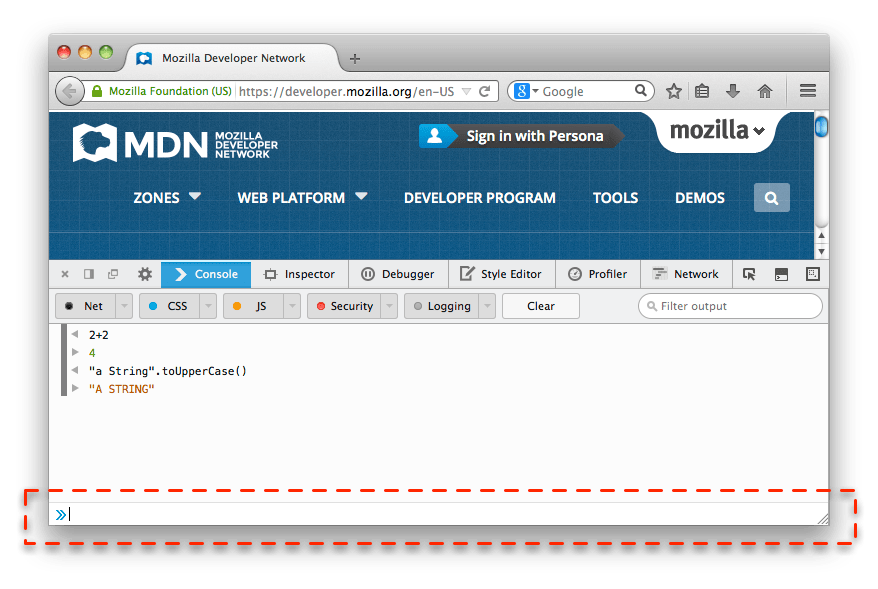
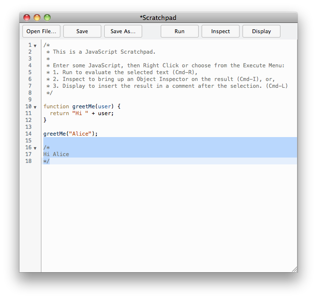

{{jsSidebar("JavaScript Guide")}} {{PreviousNext("Web/JavaScript/Guide", "Web/JavaScript/Guide/Grammar_and_types")}}

Este capítulo apresenta o JavaScript e discute alguns de seus conceitos fundamentais.

## O que você realmente já deveria saber?

Este guia assume que você tem os seguintes conhecimentos básicos:

- Um entendimento geral da internet e da _World Wide Web_ ({{Glossary("WWW")}}).
- Um bom conhecimento de _HyperText Markup Language_ ({{Glossary("HTML")}}).
- Alguma experiência em programação. Se você é novo em programação, veja alguns tutorias na página inicial sobre [JavaScript](/pt-BR/docs/Web/JavaScript).

## Onde encontrar informações sobre JavaScript

A documentação de JavaScript na MDN inclui o seguinte:

- [Aprendendo sobre a internet](/pt-BR/Learn) fornece informações aos iniciantes e introduz os conceitos básicos de programação e da internet.
- [Guia JavaScript](/pt-BR/docs/Web/JavaScript/Guide) (este guia) dá uma visão geral sobre a linguagem de programação JavaScript e seus objetos.
- [Referência JavaScript](/pt-BR/docs/Web/JavaScript/Reference) provê um material de referência detalhado da linguagem JavaScript.

Se você é novo com JavaScript, comece com os artigos na [área de aprendizado](/pt-BR/Learn) e com o [Guia JavaScript](/pt-BR/docs/Web/JavaScript/Guide). Quando você já possuir uma compreensão dos princípios básicos, você pode usar a [Referência JavaScript](/pt-BR/docs/Web/JavaScript/Reference) para ter mais detalhes sobre objetos e declarações.

## O que é JavaScript?

JavaScript é uma linguagem de script orientada a objetos, multiplataforma. É uma linguagem pequena e leve. Dentro de um ambiente de host (por exemplo, um navegador web) o JavaScript pode ser ligado aos objetos deste ambiente para prover um controle programático sobre eles.

JavaScript tem uma biblioteca padrão de objetos, como: `Array`, `Date`, e `Math`, e um conjunto de elementos que formam o núcleo da linguagem, tais como: operadores, estruturas de controle e declarações. O núcleo do JavaScript pode ser estendido para uma variedade de propósitos, complementando assim a linguagem:

- _O lado cliente do JavaScript_ estende-se do núcleo linguagem, fornecendo objetos para controlar um navegador web e seu _Document Object Model_ (DOM). Por exemplo, as extensões do lado do cliente permitem que uma aplicação coloque elementos em um formulário HTML e responda a eventos do usuário, como cliques do mouse, entrada de formulário e de navegação da página.
- _O lado do servidor do JavaScript_ estende-se do núcleo da linguagem, fornecendo objetos relevantes à execução do JavaScript em um servidor. Por exemplo, as extensões do lado do servidor permitem que uma aplicação comunique-se com um banco de dados, garantindo a continuidade de informações de uma chamada para a outra da aplicação, ou executar manipulações de arquivos em um servidor.

## JavaScript e Java

JavaScript e Java são similares em algumas coisas, mas são diferentes em outras. O JavaScript assemelha-se ao Java, porém não possui tipagem estática e checagem rigída de tipos como o Java. JavaScript segue a sintaxe básica do Java, convenções de nomenclatura e construções de controle de fluxo, razões pelas quais esta linguagem foi renomeada de LiveScript para JavaScript.

Em contraste com o sistema em tempo de compilação das classes construídas por declarações no Java, JavaScript suporta um sistema em tempo de execução com base em um pequeno número de tipos de dados representando valores numéricos, booleanos, e strings. JavaScript tem um modelo de objeto baseado em protótipo em vez do modelo, mais comum, de objeto baseado em classes. O modelo baseado em protótipo fornece herança dinâmica; isto é, o que é herdado pode variar para objetos individuais. JavaScript também suporta funções sem quaisquer requisitos especiais declarativos. As funções podem ser propriedades de objetos, executando como métodos.

JavaScript é uma linguagem mais livre em comparação a Java. Você não tem de declarar todas as variáveis, classes e métodos. Você não tem que se preocupar com o fato dos métodos serem públicos, privados ou protegidos, e você não tem que implementar interfaces. Variáveis, parâmetros e tipo de retorno da função não são explicitamente tipados.

Java é uma linguagem de programação baseada em classes, projetada para execução rápida e segurança de tipos. Segurança de tipo significa que, por exemplo, você não pode converter um número inteiro em Java para uma referência de objeto ou acessar a memória privada corrompendo bytecodes Java. O modelo baseado em classes do Java significa que os programas são exclusivamente constituídos por classes e seus métodos. Herança de classe do Java e tipagem forte geralmente requerem hierarquias de objetos fortemente acoplados. Esses requisitos tornam a programação em Java mais complexa do que a programação em JavaScript.

Em contraste, JavaScript descende em espírito de uma linhagem de linguagens menores com tipagem dinâmica, como HyperTalk e dBASE. Essas linguagens de script oferecem ferramentas de programação para um público muito mais amplo por causa de sua sintaxe mais fácil, funções especializadas embutidas e requisitos mínimos para a criação de objetos.

| JavaScript                                                                                                                                                                         | Java                                                                                                                                                                                                        |
| ---------------------------------------------------------------------------------------------------------------------------------------------------------------------------------- | ----------------------------------------------------------------------------------------------------------------------------------------------------------------------------------------------------------- |
| Orientada a objeto. Sem distinção entre tipos e objetos. A herança é feita através do protótipo e as propriedades e métodos podem ser adicionadas a qualquer objeto dinamicamente. | Baseada em classes. Objetos são divididos em classes e instâncias com toda a herança através da hierarquia da classe. Classes e instâncias não podem ter propriedades ou métodos adicionados dinamicamente. |
| Os tipos de dados das variáveis não precisam ser declarados (tipagem dinâmica)                                                                                                     | Os tipos de dados das variáveis devem ser declarados (tipagem estática).                                                                                                                                    |
| Não pode escrever automaticamente no disco rigído.                                                                                                                                 | Pode escrever automaticamente no disco rigído.                                                                                                                                                              |
| Linguagem não compilada                                                                                                                                                            | Linguagem compilada                                                                                                                                                                                         |

Para mais informações sobre as diferenças entre JavaScript e Java, veja a seção [Detalhes do modelo de objetos](/pt-BR/docs/Web/JavaScript/Guide/Detalhes_do_Modelo_do_Objeto).

## JavaScript e a especificação ECMAScript

O JavaScript é padronizado pela [Ecma International](http://www.ecma-international.org/) — a associação Europeia para a padronização de sistemas de comunicação e informação (antigamente ECMA era um acrônimo para European Computer Manufacturers Association) para entregar uma linguagem de programação padronizada, internacional baseada em JavaScript. Esta versão padronizada de JavaScript, chamada ECMAScript, comporta-se da mesma forma em todas as aplicações que suportam o padrão. As empresas podem usar a linguagem de padrão aberto para desenvolver a sua implementação de JavaScript. O padrão ECMAScript é documentado na especificação ECMA-262. Veja [Novidades em JavaScript](/pt-BR/docs/Web/JavaScript/New_in_JavaScript) para aprender mais sobre diferentes versões de JavaScript e edições da especificação ECMAScript.

O padrão ECMA-262 também é aprovado pela [ISO](http://www.iso.ch/) (International Organization for Standardization) como ISO-16262. Você também pode encontrar a especificação no site da [Ecma International](http://www.ecma-international.org/publications/standards/Ecma-262.htm). A especificação ECMAScript não descreve o Document Object Model (DOM), que é padronizado pelo [World Wide Web Consortium (W3C)](https://www.w3.org/). O DOM define a maneira na qual os objetos do documento HTML estão expostos no seu script. Para ter uma ideia melhor sobre as diferentes tecnologias que são usadas durante a programação com JavaScript, consultar o artigo [Visão Geral do JavaScript](/pt-BR/docs/Web/JavaScript/JavaScript_technologies_overview).

### Documentação JavaScript versus Especificação ECMAScript

A especificação ECMAScript é um conjunto de requisitos para a implementação ECMAScript; é útil se você desejar implementar recursos compatíveis com os padrões da linguagem em sua implementação ECMAScript ou _engine_ (como SpiderMonkey no Firefox, ou v8 no Chrome).

O documento ECMAScript não se destina a ajudar programadores de script; utilize a documentação JavaScript para informações sobre como escrever scripts.

A especificação ECMAScript utiliza terminologia e sintaxe que podem ser desconhecidos para um programador JavaScript. Embora a descrição da linguagem possa ser diferente no ECMAScript, a linguagem em si continua sendo a mesma. JavaScript suporta todas as funcionalidades descritas na especificação ECMAScript.

A documentação JavaScript descreve aspectos da linguagem que são apropriadas para um programador JavaScript.

## Começando com JavaScript

Começar a aprender JavaScript é fácil: Tudo o que você precisa é de um navegador web moderno. Esse guia inclui algumas características do JavaScript que só estão disponíveis nas últimas versões do Firefox, então, é recomendável o uso de uma versão mais recente do Firefox.

Há duas ferramentas no Firefox que são muito úteis para aprender JavaScript: O console web e o Scratchpad.

### O console web

O [console web](/pt-BR/docs/Tools/Web_Console) mostra informações sobre a página web que está sendo carregada atualmente e também inclui a [linha de comando](/pt-BR/docs/Tools/Web_Console#The_command_line_interpreter) que você pode utilizar para executar códigos JavaScript na página atual.

Para abrir o console (Ctrl+Shift+K), selecione "Web Console" do menu "Web Developer", que está sob o menu "Tools" no Firefox. Ele aparece na parte inferior da janela do navegador. Na parte inferior do console está a linha de comando que você pode usar para colocar o JavaScript, e a saída é exibida no painel acima:



### Scratchpad

O Web Console é excelente para executar linhas únicas de JavaScript, mas embora você possa executar várias linhas, não é muito conveniente para isso, e você não pode salvar as amostras de código usando o Web Console. Assim, para exemplos mais complexos a ferramenta [Scratchpad](/pt-BR/docs/Tools/Scratchpad) é melhor.

Para abrir o Scratchpad (Shift+F4), selecione "Scratchpad" do menu "Web Developer", que está sob o menu "Tools/Ferramentas" do Firefox. Ele abre em uma janela separada e é um editor que você pode usar para escrever e executar JavaScript no navegador. Você também pode salvar os scripts para o disco e carregá-los a partir do disco.



### Hello world

Para começar a escrever JavaScript, abra o Console Web ou o Scratchpad e escreva seu primeiro código JavaScript "Olá, mundo".

```js
function greetMe(nome) {
  alert("Olá, " + nome);
}

greetMe("mundo"); // "Olá, mundo"
```

Logo após, pressione Ctrl+R para executar o código em seu navegador.

Nas páginas seguintes, este guia irá apresentar-lhe a sintaxe e as características da linguagem JavaScript, de modo que você possa escrever aplicações mais complexas.

{{PreviousNext("Web/JavaScript/Guide", "Web/JavaScript/Guide/Grammar_and_types")}}
