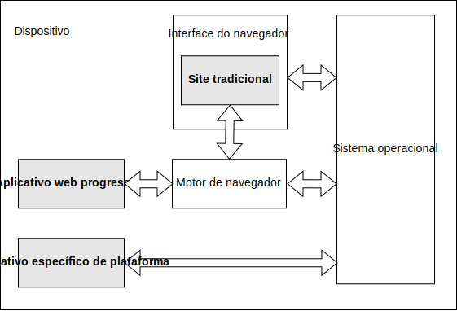

{{PWASidebar}}

Um progressive web app (PWA) é um aplicativo construído usando tecnologias de plataforma web, mas que oferece uma experiência de usuário semelhante à de um aplicativo específico de plataforma.

## Aplicativos específicos de plataforma

_Aplicativos específicos de plataforma_ são desenvolvidos para um sistema operacional (SO) e/ou classe de dispositivo específica, como um dispositivo iOS ou Android, geralmente usando um SDK fornecido pelo fornecedor da plataforma. Eles são geralmente distribuídos usando a loja de aplicativos do fornecedor, onde o usuário pode encontrá-los e instalá-los, e subsequentemente parecem para o usuário como um recurso extra permanente de seu dispositivo, expandindo suas capacidades de alguma forma.

Os benefícios dos aplicativos específicos de plataforma incluem:

- **Fácil acesso para usuários**: Eles têm seu próprio ícone no dispositivo, tornando fácil para os usuários encontrá-los e abri-los.
- **Operação offline e em segundo plano**: Eles são capazes de operar quando o usuário não está interagindo com eles e quando o dispositivo está offline. Isso, por exemplo, permite que um aplicativo de bate-papo receba mensagens quando não está aberto e exiba uma notificação para o usuário. Também permite que um aplicativo de notícias seja atualizado em segundo plano para que possa mostrar conteúdo fresco mesmo que o dispositivo esteja offline.
- **UI dedicada**: Eles podem implementar sua própria UI distinta e imersiva.
- **Integração com o SO**: Eles podem ser integrados ao SO hospedeiro: por exemplo, um aplicativo de mensagens pode se registrar como um alvo de compartilhamento, permitindo que os usuários selecionem uma imagem no aplicativo de fotos e a enviem usando o aplicativo de mensagens. Eles também podem acessar recursos do dispositivo, como a câmera, GPS ou acelerômetro.
- **Integração com a loja de aplicativos**: Eles são distribuídos usando a loja de aplicativos, dando aos usuários um único lugar para encontrá-los e uma maneira consistente de decidir se desejam instalá-los.

## Sites tradicionais

Tradicionalmente, os sites são menos como "algo que o usuário tem" e mais como "um lugar que o usuário visita". Tipicamente, um site: não tem presença no dispositivo do usuário quando o usuário não está acessando-o, só pode ser acessado pelo usuário abrindo o navegador e navegando para o site, e é altamente dependente da conectividade de rede.

No entanto, os sites têm alguns benefícios sobre os aplicativos específicos de plataforma, incluindo:

- **Código único**: Como a web é inerentemente multiplataforma, um site pode ser executado em diferentes sistemas operacionais e classes de dispositivos a partir de um único código-base.
- **Distribuição via web**: A web é uma ótima plataforma de distribuição. Os sites são indexados por mecanismos de busca e podem ser compartilhados e acessados apenas usando URLs. Um site pode ser distribuído sem a necessidade de se inscrever em qualquer loja de aplicativos de fornecedor.

## Progressive web apps

Os progressive web apps combinam os melhores recursos dos sites tradicionais e dos aplicativos específicos de plataforma.

Os PWAs têm os benefícios dos sites, incluindo:

- PWAs são desenvolvidos usando tecnologias padrão de plataforma web, para que possam ser executados em múltiplos sistemas operacionais e classes de dispositivos a partir de um único código-base.
- PWAs podem ser acessados diretamente da web.

Os PWAs também têm muitos dos benefícios dos aplicativos específicos de plataforma, incluindo:

- [**PWAs podem ser instalados no dispositivo**](/pt-BR/docs/Web/Progressive_web_apps/Guides/Making_PWAs_installable). Isso significa:

  - O PWA pode ser instalado a partir da loja de aplicativos da plataforma ou instalado diretamente da web.
  - O PWA pode ser instalado como um aplicativo específico de plataforma e pode personalizar o processo de instalação.
  - Uma vez instalado, o PWA obtém um ícone de aplicativo no dispositivo, ao lado dos aplicativos específicos de plataforma.
  - Uma vez instalado, o PWA pode ser lançado como um aplicativo autônomo, em vez de um site em um navegador.

- [**PWAs podem operar em segundo plano e offline**](/pt-BR/docs/Web/Progressive_web_apps/Guides/Offline_and_background_operation): um site típico só está ativo enquanto a página está carregada no navegador. Um PWA pode:

  - Funcionar enquanto o dispositivo não tem conectividade de rede.
  - Atualizar conteúdo em segundo plano.
  - Responder a [mensagens push](/pt-BR/docs/Web/API/Push_API) do servidor.
  - Exibir notificações usando o sistema de [notificações](/pt-BR/docs/Web/API/Notifications_API) do SO.

- PWAs podem [usar a tela inteira](/pt-BR/docs/Web/Progressive_web_apps/How_to/Create_a_standalone_app), em vez de serem executados na UI do navegador.
- PWAs podem ser integrados ao dispositivo, registrando-se como alvos e fontes de compartilhamento e acessando recursos do dispositivo.
- PWAs podem ser distribuídos em lojas de aplicativos, bem como abertamente via web.

### PWAs e o navegador

Ao visitar um site no navegador, é visualmente aparente que o site está "sendo executado no navegador". A UI do navegador fornece um quadro visível ao redor do site, incluindo recursos de UI como botões de voltar/avançar e um título para a página. As APIs Web que seu site chama são implementadas pelo motor do navegador.

Os PWAs tipicamente se parecem com aplicativos específicos de plataforma - geralmente são exibidos sem a UI do navegador ao redor deles - mas são, em termos de tecnologia, ainda sites. Isso significa que eles precisam de um motor de navegador, como os do Chrome ou Firefox, para gerenciá-los e executá-los. Com um aplicativo específico de plataforma, o SO da plataforma gerencia o aplicativo, fornecendo o ambiente em que ele é executado. Com um PWA, um motor de navegador executa esse papel de fundo, assim como faz para sites normais.

Em nossa documentação para PWAs, às vezes nos referimos ao navegador desempenhando esse papel de fundo. Podemos dizer, por exemplo: "O navegador inicia o service worker de um PWA quando uma notificação push é recebida." Aqui, a atividade do navegador está inteiramente em segundo plano. Do ponto de vista do PWA, poderia ser o sistema operacional que o iniciou. Para alguns sistemas, como Chromebooks, pode nem haver distinção entre "o navegador" e "o sistema operacional".

### Recursos técnicos dos PWAs

Como PWAs são sites, eles têm as mesmas características básicas de qualquer outro site: pelo menos uma página HTML, que muito provavelmente carrega algum CSS e JavaScript. Como um site normal, o JavaScript carregado pela página tem um objeto global {{domxref("Window")}} e pode acessar todas as APIs Web que estão disponíveis através desse objeto.

Além disso, um PWA tem alguns recursos adicionais:

- Um arquivo de [manifesto de aplicativo web](/pt-BR/docs/Web/Progressive_web_apps/Manifest), que, no mínimo, fornece informações que o navegador precisa para instalar o PWA, como o nome e o ícone do aplicativo.
- Opcionalmente, um [service worker](/pt-BR/docs/Web/API/Service_Worker_API) para fornecer uma experiência offline.

#### Manifesto de aplicativo web

Um PWA deve ter um manifesto de aplicativo web, e o [manifesto deve incluir informações suficientes para que o navegador possa instalar o PWA](/pt-BR/docs/Web/Progressive_web_apps/Guides/Making_PWAs_installable#the_web_app_manifest).

O manifesto pode definir muitos outros aspectos da aparência do PWA, como [cor do tema](/pt-BR/docs/Web/Progressive_web_apps/Manifest/Reference/theme_color) e [cor de fundo](/pt-BR/docs/Web/Progressive_web_apps/Manifest/Reference/background_color), e seu comportamento, incluindo sua capacidade de [atuar como um alvo de compartilhamento](/pt-BR/docs/Web/Progressive_web_apps/Manifest/Reference/share_target) para dados de outros aplicativos ou [lidar com tipos de arquivo específicos](/pt-BR/docs/Web/Progressive_web_apps/Manifest/Reference/file_handlers).

#### Service worker

Embora um PWA não precise de um service worker para ser instalado, os service workers são frequentemente usados com PWAs para fornecer pelo menos uma experiência offline mínima.

Os service workers incentivam uma arquitetura na qual as páginas do aplicativo - ou seja, a parte tradicional de um site - implementam a interface do usuário, e o service worker implementa um backend que pode suportar [operação offline e em segundo plano](/pt-BR/docs/Web/Progressive_web_apps/Guides/Offline_and_background_operation), fazendo com que o PWA se comporte mais como um aplicativo do que como um site. Isso ocorre porque os service workers podem ser iniciados pelo navegador em segundo plano quando são necessários (por exemplo, para lidar com uma notificação push).

### PWAs e single-page apps

Tradicionalmente, um site é construído como uma coleção de páginas interligadas. Quando o usuário clica em um link de uma página do site para outra página no mesmo site, o navegador carrega a nova página como uma entidade completamente nova, incluindo o HTML e os sub-recursos que o HTML carrega, como CSS e JavaScript. Em um {{Glossary("SPA", "single-page app")}}, o site consiste em uma única página HTML, e quando o usuário clica em links internos, isso é tratado pelo JavaScript buscando novo conteúdo do servidor e atualizando as partes relevantes da página.

Os single-page apps podem fornecer uma experiência de usuário mais próxima de aplicativos específicos de plataforma, então os PWAs são frequentemente implementados como single-page apps. Em particular, os single-page apps facilitam a obtenção de uma interface de usuário perfeita, na qual o usuário é apresentado a uma única página consistente, e apenas as partes relevantes da página são atualizadas conforme o usuário interage com o aplicativo.

No entanto, os PWAs não precisam ser single-page apps, e os single-page apps não precisam ser PWAs.

### Aprimoramento progressivo

Embora o {{Glossary("Progressive Enhancement", "aprimoramento progressivo")}} seja um atributo desejável para a maioria dos sites, é especialmente importante para PWAs, que esperam ser executados em uma ampla gama de dispositivos e frequentemente usam APIs Web avançadas que podem não ser suportadas por todos os navegadores.

Um componente básico do aprimoramento progressivo é que, se o usuário visitar seu PWA na web digitando sua URL em um navegador, o usuário poderá interagir com o aplicativo como um site normal. Mas se o navegador puder instalá-lo, o usuário será solicitado a instalá-lo e o aplicativo aparecerá como um novo recurso em seu dispositivo.

Os PWAs devem realizar a detecção de recursos para APIs avançadas e fornecer experiências de fallback aceitáveis.

Por exemplo, a [API Background Sync](/pt-BR/docs/Web/API/Background_Synchronization_API) permite que um PWA peça a um service worker para fazer uma requisição de rede assim que o dispositivo tiver conectividade. Um caso de uso clássico para isso é a troca de mensagens. Supponha que o usuário compunha uma mensagem, mas quando tenta enviá-la, o dispositivo está offline. A API Background Sync permite que o dispositivo envie a mensagem em segundo plano assim que o dispositivo estiver conectado. Em um dispositivo que não suporta Background Sync, o aplicativo deve informar ao usuário que a mensagem não pôde ser enviada, dando a ele a chance de tentar novamente mais tarde.
