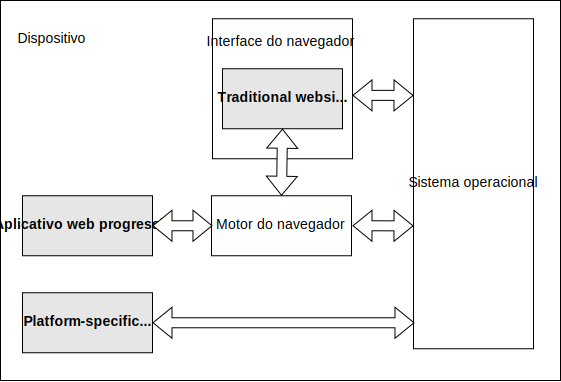

Um aplicativo web progressivo (PWA) é um aplicativo construído usando tecnologias de plataforma web, mas que oferece uma experiência de usuário semelhante à de um aplicativo específico da plataforma.

## Aplicativos específicos da plataforma

_Aplicativos específicos da plataforma_ são desenvolvidos para um sistema operacional (SO) e/ou classe de dispositivo específico, como um dispositivo iOS ou Android, geralmente usando um SDK fornecido pelo fornecedor da plataforma. Eles geralmente são distribuídos usando a loja de aplicativos do fornecedor, onde o usuário pode encontrá-los e instalá-los, e subsequentemente parecem ao usuário como um recurso extra permanente de seu dispositivo, expandindo suas capacidades de alguma forma.

Os benefícios dos aplicativos específicos da plataforma incluem:

- **Fácil acesso para os usuários**: Eles ganham seu próprio ícone no dispositivo, facilitando para os usuários encontrá-los e abri-los.
- **Operação offline e em segundo plano**: Eles podem operar quando o usuário não está interagindo com eles e quando o dispositivo está offline. Isso, por exemplo, permite que um aplicativo de chat receba mensagens quando não está aberto e exiba uma notificação ao usuário. Também permite que um aplicativo de notícias seja atualizado em segundo plano para que possa mostrar conteúdo novo mesmo se o dispositivo estiver offline.
- **IU dedicada**: Eles podem implementar sua própria IU distinta e imersiva.
- **Integração com o SO**: Eles podem ser integrados ao SO host: por exemplo, um aplicativo de mensagens pode se registrar como um alvo de compartilhamento, permitindo que os usuários selecionem uma imagem no aplicativo de fotos e a enviem usando o aplicativo de mensagens. Eles também podem acessar recursos do dispositivo, como a câmera, GPS ou acelerômetro.
- **Integração com a loja de aplicativos**: Eles são distribuídos usando a loja de aplicativos, dando aos usuários um único lugar para encontrá-los e uma maneira consistente de decidir se desejam instalá-los.

## Sites tradicionais

Tradicionalmente, os sites são menos como "algo que o usuário tem" e mais como "um lugar que o usuário visita". Normalmente, um site: não tem presença no dispositivo do usuário quando o usuário não está acessando, só pode ser acessado pelo usuário abrindo o navegador e navegando até o site, e é altamente dependente da conectividade de rede.

No entanto, os sites têm algumas vantagens sobre os aplicativos específicos da plataforma, incluindo:

- **Base de código única**: Como a web é inerentemente multiplataforma, um site pode rodar em diferentes sistemas operacionais e classes de dispositivos a partir de uma única base de código.
- **Distribuição via web**: A web é uma ótima plataforma de distribuição. Os sites são indexados por mecanismos de busca e podem ser compartilhados e acessados apenas usando URLs. Um site pode ser distribuído sem a necessidade de se inscrever na loja de aplicativos de nenhum fornecedor.

## Aplicativos web progressivos

Os aplicativos web progressivos combinam os melhores recursos dos sites tradicionais e dos aplicativos específicos da plataforma.

Os PWAs têm os benefícios dos sites, incluindo:

- Os PWAs são desenvolvidos usando tecnologias padrão da plataforma web, para que possam rodar em vários sistemas operacionais e classes de dispositivos a partir de uma única base de código.
- Os PWAs podem ser acessados diretamente da web.

Os PWAs também têm muitos dos benefícios dos aplicativos específicos da plataforma, incluindo:

- [**PWAs podem ser instalados no dispositivo**](/pt-BR/docs/Web/Progressive_web_apps/Guides/Making_PWAs_installable). Isso significa:

  - O PWA pode ser instalado a partir da loja de aplicativos da plataforma ou instalado diretamente da web.
  - O PWA pode ser instalado como um aplicativo específico da plataforma e pode personalizar o processo de instalação.
  - Uma vez instalado, o PWA ganha um ícone de aplicativo no dispositivo, ao lado dos aplicativos específicos da plataforma.
  - Uma vez instalado, o PWA pode ser iniciado como um aplicativo independente, em vez de um site em um navegador.

- [**PWAs podem operar em segundo plano e offline**](/pt-BR/docs/Web/Progressive_web_apps/Guides/Offline_and_background_operation): um site típico só está ativo enquanto a página está carregada no navegador. Um PWA pode:

  - Funcionar enquanto o dispositivo não tem conectividade de rede.
  - Atualizar o conteúdo em segundo plano.
  - Responder a [mensagens push](/pt-BR/docs/Web/API/Push_API) do servidor.
  - Exibir notificações usando o sistema de [notificações](/pt-BR/docs/Web/API/Notifications_API) do SO.

- PWAs podem [usar a tela inteira](/pt-BR/docs/Web/Progressive_web_apps/How_to/Create_a_standalone_app), em vez de rodar na IU do navegador.
- PWAs podem ser integrados ao dispositivo, registrando-se como alvos e fontes de compartilhamento, e acessando recursos do dispositivo.
- PWAs podem ser distribuídos em lojas de aplicativos, bem como abertamente via web.

### PWAs e o navegador

Quando você visita um site no navegador, é visualmente aparente que o site está "rodando no navegador". A IU do navegador fornece um quadro visível ao redor do site, incluindo recursos de IU como botões de voltar/avançar e um título para a página. As APIs da Web que seu site chama são implementadas pelo mecanismo do navegador.

Os PWAs normalmente se parecem com aplicativos específicos da plataforma － geralmente são exibidos sem a IU do navegador ao redor deles － mas são, em termos de tecnologia, ainda sites. Isso significa que eles precisam de um mecanismo de navegador, como os do Chrome ou Firefox, para gerenciá-los e executá-los. Com um aplicativo específico da plataforma, o SO da plataforma gerencia o aplicativo, fornecendo o ambiente em que ele roda. Com um PWA, um mecanismo de navegador desempenha esse papel em segundo plano, assim como faz para sites normais.

Em nossa documentação para PWAs, às vezes nos referimos ao navegador desempenhando esse papel em segundo plano. Podemos dizer, por exemplo: "O navegador inicia o service worker de um PWA quando uma notificação push é recebida." Aqui, a atividade do navegador está inteiramente em segundo plano. Do ponto de vista do PWA, pode muito bem ser o sistema operacional que o iniciou. Para alguns sistemas, como os Chromebooks, pode nem haver uma distinção entre "o navegador" e "o sistema operacional".

### Recursos técnicos dos PWAs

Como os PWAs são sites, eles têm os mesmos recursos básicos de qualquer outro site: pelo menos uma página HTML, que muito provavelmente carrega algum CSS e JavaScript. Como um site normal, o JavaScript carregado pela página tem um objeto {{domxref("Window")}} global e pode acessar todas as APIs da Web que estão disponíveis através desse objeto.

Além disso, um PWA tem alguns recursos adicionais:

- Um arquivo de [manifesto do aplicativo web](/pt-BR/docs/Web/Progressive_web_apps/Manifest), que, no mínimo, fornece informações que o navegador precisa para instalar o PWA, como o nome e o ícone do aplicativo.
- Opcionalmente, um [service worker](/pt-BR/docs/Web/API/Service_Worker_API) para fornecer uma experiência offline.

#### Manifesto do aplicativo web

Um PWA deve ter um manifesto do aplicativo web, e o [manifesto deve incluir informações suficientes para o navegador instalar o PWA](/pt-BR/docs/Web/Progressive_web_apps/Guides/Making_PWAs_installable#the_web_app_manifest).

O manifesto pode definir muitos outros aspectos da aparência do PWA, como [cor do tema](/pt-BR/docs/Web/Progressive_web_apps/Manifest/Reference/theme_color) e [cor de fundo](/pt-BR/docs/Web/Progressive_web_apps/Manifest/Reference/background_color), e seu comportamento, incluindo sua capacidade de [agir como um alvo de compartilhamento](/pt-BR/docs/Web/Progressive_web_apps/Manifest/Reference/share_target) para dados de outros aplicativos ou para [manipular tipos de arquivo específicos](/pt-BR/docs/Web/Progressive_web_apps/Manifest/Reference/file_handlers).

#### Service worker

Embora um PWA não precise de um service worker para ser instalado, os service workers são frequentemente usados com PWAs para fornecer pelo menos uma experiência offline mínima.

Os service workers incentivam uma arquitetura em que as páginas do aplicativo - ou seja, a parte tradicional de um site - implementam a interface do usuário, e o service worker implementa um backend que pode suportar [operação offline e em segundo plano](/pt-BR/docs/Web/Progressive_web_apps/Guides/Offline_and_background_operation), fazendo com que o PWA se comporte mais como um aplicativo do que como um site. Isso ocorre porque os service workers podem ser iniciados pelo navegador em segundo plano quando são necessários (por exemplo, para lidar com uma notificação push).

### PWAs e aplicativos de página única

Tradicionalmente, um site é construído como uma coleção de páginas interligadas. Quando o usuário clica em um link de uma página do site para outra página do mesmo site, o navegador carrega a nova página como uma entidade completamente nova, incluindo o HTML e os sub-recursos que o HTML carrega, como CSS e JavaScript. Em um {{Glossary("SPA", "aplicativo de página única")}}, o site consiste em uma única página HTML, e quando o usuário clica em links internos, isso é tratado pelo JavaScript buscando novo conteúdo do servidor e atualizando as partes relevantes da página.

Os aplicativos de página única podem fornecer uma experiência de usuário mais próxima dos aplicativos específicos da plataforma, então os PWAs são frequentemente implementados como aplicativos de página única. Em particular, os aplicativos de página única tornam mais fácil obter uma interface de usuário perfeita, na qual o usuário é apresentado com uma única página consistente, e apenas as partes relevantes da página são atualizadas conforme o usuário interage com o aplicativo.

No entanto, os PWAs não precisam ser aplicativos de página única, e os aplicativos de página única não precisam ser PWAs.

### Aprimoramento progressivo

Embora o {{Glossary("Progressive Enhancement", "aprimoramento progressivo")}} seja um atributo desejável para a maioria dos sites, é especialmente importante para os PWAs, que esperam rodar em uma ampla gama de dispositivos e frequentemente usam APIs da Web avançadas que podem não ser suportadas por todos os navegadores.

Um componente básico do aprimoramento progressivo é que, se o usuário visitar seu PWA na web digitando seu URL em um navegador, o usuário pode interagir com o aplicativo como um site normal. Mas se o navegador puder instalá-lo, o usuário será solicitado a instalá-lo e o aplicativo aparecerá como um novo recurso em seu dispositivo.

Os PWAs devem realizar a detecção de recursos para APIs avançadas e fornecer experiências de fallback aceitáveis.

Por exemplo, a [API Background Sync](/pt-BR/docs/Web/API/Background_Synchronization_API) permite que um PWA peça a um service worker para fazer uma solicitação de rede assim que o dispositivo tiver conectividade. Um caso de uso clássico para isso é a troca de mensagens. Suponha que o usuário componha uma mensagem, mas quando o usuário tenta enviar a mensagem, o dispositivo está offline. A API Background Sync permite que o dispositivo envie a mensagem em segundo plano assim que o dispositivo estiver conectado. Em um dispositivo que não suporta Background Sync, o aplicativo deve informar ao usuário que a mensagem não pôde ser enviada, dando a ele a chance de tentar novamente mais tarde.
