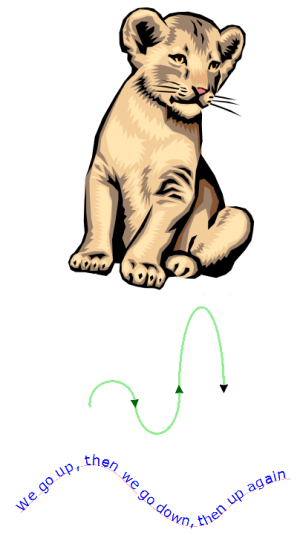

{{ PreviousNext("Web/SVG/Tutorial", "Web/SVG/Tutorial/Getting_Started") }}

[SVG](/pt-BR/docs/Web/SVG) é uma linguagem [XML](/pt-BR/XML), similar ao [XHTML](/pt-BR/XHTML), na qual pode ser usada para desenhar vetores gráficos (imagens), como os mostrados à direita. Ela pode ser usada para criar uma imagem qualquer especificando todas as linhas e formas necessárias, para modificar uma imagem raster já existente ou fazer ambas as opções. A imagem e seus componentes também podem ser transformados, compostas em conjunto, ou filtradas para mudar completamente sua aparência.

SVG surgiu em 1999 após vários outros formatos terem sido submetidos à [W3C](https://www.w3.org) e não terem sido totalmente ratificados. Enquanto a especificação tem levado um bom tempo, a aceitação pelos navegadores têm sido lenta, e não há tanto conteúdo sobre SVG sendo utilizado na internet neste momento (2009). Even the implementations that are available often are not as fast as competing technologies like [HTML5 Canvas](/pt-BR/docs/Web/API/Canvas_API) or Adobe Flash as a full application interface. SVG does offer benefits over both implementations, some of which include having a [DOM interface](/pt-BR/docs/Web/API) available for it, and not requiring third-party extensions. Whether or not to use it often depends on your specific use case.

### Ingredientes Básicos

O [HTML](/pt-BR/docs/Web/HTML) fornece elementos para definir cabeçalhos, parágrafos, tabelas e assim por diante. Da mesma forma, o SVG fornnece elementos para circulos,retangulos e curvas simples e complexas. Um documentos simples de SVG consiste de nada mais do que um elemento-raiz {{SVGElement('svg')}} e várias formas básicas que juntas constroem um gráfico. Há também o elemento {{SVGElement('g')}}, que é utilizado para agrupar várias formas básicas.

Começando daqui, o SVG em imagem pode se tornar arbitrariamente complexo. SVG suporta gradientes, rotação, filtros, efeitos, animações, interatividade com JavaScript e assim por diante. Mas todas essas ferramentas extras da linguagem dependem desse conjunto relativamente pequeno de elementos para definir a área gráfica.

### Antes de você começar

Há muitos softwares disponíveis como o [Inkscape](https://www.inkscape.org/) os quais são gratuitos e usam SVG como seus formatos de arquivos padrão. Entretanto, este tutorial dependerá apenas do XML ou do editor de texto da sua escolha. A ideia é ensinar o funcionamento interno do SVG para aqueles que desejam entendê-lo, e a melhor forma é "pondo a mão na masssa", escrevendo algumas marcações. Contudo você deve anotar o seu objetivo. Nenhum dos visualizadores SVG são iguais, então, há uma boa chance de você desenvolver para um aplicativo não será exibido exatamente da mesma forma que em outros, simplesmente porque eles suportam diferentes níveis da especificação SVG ou outra especificação que você está usando junto com o SVG (isto é, JavaScript ou CSS).

SVG é suportado em todos os browsers modernos em cobre algumas versões anteriores em alguns casos. Uma tabela completa de compatibilidade com browser pode ser encontrada em [Can I use](http://caniuse.com/svg). O Firefox suporta alguns conteúdos SVG desde a versão 1.5, e este suporte vem crescendo a cada lançamento desde então. Espero, que com essa tradução aqui, o MDN possa ajudar os desenvolvedores a acompanhar as diferenças entre o Gecko e algumas das outras importantes implementações.

- O XML é case-sensitive (diferencia maiúsculas e minúsculas, diferentemente do HTML), ou seja, todos os exemplos devem ser escritos exatamente como mostrado aqui.
- Valores de atributos, mesmo que estes sejam números, devem ser colocados dentro de aspas.

SVG é uma especificação imensa. Este tutorial combre apenas o conteúdo básico. Uma vez que você se familiarizar você estará habilitado a usar o [Element Reference](/pt-BR/docs/Web/SVG/Element) e o [Interface Reference](/pt-BR/docs/Web/API/Document_Object_Model#svg_interfaces) para encontrar qualquer outra coisa que precisa saber.

### Sabores do SVG

Desde que se tornou uma recomendação em 2003, a mais recente Versão SVG completa é 1.1. Ele se baseia SVG 1.0, mas adiciona mais modularização para facilitar a implementação. [The second edition of SVG 1.1](https://www.w3.org/TR/SVG/) tornou-se uma recomendação em 2011. O SVG 1.2 completo deveria se tornar o próximo grande lançamento. Ele foi descartado para o próximo lançamento [SVG 2.0](https://www.w3.org/TR/SVG2/), o qual está sob forte desenvolvimento agora e segue uma abordagem semelhante ao CSS 3, pois divide componentes em várias especificações fracamente acopladas.

Além das recomendações completas do SVG, o grupo de trabalho do W3C introduziu o SVG Tiny e o SVG Basic em 2003. Esses dois perfis são voltados principalmente para dispositivos móveis. O primeiro, SVG Tiny, deve render primitivos gráficos para pequenos dispositivos com baixa capacidade. O SVG Basic oferece muitos recursos de SVG completo, mas não inclui aqueles que são difíceis de implementar ou pesados para renderizar (como animações). Em 2008, o SVG Tiny 1.2 tornou-se uma recomendação do W3C.

Havia planos para uma especificação de impressão SVG, que adicionaria suporte a várias páginas e gerenciamento de cores aprimorado. Este trabalho foi descontinuado.

{{ PreviousNext("Web/SVG/Tutorial", "Web/SVG/Tutorial/Getting_Started") }}
