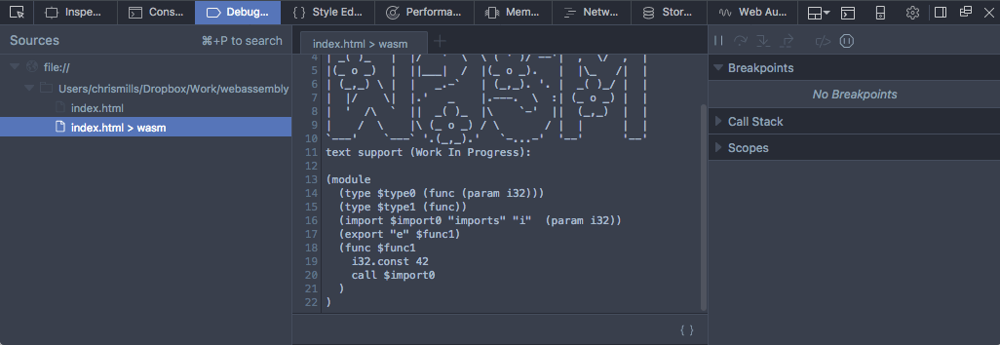

{{WebAssemblySidebar}}

Se você já [compilou um módulo de outra linguagem utilizando ferramentas como o Emscripten](/pt-BR/docs/WebAssembly/C_to_wasm), ou [carregou e executou o código sozinho](/pt-BR/docs/WebAssembly/Loading_and_running), o próximo passo é aprender mais sobre o uso de outros recursos da API JavaScript do WebAssembly. Este artigo te ensina o que você precisará saber.

> **Nota:** Se você não estiver familiarizado com os conceitos básicos mencionados neste artigo e precisar de mais explicação, leia [WebAssembly concepts](/pt-BR/docs/WebAssembly/Concepts) primeiro, e depois volte aqui.

## Um exemplo simples

Vamos percorrer o passo a passo de um exemplo que explica como usar a API JavaScript do WebAssembly, e como usá-la para carregar um módulo wasm em uma página web.

> **Nota:** Você pode encontrar o código de exemplo no nosso repositório di GitHub [webassembly-examples](https://github.com/mdn/webassembly-examples).

### Preparando o exemplo

1. Primeiro precisamos de um módulo wasm! Pegue o nosso arquivo [simple.wasm](https://github.com/mdn/webassembly-examples/raw/master/js-api-examples/simple.wasm) e salve uma cópia em um novo diretório em sua máquina local.
2. Depois, tenha certeza de que você está usando um browser com suporte ao WebAssembly. O Firefox 52+ e o Chrome 57+ já vem com WebAssembly habilitado por padrão.
3. Depois, crie um arquivo html simples chamado `index.html` no mesmo diretório que seu arquivo wasm (você pode usar o nosso [template simples](https://github.com/mdn/webassembly-examples/blob/master/template/template.html) caso você não tenha algum por aí).
4. Agora, para ajudar a entender o que está acontecendo aqui, vamos olhar a representação textual do nosso módulo wasm (do qual também encontramos em [Converting WebAssembly format to wasm](/pt-BR/docs/WebAssembly/Text_format_to_wasm#A_first_look_at_the_text_format)):

    ```
    (module
      (func $i (import "imports" "imported_func") (param i32))
      (func (export "exported_func")
        i32.const 42
        call $i))
    ```

5. Na segunda linha, você perceberá que o import tem um namespace de dois níveis — a função interna `$i` que é importada do `imports.imported_func`. Precisamos refletir esse namespace de dois níveis no JavaScript ao escrever o objeto que será importado no módulo wasm. Crie um elemento `<script></script>` no seu arquivo HTML, e adicione o seguinte código:

    ```js
    var importObject = {
      imports: {
          imported_func: function(arg) {
            console.log(arg);
          }
        }
      };
    ```

Conforme explicado acima, temos nossa função que será importada em `imports.imported_func`.

> **Nota:** Isto poderia ser mais conciso usando [a sintaxe de arrow function do ES6](/pt-BR/docs/Web/JavaScript/Reference/Functions/Arrow_functions):
>
> ```js
> var importObject = { imports: { imported_func: arg => console.log(arg) } };
> ```

O estilo que você preferir fica a sua escolha.

### Carregando e utilizando o nosso módulo wasm

Com o objeto que iremos importar preparado, vamos baixar o nosso arquivo wasm, torná-lo disponível em um array buffer, e em seguida fazer uso de sua função exportada.

Adicione o código abaixo no seu script:

```js
fetch('simple.wasm').then(response =>
  response.arrayBuffer()
).then(bytes =>
  WebAssembly.instantiate(bytes, importObject)
).then(results => {
  results.instance.exports.exported_func();
});
```

> **Nota:** Já explicamos com grandes detalhes como funciona essa síntaxe em [Loading and running WebAssembly code](/pt-BR/docs/WebAssembly/Loading_and_running#Using_Fetch). Volte lá e se atualize caso não se sinta confortável com o assunto.

O resultado liquido disto é que nós chamamos nossa função `exported_func` exportada pelo WebAssembly, que por sua vez chama a nossa função JavaScript importada `imported_func`, que mostra no console o valor fornecido (42) dentro da instância do WebAssembly. Se você salvar seu código de exemplo agora e carregá-lo em um browser que suporta WebAssembly, você verá isso em ação!

> **Nota:** O WebAssembly está habilitado por padrão no Firefox 52+, no Chrome 57+ e no Opera mais recente (você também pode executar código wasm no Firefox 47+ habilitando a flag `javascript.options.wasm` em _about:config_, ou no Chrome (51+) e no Opera (38+) indo em _chrome://flags_ e habilitando a flag _Experimental WebAssembly_ .)

Este exemplo é longo e um pouco complicado que alcança muito pouco, mas serve para mostrar o que é possível — usando código WebAssembly junto com JavaScript em suas aplicações web. Como já dissemos em outro lugar, o WebAssembly não pretende substituir o JavaScript; ambos podem trabalhar juntos, juntando forças.

### Visualizando o wasm no developer tools

No Firefox 54+, o painel Debugger do Developer Tool consegue exibir a representação textual do qualquer código wasm inserido em uma página web. Para visualizá-lo, abra o painel Debugger e clique em “xxx > wasm”.



Muito em breve no Firefox, além de visualizar o WebAssembly em seu formato textual, os desenvolvedores serão capazes de depurar (colocar breakpoints, inspecionar o callstack, etc.) o WebAssembly utilizando o formato textual. Assista o vídeo [WebAssembly debugging with Firefox DevTools](https://www.youtube.com/watch?v=R1WtBkMeGds) para ter uma prévia.

## Memória

No modelo de memória de baixo nível do WebAssembly, a memória é representada como uma faixa contínua de bytes não tipados chamados de [Memória Linear](http://webassembly.org/docs/semantics/#linear-memory) que são lidos e escritos por [instruções de carga e armazenamento](http://webassembly.org/docs/semantics/#linear-memory-accesses) dentro do módulo. Neste modelo de memória, qualquer carga ou armazenamento pode acessar qualquer byte na memória linear inteira, o que é necessário para representar fielmente conceitos de C/C++ como ponteiros.

Ao contrário de um programa C/C++ nativo, contudo, onde a coleção de memória disponível se estende por todo o processo, a memória que é acessível por uma instância de WebAssembly em particular se limita a uma única — e potencialmente muito pequena — coleção contida por um objeto do tipo WebAssembly Memory. Isto possibilita que uma única aplicação web utilize diversas bibliotecas independentes — cada uma das quais estiverem utilizando o WebAssembly internamente — para ter memórias separadas que são totalmente isoladas umas das outras.

In JavaScript, a Memory instance can be thought of as a resizable ArrayBuffer and, just as with ArrayBuffers, a single web app can create many independent Memory objects. You can create one using the {{jsxref("WebAssembly.Memory()")}} constructor, which takes as arguments an initial size and (optionally) a maximum size.

Let’s start exploring this by looking at a quick example.

1. Create another new simple HTML page (copy our [simple template](https://github.com/mdn/webassembly-examples/blob/master/template/template.html)) and call it `memory.html`. Add a `<script></script>` element to the page.
2. Now add the following line to the top of your script, to create a memory instance:

    ```js
    var memory = new WebAssembly.Memory({initial:10, maximum:100});
    ```

    The unit of `initial` and `maximum` is WebAssembly pages — these are fixed to 64KB in size. This means that the above memory instance has an initial size of 640KB, and a maximum size of 6.4MB.

    WebAssembly memory exposes its bytes by simply providing a buffer getter/setter that returns an ArrayBuffer. For example, to write 42 directly into the first word of linear memory, you can do this:

    ```js
    new Uint32Array(memory.buffer)[0] = 42;
    ```

    You can then return the same value using:

    ```js
    new Uint32Array(memory.buffer)[0]
    ```

3. Try this now in your demo — save what you’ve added so far, load it in your browser, then try entering the above two lines in your JavaScript console.

### Growing memory

A memory instance can be grown by calls to {{jsxref("Memory.prototype.grow()")}}, where again the argument is specified in units of WebAssembly pages:

```js
memory.grow(1);
```

If a maximum value was supplied upon creation of the memory instance, attempts to grow past this maximum will throw a {{jsxref("WebAssembly.RangeError")}} exception. The engine takes advantage of this supplied upper-bounds to reserve memory ahead of time, which can make resizing more efficient.

Note: Since an {{domxref("ArrayBuffer")}}’s byteLength is immutable, after a successful {{jsxref("Memory.prototype.grow()")}} operation the buffer getter will return a new ArrayBuffer object (with the new byteLength) and any previous ArrayBuffer objects become “detached”, or disconnected from the underlying memory they previously pointed to.

Just like functions, linear memories can be defined inside a module or imported. Similarly, a module may also optionally export its memory. This means that JavaScript can get access to the memory of a WebAssembly instance either by creating a new `WebAssembly.Memory` and passing it in as an import or by receiving a Memory export (via [`Instance.prototype.exports`](/en-US/docs/Web/JavaScript/Reference/Global_Objects/WebAssembly/Instance/exports)).

### More involved memory example

Let’s make the above assertions clearer by looking at a more involved memory example — a WebAssembly module that sums an array of integers. You can find this at [memory.wasm.](https://github.com/mdn/webassembly-examples/raw/master/js-api-examples/memory.wasm)

1. make a local copy of `memory.wasm` in the same directory as before.

    > **Nota:** You can see the module’s text representation at [memory.wat](https://github.com/mdn/webassembly-examples/blob/master/js-api-examples/memory.wat).

2. Go back to your `memory.html` sample file, and fetch, compile, and instantiate your wasm module as before — add the following to the bottom of your script:

    ```js
    fetch('memory.wasm').then(response =>
      response.arrayBuffer()
    ).then(bytes =>
      WebAssembly.instantiate(bytes)
    ).then(results => {
      // add your code here
    });
    ```

3. Since this module exports its memory, given an Instance of this module called instance we can use an exported function `accumulate()` to create and populate an input array directly in the module instance’s linear memory (`mem`). Add the following into your code, where indicated:

    ```js
    var i32 = new Uint32Array(results.instance.exports.mem.buffer);
    for (var i = 0; i < 10; i++) {
      i32[i] = i;
    }

    var sum = results.instance.exports.accumulate(0, 10);
    console.log(sum);
    ```

Note how we create the {{domxref("Uint32Array")}} view on the Memory object’s buffer ([`Memory.prototype.buffer`](/en-US/docs/Web/JavaScript/Reference/Global_Objects/WebAssembly/Memory/buffer)), not on the Memory itself.

As importações de memória funcionam como importações de função, apenas objetos de memória são passados como valores em vez de funções JavaScript. As importações de memória são úteis por dois motivos:

- Eles permitem que o JavaScript busque e crie o conteúdo inicial da memória antes ou simultaneamente com a compilação do módulo.
- Eles permitem que um único objeto Memory seja importado por várias instâncias do módulo, o que é um bloco de construção crítico para implementar a vinculação dinâmica no WebAssembly.

> **Nota:** You can find our complete demo at [memory.html](https://github.com/mdn/webassembly-examples/blob/master/js-api-examples/memory.html) ([see it live also](https://mdn.github.io/webassembly-examples/js-api-examples/memory.html)) — this version uses the [`fetchAndInstantiate()`](https://github.com/mdn/webassembly-examples/blob/master/wasm-utils.js) function.

## Tables

A WebAssembly Table is a resizable typed array of [references](<https://en.wikipedia.org/wiki/Reference_(computer_science)>) that can be accessed by both JavaScript and WebAssembly code. While Memory provides a resizable typed array of raw bytes, it is unsafe for references to be stored in a Memory since a reference is an engine-trusted value whose bytes must not be read or written directly by content for safety, portability, and stability reasons.

Tables have an element type, which limits the types of reference that can be stored in the table. In the current iteration of WebAssembly, there is only one type of reference needed by WebAssembly code — functions — and thus only one valid element type. In future iterations, more element types will be added.

Function references are necessary to compile languages like C/C++ that have function pointers. In a native implementation of C/C++, a function pointer is represented by the raw address of the function’s code in the process’s virtual address space and so, for the safety reasons mentioned above, cannot be stored directly in linear memory. Instead, function references are stored in a table and their indexes, which are integers and can be stored in linear memory, are passed around instead.

When the time comes to call a function pointer, the WebAssembly caller supplies the index, which can then be safety bounds checked against the table before indexing and calling the indexed function reference. Thus, tables are currently a rather low-level primitive used to compile low-level programming language features safely and portably.

Tables can be mutated via [`Table.prototype.set()`](/en-US/docs/Web/JavaScript/Reference/Global_Objects/WebAssembly/Table/set), which updates one of the values in a table, and [`Table.prototype.grow()`](/en-US/docs/Web/JavaScript/Reference/Global_Objects/WebAssembly/Table/grow), which increases the number of values that can be stored in a table. This allows the indirectly-callable set of functions to change over time, which is necessary for [dynamic linking techniques](http://webassembly.org/docs/dynamic-linking/). The mutations are immediately accessible via [`Table.prototype.get()`](/en-US/docs/Web/JavaScript/Reference/Global_Objects/WebAssembly/Table/get) in JavaScript, and to wasm modules.

### A table example

Let’s looking at an simple table example — a WebAssembly module that creates and exports a table with two elements: element 0 returns 13 and element 1 returns 42. You can find this at [table.wasm](https://github.com/mdn/webassembly-examples/raw/master/js-api-examples/table.wasm).

1. Make a local copy of `table.wasm` in a new directory.

    > **Nota:** You can see the module’s text representation at [table.wat](https://github.com/mdn/webassembly-examples/blob/master/js-api-examples/table.wat).

2. Create a new copy of our [HTML template](https://github.com/mdn/webassembly-examples/blob/master/template/template.html) in the same directory and call it `table.html`.
3. As before, fetch, compile, and instantiate your wasm module — add the following into a {{htmlelement("script")}} element at the bottom of your HTML body:

    ```js
    fetch('table.wasm').then(response =>
      response.arrayBuffer()
    ).then(bytes =>
      WebAssembly.instantiate(bytes)
    ).then(results => {
      // add your code here
    });
    ```

4. Now let’s access the data in the tables — add the following lines to your code in the indicated place:

    ```js
    var tbl = results.instance.exports.tbl;
    console.log(tbl.get(0)());  // 13
    console.log(tbl.get(1)());  // 42
    ```

This code accesses each function reference stored in the table in turn, and instantiates them to print the values they hold to the console — note how each function reference is retrieved with a [`Table.prototype.get()`](/en-US/docs/Web/JavaScript/Reference/Global_Objects/WebAssembly/Table/get) call, then we add an extra set of parentheses on the end to actually invoke the function.

> **Nota:** You can find our complete demo at [table.html](https://github.com/mdn/webassembly-examples/blob/master/js-api-examples/table.html) ([see it live also](https://mdn.github.io/webassembly-examples/js-api-examples/table.html)) — this version uses the [`fetchAndInstantiate()`](https://github.com/mdn/webassembly-examples/blob/master/wasm-utils.js) function.

## Multiplicity

Now we’ve demonstrated usage of the main key WebAssembly building blocks, this is a good place to mention the concept of multiplicity. This provides WebAssembly with a multitude of advances in terms of architectural efficiency:

- One module can have N Instances, in the same way that one function literal can produce N closure values.
- One module instance can use 0–1 memory instances, which provide the "address space" of the instance. Future versions of WebAssembly may allow 0–N memory instances per module instance (see [Multiple Tables and Memories](http://webassembly.org/docs/future-features/#multiple-tables-and-memories)).
- One module instance can use 0–1 table instances — this is the "function address space" of the instance, used to implement C function pointers. Future versions of WebAssembly may allow 0–N table instances per module instance in the future.
- One memory or table instance can be used by 0–N module instances — these instances all share the same address space, allowing [dynamic linking](http://webassembly.org/docs/dynamic-linking).

You can see multiplicity in action in our Understanding text format article — see the Mutating tables and dynamic linking section (TBD).

## Summary

This article has taken you through the basics of using the WebAssembly JavaScript API to include a WebAssembly module in a JavaScript context and make use of its functions, and how to use WebAssembly memory and tables in JavaScript. We also touched on the concept of multiplicity.

## See also

- [webassembly.org](http://webassembly.org/)
- [WebAssembly concepts](/pt-BR/docs/WebAssembly/Concepts)
